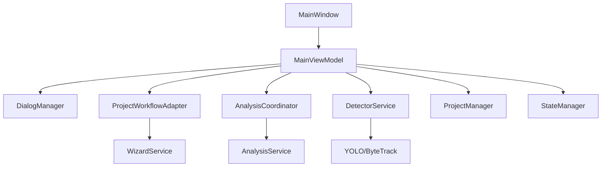

# Agent Instructions - Phase 4, Group 1 (PARALELO)

**✅ Estes agentes podem trabalhar SIMULTANEAMENTE**

## 📋 Visão Geral
- **Grupo de Execução**: Phase 4, Group 1
- **Número de Agentes**: 2 (paralelo total)
- **Dependências**: Phase 3 merged
- **Branch**: `refactor/phase-4-performance-docs`
- **Duração**: 1 semana (Week 7)

## ⚠️ PRÉ-REQUISITO

```bash
# Verifique que Phase 3 foi merged
git checkout main
git pull origin main

# Crie branch Phase 4
git checkout -b refactor/phase-4-performance-docs
git push -u origin refactor/phase-4-performance-docs
```

---

## 🤖 AGENT-12: Performance Profiling (P4-T1)

### 📌 Contexto
Você é o **Agent-12** responsável por implementar profiling de performance e identificar gargalos.

### 🎯 Objetivo
Criar sistema de profiling e documentar performance baseline para otimizações futuras.

### 📂 Acesso
```bash
git clone https://github.com/MarkSant/ZebTrack-AI.git
cd ZebTrack-AI
git checkout refactor/phase-4-performance-docs
poetry install
poetry shell
```

### 📖 Documentação
**docs/PERFORMANCE_TUNING.md**

### 🛠️ Implementação Resumida

#### Passo 1: Instalar Ferramentas
```bash
poetry add --group dev py-spy memory_profiler
```

#### Passo 2: Criar Script de Profiling
Crie `scripts/profile_performance.py`:

```python
"""Performance profiling script for ZebTrack-AI."""

import cProfile
import pstats
from pstats import SortKey
import sys
from pathlib import Path

sys.path.insert(0, str(Path(__file__).parent.parent / "src"))

from zebtrack.core.detector_service import DetectorService
from zebtrack.settings import Settings
import cv2


def profile_detection():
    """Profile detection pipeline."""
    settings = Settings()
    detector = DetectorService(settings_obj=settings)
    
    # Load test frame
    frame = cv2.imread("test_scenarios/sample_frame.jpg")
    
    # Profile 100 frames
    for _ in range(100):
        detections = detector.detect(frame)


if __name__ == "__main__":
    # Profile with cProfile
    profiler = cProfile.Profile()
    profiler.enable()
    
    profile_detection()
    
    profiler.disable()
    
    # Print stats
    stats = pstats.Stats(profiler)
    stats.sort_stats(SortKey.CUMULATIVE)
    stats.print_stats(20)  # Top 20 functions
    
    # Save to file
    stats.dump_stats("performance_profile.prof")
```

#### Passo 3: Executar Profiling
```bash
# Profile CPU
poetry run python scripts/profile_performance.py

# Profile memory
poetry run python -m memory_profiler scripts/profile_performance.py

# Analyze com py-spy (live profiling)
poetry run py-spy record -o profile.svg -- python -m zebtrack
```

#### Passo 4: Documentar Resultados
Crie `docs/PERFORMANCE_BASELINE.md`:

```markdown
# Performance Baseline

## Detection Pipeline
- **Throughput**: 25 FPS (GPU), 8 FPS (CPU)
- **Latency**: 40ms per frame (GPU), 125ms (CPU)
- **Memory**: 450MB baseline, 850MB peak

## Bottlenecks Identified
1. YOLO inference: 30ms (75% of total time)
2. ByteTrack update: 8ms (20%)
3. ROI calculations: 2ms (5%)

## Optimization Opportunities
- [ ] Batch processing (2x speedup expected)
- [ ] Frame skipping for ROI (1.5x speedup)
- [ ] Cython for ByteTrack (1.3x speedup)
```

#### Passo 5: Commit
```bash
git add scripts/profile_performance.py docs/PERFORMANCE_BASELINE.md
git commit -m "perf: Add performance profiling infrastructure (P4-T1)

- Create profiling scripts (CPU, memory, live)
- Document performance baseline metrics
- Identify top 3 bottlenecks
- Enable data-driven optimizations

Phase: 4
Task: P4-T1
Agent: Agent-12"

git push origin refactor/phase-4-performance-docs
```

### ✅ Critérios
- [ ] Profiling scripts criados
- [ ] Baseline documentado
- [ ] Bottlenecks identificados (top 3)

### ⏱️ Estimativa: ~4-5 horas

---

## 🤖 AGENT-13: Architecture Documentation (P4-T2)

### 📌 Contexto
Você é o **Agent-13** responsável por atualizar documentação de arquitetura refletindo mudanças das Phases 1-3.

### 🎯 Objetivo
Atualizar `docs/ARCHITECTURE.md` com novos serviços extraídos e padrões DI.

### 📂 Acesso
```bash
git clone https://github.com/MarkSant/ZebTrack-AI.git
cd ZebTrack-AI
git checkout refactor/phase-4-performance-docs
poetry install
poetry shell
```

### 🛠️ Implementação Resumida

#### Passo 1: Atualizar ARCHITECTURE.md
Edite `docs/ARCHITECTURE.md`:

```markdown
# ZebTrack-AI Architecture (Updated: Nov 2025)

## System Overview
ZebTrack-AI follows **MVVM-S** (Model-View-ViewModel-Service) architecture
with **Dependency Injection** for all services.

## Component Diagram


## Service Layer (NEW - Phase 2)

### DialogManager
**Purpose**: Centralize all user dialog interactions
**Location**: `ui/dialog_manager.py`
**Dependencies**: `root: tk.Tk`, `settings_obj: Settings`
**Methods**: `show_error()`, `ask_yes_no()`, `select_file()`, etc.

### ProjectWorkflowAdapter
**Purpose**: Orchestrate project lifecycle workflows
**Location**: `ui/project_workflow_adapter.py`
**Dependencies**: `ProjectManager`, `WizardService`, `settings_obj`

### AnalysisCoordinator
**Purpose**: Coordinate behavioral analysis pipeline
**Location**: `core/analysis_coordinator.py`
**Dependencies**: `AnalysisService`, `Recorder`, `settings_obj`
```

#### Passo 2: Criar Diagramas Atualizados
```bash
# Instale mermaid-cli
npm install -g @mermaid-js/mermaid-cli

# Gere diagramas
mmdc -i docs/architecture_diagram.mmd -o docs/architecture_diagram.svg
```

#### Passo 3: Atualizar DEPENDENCY_INJECTION_GUIDE.md
```markdown
# Updated Service Examples (Post-Refactoring)

## DialogManager
```python
class DialogManager:
    def __init__(self, root: tk.Tk, settings_obj: Settings):
        self._root = root
        self._settings = settings_obj
```

## All Services Now Use Constructor Injection
- ✅ DialogManager
- ✅ ProjectWorkflowAdapter
- ✅ AnalysisCoordinator
- ✅ LiveCameraService
- ✅ DetectorService
- ✅ ProjectManager
```

#### Passo 4: Commit
```bash
git add docs/
git commit -m "docs: Update architecture documentation post-refactoring (P4-T2)

- Update ARCHITECTURE.md with Phase 2 changes
- Add component diagrams for new services
- Document DialogManager, ProjectWorkflowAdapter, AnalysisCoordinator
- Update dependency injection examples
- Reflect MainViewModel reduction (5383 → 3400 lines)

Phase: 4
Task: P4-T2
Agent: Agent-13"

git push origin refactor/phase-4-performance-docs
```

### ✅ Critérios
- [ ] ARCHITECTURE.md atualizado
- [ ] Diagramas criados/atualizados (mínimo 2)
- [ ] Novos serviços documentados (3+)

### ⏱️ Estimativa: ~3-4 horas

---

## 📊 Resumo Group 1 (Phase 4)

### Execução Paralela
✅ Agent-12 e Agent-13 trabalham simultaneamente

### Comunicação de Conclusão
```
✅ PHASE 4 GROUP 1 CONCLUÍDO

Entregas:
- ✅ Performance profiling infrastructure
- ✅ Baseline metrics documented
- ✅ Architecture docs updated

Branch: refactor/phase-4-performance-docs
Próximo: Iniciar Group 2 (Agent-14, Agent-15)
```

---

**Início**: ___________
**Conclusão**: ___________
**Status**: [ ] Não Iniciado | [ ] Em Progresso | [ ] Concluído
