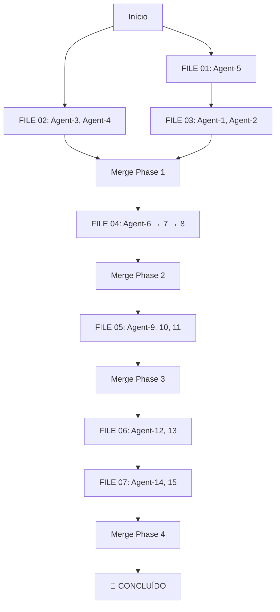

# 🚀 Master Agent Execution Guide

**GUIA DE EXECUÇÃO COMPLETA - Copie e Cole para Agentes**

---

## 📋 Visão Geral Rápida

Este guia contém **7 arquivos de instruções** organizados para execução sequencial. Cada arquivo contém instruções **completas e independentes** para agentes que podem trabalhar em paralelo.

### ✅ Como Usar Este Guia

1. **Siga a ordem dos arquivos** (01 → 02 → 03 → ... → 07)
2. **Abra o arquivo** correspondente à fase atual
3. **Copie a seção completa** do agente específico
4. **Cole no chat do agente** e execute
5. **Aguarde conclusão** antes de prosseguir

---

## 📁 Arquivos de Instrução (Ordem de Execução)

### 🔴 Phase 1: Critical Fixes (Week 1-2)

#### **FILE 01** - `AGENT_INSTRUCTIONS_01_PHASE1_GROUP1.md`
**BLOQUEADOR CRÍTICO - Executar PRIMEIRO**

| Agent | Task | Paralelo? | Tempo |
|-------|------|-----------|-------|
| Agent-5 | P1-T5: Custom Exception Hierarchy | ❌ Solo | 75 min |

**Status**: [ ] Não Iniciado | [ ] Concluído  
**Bloqueia**: Group 3 (Agent-1, Agent-2)

---

#### **FILE 02** - `AGENT_INSTRUCTIONS_02_PHASE1_GROUP2.md`
**INDEPENDENTE - Pode executar IMEDIATAMENTE**

| Agent | Task | Paralelo? | Tempo |
|-------|------|-----------|-------|
| Agent-3 | P1-T3: Settings Injection | ✅ Sim | 90 min |
| Agent-4 | P1-T4: CI/CD Fixes | ✅ Sim | 60 min |

**Status**: [ ] Não Iniciado | [ ] Concluído  
**Dependências**: Nenhuma (pode executar junto com Agent-5)

---

#### **FILE 03** - `AGENT_INSTRUCTIONS_03_PHASE1_GROUP3.md`
**⚠️ AGUARDAR Agent-5 (P1-T5) CONCLUIR**

| Agent | Task | Paralelo? | Tempo |
|-------|------|-----------|-------|
| Agent-1 | P1-T1: Exception Handling | ✅ Sim | 120 min |
| Agent-2 | P1-T2: Resource Management | ✅ Sim | 90 min |

**Status**: [ ] Aguardando P1-T5 | [ ] Em Progresso | [ ] Concluído  
**Dependências**: ✋ P1-T5 (exceptions.py deve existir)

**✅ Checkpoint**: Phase 1 completa → Merge para `main`

---

### 🟡 Phase 2: God Object Extraction (Week 3-4)

#### **FILE 04** - `AGENT_INSTRUCTIONS_04_PHASE2_SEQUENTIAL.md`
**⚠️ EXECUÇÃO SEQUENCIAL OBRIGATÓRIA**

| Agent | Task | Paralelo? | Tempo |
|-------|------|-----------|-------|
| Agent-6 | P2-T1: Extract DialogManager | ❌ Sequencial | 3-4h |
| Agent-7 | P2-T2: Extract ProjectWorkflowAdapter | ❌ Sequencial | 3-4h |
| Agent-8 | P2-T3: Extract AnalysisCoordinator | ❌ Sequencial | 3-4h |

**Ordem Obrigatória**: Agent-6 → CONCLUIR → Agent-7 → CONCLUIR → Agent-8

**Status**: [ ] Não Iniciado | [ ] Concluído  
**Dependências**: Phase 1 merged

**✅ Checkpoint**: Phase 2 completa → Merge para `main`

---

### 🟢 Phase 3: Testing & Quality (Week 5-6)

#### **FILE 05** - `AGENT_INSTRUCTIONS_05_PHASE3_PARALLEL.md`
**✅ EXECUÇÃO PARALELA TOTAL**

| Agent | Task | Paralelo? | Tempo |
|-------|------|-----------|-------|
| Agent-9 | P3-T1: Increase Test Coverage (70→80%) | ✅ Sim | 6-8h |
| Agent-10 | P3-T2: Fix Deprecation Warnings | ✅ Sim | 3-4h |
| Agent-11 | P3-T3: Improve Docstrings | ✅ Sim | 4-5h |

**Status**: [ ] Não Iniciado | [ ] Concluído  
**Dependências**: Phase 2 merged

**✅ Checkpoint**: Phase 3 completa → Merge para `main`

---

### 🔵 Phase 4: Performance & Documentation (Week 7)

#### **FILE 06** - `AGENT_INSTRUCTIONS_06_PHASE4_GROUP1.md`
**✅ EXECUÇÃO PARALELA**

| Agent | Task | Paralelo? | Tempo |
|-------|------|-----------|-------|
| Agent-12 | P4-T1: Performance Profiling | ✅ Sim | 4-5h |
| Agent-13 | P4-T2: Architecture Documentation | ✅ Sim | 3-4h |

**Status**: [ ] Não Iniciado | [ ] Concluído  
**Dependências**: Phase 3 merged

---

#### **FILE 07** - `AGENT_INSTRUCTIONS_07_PHASE4_GROUP2.md`
**⚠️ AGUARDAR Group 1 (Agent-12, Agent-13)**

| Agent | Task | Paralelo? | Tempo |
|-------|------|-----------|-------|
| Agent-14 | P4-T3: User Documentation | ✅ Sim | 5-6h |
| Agent-15 | P4-T4: Documentation Curation | ✅ Sim | 4-5h |

**Status**: [ ] Aguardando Group 1 | [ ] Em Progresso | [ ] Concluído  
**Dependências**: ✋ Agent-12 e Agent-13 concluídos

**✅ Checkpoint**: Phase 4 completa → 🎉 **REFATORAÇÃO COMPLETA** 🎉

---

## 🎯 Guia de Execução Passo a Passo

### 📌 Workflow Completo



---

## 📝 Instruções por Arquivo

### Como Usar Cada Arquivo

1. **Abra o arquivo** no VS Code
2. **Localize a seção do agente** (busque por `## 🤖 AGENT-X`)
3. **Copie TODA a seção** (desde `## 🤖` até antes do próximo `## 🤖` ou `---`)
4. **Cole no chat do agente**
5. **Aguarde conclusão** e validação

---

## 📊 Tabela de Referência Rápida

| Arquivo | Agentes | Paralelo? | Dependências | Duração Total |
|---------|---------|-----------|--------------|---------------|
| FILE 01 | Agent-5 | ❌ | Nenhuma | ~75 min |
| FILE 02 | Agent-3, 4 | ✅ | Nenhuma | ~90 min |
| FILE 03 | Agent-1, 2 | ✅ | FILE 01 | ~120 min |
| FILE 04 | Agent-6, 7, 8 | ❌ Sequencial | Phase 1 | ~10h |
| FILE 05 | Agent-9, 10, 11 | ✅ | Phase 2 | ~6-8h |
| FILE 06 | Agent-12, 13 | ✅ | Phase 3 | ~4-5h |
| FILE 07 | Agent-14, 15 | ✅ | FILE 06 | ~5-6h |

**Total**: ~30-35 horas de trabalho (pode ser comprimido com paralelização)

---

## ✅ Checklist de Progresso

### Phase 1: Critical Fixes
- [ ] **FILE 01**: Agent-5 (P1-T5) concluído
- [ ] **FILE 02**: Agent-3 (P1-T3) concluído
- [ ] **FILE 02**: Agent-4 (P1-T4) concluído
- [ ] **FILE 03**: Agent-1 (P1-T1) concluído
- [ ] **FILE 03**: Agent-2 (P1-T2) concluído
- [ ] **Phase 1 Merged** para main

### Phase 2: God Object Extraction
- [ ] **FILE 04**: Agent-6 (P2-T1) concluído
- [ ] **FILE 04**: Agent-7 (P2-T2) concluído
- [ ] **FILE 04**: Agent-8 (P2-T3) concluído
- [ ] **Phase 2 Merged** para main

### Phase 3: Testing & Quality
- [ ] **FILE 05**: Agent-9 (P3-T1) concluído
- [ ] **FILE 05**: Agent-10 (P3-T2) concluído
- [ ] **FILE 05**: Agent-11 (P3-T3) concluído
- [ ] **Phase 3 Merged** para main

### Phase 4: Performance & Docs
- [ ] **FILE 06**: Agent-12 (P4-T1) concluído
- [ ] **FILE 06**: Agent-13 (P4-T2) concluído
- [ ] **FILE 07**: Agent-14 (P4-T3) concluído
- [ ] **FILE 07**: Agent-15 (P4-T4) concluído
- [ ] **Phase 4 Merged** para main

### 🎉 Final
- [ ] **Tag release v2.2.0**
- [ ] **Deploy documentation**
- [ ] **Celebration** 🍾

---

## 🚨 Regras Importantes

### ⚠️ Regras de Dependência

1. **FILE 03** SÓ pode iniciar DEPOIS de **FILE 01** concluir
2. **FILE 04** SÓ pode iniciar DEPOIS de Phase 1 merged
3. **FILE 05** SÓ pode iniciar DEPOIS de Phase 2 merged
4. **FILE 06** SÓ pode iniciar DEPOIS de Phase 3 merged
5. **FILE 07** SÓ pode iniciar DEPOIS de **FILE 06** concluir

### ✅ Paralelização Permitida

- **Grupo A** (Simultâneo): FILE 01 + FILE 02
- **Grupo B** (Simultâneo): Agentes dentro de FILE 02
- **Grupo C** (Simultâneo): Agentes dentro de FILE 03
- **Grupo D** (Simultâneo): Agentes dentro de FILE 05
- **Grupo E** (Simultâneo): Agentes dentro de FILE 06
- **Grupo F** (Simultâneo): Agentes dentro de FILE 07

### ❌ Paralelização Proibida

- **FILE 04**: Agent-6, 7, 8 devem executar **sequencialmente** (um de cada vez)

---

## 📞 Template de Comunicação

### Ao Iniciar Arquivo
```
🚀 INICIANDO [FILE XX]

Arquivo: AGENT_INSTRUCTIONS_XX_[nome].md
Agentes: Agent-X, Agent-Y
Modo: [Paralelo/Sequencial]

Pré-requisitos verificados:
- [ ] Dependências concluídas
- [ ] Branch criada/atualizada
- [ ] Documentação lida

Iniciando em: [data/hora]
```

### Ao Concluir Arquivo
```
✅ CONCLUÍDO [FILE XX]

Agentes:
- ✅ Agent-X: [commit hash]
- ✅ Agent-Y: [commit hash]

Validação:
- ✅ Todos os testes passando
- ✅ Zero erros Ruff
- ✅ Commits pushed

Próximo: [FILE XX+1 ou Merge]
```

---

## 🎯 Início Rápido (Exemplo Prático)

### Exemplo: Executar Agent-5 (P1-T5)

1. **Abra**: `AGENT_INSTRUCTIONS_01_PHASE1_GROUP1.md`
2. **Copie**: Toda a seção `## 🤖 AGENT-5: Hierarquia de Exceções Customizadas (P1-T5)`
3. **Cole no chat do Agent-5**:

```
[COLE AQUI A SEÇÃO COMPLETA DO AGENT-5]
```

4. **Aguarde**: Agent-5 executar todos os 8 passos
5. **Valide**: Verifique commit e testes
6. **Prossiga**: Para FILE 02 ou FILE 03

---

## 📚 Documentação de Apoio

- **Plano Completo Parte 1**: `PLANO_REFATORACAO_PARALELA_PARTE1.md`
- **Plano Completo Parte 2**: `PLANO_REFATORACAO_PARALELA_PARTE2.md`
- **Orquestração Detalhada**: `AGENT_ORCHESTRATION_GUIDE.md`
- **Resumo Executivo**: `REFACTORING_QUICK_REFERENCE.md`

---

## 🏁 Meta Final

**Ao completar todos os 7 arquivos:**

✅ 15 tarefas concluídas  
✅ 15 agents executados  
✅ 4 phases merged  
✅ MainViewModel: 5,383 → 2,000 linhas  
✅ Coverage: 70% → 80%+  
✅ Zero warnings  
✅ Documentação completa  

**🎉 REFATORAÇÃO 100% CONCLUÍDA 🎉**

---

**Última Atualização**: November 2025  
**Versão**: 1.0  
**Criado por**: Agent Task P4-T4 (Documentation Curation)
