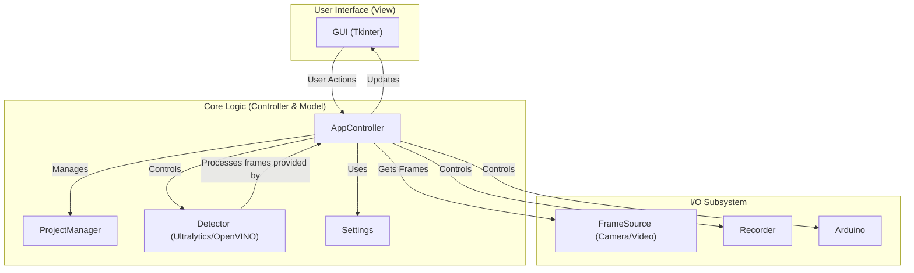

# Zebtrack Controller

Zebtrack Controller is a graphical application designed for object tracking in video streams, with integration for hardware control via Arduino. It is intended for scientific research and can be used with both live camera feeds and pre-recorded videos.

## Installation

This project is managed with [Poetry](https://python-poetry.org/).

1.  **Clone the repository:**
    ```bash
    git clone https://github.com/your-username/zebtrack-controller.git
    cd zebtrack-controller
    ```

2.  **Install Poetry:**
    Follow the official instructions at [python-poetry.org](https://python-poetry.org/docs/#installation) to install Poetry on your system.

3.  **Install dependencies:**
    Once Poetry is installed, run the following command in the project root to create a virtual environment and install the required dependencies:
    ```bash
    poetry install
    ```

## Usage

To run the application, use the following command from the project's root directory:

```bash
poetry run python -m zebtrack
```

This will launch the main graphical user interface.

## Architecture

The application is designed with a separation of concerns, loosely following a Model-View-Controller (MVC) pattern.



*   **GUI**: The user interface, built with Tkinter.
*   **AppController**: The central component that handles user input from the GUI and coordinates all other components.
*   **ProjectManager**: Manages the creation, loading, and saving of project files and configurations.
*   **Detector**: Performs object detection on video frames using models from `ultralytics` or `OpenVINO`.
*   **FrameSource**: Provides video frames, either from a live camera feed or a video file.
*   **Recorder**: Handles the saving of output video and tracking data.
*   **Arduino**: Manages communication with an Arduino board for hardware I/O.
*   **Settings**: Loads and manages application settings from configuration files.

## License

This project is licensed under the MIT License - see the [LICENSE](LICENSE) file for details.
