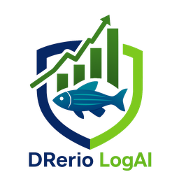

<div align="center">
  

# DRerio LogAI

**Plataforma Inteligente de Rastreamento e Análise Comportamental para _Danio rerio_ (Zebrafish)**


[](https://github.com/MarkSant/DRerio-LogAI/actions/workflows/ci.yml)
[](https://codecov.io/gh/MarkSant/DRerio-LogAI)

[Documentação](docs/) | [Guia de Contribuição](docs/guides/developer/DEVELOPER_GUIDE.md) | [Arquitetura](docs/architecture/ARCHITECTURE.md) | [Changelog](CHANGELOG.md)

</div>

---

## 📋 Sobre o Projeto

O **DRerio LogAI** é uma solução completa e de código aberto para análise automatizada de comportamento de peixes zebrafish (_Danio rerio_) em experimentos científicos. Desenvolvido com foco em **reprodutibilidade**, **precisão** e **facilidade de uso**, o sistema combina técnicas avançadas de visão computacional com Deep Learning para rastreamento multi-objeto em tempo real.

### 🎯 Motivação

Pesquisadores em neurociência, farmacologia e toxicologia frequentemente utilizam zebrafish como modelo animal devido à sua transparência óptica, rápido desenvolvimento e alta homologia genética com humanos (~70%). No entanto, a análise manual de vídeos comportamentais é:

- **Demorada**: Horas de trabalho para analisar minutos de vídeo
- **Subjetiva**: Variabilidade entre observadores
- **Limitada**: Impossibilidade de rastrear múltiplos indivíduos simultaneamente

O **DRerio LogAI** resolve esses problemas oferecendo análise automatizada, objetiva e escalável.

> **Não confunda com o PyZebArdYolo.** O **PyZebArdYolo** é um repositório
> irmão, mais simples, focado em uma unidade de aquisição em tempo real
> (webcam + YOLO11 + Arduino, closed-loop) usada em um paper de hardware
> separado. Ele **não** está coberto pelo registro INPI descrito abaixo e
> não tem a exigência de titularidade UNESP presente nos arquivos de
> licença deste repositório — lá, os próprios autores figuram como
> titulares. Os dois projetos são independentes.

## 🏛️ Titularidade e Registro

O **DRerio LogAI** possui **Registro de Programa de
Computador concedido pelo INPI** (Instituto Nacional da Propriedade
Industrial, Brasil), sob a Lei 9.609/98 (direito autoral de software —
**não** se trata de patente):

- **Processo**: BR 51 2026 005215-7
- **Petição**: 870260066857
- **Data de depósito**: 07/07/2026
- **Data de criação declarada**: 22/10/2025

O **titular** dos direitos patrimoniais (dono dos direitos econômicos) é a
**Universidade Estadual Paulista "Júlio de Mesquita Filho" (UNESP)**, CNPJ
48.031.918/0001-24. Os **autores/inventores** (direitos morais) são
**Marco Antônio Sant'Ana Camargos** e **Percília Cardoso Giaquinto**,
ambos com afiliação UNESP.

Veja [NOTICE](NOTICE) para o detalhamento completo (copyright,
dependências de terceiros e suas licenças) e [LICENSE](LICENSE) para os
termos legais.

### ✨ Diferenciais

- **🤖 Deep Learning Otimizado**: Ultralytics YOLO (detecção e segmentação) com opção de aceleração via OpenVINO
- **📊 Métricas Científicas**: Cálculo automático de velocidade, distância percorrida, tempo em zonas, imobilidade, proximidade social
- **🎨 Interface Intuitiva**: Wizard dinâmico (6–7 etapas) para criação de projetos (pré-gravado ou ao vivo) sem necessidade de programação
- **🔬 Reprodutibilidade**: Todas as configurações e parâmetros de análise são salvos junto com os dados
- **📹 Análise ao Vivo**: Captura e análise em tempo real com câmeras USB/webcams
- **🏗️ Arquitetura Event-Driven**: Sistema modular e extensível baseado em eventos
- **📦 Formatos Padrão**: Exportação para Parquet (dados), Excel (métricas) e Word (relatórios)

## 🚀 Novidades na Versão 4.0

### Refatoração Arquitetural Completa

A v4.0 representa uma reescrita fundamental do sistema com foco em estabilidade, manutenibilidade e performance:

- **🏗️ Arquitetura Event-Driven**: Refatoração completa para eliminar acoplamento direto entre componentes
  - Sistema de eventos com `EventBus` para comunicação assíncrona
  - Padrão Mediator (`UICoordinator`) para orquestração da UI
  - Eliminação de 90+ linhas de código legado de threads
- **🎨 Interface Otimizada**: Nova aba unificada de "Processamento e Relatórios"
  - Redução de 50% no uso de memória durante renderização
  - Eliminação de race conditions em atualizações de UI
  - Preview em tempo real com `LivePreviewWindow`
- **⚡ Performance**: Melhorias significativas de velocidade
  - Startup 67% mais rápido (6.0s → 2.0s) com lazy loading
  - `RecorderFactory` para carregamento sob demanda de pandas/pyarrow
  - Cache de hardware com TTL de 30s (5x mais rápido)
- **🔒 Confiabilidade**: Sistema de testes robusto
  - ~3700 testes (~48% de cobertura)
  - Testes E2E para fluxos críticos
  - Timeout automático para prevenir travamentos (pytest-timeout)
- **🐛 Correções Críticas**: Resolução de bugs de câmera ao vivo
  - Seleção correta de `camera_index` em projetos live
  - Respeito a intervalos de análise configurados
  - Unificação de `LiveCameraService` para ambos os contextos
- **💡 Ajuda Contextual**: Novo sistema de ícones de informação (ⓘ)
  - Tooltips detalhados para todos os parâmetros de IA e calibração
  - Explicações claras sobre o impacto de aumentar ou diminuir valores
  - Sincronização em tempo real entre diálogos de configuração e o `Settings` global

### Multi-Aquarium v2 (Novo!)

Suporte avançado para análise simultânea de múltiplos aquários:

- **🔄 Detecção Paralela**: `detect_partitioned_parallel()` com ThreadPoolExecutor (~30-40% speedup)
- **📦 Inferência em Lote**: `detect_batch()` para processamento offline otimizado
- **✂️ Recorte ROI**: `_crop_aquarium_region()` para extração individual por aquário
- **📊 Métricas de Incerteza**: Colunas `uncertainty` e `bbox_iou` no Parquet para análise de qualidade
- **🔬 Thigmotaxis**: Métricas de preferência de borda por aquário
- **✅ Validação Avançada**: `validate_multi_aquarium_config()` retorna erros e avisos
- **🔍 Detecção de Gaps**: `_detect_per_aquarium_gaps()` para lacunas de trajetória por aquário
- **🛡️ Recuperação de Erros**: Fallback automático quando detecção em aquário individual falha
- **📤 Exportação R/Python**: Scripts prontos para análise estatística em R ou Python
- **🖼️ Preview Lado-a-lado**: `create_side_by_side_preview()` para comparação visual
- **📝 Relatórios por Aquário (Word/Excel)**: artefatos separados por `aquarium_0/`, `aquarium_1/` e exibição correta na aba de Relatórios

### Análise Comportamental Expandida

- **🧠 Geotaxia (Novel Tank Test)**: Suporte nativo para perspectiva lateral com zonas verticais (Fundo/Meio/Superfície)
- **📏 Demarcação Visual**: Linhas de zona automáticas em plots de trajetória e heatmaps para visualização clara de preferência de altura
- **📄 Relatórios Contextuais**: Nomenclatura adaptativa de colunas baseada na perspectiva da câmera

### Suporte a NPU e Hardware Heterogêneo (Novo!)

- **🔌 Intel NPU**: Suporte a Neural Processing Unit em processadores Intel Core Ultra via OpenVINO
- **📦 Variantes de Modelo**: `standard`, `lite` e `nano` com seleção automática conforme capacidade do hardware
- **📈 Benchmark Automático**: Medição de throughput (FPS) entre CPU, GPU e NPU para recomendação ideal
- **⚡ Fallback Inteligente**: Downgrade automático de variante quando hardware detectado é insuficiente
- **🔧 CI Robustecido**: Badge dinâmico, trigger manual, mocks cross-platform para Linux

## 📚 Histórico de versões (v1–v3)

O README destaca o estado atual (v4.0). Para detalhes completos por release, consulte o
[CHANGELOG.md](CHANGELOG.md). Abaixo fica um resumo (marcos principais) das versões anteriores.

### v3.0.0 (2025-01-11)

- Remoção completa do sistema legado de threads para projetos ao vivo.
- Fluxo de câmera ao vivo passa a ser exclusivamente via `LiveCameraService`.
- Limpeza e simplificação do carregamento de projetos Live (separação mais clara entre vídeo e
   câmera).

### v2.x (2025)

#### v2.1.0 (2025-01-11)

- Migração de projetos Live para arquitetura unificada do `LiveCameraService`.
- Correções críticas: `camera_index` respeitado (não força câmera 0) e intervalos de análise/display
   respeitados.
- Redução de threads e memória (de 4 → 2 threads; buffer menor).

#### v2.0.0 (2025-10-XX)

- Camada de serviço do Wizard (`zebtrack.core.wizard_service`) com lógica de negócio testável e
   centralizada (hardware, validação, utilitários e sugestões).
- Modelos Pydantic para validação tipada (`LiveConfigData`, `ExperimentalDesignData`, etc.).
- Modularização de UI: extração de diálogos do `gui.py` para `zebtrack.ui.dialogs/` e melhoria de
   testabilidade/manutenibilidade.
- Cache de detecção de hardware (TTL 30s) para reduzir latência na navegação do Wizard.
- Evolução do Wizard (Express/Advanced, trigger externo, templates, regras de inclusão em ROI).

### v1.x (baseline)

#### v1.6.0 (previous release)

- Criação de projetos via Wizard (fluxo em etapas) e suporte a projetos Live com câmera/Arduino.
- Campos de desenho experimental (grupos/dias/sujeitos) e persistência de templates.
- Diálogos legados mantidos por compatibilidade.

## 🛠️ Instalação

### Requisitos do Sistema

| Componente | Versão Mínima            | Recomendado                         |
| ---------- | ------------------------ | ----------------------------------- |
| Python     | 3.11                     | 3.12+                               |
| RAM        | 4 GB                     | 8 GB+                               |
| CPU        | Dual-core                | Quad-core+ (Intel Core Ultra p/ NPU)|
| GPU        | Não requerida            | NVIDIA com CUDA (opcional)          |
| NPU        | Não requerido            | Intel Core Ultra (via OpenVINO)     |
| SO         | Windows 10, Linux, macOS | Ubuntu 22.04+                       |

### Instalação Rápida

1. **Pré-requisitos**: Certifique-se de ter Python 3.11+ e Poetry instalados

   ```bash
   # Verificar versão do Python
   python --version

   # Instalar Poetry (se necessário)
   curl -sSL https://install.python-poetry.org | python3 -
   ```

2. **Clone o repositório**:

   ```bash
   git clone https://github.com/MarkSant/DRerio-LogAI.git
   cd DRerio-LogAI
   ```

3. **Instale as dependências**:

   ```bash
   poetry install
   ```

4. **(Opcional) Configure parâmetros locais**:

   ```bash
   # Copie o template de configuração local
   cp config.yaml config.local.yaml

   # Edite config.local.yaml com suas preferências
   # (índice da câmera, porta Arduino, parâmetros de detecção, etc.)
   ```

### Instalação para Desenvolvimento

Se você pretende contribuir ou modificar o código:

```bash
# Clone e instale com dependências de desenvolvimento
git clone https://github.com/MarkSant/DRerio-LogAI.git
cd DRerio-LogAI
poetry install --with dev

# Instale os hooks de pré-commit
poetry run pre-commit install

# Execute os testes para verificar a instalação
poetry run pytest -q
```

### 🧩 Extensões VS Code (Desenvolvimento)

Para consistência no ambiente local, siga estas boas práticas com as extensões instaladas:

- **Python / Pylance**: use o interpretador do Poetry (venv) no editor e no terminal.
- **Ruff**: use como **único** formatter/linter Python; evite Black/Pylint/Flake8 no VS Code.
- **Mypy (Matan Gover)**: extensão única de daemon Mypy; prefira `mypy.runUsingActiveInterpreter=true`;
  alinhe com `mypy.ini`/`pyproject.toml`.
- **Python Debugger**: depure e gerencie ambientes usando o mesmo interpretador do Poetry.
- **PowerShell**: use para scripts e automação; mantenha comandos no terminal PowerShell.
- **GitHub Copilot / Chat / PRs / Actions**: faça mudanças incrementais e sempre com impacto analisado.
- **GitLens (GitKraken)**: ferramenta Git principal — blame inline, histórico e comparação.
- **Error Lens**: exibe erros/warnings inline; CSpell excluído.
- **TODO Tree**: rastreia tags TODO, FIXME, HACK, BUG, XXX, DEPRECATED.
- **YAML / markdownlint / Code Spell Checker**: mantenha lint ativo e corrija avisos.

Checklist rápido:

- [ ] Interpretador ativo é o venv do Poetry.
- [ ] Ruff é o único formatter Python (Black/Pylint/Flake8 desativados).
- [ ] Apenas `matangover.mypy` instalado (NÃO `ms-python.mypy-type-checker`).
- [ ] Linters de YAML/Markdown estão ativos.

Como configurar no VS Code:

- Use "Python: Select Interpreter" para escolher o venv do Poetry.
- Prefira `python.analysis.typeCheckingMode=basic` e use `strict` apenas em arquivos alvo.
- Mypy: mantenha config em `mypy.ini`/pyproject e prefira `mypy.runUsingActiveInterpreter=true`.
- Ruff: `editor.defaultFormatter=charliermarsh.ruff`, `editor.formatOnSave=true` e `editor.codeActionsOnSave` com `source.fixAll.ruff` e `source.organizeImports.ruff`.
- GitLens: habilitado por padrão; blame inline e CodeLens ativos.

> Nota para agentes: as instruções de agentes têm **fonte de verdade** em AGENTS.md e mudanças devem começar por lá.

## ▶️ Execução

### Modo Gráfico (GUI)

Para iniciar a interface gráfica:

```bash
poetry run zebtrack
```

### Modo Linha de Comando (CLI)

Atualmente o entrypoint `zebtrack` é focado na execução da aplicação (GUI) e expõe apenas
opções de diagnóstico/log via argumentos.

```bash
# Exemplo: aumentar verbosidade de um módulo específico
poetry run zebtrack --log-level zebtrack.core.detector=DEBUG
```

### Primeira Execução

Na primeira execução, o sistema irá:

1. **Baixar modelos YOLO**: Os modelos de detecção (~6 MB) serão baixados automaticamente
2. **Criar diretórios**: Estrutura de pastas para projetos, templates e cache
3. **Exibir Wizard**: Interface guiada para criar seu primeiro projeto

## 🎬 Guia Rápido de Uso

### Fluxo de Trabalho Típico

1. **Criar Projeto** (Wizard dinâmico: 6 etapas ao vivo, 7 etapas pré-gravado)
    - **Discovery**: tipo de projeto (experimental/exploratório/ao vivo), organização de pastas e
       escopo de importação de parquets (quando aplicável); suporte a templates
    - **Pré-gravado**: seleção de arquivos/pastas → calibração física → detecção/validação de
       design (auto-detecção por estrutura de pastas, regex customizada e editor de design)
       → seleção de modelo/pesos/parâmetros → configuração de importação por vídeo
       (arena/ROIs/trajetória + estratégia de merge de ROIs) → confirmação
    - **Ao vivo**: design experimental (grupos/dias/sujeitos) → configuração de câmera/Arduino e
       gravação (inclui modo de gatilho externo) → calibração física → seleção de modelo/pesos/
       parâmetros → confirmação

2. **Processar Vídeos**
   - Detecção automática de peixes com YOLO
   - Rastreamento multi-objeto com BYTETracker
   - Filtragem de trajetórias (Savitzky-Golay)
   - Cálculo de métricas comportamentais

3. **Analisar Resultados**
   - Visualizar trajetórias e heatmaps
   - Revisar métricas por ROI e zona
   - Exportar dados para análise estatística

4. **Gerar Relatórios**
   - Relatórios automatizados em Word
   - Planilhas Excel com métricas agregadas
   - Gráficos de velocidade, distância e ocupação

## 🧩 Tour da Interface (abas do projeto)

Após criar/abrir um projeto, a janela principal organiza o fluxo operacional em abas:

- **Controle Principal**: ações por tipo de projeto (ao vivo: iniciar/parar gravação; pré-gravado:
   adicionar e processar novos vídeos/pastas), fechar projeto, visão geral hierárquica
   (grupo/dia/sujeito/vídeo), e painel de estado do modelo (peso ativo e OpenVINO)
- **Configuração de Zonas**: definição de arena e ROIs com desenho por polígono, desfazer/refazer,
   estabilização (ignorar frames iniciais), regras de inclusão em zona (centroide/intersecção/sobreposição)
   e suporte a templates/reuso
- **Análise de Vídeo**: acompanhamento de análise e seleção de `track_id` (todos ou específicos)
- **Processamento e Relatórios**: centraliza geração de trajetórias, exportação de sumários e
   geração de relatórios (parciais e unificado), com árvore de status por vídeo e abertura por duplo clique
- **Config. Avançadas**: editor in-app para parâmetros do `config.yaml` com persistência em
   `config.local.yaml` e sincronização por eventos
- **Progresso do Experimento** (ao vivo): grade visual de progresso e atualização sob demanda

Em projetos ao vivo, o **Arduino Dashboard** também é integrado ao fluxo para status de conexão,
comandos e rechecagem de portas.

## 🔬 Funcionalidades Científicas

### Detecção e Rastreamento

- **Modelos**: Ultralytics YOLO (detecção e/ou segmentação conforme o objetivo)
- **Aceleração**: OpenVINO para CPUs Intel (3-5x mais rápido), suporte a NPU (Intel Core Ultra)
- **Variantes de Modelo**: `standard`, `lite`, `nano` — seleção automática por hardware
- **Multi-objeto**: Rastreamento simultâneo de até 96 peixes
- **Filtragem**: Savitzky-Golay para suavização de trajetórias
- **Persistência**: Manutenção de IDs através de oclusões temporárias

### Pesos, backends e reprodutibilidade de modelo

- **Catálogo persistente de pesos**: gerenciamento via `weights_config.json`
- **Tipos de peso**: separação explícita entre segmentação (`seg`) e detecção (`det`)
- **Padrões independentes por tipo**: um peso padrão para segmentação e outro para detecção
- **Seleção por tarefa**: no Wizard, método/peso podem ser definidos separadamente para “aquário”
   e “animal”
- **OpenVINO**: conversão/caching com estados explícitos (não convertido, convertendo, pronto, falhou)

### Detecção (det) vs Segmentação (seg): quando usar

- **Detecção (det)**: representa o alvo como _bounding box_; tende a ser mais leve e adequada quando
   a localização aproximada é suficiente
- **Segmentação (seg)**: representa o alvo como máscara; tende a ser mais adequada quando a análise
   depende de precisão espacial (bordas/ROIs pequenas) e/ou quando há múltiplos animais

O DRerio LogAI expõe na UI os parâmetros críticos (confiança/NMS e ByteTrack) para documentar e
reproduzir o trade-off escolhido em cada experimento.

### Métricas Comportamentais

<!-- EN: Complete behavioral metrics reference with formulas and column names.
     PT: Referência completa de métricas com fórmulas e nomes de colunas. -->

#### Métricas Locomotoras / Locomotor Metrics

| Métrica / Metric | Coluna / Column | Fórmula / Formula |
| --- | --- | --- |
| Distância Total / Total Distance | `total_distance_cm` | $D = \sum_{i=1}^{N-1} \sqrt{(x_{i+1}-x_i)^2 + (y_{i+1}-y_i)^2}$ |
| Velocidade Média / Mean Speed | `mean_speed_cm_s` | $\bar{v} = \text{mean}(v_i)$ onde $v_i = d_i \times FPS$ |
| Velocidade Máxima / Max Speed | `max_speed_cm_s` | $v_{\max} = \max(v_i)$ |
| Desvio Padrão Vel. / Speed Std Dev | `std_speed_cm_s` | $\sigma_v = \text{std}(v_i)$ |
| Tortuosidade / Tortuosity | `tortuosity` | $T = D_{\text{path}} / D_{\text{net}}$ (≥ 1.0; 1.0 = reta perfeita) |

#### Velocidade Angular / Angular Velocity

| Métrica / Metric | Coluna / Column | Fórmula / Formula |
| --- | --- | --- |
| Vel. Angular Média / Mean Angular Vel. | `mean_angular_velocity_deg_s` | $\bar{\omega} = \text{mean}(\|\omega_i\|)$ |
| Vel. Angular Máx. / Max Angular Vel. | `max_angular_velocity_deg_s` | $\omega_{\max} = \max(\|\omega_i\|)$ |
| Desvio Padrão / Angular Vel. Std Dev | `angular_velocity_std_dev_deg_s` | $\sigma_\omega = \text{std}(\|\omega_i\|)$ |
| Curvas Acentuadas / Sharp Turns | `sharp_turns_count` | Frames onde $\|\omega_i\| >$ threshold |
| Curvas por Minuto / Turns per Minute | `sharp_turns_per_minute` | $\text{count} \times 60 / T_{\text{total}}$ |

Onde $\omega_i = \arctan2(\vec{v}_i \times \vec{v}_{i-1},\; \vec{v}_i \cdot \vec{v}_{i-1}) \times FPS$ — signed angle between consecutive displacement vectors.

#### Episódios Comportamentais / Behavioral Episodes

| Métrica / Metric | Coluna / Column | Descrição / Description |
| --- | --- | --- |
| Rajadas de Velocidade / Speed Bursts | `speed_bursts_count`, `speed_bursts_total_duration_s` | Episódios com $v > $ threshold |
| Periodos de Inatividade / Inactivity | `inactivity_count`, `inactivity_total_duration_s`, `inactivity_percentage_of_recording` | $v <$ threshold por duração mínima |

#### Métricas Espaciais / Spatial Metrics

| Métrica / Metric | Coluna / Column | Descrição / Description |
| --- | --- | --- |
| Tigmotaxia (parede) / Thigmotaxis | `thigmotaxis_time_near_wall_pct` | % tempo próximo à parede |
| Distância Média da Parede / Avg Wall Dist | `thigmotaxis_avg_wall_distance_cm` | Distância média ao contorno da arena |
| Ocupação Geotaxia / Geotaxis Zones | `geotaxis_zone_{i}_pct` | % tempo em cada zona vertical (vista lateral) |

Para cada ROI definida pelo usuário, métricas adicionais são geradas: tempo, entradas, saídas, latência, distância e velocidade dentro da ROI.

> **Aquários poligonais (N lados) / Polygonal arenas.** A distância à parede
> (tigmotaxia) é a distância euclidiana exata até a aresta mais próxima do
> polígono do aquário, válida para qualquer número de lados (≥3), convexo ou
> côncavo — não só retângulos. Logo, o gráfico de tigmotaxia do relatório é
> confiável para aquários de 8+ lados. Detalhes (e a ressalva da geotaxia, que
> usa o piso da _bounding-box_): [docs/reference/metrics.md](docs/reference/metrics.md).
>
> **Referência completa**: [docs/reference/metrics.md](docs/reference/metrics.md) — [Full reference with all column names and formulas]

#### Metadados de Sessão / Session Metadata

| Coluna / Column | Descrição / Description |
| --- | --- |
| `experiment_id` | Identificador do vídeo/experimento |
| `group_id` | Grupo experimental |
| `day` | Dia experimental |
| `video_duration_s` | Duração do vídeo em segundos |
| `total_frames_analyzed` | Total de frames processados |

### Schema Parquet (Trajetória) / Parquet Schema (Trajectory)

O schema de colunas do arquivo de trajetória (`3_CoordMovimento_*.parquet`) é imutável:

```text
timestamp, frame, track_id, x1, y1, x2, y2, confidence
[x_center_px, y_center_px, x_cm, y_cm]*  — quando calibração disponível
```

### Estrutura de Saída / Output Directory Structure

Cada vídeo processado gera uma pasta de resultados:

```text
<video>_results/
├── 1_ArenaROI_<video>.parquet       # Definições Arena/ROI
├── 2_Zones_<video>.parquet          # Metadados de zonas
├── 3_CoordMovimento_<video>.parquet # Trajetória (schema imutável)
├── <video>_summary.xlsx             # Resumo por ROI
└── <video>_report.docx              # Relatório Word com gráficos
```

Multi-aquário adiciona subpastas por aquário:

```text
<video>_results/
├── aquarium_0/
│   ├── 3_CoordMovimento_<video>.parquet
│   ├── <video>_aq0_summary.parquet
│   ├── 4_Relatorio_<video>_aq0.docx
│   └── 4_Relatorio_<video>_aq0.xlsx
└── aquarium_1/
    ├── 3_CoordMovimento_<video>.parquet
    ├── <video>_aq1_summary.parquet
    ├── 4_Relatorio_<video>_aq1.docx
    └── 4_Relatorio_<video>_aq1.xlsx
```

### Relatório Unificado / Unified Report

Ao gerar relatórios unificados para o projeto, os seguintes arquivos são criados:

```text
<project>/unified_reports/
├── project_summary_<run_id>.parquet   # Dados brutos (colunas EN internas)
├── project_summary_<run_id>.xlsx      # Excel com 2 abas: "Data" + "Descriptive Stats"
├── project_summary_<run_id>.csv       # CSV idêntico à aba "Data" do Excel
├── project_summary_<run_id>.docx      # Word: boxplots comparativos + tabela descritiva
└── project_summary_<run_id>.json      # Manifesto com metadados do run
```

O Excel e CSV utilizam nomes de colunas traduzidos (display names). A aba "Descriptive Stats" contém estatísticas descritivas (mean, std, count, min, max) agrupadas por grupo e dia.

### Calibração e Coordenadas

- **Calibração Espacial**: Conversão pixels → cm via dimensões físicas informadas (largura/altura em cm)
- **Sistemas de Coordenadas**: Referência (original) e display (redimensionado)
- **Geometria de ROIs**: Suporte a polígonos, círculos e retângulos
- **Buffer de ROIs**: Expansão/contração de regiões para análises de proximidade

### Reprodutibilidade

- **Formato Parquet**: Dados tabulares compactados e eficientes
- **Schema Imutável**: Garantia de compatibilidade entre versões
- **Metadados YAML**: Todas as configurações salvas junto com os dados
- **Versionamento**: Rastreabilidade de modelos e parâmetros usados
- **Timestamps**: Sincronização precisa entre eventos

## 📖 Documentação Completa

A documentação técnica está disponível na pasta `docs/`:

### Guias Essenciais

- 📚 [**CHEATSHEET.md**](docs/guides/developer/CHEATSHEET.md) - Referência rápida de comandos e padrões

- 🏗️ [**ARCHITECTURE.md**](docs/architecture/ARCHITECTURE.md) - Arquitetura Event-Driven e Mediator
- 👨‍💻 [**DEVELOPER_GUIDE.md**](docs/guides/developer/DEVELOPER_GUIDE.md) - Guia completo para contribuidores
- 🧙 [**DEVELOPER_GUIDE_WIZARD.md**](docs/guides/developer/DEVELOPER_GUIDE_WIZARD.md) - Desenvolvimento do Wizard
- 🧪 [**README_TESTS.md**](README_TESTS.md) - Guia completo de testes (~3700 testes)

### Guias Técnicos

- 🔌 [**DEPENDENCY_INJECTION_GUIDE.md**](docs/architecture/DEPENDENCY_INJECTION_GUIDE.md) - Padrões de DI

- 📡 [**EVENT_BUS_GUIDE.md**](docs/architecture/EVENT_BUS_GUIDE.md) - Sistema de eventos
- 🗺️ [**COORDINATE_SYSTEMS.md**](docs/reference/COORDINATE_SYSTEMS.md) - Sistemas de coordenadas
- 🎯 [**STATE_MANAGEMENT_GUIDE.md**](docs/architecture/STATE_MANAGEMENT_GUIDE.md) - Gerenciamento de estado
- 🚀 [**PERFORMANCE_TUNING.md**](docs/performance/PERFORMANCE_TUNING.md) - Otimizações
- 🔌 [**HARDWARE_OPTIMIZATION_GUIDE.md**](docs/performance/HARDWARE_OPTIMIZATION_GUIDE.md) - NPU e hardware
- 💻 [**NPU_SETUP_GUIDE.md**](docs/performance/NPU_SETUP_GUIDE.md) - Configuração de NPU Intel

### Guias Operacionais

- 📋 [**REFERENCE_GUIDE.md**](docs/reference/REFERENCE_GUIDE.md) - Guia operacional completo
- 📊 [**metrics.md**](docs/reference/metrics.md) - Referência canônica de métricas comportamentais
- 🔄 [**WORKFLOWS.md**](docs/guides/developer/WORKFLOWS.md) - Fluxos de trabalho detalhados
- 🐛 [**QUICK_DEBUG_GUIDE.md**](docs/guides/developer/QUICK_DEBUG_GUIDE.md) - Solução de problemas
- ⚠️ [**KNOWN_ISSUES.md**](docs/reference/KNOWN_ISSUES.md) - Problemas conhecidos e soluções
- 📝 [**CHANGELOG.md**](CHANGELOG.md) - Histórico de versões

### Documentos Históricos

- 📦 [**archive/**](docs/archive/) - Documentação de versões anteriores

## 🏗️ Estrutura do Projeto

### Organização de Diretórios

```text
DRerio-LogAI/
├── src/zebtrack/               # Código-fonte principal
│   ├── __main__.py            # Entry point (DI delegada a ApplicationBootstrapper)
│   ├── core/                   # Camada de negócios (6 sub-packages)
│   │   ├── state_manager.py   # Gerenciamento de estado (thread-safe)
│   │   ├── main_view_model.py # Orquestrador principal (MVVM)
│   │   ├── application_bootstrapper.py # Composition Root (DI)
│   │   ├── dependency_container.py     # Container DI com LazyRef[T]
│   │   ├── detection/          # Detecção AI (9 módulos)
│   │   │   ├── single_detector.py      # Detecção single-aquarium
│   │   │   ├── multi_aquarium_detector.py # Detecção multi-aquário
│   │   │   ├── zone_scaler.py          # Escalonamento de zonas
│   │   │   └── detection_types.py      # ZoneData, MultiAquariumZoneData
│   │   ├── project/            # Gerenciamento de projetos (14 módulos)
│   │   │   ├── project_manager.py      # Gerenciador principal
│   │   │   └── zone_manager.py         # Zonas e parquets
│   │   ├── video/              # Processamento de vídeo (8 módulos)
│   │   │   ├── processing_worker.py    # Worker em background
│   │   │   └── video_processing_service.py
│   │   ├── recording/          # Gravação e câmera ao vivo (5 módulos)
│   │   │   ├── live_camera_service.py  # Análise ao vivo
│   │   │   └── recording_service.py    # Gravação de sessões
│   │   └── services/           # Serviços de domínio (5 módulos)
│   │       ├── detector_service.py
│   │       ├── weight_manager.py       # Pesos + variantes (standard/lite/nano)
│   │       └── wizard_service.py
│   ├── coordinators/           # Coordinators decompostos (24 arquivos)
│   │   ├── video_processing_coordinator.py
│   │   ├── report_generation_coordinator.py
│   │   ├── multi_aquarium_coordinator.py
│   │   ├── sequential_processing_coordinator.py
│   │   └── ...
│   ├── io/                     # Camada de I/O
│   │   ├── recorder.py         # Persistência Parquet (thread-safe, atomic writes)
│   │   ├── recorder_factory.py # Lazy loading de recorder
│   │   ├── video_source.py     # Fonte de frames (vídeos)
│   │   ├── camera.py           # Captura de câmera
│   │   └── frame_source_factory.py # Factory de fontes
│   ├── ui/                     # Interface gráfica
│   │   ├── gui.py              # Janela principal (865 linhas)
│   │   ├── event_bus_v2.py     # EventBusV2 (único sistema de eventos)
│   │   ├── components/         # Componentes UI decompostos
│   │   │   ├── canvas/         # Sub-package canvas (5 módulos)
│   │   │   ├── project_views/  # Sub-package reports/tree (3 módulos)
│   │   │   ├── event_dispatcher.py
│   │   │   └── ...
│   │   ├── dialogs/            # Diálogos extraídos (26 diálogos)
│   │   └── wizard/             # Wizard de 5 etapas + models Pydantic
│   ├── analysis/               # Análise comportamental
│   │   ├── analysis_service.py
│   │   ├── behavior.py         # Métricas (velocidade, angular, thigmotaxis)
│   │   ├── roi.py              # Análise de ROIs
│   │   └── reporters/          # Sub-package de relatórios (8 módulos)
│   │       ├── word_reporter.py
│   │       ├── excel_reporter.py
│   │       ├── parquet_reporter.py
│   │       └── script_exporter.py
│   ├── plugins/                # Sistema de plugins
│   │   ├── base.py             # Interface de plugins (detect_batch ABC)
│   │   ├── yolov8_detector.py  # Ultralytics YOLO (CPU/GPU)
│   │   └── openvino_detector.py # OpenVINO (CPU/GPU/NPU)
│   └── utils/                  # Utilitários
│       ├── hardware_detection.py # Detecção CPU/GPU/NPU
│       ├── hardware_benchmark.py # Benchmark automático
│       ├── geometry.py         # Cálculos geométricos
│       └── cache.py            # TTLCache thread-safe
├── tests/                      # Suíte de testes (~3700 testes)
│   ├── conftest.py            # Fixtures e hooks pytest
│   ├── unit/                  # Testes unitários (~2806)
│   ├── integration/           # Testes de integração (~891 GUI)
│   └── e2e/                   # Testes end-to-end (~35)
├── docs/                       # Documentação técnica
│   ├── ARCHITECTURE.md
│   ├── DEVELOPER_GUIDE.md
│   ├── CHEATSHEET.md
│   └── archive/               # Documentação histórica
├── config.yaml                 # Configuração padrão
├── config.local.yaml          # Configuração local (git-ignored)
├── pyproject.toml             # Configuração Poetry
└── README.md                  # Este arquivo
```

### Arquitetura (MVVM-S + Event-Driven)

#### Camadas Principais

| Camada         | Responsabilidade   | Componentes Chave                                           |
| -------------- | ------------------ | ----------------------------------------------------------- |
| **Model**      | Estado e dados     | `StateManager`, `ProjectManager`, `DetectorService`         |
| **View**       | Interface Tkinter  | `ApplicationGUI`, `Dialogs`, `Wizard`                       |
| **ViewModel**  | Orquestração       | `MainViewModel`, `DependencyContainer`                      |
| **Coordinators** | Fluxos de domínio | 24 coordinators decompostos (Video, Reports, MultiAq, etc.) |
| **Services**   | Lógica de negócios | `WizardService`, `AnalysisService`, `LiveCameraService`     |

#### Fluxo de Dados (Event-Driven)

```text
User → UI Event → EventBusV2 → Coordinator/Handler → StateManager → UI Update (root.after)
                                    ↓
                              Services/Model
```

**Benefícios**:

- ✅ Desacoplamento total entre componentes
- ✅ Testabilidade (injeção de dependências)
- ✅ Thread-safety (comunicação assíncrona)
- ✅ Manutenibilidade (responsabilidades claras)

## 🧪 Testes

### Executar Testes

```bash
# Testes rápidos (excluindo GUI/slow) - ~2806 testes
poetry run pytest

# Todos os testes - ~3700 testes (6-7 min)
poetry run pytest -m "" -n0

# Testes de GUI (sequencial) - ~891 testes
poetry run pytest -m gui -n0

# Testes lentos - ~35 testes
poetry run pytest -m slow

# Com cobertura
poetry run pytest --cov=src/zebtrack --cov-report=html
```

### Estatísticas de Testes

| Categoria                | Quantidade | Tempo       |
| ------------------------ | ---------- | ----------- |
| **Testes Rápidos**       | ~2806      | ~3 min      |
| **Testes de GUI**        | ~891       | ~3 min      |
| **Testes Lentos**        | ~35        | ~1 min      |
| **TOTAL**                | **~3700**  | **6-7 min** |

### Cobertura

- **Cobertura Global**: ~48%
- **CI Gates**: Linux core 45%, Linux GUI 32%, Windows core 28%
- **Meta**: OpenSSF Silver 80% (roadmap em progresso)

### Marcadores de Teste

```python
@pytest.mark.unit         # Teste unitário rápido
@pytest.mark.integration  # Teste de integração
@pytest.mark.gui          # Teste de interface Tkinter
@pytest.mark.slow         # Teste lento (>5s)
@pytest.mark.e2e          # Teste end-to-end
```

Para mais detalhes, consulte [README_TESTS.md](README_TESTS.md).

## 🤝 Contribuição

Contribuições são muito bem-vindas! Este projeto segue práticas modernas de desenvolvimento:

### Como Contribuir

1. **Fork** o repositório
2. **Clone** seu fork localmente
3. **Crie uma branch** para sua feature/fix:

   ```bash
   git checkout -b feature/minha-feature
   ```

4. **Instale dependências de desenvolvimento**:

   ```bash
   poetry install --with dev
   poetry run pre-commit install
   ```

5. **Faça suas alterações** seguindo os padrões do projeto
6. **Execute os testes**:

   ```bash
   poetry run pytest -q
   poetry run ruff check .
   ```

7. **Commit** suas mudanças com mensagens claras:

   ```bash
   git commit -m "feat: adiciona suporte para YOLO v12"
   ```

8. **Push** para seu fork e abra um **Pull Request**

### Diretrizes de Código

- ✅ **Python 3.11+**: Use type hints e recursos modernos
- ✅ **Ruff**: Linter e formatador (linha máxima: 100 caracteres)
- ✅ **Docstrings**: Google Style para funções públicas
- ✅ **Testes**: Adicione testes para novas funcionalidades
- ✅ **DI**: Sempre use injeção de dependências
- ✅ **Event-Driven**: Prefira comunicação via `EventBus`
- ✅ **Logging**: Use `structlog` com padrão `domain.action.result`

### Áreas que Precisam de Ajuda

- 🐛 **Correção de bugs** listados em [KNOWN_ISSUES.md](docs/KNOWN_ISSUES.md)
- 📝 **Documentação**: Tradução, tutoriais, exemplos
- 🧪 **Testes**: Aumentar cobertura para 70%+
- 🎨 **UI/UX**: Melhorias na interface gráfica
- 🚀 **Performance**: Otimizações de processamento
- 🔌 **Plugins**: Novos detectores ou exportadores

Consulte o [DEVELOPER_GUIDE.md](docs/DEVELOPER_GUIDE.md) para diretrizes completas.

## 📊 Casos de Uso

### Pesquisa Acadêmica

- **Farmacologia**: Screening de drogas (canabidiol, antidepressivos)
- **Toxicologia**: Testes de toxicidade ambiental
- **Neurociência**: Estudos de ansiedade e memória
- **Genética**: Análise de mutantes e transgênicos

### Publicações Científicas

Este software foi desenvolvido para suportar pesquisas científicas com zebrafish. Se você usar o DRerio LogAI em suas publicações, por favor cite-o conforme a seção "📖 Citation" abaixo.

## 👥 Authors

- **Marco Antônio Sant'Ana Camargos** — São Paulo State University (UNESP), Botucatu, Brazil
- **Percília Cardoso Giaquinto** — São Paulo State University (UNESP), Botucatu, Brazil

Copyright patrimonial: **Universidade Estadual Paulista (UNESP)**. Veja a seção "🏛️ Titularidade e Registro" acima e o arquivo [NOTICE](NOTICE).

## 📖 Citation

Se você usar o DRerio LogAI em pesquisa, cite-o usando os metadados em [CITATION.cff](CITATION.cff) (formato Citation File Format 1.2.0 — reconhecido pelo GitHub como "Cite this repository").

## 📄 Licença

O código-fonte original deste repositório (de titularidade da UNESP) é licenciado sob a **MIT License** — veja o arquivo [LICENSE](LICENSE) para detalhes.

⚠️ **Licença efetiva da distribuição**: este projeto depende do
[Ultralytics YOLO](https://github.com/ultralytics/ultralytics)
(`ultralytics`), licenciado sob **AGPL-3.0-or-later**. Pelas condições de
copyleft da AGPL-3.0-or-later, a obra combinada distribuída (este código +
a dependência `ultralytics`) fica sujeita aos termos da
AGPL-3.0-or-later, a menos que uma licença comercial/enterprise da
Ultralytics seja obtida. Ou seja, a
licença MIT cobre o código original da UNESP, mas **não** cobre sozinha o
pacote distribuído como um todo. Veja [NOTICE](NOTICE) para o
levantamento completo de licenças de dependências de terceiros.

**Em resumo** (para o código original sob MIT), você pode:

- ✅ Usar comercialmente
- ✅ Modificar
- ✅ Distribuir
- ✅ Uso privado

**Condições**:

- 📋 Manter a licença e copyright
- ⚠️ Sem garantias
- ⚠️ Observar as obrigações da AGPL-3.0-or-later da dependência `ultralytics` na distribuição do conjunto (veja acima)

## 🙏 Agradecimentos

### Instituições

- **UNESP** - Universidade Estadual Paulista
- **Laboratório de Fisiologia e Comportamento de Peixes** (Depto. de Fisiologia - IBB/UNESP)

### Tecnologias Open Source

- [Ultralytics YOLO](https://github.com/ultralytics/ultralytics) - Detecção de objetos
- [OpenVINO](https://github.com/openvinotoolkit/openvino) - Aceleração de inferência
- [BYTETracker](https://github.com/ifzhang/ByteTrack) - Rastreamento multi-objeto
- [Tkinter](https://docs.python.org/3/library/tkinter.html) - Interface gráfica
- [Poetry](https://python-poetry.org/) - Gerenciamento de dependências
- [Pydantic](https://pydantic.dev/) - Validação de dados
- [structlog](https://www.structlog.org/) - Logging estruturado

### Comunidade

Agradecimentos especiais a todos os contribuidores e à comunidade open source que tornou este projeto possível.

---

<div align="center">

<h4>Desenvolvido com ❤️ para pesquisa científica</h4>

<h4>UNESP - Laboratório de Fisiologia e Comportamento de Peixes (Depto. de Fisiologia - IBB/UNESP)</h4>

[⬆ Voltar ao topo](#drerio-logai)

</div>
