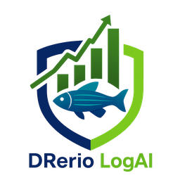

<div align="center">
  

# DRerio LogAI

**Intelligent Tracking and Behavioral Analysis Platform for _Danio rerio_ (Zebrafish)**


[](https://github.com/MarkSant/DRerio-LogAI/actions/workflows/ci.yml)
[](https://codecov.io/gh/MarkSant/DRerio-LogAI)

**🇧🇷 [Ler em Português](README.pt-BR.md)**

[Documentation](docs/) | [Contributing Guide](docs/guides/developer/DEVELOPER_GUIDE.md) | [Architecture](docs/architecture/ARCHITECTURE.md) | [Changelog](CHANGELOG.md)

</div>

---

## 📋 About the Project

**DRerio LogAI** is a complete, open-source solution for automated behavioral analysis of zebrafish (_Danio rerio_) in scientific experiments. Built with a focus on **reproducibility**, **precision**, and **ease of use**, the system combines advanced computer vision techniques with Deep Learning for real-time multi-object tracking.

### 🎯 Motivation

Researchers in neuroscience, pharmacology, and toxicology frequently use zebrafish as an animal model due to their optical transparency, rapid development, and high genetic homology with humans (~70%). However, manual analysis of behavioral videos is:

- **Time-consuming**: hours of work to analyze minutes of video
- **Subjective**: variability between observers
- **Limited**: impossible to track multiple individuals simultaneously

**DRerio LogAI** solves these problems by offering automated, objective, and scalable analysis.

> **Do not confuse with PyZebArdYolo.** **PyZebArdYolo** is a sibling
> repository, simpler in scope, focused on a real-time acquisition unit
> (webcam + YOLO11 + Arduino, closed-loop) used in a separate hardware
> paper. It is **not** covered by the INPI registration described below
> and does not carry the UNESP ownership requirement present in this
> repository's license files — there, the authors themselves are the
> rights holders. The two projects are independent.

## 🏛️ Ownership and Registration

**DRerio LogAI** has a **Computer Program Registration granted by
INPI** (Instituto Nacional da Propriedade Industrial, Brazil), under Law
9.609/98 (software copyright — **not** a patent):

- **Process**: BR 51 2026 005215-7
- **Petition**: 870260066857
- **Filing date**: 07/07/2026
- **Declared creation date**: 22/10/2025

The **holder** of the economic rights (owner of the pecuniary rights) is
the **Universidade Estadual Paulista "Júlio de Mesquita Filho" (UNESP)**,
CNPJ 48.031.918/0001-24. The **authors/inventors** (moral rights) are
**Marco Antônio Sant'Ana Camargos** and **Percília Cardoso Giaquinto**,
both affiliated with UNESP.

See [NOTICE](NOTICE) for the full breakdown (copyright, third-party
dependencies, and their licenses) and [LICENSE](LICENSE) for the legal
terms.

### ✨ Highlights

- **🤖 Optimized Deep Learning**: Ultralytics YOLO (detection and segmentation) with optional OpenVINO acceleration
- **📊 Scientific Metrics**: automatic calculation of speed, distance traveled, time in zones, immobility, social proximity
- **🎨 Intuitive Interface**: dynamic Wizard (6–7 steps) for creating projects (pre-recorded or live) without any programming required
- **🔬 Reproducibility**: all configurations and analysis parameters are saved alongside the data
- **📹 Live Analysis**: real-time capture and analysis with USB cameras/webcams
- **🏗️ Event-Driven Architecture**: modular, extensible system built on events
- **📦 Standard Formats**: export to Parquet (data), Excel (metrics), and Word (reports)

## 🚀 Architecture Milestone: Version 4.0

### Complete Architectural Refactor

v4.0 represented a fundamental rewrite of the system, focused on stability, maintainability, and performance. It remains the architectural foundation of the current release; see [CHANGELOG.md](CHANGELOG.md) for what changed since then, through the current `v6.0.0`:

- **🏗️ Event-Driven Architecture**: complete refactor to eliminate direct coupling between components
  - Event system with `EventBus` for asynchronous communication
  - Mediator pattern (`UICoordinator`) for UI orchestration
  - Elimination of 90+ lines of legacy thread code
- **🎨 Optimized Interface**: new unified "Processing and Reports" tab
  - 50% reduction in memory usage during rendering
  - Elimination of UI-update race conditions
  - Real-time preview with `LivePreviewWindow`
- **⚡ Performance**: significant speed improvements
  - 67% faster startup (6.0s → 2.0s) via lazy loading
  - `RecorderFactory` for on-demand loading of pandas/pyarrow
  - Hardware cache with a 30s TTL (5x faster)
- **🔒 Reliability**: robust test system
  - ~3700 tests (~48% coverage)
  - E2E tests for critical flows
  - Automatic timeout to prevent hangs (pytest-timeout)
- **🐛 Critical Fixes**: resolved live-camera bugs
  - Correct `camera_index` selection in live projects
  - Configured analysis intervals now respected
  - Unified `LiveCameraService` for both contexts
- **💡 Contextual Help**: new information-icon system (ⓘ)
  - Detailed tooltips for all AI and calibration parameters
  - Clear explanations of the impact of increasing or decreasing values
  - Real-time synchronization between configuration dialogs and global `Settings`

### Multi-Aquarium v2 (New!)

Advanced support for simultaneous analysis of multiple aquariums:

- **🔄 Parallel Detection**: `detect_partitioned_parallel()` with ThreadPoolExecutor (~30-40% speedup)
- **📦 Batch Inference**: `detect_batch()` for optimized offline processing
- **✂️ ROI Cropping**: `_crop_aquarium_region()` for per-aquarium extraction
- **📊 Uncertainty Metrics**: `uncertainty` and `bbox_iou` columns in the Parquet for quality analysis
- **🔬 Thigmotaxis**: wall-preference metrics per aquarium
- **✅ Advanced Validation**: `validate_multi_aquarium_config()` returns errors and warnings
- **🔍 Gap Detection**: `_detect_per_aquarium_gaps()` for per-aquarium trajectory gaps
- **🛡️ Error Recovery**: automatic fallback when detection fails on an individual aquarium
- **📤 R/Python Export**: ready-made scripts for statistical analysis in R or Python
- **🖼️ Side-by-Side Preview**: `create_side_by_side_preview()` for visual comparison
- **📝 Per-Aquarium Reports (Word/Excel)**: separate artifacts under `aquarium_0/`, `aquarium_1/`, with correct display in the Reports tab

### Expanded Behavioral Analysis

- **🧠 Geotaxis (Novel Tank Test)**: native support for lateral perspective with vertical zones (Bottom/Middle/Surface)
- **📏 Visual Demarcation**: automatic zone lines on trajectory plots and heatmaps for clear visualization of height preference
- **📄 Contextual Reports**: adaptive column naming based on camera perspective

### NPU and Heterogeneous Hardware Support (New!)

- **🔌 Intel NPU**: Neural Processing Unit support on Intel Core Ultra processors via OpenVINO
- **📦 Model Variants**: `standard`, `lite`, and `nano`, with automatic selection based on hardware capability
- **📈 Automatic Benchmark**: throughput (FPS) measurement across CPU, GPU, and NPU for the ideal recommendation
- **⚡ Smart Fallback**: automatic variant downgrade when detected hardware is insufficient
- **🔧 Hardened CI**: dynamic badge, manual trigger, cross-platform mocks for Linux

## 📚 Version History (v1–v3)

This README highlights the current state (v6.0.0). For full per-release details, see the
[CHANGELOG.md](CHANGELOG.md). Below is a summary (main milestones) of earlier versions.

### v3.0.0 (2025-01-11)

- Complete removal of the legacy thread system for live projects.
- Live camera flow now goes exclusively through `LiveCameraService`.
- Cleanup and simplification of Live project loading (clearer separation between video and
   camera).

### v2.x (2025)

#### v2.1.0 (2025-01-11)

- Migration of Live projects to the unified `LiveCameraService` architecture.
- Critical fixes: `camera_index` respected (no longer forces camera 0), and analysis/display
   intervals respected.
- Reduced threads and memory (from 4 → 2 threads; smaller buffer).

#### v2.0.0 (2025-10-XX)

- Wizard service layer (`zebtrack.core.wizard_service`) with testable, centralized business
   logic (hardware, validation, utilities, and suggestions).
- Pydantic models for typed validation (`LiveConfigData`, `ExperimentalDesignData`, etc.).
- UI modularization: dialogs extracted from `gui.py` into `zebtrack.ui.dialogs/`, improving
   testability/maintainability.
- Hardware-detection cache (30s TTL) to reduce latency while navigating the Wizard.
- Wizard evolution (Express/Advanced, external trigger, templates, ROI inclusion rules).

### v1.x (baseline)

#### v1.6.0 (previous release)

- Project creation via the Wizard (step-based flow) and support for Live projects with
   camera/Arduino.
- Experimental-design fields (groups/days/subjects) and template persistence.
- Legacy dialogs kept for backward compatibility.

## 🛠️ Installation

### System Requirements

| Component | Minimum Version           | Recommended                          |
| --------- | -------------------------- | ------------------------------------- |
| Python    | 3.11                       | 3.12+                                 |
| RAM       | 4 GB                        | 8 GB+                                 |
| CPU       | Dual-core                  | Quad-core+ (Intel Core Ultra for NPU) |
| GPU       | Not required                | NVIDIA with CUDA (optional)           |
| NPU       | Not required                 | Intel Core Ultra (via OpenVINO)      |
| OS        | Windows 10, Linux, macOS   | Ubuntu 22.04+                         |

### Quick Install

1. **Prerequisites**: make sure you have Python 3.11+ and Poetry installed

   ```bash
   # Check Python version
   python --version

   # Install Poetry (if needed)
   curl -sSL https://install.python-poetry.org | python3 -
   ```

2. **Clone the repository**:

   ```bash
   git clone https://github.com/MarkSant/DRerio-LogAI.git
   cd DRerio-LogAI
   ```

3. **Install dependencies**:

   ```bash
   poetry install
   ```

4. **(Optional) Configure local parameters**:

   ```bash
   # Copy the local configuration template
   cp config.yaml config.local.yaml

   # Edit config.local.yaml with your preferences
   # (camera index, Arduino port, detection parameters, etc.)
   ```

### Development Install

If you intend to contribute to or modify the code:

```bash
# Clone and install with development dependencies
git clone https://github.com/MarkSant/DRerio-LogAI.git
cd DRerio-LogAI
poetry install --with dev

# Install pre-commit hooks
poetry run pre-commit install

# Run the tests to verify the installation
poetry run pytest -q
```

### 🧩 VS Code Extensions (Development)

For consistency in the local environment, follow these best practices with the installed
extensions:

- **Python / Pylance**: use the Poetry interpreter (venv) in the editor and the terminal.
- **Ruff**: use as the **only** Python formatter/linter; avoid Black/Pylint/Flake8 in VS Code.
- **Mypy (Matan Gover)**: the single Mypy daemon extension; prefer
  `mypy.runUsingActiveInterpreter=true`; align with `mypy.ini`/`pyproject.toml`.
- **Python Debugger**: debug and manage environments using the same Poetry interpreter.
- **PowerShell**: use for scripts and automation; keep commands in the PowerShell terminal.
- **GitHub Copilot / Chat / PRs / Actions**: make incremental changes, always with impact
  analyzed.
- **GitLens (GitKraken)**: primary Git tool — inline blame, history, and comparisons.
- **Error Lens**: shows errors/warnings inline; CSpell is excluded.
- **TODO Tree**: tracks TODO, FIXME, HACK, BUG, DEPRECATED tags.
- **YAML / markdownlint / Code Spell Checker**: keep linting active and fix warnings.

Quick checklist:

- [ ] The active interpreter is the Poetry venv.
- [ ] Ruff is the only Python formatter (Black/Pylint/Flake8 disabled).
- [ ] Only `matangover.mypy` is installed (NOT `ms-python.mypy-type-checker`).
- [ ] YAML/Markdown linters are active.

How to configure in VS Code:

- Use "Python: Select Interpreter" to choose the Poetry venv.
- Prefer `python.analysis.typeCheckingMode=basic` and use `strict` only in targeted files.
- Mypy: keep the config in `mypy.ini`/pyproject and prefer `mypy.runUsingActiveInterpreter=true`.
- Ruff: `editor.defaultFormatter=charliermarsh.ruff`, `editor.formatOnSave=true`, and
  `editor.codeActionsOnSave` with `source.fixAll.ruff` and `source.organizeImports.ruff`.
- GitLens: enabled by default; inline blame and CodeLens active.

> Note for agents: agent instructions have their **source of truth** in AGENTS.md, and changes
> should start there.

## ▶️ Running the App

### GUI Mode

To launch the graphical interface:

```bash
poetry run zebtrack
```

### Command-Line Mode (CLI)

Currently the `zebtrack` entry point is focused on running the application (GUI) and only
exposes diagnostic/logging options via arguments.

```bash
# Example: increase verbosity for a specific module
poetry run zebtrack --log-level zebtrack.core.detector=DEBUG
```

### First Run

On first run, the system will:

1. **Download YOLO models**: detection models (~6 MB) are downloaded automatically
2. **Create directories**: folder structure for projects, templates, and cache
3. **Show the Wizard**: guided interface for creating your first project

## 🎬 Quick Usage Guide

### Typical Workflow

1. **Create a Project** (dynamic Wizard: 6 steps for live, 7 steps for pre-recorded)
    - **Discovery**: project type (experimental/exploratory/live), folder organization, and
       parquet-import scope (when applicable); template support
    - **Pre-recorded**: file/folder selection → physical calibration → design
       detection/validation (auto-detection via folder structure, custom regex, and a design
       editor) → model/weights/parameter selection → per-video import configuration
       (arena/ROIs/trajectory + ROI merge strategy) → confirmation
    - **Live**: experimental design (groups/days/subjects) → camera/Arduino and recording
       configuration (including external trigger mode) → physical calibration → model/weights/
       parameter selection → confirmation
    - **External trigger mode** (the Arduino starts the recording) is opt-in and ships
       disabled; it requires a sketch that sends `1`/`0` over serial — the repository's
       reference sketch does **not** do this. See
       [`docs/guides/user/external-trigger.md`](docs/guides/user/external-trigger.md).

2. **Process Videos**
   - Automatic fish detection with YOLO
   - Multi-object tracking with BYTETracker
   - Trajectory filtering (Savitzky-Golay)
   - Behavioral metrics calculation

3. **Analyze Results**
   - View trajectories and heatmaps
   - Review metrics per ROI and zone
   - Export data for statistical analysis

4. **Generate Reports**
   - Automated Word reports
   - Excel spreadsheets with aggregated metrics
   - Speed, distance, and occupancy charts

## 🧩 Interface Tour (project tabs)

After creating/opening a project, the main window organizes the operational flow into tabs:

- **Main Control**: actions by project type (live: start/stop recording; pre-recorded: add and
   process new videos/folders), close project, hierarchical overview (group/day/subject/video),
   and a model-status panel (active weight and OpenVINO)
- **Zone Configuration**: arena and ROI definition with polygon drawing, undo/redo,
   stabilization (ignore initial frames), zone-inclusion rules (centroid/intersection/overlap),
   and template/reuse support
- **Video Analysis**: analysis tracking and `track_id` selection (all or specific)
- **Processing and Reports**: centralizes trajectory generation, summary export, and report
   generation (partial and unified), with a per-video status tree and double-click to open
- **Advanced Settings**: in-app editor for `config.yaml` parameters, persisted to
   `config.local.yaml` and synchronized via events
- **Experiment Progress** (live): visual progress grid with on-demand refresh

In live projects, the **Arduino Dashboard** is also integrated into the flow for connection
status, commands, and port re-checking.

## 🔬 Scientific Features

### Detection and Tracking

- **Models**: Ultralytics YOLO (detection and/or segmentation, depending on the goal)
- **Acceleration**: OpenVINO for Intel CPUs (3-5x faster), NPU support (Intel Core Ultra)
- **Model Variants**: `standard`, `lite`, `nano` — automatic selection by hardware
- **Multi-object**: simultaneous tracking of up to 96 fish
- **Filtering**: Savitzky-Golay for trajectory smoothing
- **Persistence**: ID retention across temporary occlusions

### Weights, Backends, and Model Reproducibility

- **Persistent weight catalog**: managed via `weights_config.json`
- **Weight types**: explicit separation between segmentation (`seg`) and detection (`det`)
- **Independent defaults per type**: one default weight for segmentation and another for
   detection
- **Task-based selection**: in the Wizard, method/weight can be set separately for "aquarium"
   and "animal"
- **OpenVINO**: conversion/caching with explicit states (not converted, converting, ready,
   failed)

### Detection (det) vs. Segmentation (seg): when to use which

- **Detection (det)**: represents the target as a _bounding box_; tends to be lighter and
   suitable when approximate location is enough
- **Segmentation (seg)**: represents the target as a mask; tends to be more suitable when the
   analysis depends on spatial precision (edges/small ROIs) and/or when there are multiple
   animals

DRerio LogAI exposes the critical parameters (confidence/NMS and ByteTrack) in the UI to
document and reproduce the trade-off chosen for each experiment.

### Behavioral Metrics

<!-- EN: Complete behavioral metrics reference with formulas and column names.
     PT: Referência completa de métricas com fórmulas e nomes de colunas. -->

#### Locomotor Metrics

| Metric | Column | Formula |
| --- | --- | --- |
| Total Distance | `total_distance_cm` | $D = \sum_{i=1}^{N-1} \sqrt{(x_{i+1}-x_i)^2 + (y_{i+1}-y_i)^2}$ |
| Mean Speed | `mean_speed_cm_s` | $\bar{v} = \text{mean}(v_i)$ where $v_i = d_i \times FPS$ |
| Max Speed | `max_speed_cm_s` | $v_{\max} = \max(v_i)$ |
| Speed Std Dev | `std_speed_cm_s` | $\sigma_v = \text{std}(v_i)$ |
| Tortuosity | `tortuosity` | $T = D_{\text{path}} / D_{\text{net}}$ (≥ 1.0; 1.0 = perfect straight line) |

#### Angular Velocity

| Metric | Column | Formula |
| --- | --- | --- |
| Mean Angular Vel. | `mean_angular_velocity_deg_s` | $\bar{\omega} = \text{mean}(\|\omega_i\|)$ |
| Max Angular Vel. | `max_angular_velocity_deg_s` | $\omega_{\max} = \max(\|\omega_i\|)$ |
| Angular Vel. Std Dev | `angular_velocity_std_dev_deg_s` | $\sigma_\omega = \text{std}(\|\omega_i\|)$ |
| Sharp Turns | `sharp_turns_count` | Frames where $\|\omega_i\| >$ threshold |
| Turns per Minute | `sharp_turns_per_minute` | $\text{count} \times 60 / T_{\text{total}}$ |

Where $\omega_i = \arctan2(\vec{v}_i \times \vec{v}_{i-1},\; \vec{v}_i \cdot \vec{v}_{i-1}) \times FPS$ — signed angle between consecutive displacement vectors.

#### Behavioral Episodes

| Metric | Column | Description |
| --- | --- | --- |
| Speed Bursts | `speed_bursts_count`, `speed_bursts_total_duration_s` | Episodes with $v > $ threshold |
| Inactivity | `inactivity_count`, `inactivity_total_duration_s`, `inactivity_percentage_of_recording` | $v <$ threshold for a minimum duration |

#### Spatial Metrics

| Metric | Column | Description |
| --- | --- | --- |
| Thigmotaxis (wall) | `thigmotaxis_time_near_wall_pct` | % of time near the wall |
| Avg Wall Distance | `thigmotaxis_avg_wall_distance_cm` | Average distance to the arena outline |
| Geotaxis Occupancy | `geotaxis_zone_{i}_pct` | % of time in each vertical zone (side view) |

For each user-defined ROI, additional metrics are generated: time, entries, exits, latency, distance, and speed within the ROI.

> **Polygonal arenas (N sides).** The wall distance
> (thigmotaxis) is the exact Euclidean distance to the nearest edge of the
> aquarium polygon, valid for any number of sides (≥3), convex or
> concave — not just rectangles. So the report's thigmotaxis chart is
> reliable for 8+ sided aquariums. Details (and the geotaxis caveat, which
> uses the bounding-box floor): [docs/reference/metrics.md](docs/reference/metrics.md).
>
> **Full reference**: [docs/reference/metrics.md](docs/reference/metrics.md) — Full reference with all column names and formulas.

#### Session Metadata

| Column | Description |
| --- | --- |
| `experiment_id` | Video/experiment identifier |
| `group_id` | Experimental group |
| `day` | Experimental day |
| `video_duration_s` | Video duration in seconds |
| `total_frames_analyzed` | Total frames processed |

### Parquet Schema (Trajectory)

The column schema of the trajectory file (`3_CoordMovimento_*.parquet`) is immutable:

```text
timestamp, frame, track_id, x1, y1, x2, y2, confidence
[x_center_px, y_center_px, x_cm, y_cm]*  — when calibration is available
```

### Output Directory Structure

Each processed video generates a results folder:

```text
<video>_results/
├── 1_ArenaROI_<video>.parquet       # Arena/ROI definitions
├── 2_Zones_<video>.parquet          # Zone metadata
├── 3_CoordMovimento_<video>.parquet # Trajectory (immutable schema)
├── <video>_summary.xlsx             # Summary per ROI
└── <video>_report.docx              # Word report with charts
```

Multi-aquarium adds per-aquarium subfolders:

```text
<video>_results/
├── aquarium_0/
│   ├── 3_CoordMovimento_<video>.parquet
│   ├── <video>_aq0_summary.parquet
│   ├── 4_Relatorio_<video>_aq0.docx
│   └── 4_Relatorio_<video>_aq0.xlsx
└── aquarium_1/
    ├── 3_CoordMovimento_<video>.parquet
    ├── <video>_aq1_summary.parquet
    ├── 4_Relatorio_<video>_aq1.docx
    └── 4_Relatorio_<video>_aq1.xlsx
```

### Unified Report

When generating unified reports for the project, the following files are created:

```text
<project>/unified_reports/
├── project_summary_<run_id>.parquet   # Raw data (internal EN columns)
├── project_summary_<run_id>.xlsx      # Excel with 2 sheets: "Data" + "Descriptive Stats"
├── project_summary_<run_id>.csv       # CSV identical to the Excel "Data" sheet
├── project_summary_<run_id>.docx      # Word: comparative boxplots + descriptive table
└── project_summary_<run_id>.json      # Manifest with run metadata
```

The Excel and CSV files use translated column names (display names). The "Descriptive Stats" sheet contains descriptive statistics (mean, std, count, min, max) grouped by group and day.

### Calibration and Coordinates

- **Spatial Calibration**: pixel → cm conversion via provided physical dimensions
   (width/height in cm)
- **Coordinate Systems**: reference (original) and display (resized)
- **ROI Geometry**: support for polygons, circles, and rectangles
- **ROI Buffer**: expansion/contraction of regions for proximity analyses

### Reproducibility

- **Parquet Format**: compact, efficient tabular data
- **Immutable Schema**: guaranteed compatibility across versions
- **YAML Metadata**: all configurations saved alongside the data
- **Versioning**: traceability of models and parameters used
- **Timestamps**: precise synchronization between events

## 📖 Full Documentation

Technical documentation is available under the `docs/` folder:

### Essential Guides

- 📚 [**CHEATSHEET.md**](docs/guides/developer/CHEATSHEET.md) - Quick reference for commands and patterns

- 🏗️ [**ARCHITECTURE.md**](docs/architecture/ARCHITECTURE.md) - Event-Driven architecture and Mediator pattern
- 👨‍💻 [**DEVELOPER_GUIDE.md**](docs/guides/developer/DEVELOPER_GUIDE.md) - Full guide for contributors
- 🧙 [**DEVELOPER_GUIDE_WIZARD.md**](docs/guides/developer/DEVELOPER_GUIDE_WIZARD.md) - Wizard development
- 🧪 [**README_TESTS.md**](README_TESTS.md) - Complete testing guide (~3700 tests)

### Technical Guides

- 🔌 [**DEPENDENCY_INJECTION_GUIDE.md**](docs/architecture/DEPENDENCY_INJECTION_GUIDE.md) - DI patterns

- 📡 [**EVENT_BUS_GUIDE.md**](docs/architecture/EVENT_BUS_GUIDE.md) - Event system
- 🗺️ [**COORDINATE_SYSTEMS.md**](docs/reference/COORDINATE_SYSTEMS.md) - Coordinate systems
- 🎯 [**STATE_MANAGEMENT_GUIDE.md**](docs/architecture/STATE_MANAGEMENT_GUIDE.md) - State management
- 🚀 [**PERFORMANCE_TUNING.md**](docs/performance/PERFORMANCE_TUNING.md) - Optimizations
- 🔌 [**HARDWARE_OPTIMIZATION_GUIDE.md**](docs/performance/HARDWARE_OPTIMIZATION_GUIDE.md) - NPU and hardware
- 💻 [**NPU_SETUP_GUIDE.md**](docs/performance/NPU_SETUP_GUIDE.md) - Intel NPU setup

### Operational Guides

- 📋 [**REFERENCE_GUIDE.md**](docs/reference/REFERENCE_GUIDE.md) - Full operational guide
- 📊 [**metrics.md**](docs/reference/metrics.md) - Canonical reference for behavioral metrics
- 🔄 [**WORKFLOWS.md**](docs/guides/developer/WORKFLOWS.md) - Detailed workflows
- 🐛 [**QUICK_DEBUG_GUIDE.md**](docs/guides/developer/QUICK_DEBUG_GUIDE.md) - Troubleshooting
- ⚠️ [**KNOWN_ISSUES.md**](docs/reference/KNOWN_ISSUES.md) - Known issues and workarounds
- 📝 [**CHANGELOG.md**](CHANGELOG.md) - Version history

### Historical Documents

- 📦 [**archive/**](docs/archive/) - Documentation from earlier versions

## 🏗️ Project Structure

### Directory Layout

```text
DRerio-LogAI/
├── src/zebtrack/               # Main source code
│   ├── __main__.py            # Entry point (DI delegated to ApplicationBootstrapper)
│   ├── core/                   # Business layer (6 sub-packages)
│   │   ├── state_manager.py   # State management (thread-safe)
│   │   ├── main_view_model.py # Main orchestrator (MVVM)
│   │   ├── application_bootstrapper.py # Composition Root (DI)
│   │   ├── dependency_container.py     # DI container with LazyRef[T]
│   │   ├── detection/          # AI detection (9 modules)
│   │   │   ├── single_detector.py      # Single-aquarium detection
│   │   │   ├── multi_aquarium_detector.py # Multi-aquarium detection
│   │   │   ├── zone_scaler.py          # Zone scaling
│   │   │   └── detection_types.py      # ZoneData, MultiAquariumZoneData
│   │   ├── project/            # Project management (14 modules)
│   │   │   ├── project_manager.py      # Main manager
│   │   │   └── zone_manager.py         # Zones and parquets
│   │   ├── video/              # Video processing (8 modules)
│   │   │   ├── processing_worker.py    # Background worker
│   │   │   └── video_processing_service.py
│   │   ├── recording/          # Recording and live camera (5 modules)
│   │   │   ├── live_camera_service.py  # Live analysis
│   │   │   └── recording_service.py    # Session recording
│   │   └── services/           # Domain services (5 modules)
│   │       ├── detector_service.py
│   │       ├── weight_manager.py       # Weights + variants (standard/lite/nano)
│   │       └── wizard_service.py
│   ├── coordinators/           # Decomposed coordinators (24 files)
│   │   ├── video_processing_coordinator.py
│   │   ├── report_generation_coordinator.py
│   │   ├── multi_aquarium_coordinator.py
│   │   ├── sequential_processing_coordinator.py
│   │   └── ...
│   ├── io/                     # I/O layer
│   │   ├── recorder.py         # Parquet persistence (thread-safe, atomic writes)
│   │   ├── recorder_factory.py # Lazy loading for the recorder
│   │   ├── video_source.py     # Frame source (videos)
│   │   ├── camera.py           # Camera capture
│   │   └── frame_source_factory.py # Frame-source factory
│   ├── ui/                     # Graphical interface
│   │   ├── gui.py              # Main window (865 lines)
│   │   ├── event_bus_v2.py     # EventBusV2 (the sole event system)
│   │   ├── components/         # Decomposed UI components
│   │   │   ├── canvas/         # Canvas sub-package (5 modules)
│   │   │   ├── project_views/  # Reports/tree sub-package (3 modules)
│   │   │   ├── event_dispatcher.py
│   │   │   └── ...
│   │   ├── dialogs/            # Extracted dialogs (26 dialogs)
│   │   └── wizard/             # 5-step wizard + Pydantic models
│   ├── analysis/               # Behavioral analysis
│   │   ├── analysis_service.py
│   │   ├── behavior.py         # Metrics (speed, angular, thigmotaxis)
│   │   ├── roi.py              # ROI analysis
│   │   └── reporters/          # Reporting sub-package (8 modules)
│   │       ├── word_reporter.py
│   │       ├── excel_reporter.py
│   │       ├── parquet_reporter.py
│   │       └── script_exporter.py
│   ├── plugins/                # Plugin system
│   │   ├── base.py             # Plugin interface (detect_batch ABC)
│   │   ├── yolov8_detector.py  # Ultralytics YOLO (CPU/GPU)
│   │   └── openvino_detector.py # OpenVINO (CPU/GPU/NPU)
│   └── utils/                  # Utilities
│       ├── hardware_detection.py # CPU/GPU/NPU detection
│       ├── hardware_benchmark.py # Automatic benchmark
│       ├── geometry.py         # Geometric calculations
│       └── cache.py            # Thread-safe TTLCache
├── tests/                      # Test suite (~3700 tests)
│   ├── conftest.py            # Pytest fixtures and hooks
│   ├── unit/                  # Unit tests (~2806)
│   ├── integration/           # Integration tests (~891 GUI)
│   └── e2e/                   # End-to-end tests (~35)
├── docs/                       # Technical documentation
│   ├── ARCHITECTURE.md
│   ├── DEVELOPER_GUIDE.md
│   ├── CHEATSHEET.md
│   └── archive/               # Historical documentation
├── config.yaml                 # Default configuration
├── config.local.yaml          # Local configuration (git-ignored)
├── pyproject.toml             # Poetry configuration
└── README.md                  # This file
```

### Architecture (MVVM-S + Event-Driven)

#### Main Layers

| Layer            | Responsibility        | Key Components                                               |
| ---------------- | ---------------------- | ------------------------------------------------------------ |
| **Model**        | State and data         | `StateManager`, `ProjectManager`, `DetectorService`          |
| **View**         | Tkinter interface       | `ApplicationGUI`, `Dialogs`, `Wizard`                        |
| **ViewModel**    | Orchestration           | `MainViewModel`, `DependencyContainer`                       |
| **Coordinators** | Domain flows            | 24 decomposed coordinators (Video, Reports, MultiAq, etc.)   |
| **Services**     | Business logic          | `WizardService`, `AnalysisService`, `LiveCameraService`      |

#### Data Flow (Event-Driven)

```text
User → UI Event → EventBusV2 → Coordinator/Handler → StateManager → UI Update (root.after)
                                    ↓
                              Services/Model
```

**Benefits**:

- ✅ Full decoupling between components
- ✅ Testability (dependency injection)
- ✅ Thread-safety (asynchronous communication)
- ✅ Maintainability (clear responsibilities)

## 🧪 Tests

### Running Tests

```bash
# Fast tests (excluding GUI/slow) - ~2806 tests
poetry run pytest

# All tests - ~3700 tests (6-7 min)
poetry run pytest -m "" -n0

# GUI tests (sequential) - ~891 tests
poetry run pytest -m gui -n0

# Slow tests - ~35 tests
poetry run pytest -m slow

# With coverage
poetry run pytest --cov=src/zebtrack --cov-report=html
```

### Test Statistics

| Category                 | Count      | Time        |
| ------------------------- | ---------- | ----------- |
| **Fast Tests**            | ~2806      | ~3 min      |
| **GUI Tests**              | ~891       | ~3 min      |
| **Slow Tests**             | ~35        | ~1 min      |
| **TOTAL**                  | **~3700**  | **6-7 min** |

### Coverage

- **Overall Coverage**: ~48%
- **CI Gates**: Linux core 45%, Linux GUI 32%, Windows core 28%
- **Target**: OpenSSF Silver 80% (roadmap in progress)

### Test Markers

```python
@pytest.mark.unit         # Fast unit test
@pytest.mark.integration  # Integration test
@pytest.mark.gui          # Tkinter interface test
@pytest.mark.slow         # Slow test (>5s)
@pytest.mark.e2e          # End-to-end test
```

For more details, see [README_TESTS.md](README_TESTS.md).

## 🤝 Contributing

Contributions are very welcome! This project follows modern development practices:

### How to Contribute

1. **Fork** the repository
2. **Clone** your fork locally
3. **Create a branch** for your feature/fix:

   ```bash
   git checkout -b feature/my-feature
   ```

4. **Install development dependencies**:

   ```bash
   poetry install --with dev
   poetry run pre-commit install
   ```

5. **Make your changes** following the project's conventions
6. **Run the tests**:

   ```bash
   poetry run pytest -q
   poetry run ruff check .
   ```

7. **Commit** your changes with clear messages:

   ```bash
   git commit -m "feat: add support for YOLO v12"
   ```

8. **Push** to your fork and open a **Pull Request**

### Code Guidelines

- ✅ **Python 3.11+**: use type hints and modern features
- ✅ **Ruff**: linter and formatter (max line length: 100 characters)
- ✅ **Docstrings**: Google Style for public functions
- ✅ **Tests**: add tests for new functionality
- ✅ **DI**: always use dependency injection
- ✅ **Event-Driven**: prefer communication via `EventBusV2`
- ✅ **Logging**: use `structlog` with the `domain.action.result` pattern

### Areas That Need Help

- 🐛 **Bug fixes** listed in [KNOWN_ISSUES.md](docs/KNOWN_ISSUES.md)
- 📝 **Documentation**: translation, tutorials, examples
- 🧪 **Tests**: increase coverage to 70%+
- 🎨 **UI/UX**: improvements to the graphical interface
- 🚀 **Performance**: processing optimizations
- 🔌 **Plugins**: new detectors or exporters

See [DEVELOPER_GUIDE.md](docs/DEVELOPER_GUIDE.md) for the complete guidelines.

## 📊 Use Cases

### Academic Research

- **Pharmacology**: drug screening (cannabidiol, antidepressants)
- **Toxicology**: environmental toxicity testing
- **Neuroscience**: anxiety and memory studies
- **Genetics**: analysis of mutants and transgenics

### Scientific Publications

This software was developed to support scientific research with zebrafish. If you use DRerio LogAI in your publications, please cite it as described in the "📖 Citation" section below.

## 👥 Authors

- **Marco Antônio Sant'Ana Camargos** — São Paulo State University (UNESP), Botucatu, Brazil
- **Percília Cardoso Giaquinto** — São Paulo State University (UNESP), Botucatu, Brazil

Economic copyright: **Universidade Estadual Paulista (UNESP)**. See the "🏛️ Ownership and Registration" section above and the [NOTICE](NOTICE) file.

## 📖 Citation

If you use DRerio LogAI in research, please cite it using the metadata in [CITATION.cff](CITATION.cff) (Citation File Format 1.2.0 — recognized by GitHub as "Cite this repository").

## 📄 License

The original source code in this repository (owned by UNESP) is licensed under the **MIT License** — see the [LICENSE](LICENSE) file for details.

⚠️ **Effective distribution license**: this project depends on
[Ultralytics YOLO](https://github.com/ultralytics/ultralytics)
(`ultralytics`), licensed under **AGPL-3.0-or-later**. Due to the
copyleft conditions of AGPL-3.0-or-later, the resulting combined work
distributed (this code + the `ultralytics` dependency) is subject to
the terms of AGPL-3.0-or-later, unless a commercial/enterprise license
from Ultralytics is obtained. In other words, the MIT license covers
UNESP's original code, but it does **not** by itself cover the
distributed package as a whole. See [NOTICE](NOTICE) for the complete
survey of third-party dependency licenses.

**In summary** (for the original code under MIT), you may:

- ✅ Use commercially
- ✅ Modify
- ✅ Distribute
- ✅ Use privately

**Conditions**:

- 📋 Keep the license and copyright notice
- ⚠️ No warranties
- ⚠️ Observe the AGPL-3.0-or-later obligations of the `ultralytics` dependency when distributing the combined work (see above)

## 🙏 Acknowledgments

### Institutions

- **UNESP** - Universidade Estadual Paulista
- **Fish Physiology and Behavior Laboratory** (Dept. of Physiology - IBB/UNESP)

### Open Source Technologies

- [Ultralytics YOLO](https://github.com/ultralytics/ultralytics) - Object detection
- [OpenVINO](https://github.com/openvinotoolkit/openvino) - Inference acceleration
- [BYTETracker](https://github.com/ifzhang/ByteTrack) - Multi-object tracking
- [Tkinter](https://docs.python.org/3/library/tkinter.html) - Graphical interface
- [Poetry](https://python-poetry.org/) - Dependency management
- [Pydantic](https://pydantic.dev/) - Data validation
- [structlog](https://www.structlog.org/) - Structured logging

### Community

Special thanks to all the contributors and to the open source community that made this project possible.

---

<div align="center">

<h4>Built with ❤️ for scientific research</h4>

<h4>UNESP - Fish Physiology and Behavior Laboratory (Dept. of Physiology - IBB/UNESP)</h4>

[⬆ Back to top](#drerio-logai)

</div>
