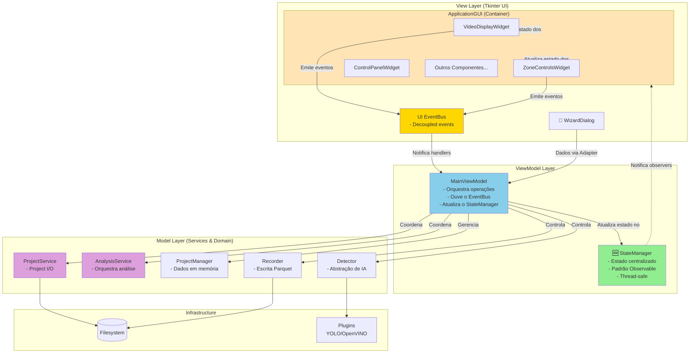
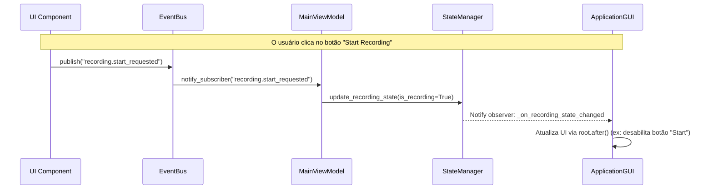
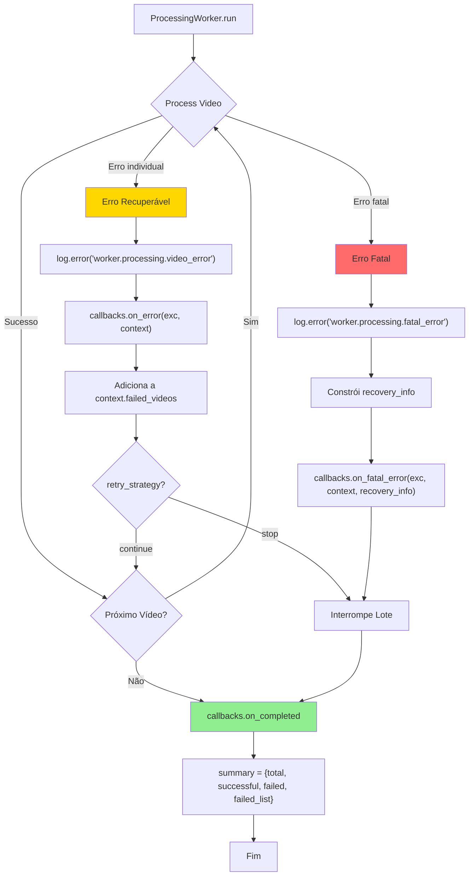

# DRerio LogAI – Visão Arquitetural

Este documento descreve a arquitetura técnica do **DRerio LogAI** (pacote interno `zebtrack`), destacando os principais componentes, fluxos de dados e decisões que norteiam o desenvolvimento e a manutenção do projeto.

> **Nota**: O nome do produto é "DRerio LogAI", mas o pacote Python interno permanece como `zebtrack`. Ver `TRANSITION_NOTE.md` para contexto completo.

## 1. Panorama

**DRerio LogAI** é uma aplicação desktop baseada em Tkinter que organiza o fluxo completo de análise comportamental de *Danio rerio* (zebrafish) e outros organismos aquáticos:

1.  **Captura/Carga de vídeo** (ao vivo ou pré-gravado).
2.  **Rastreamento multi-animal** usando plugins de detecção.
3.  **Registro de trajetórias** em Parquet com esquema rígido.
4.  **Análises comportamentais e ROI** orientadas a métricas científicas.
5.  **Geração de relatórios** (Excel/Word/CSV) para uso laboratorial.

### Arquitetura Geral: MVVM-S com Injeção de Dependência

A aplicação agora segue um padrão **MVVM-S** (Model-View-ViewModel-Service) com **Injeção de Dependência (DI)** completa. O `__main__.py` atua como o **Composition Root**, instanciando todos os serviços (`StateManager`, `DetectorService`, `VideoProcessingService`, `ProjectManager`, `Settings`, etc.) e injetando-os no `MainViewModel`.

A `ApplicationGUI` (View) é desacoplada e se comunica com o `MainViewModel` exclusivamente via `EventBus`, seguindo um **fluxo de dados unidirecional**. O `StateManager` é a **fonte única da verdade** para o estado do núcleo da aplicação.

-   **Model**: Camada de dados gerenciada pelo `StateManager` (imutável) e `ProjectManager` (persistência e carregamento de projetos).
-   **View**: A camada de UI, composta por componentes `ttk.Frame` modulares e reutilizáveis (`VideoDisplayWidget`, `ZoneControlsWidget`, etc.) que emitem eventos via `EventBus`. A `ApplicationGUI` atua como um contêiner para esses componentes.
-   **ViewModel**: O `MainViewModel` (controller) que orquestra as operações. Ele se inscreve em eventos do `EventBus` para responder a interações da UI e atualiza o `StateManager` para acionar atualizações reativas na View.
-   **Service Layer**: Serviços injetados via construtor (`DetectorService`, `VideoProcessingService`, `ProjectWorkflowService`, `WeightManager`, etc.) encapsulam lógica de domínio complexa e dependências externas.

Este padrão promove:

-   **Inversão de Controle (IoC)**: Todas as dependências são fornecidas externamente pelo Composition Root, eliminando o acoplamento a singletons globais.
-   **Testabilidade**: ViewModels, serviços e componentes de UI são testáveis isoladamente com mocks/stubs.
-   **Reatividade**: `StateManager` notifica a UI sobre mudanças de estado, e o `EventBus` notifica o ViewModel sobre ações do usuário.
-   **Manutenibilidade**: Componentes coesos e de baixo acoplamento facilitam a manutenção e extensão.

## 2. Diagrama de Arquitetura

O diagrama a seguir ilustra a interação entre as camadas e os principais componentes do sistema.



## 3. Componentes Principais

### 3.1. View Layer (UI)

A UI foi refatorada de uma classe monolítica para uma **arquitetura baseada em componentes modulares**, melhorando a manutenibilidade, testabilidade e reutilização.

| Componente | Responsabilidade principal |
|---|---|
| `ApplicationGUI` | A janela principal da aplicação. Atua como um contêiner que monta os vários componentes da UI e se inscreve nas mudanças de estado do `StateManager` para atualizar seus filhos. |
| **Componentes de UI** | Subclasses de `ttk.Frame` auto-contidas e reutilizáveis (ex: `VideoDisplayWidget`, `ZoneControlsWidget`). Lidam exclusivamente com a lógica de exibição e emitem eventos no `EventBus` em resposta à interação do usuário. |
| `EventBus` | Um sistema de publicação/inscrição que desacopla os componentes da UI do `MainViewModel`. Componentes publicam eventos (`zone.draw_roi`) sem conhecer quem os consome. |
| `WizardDialog` 🧙 | Assistente de 5 etapas para criação inteligente de projetos. É um componente complexo, porém autocontido, que entrega um conjunto de dados para o `MainViewModel` através de um `Adapter`. |

### 3.2. ViewModel Layer

| Componente | Responsabilidade principal |
|---|---|
| `MainViewModel` | Orquestra o fluxo da aplicação. Inscreve-se em eventos do `EventBus` para executar a lógica de negócio correspondente (ex: iniciar o desenho de uma zona). Atualiza o `StateManager` com o novo estado da aplicação. |
| `StateManager` 🆕 | **Fonte única de verdade** para o estado da aplicação. Implementa um padrão observável thread-safe com 5 categorias de estado (Project, Detector, Recording, Processing, UI). A UI observa o `StateManager` e reage a mudanças. |

### 3.3. Model Layer (Services & Domain)

| Componente | Responsabilidade principal |
|---|---|
| `ProjectService` | Camada de serviço para I/O de projetos: criar, salvar, carregar configurações e gerenciar templates de ROI. |
| `AnalysisService` | Camada de serviço que orquestra a análise de dados, coordenando os diferentes analisadores (comportamental, ROI) e o gerador de relatórios. |
| `ProjectManager` | Gerencia o estado do projeto em memória, incluindo a lista de vídeos, zonas, intervalos de análise e outras configurações. |
| `Detector` | Abstração para os modelos de IA (YOLO, OpenVINO), normalizando as detecções e gerenciando a máquina de estado das zonas. |
| `Recorder` | Responsável pela persistência de dados, garantindo um esquema Parquet imutável e a gravação opcional de vídeos com overlays. |

## 4. Estrutura de Dados do Projeto

A configuração e os dados de um projeto são persistidos no arquivo `<pasta_projeto>/project_config.json`. Esta é a estrutura principal que o `ProjectManager` manipula.

```json
{
    "project_name": "string",
    "project_type": "pre-recorded' | 'live'",
    "timestamp": "string (ISO 8601)",
    "calibration": {
        "num_aquariums": "int",
        "animals_per_aquarium": "int",
        "aquarium_width_cm": "float",
        "aquarium_height_cm": "float"
    },
    "active_weight": "string",
    "use_openvino": "bool",
    "analysis_interval_frames": "int",
    "display_interval_frames": "int",
    "batches": [
        {
            "timestamp": "string (ISO 8601)",
            "videos": [
                {
                    "path": "string",
                    "sha256": "string",
                    "status": "'pending' | 'complete'"
                }
            ]
        }
    ],
    "detection_zones": {
        "polygon": "list[list[int]]",
        "roi_polygons": "list[list[list[int]]]",
        "roi_names": "list[string]",
        "roi_colors": "list[tuple[int, int, int]]"
    },
    "detector_config": {
        "plugin_name": "string",
        "confidence_threshold": "float",
        "nms_threshold": "float",
        "context": "'tracking' | 'zones'"
    },
    "file_hash": "string (SHA256 of the content)"
}
```

### 4.2. Estado Imutável e Rastreabilidade

O `StateManager` implementa o padrão **Observable** com garantias de **thread-safety** e rastreabilidade completa de mudanças de estado.

#### Categorias de Estado

O estado da aplicação é organizado em 5 categorias hierárquicas:

```python
{
    "project": {
        "name": str | None,
        "path": Path | None,
        "type": str | None,
        "is_loaded": bool
    },
    "detector": {
        "is_initialized": bool,
        "active_plugin": str | None,
        "confidence_threshold": float,
        "nms_threshold": float
    },
    "recording": {
        "is_recording": bool,
        "output_dir": Path | None,
        "current_video": str | None,
        "frames_recorded": int
    },
    "processing": {
        "status": str,  # "idle" | "running" | "paused" | "error"
        "progress": float,  # 0.0 to 1.0
        "current_task": str | None
    },
    "ui": {
        "active_view": str,  # "welcome" | "project" | "analysis"
        "zoom_level": float,
        "overlay_enabled": bool
    }
}
```

**Arquivo**: `src/zebtrack/core/state_manager.py`

#### Thread-Safety

```python
import threading

class StateManager:
    def __init__(self):
        self._state: dict = self._initialize_state()
        self._lock = threading.RLock()  # Recursive lock para nested updates
        self._observers: dict[str, list[Callable]] = {}

    def set(self, key: str, value: Any) -> None:
        with self._lock:
            self._state[key] = value
            self._notify_observers(key, value)
```

**Garantias**:
- Atualizações atômicas via `threading.RLock()`
- Notificações de observers no mesmo lock para consistência
- Suporte a nested updates (ex: `set("project.name", "X")` dentro de `on_project_loaded`)

#### Rastreabilidade

Todas as mudanças de estado são logadas com `structlog`:

```python
log.info(
    "state.update",
    key="processing.status",
    old_value="idle",
    new_value="running",
    source="MainViewModel.start_processing"
)
```

**Benefícios**:
- Debugging de race conditions
- Auditoria de mudanças críticas (ex: `recording.is_recording`)
- Replay de sequências de estado para testes

### 4.3. Validação de Schema Parquet

O esquema Parquet é **imutável** e **versionado**, garantindo compatibilidade com análises externas e reprodutibilidade científica.

#### Schema Base (Core Columns)

**Sempre presentes** em qualquer arquivo de trajetórias:

```python
CORE_SCHEMA = [
    ("timestamp", pa.float64()),
    ("frame", pa.int64()),
    ("track_id", pa.int64()),
    ("x1", pa.float64()),
    ("y1", pa.float64()),
    ("x2", pa.float64()),
    ("y2", pa.float64()),
    ("confidence", pa.float64())
]
```

#### Schema Estendido (Calibração)

**Adicionado ao final** quando calibração está presente:

```python
CALIBRATION_SCHEMA = [
    ("x_center_px", pa.float64()),
    ("y_center_px", pa.float64()),
    ("x_cm", pa.float64()),
    ("y_cm", pa.float64())
]
```

**Arquivo**: `src/zebtrack/io/recorder.py:45-80`

#### Validação em Runtime

```python
class Recorder:
    def _build_schema(self) -> pa.Schema:
        """Constrói schema baseado em presença de calibração."""
        schema_fields = list(CORE_SCHEMA)

        if self.calibration is not None:
            schema_fields.extend(CALIBRATION_SCHEMA)

        return pa.schema(schema_fields)

    def write_detection_data(self, detections: list) -> None:
        """Valida que detections correspondem ao schema."""
        expected_cols = len(self._schema)
        actual_cols = len(detections[0]) if detections else 0

        if actual_cols != expected_cols:
            raise ValueError(
                f"Schema mismatch: expected {expected_cols} columns, "
                f"got {actual_cols}"
            )
```

**Garantias**:
1. **Ordem fixa**: Colunas nunca são reordenadas
2. **Validação na escrita**: `write_detection_data` falha imediatamente se schema divergir
3. **Testes de schema**: `tests/test_recorder.py` valida todos os cenários

**Restrições**:
- Novas colunas **só podem ser adicionadas ao final** do schema
- Mudanças de tipo requerem incremento de versão do schema
- Remoção de colunas é **proibida** (deprecação semântica apenas)

#### Versionamento

Versão do schema registrada em metadados do Parquet:

```python
metadata = {
    "schema_version": "1.0",
    "zebtrack_version": "1.8.0",
    "has_calibration": "true" if self.calibration else "false"
}
table = table.replace_schema_metadata(metadata)
```

**Leitura segura**:
```python
def read_trajectory(path: Path) -> pd.DataFrame:
    table = pq.read_table(path)
    schema_version = table.schema.metadata.get(b"schema_version", b"1.0").decode()

    if schema_version != "1.0":
        log.warning("trajectory.read.version_mismatch", expected="1.0", got=schema_version)

    return table.to_pandas()
```

## 5. Fluxos de Dados Principais

### 5.1. Fluxo de Estado Centralizado e UI Reativa

O sistema utiliza uma combinação do `StateManager` e do `EventBus` para criar uma UI reativa e desacoplada.



### 5.2. Processamento Assíncrono em Lote

Operações pesadas, como a análise de vídeos, são executadas em uma thread separada para manter a UI responsiva.

```mermaid
graph LR
    subgraph "Main Thread (Tkinter)"
        Controller[MainViewModel]
        StateManager[StateManager]
        GUI[UI Components]
    end

    subgraph "Worker Thread"
        ProcessingLoop[Processing Loop<br/>- Detecção de objetos<br/>- Escrita de Parquet]
        AnalysisTask[Analysis Task<br/>- Cálculo de métricas]
    end

    Controller --o|spawn thread| ProcessingLoop
    ProcessingLoop -->>|update_state| StateManager
    StateManager -.->|notify observers| GUI
    GUI -->>|root.after()| GUI
    ProcessingLoop --> AnalysisTask
    AnalysisTask -->>|final_update| StateManager

    style ProcessingLoop fill:#FFB6C1
    style AnalysisTask fill:#FFB6C1
```

### 5.3. Fluxo de Tratamento de Erros

O sistema implementa tratamento hierárquico de erros com callbacks especializados e estratégias de recuperação.



**Callbacks e Thread-Safety**:

1. **on_error** (erro recuperável):
   ```python
   def on_error(exc: Exception, context: str):
       # Chamado do worker thread
       root.after(0, lambda: _show_error_toast(context))
   ```

2. **on_fatal_error** (erro fatal):
   ```python
   def on_fatal_error(exc: Exception, context: str, recovery_info: dict):
       # Chamado do worker thread
       root.after(0, lambda: _show_fatal_error_dialog(exc, recovery_info))
   ```

3. **on_completed** (sempre chamado):
   ```python
   def on_completed(was_cancelled: bool, output_dir: str, summary: dict):
       # Chamado do worker thread
       root.after(0, lambda: _finalize_processing(summary))
   ```

**Documentação completa**: [`docs/ERROR_HANDLING.md`](ERROR_HANDLING.md)

**Arquivos relacionados**:
- `src/zebtrack/core/processing_worker.py:272-340` - Implementação de callbacks
- `src/zebtrack/core/main_view_model.py` - Handlers de callbacks no ViewModel

### 5.4. Políticas de Logging Estruturado

O sistema usa `structlog` com convenção `domínio.ação.resultado` para logging estruturado, facilitando debugging e análise.

#### Convenção de Nomenclatura

```
<módulo>.<operação>.<resultado>
```

**Exemplos**:
- `worker.processing.start`
- `recorder.parquet.write_success`
- `detector.zone.transition`
- `state.update`
- `config.validation.failed`

#### Políticas por Módulo

| Módulo | Eventos Principais | Nível Padrão | Arquivo |
|--------|-------------------|--------------|---------|
| **ProcessingWorker** | `worker.processing.start`<br>`worker.processing.video_start`<br>`worker.processing.video_error`<br>`worker.processing.fatal_error`<br>`worker.processing.complete` | INFO/ERROR | `core/processing_worker.py` |
| **Recorder** | `recorder.parquet.write_success`<br>`recorder.parquet.schema_mismatch`<br>`recorder.video.save_complete` | INFO/ERROR | `io/recorder.py` |
| **Detector** | `detector.init.success`<br>`detector.zone.enter`<br>`detector.zone.exit`<br>`detector.inference.error` | INFO/WARNING | `core/detector.py` |
| **StateManager** | `state.update`<br>`state.observer.notify` | DEBUG | `core/state_manager.py` |
| **ProjectService** | `project.create.success`<br>`project.load.error`<br>`project.save.integrity_check` | INFO/ERROR | `core/project_service.py` |
| **MainViewModel** | `controller.load_project.success`<br>`controller.start_recording.request`<br>`controller.error.handled` | INFO/ERROR | `core/main_view_model.py` |
| **AnalysisService** | `analysis.behavior.start`<br>`analysis.roi.metrics_computed`<br>`analysis.report.generated` | INFO | `analysis/analysis_service.py` |

#### Estrutura de Contexto

Logs incluem contexto estruturado para facilitar filtros e análises:

```python
# Exemplo completo
log.info(
    "worker.processing.video_start",
    index=2,
    total=10,
    experiment_id="subject_003_day_01",
    thread=threading.current_thread().name,
    video_path=str(video_path),
    analysis_interval=10,
    display_interval=10
)
```

**Campos comuns**:
- `experiment_id`: Identificador do vídeo sendo processado
- `thread`: Nome da thread (para debugging de concorrência)
- `video_path` / `project_path`: Contexto de arquivo
- `index` / `total`: Progresso em lotes
- `error`: String de exceção (sempre em `exc_info=True` para ERROR)

#### Configuração de Handlers

**Arquivo**: `src/zebtrack/__main__.py:15-50`

```python
# File handler com rotação
file_handler = logging.handlers.RotatingFileHandler(
    "analysis.log",
    maxBytes=5 * 1024 * 1024,  # 5 MB
    backupCount=5,
    mode="a"
)

# Console handler
console_handler = logging.StreamHandler(sys.stdout)

# Processadores structlog
structlog.configure(
    processors=[
        structlog.stdlib.add_log_level,
        structlog.stdlib.add_logger_name,
        structlog.processors.TimeStamper(fmt="%H:%M:%S", utc=False),
        structlog.processors.StackInfoRenderer(),
        structlog.processors.format_exc_info,
        structlog.processors.UnicodeDecoder(),
        structlog.processors.JSONRenderer(),  # Saída JSON
    ],
    logger_factory=structlog.stdlib.LoggerFactory(),
)
```

**Formato de saída** (JSON):
```json
{
  "event": "worker.processing.video_start",
  "level": "info",
  "timestamp": "14:35:22",
  "index": 2,
  "total": 10,
  "experiment_id": "subject_003_day_01",
  "thread": "ProcessingWorker"
}
```

#### Debugging com Logs

**Filtrar por domínio**:
```bash
# Ver apenas erros do worker
grep "worker.processing" analysis.log | jq 'select(.level == "error")'

# Ver transições de estado
grep "state.update" analysis.log | jq '{time: .timestamp, key: .key, new: .new_value}'

# Ver apenas vídeos falhados
grep "worker.processing.video_error" analysis.log | jq .experiment_id
```

**Níveis por ambiente**:
- **Desenvolvimento**: `INFO` (console + file)
- **Produção**: `WARNING` (file apenas)
- **Debugging**: `DEBUG` (StateManager, memory GC)

## 6. Decisões Arquiteturais Chave

| ID | Decisão | Motivação |
|---|---|---|
| **AD-01** | **Padrão MVVM-like com Componentes de UI** | Promove separação de responsabilidades, testabilidade e manutenibilidade, desacoplando a lógica da UI da lógica de negócio. |
| **AD-02** | **Gerenciamento Centralizado de Estado (StateManager)** | Cria uma fonte única de verdade para o estado da aplicação, permitindo atualizações reativas da UI de forma thread-safe e desacoplada. |
| **AD-03** | **Comunicação via EventBus na UI** | Desacopla os componentes de UI do `MainViewModel`. Componentes emitem eventos sem saber quem os consome, aumentando a modularidade. |
| **AD-04** | **Camada de Serviços (Service Layer)** | Encapsula a lógica de domínio e I/O (`ProjectService`, `AnalysisService`), isolando a complexidade do `MainViewModel` e facilitando testes unitários. |
| **AD-05** | **Threading com `root.after()`** | Mantém a UI responsiva durante operações pesadas sem introduzir a complexidade de frameworks assíncronos mais pesados. |
| **AD-06** | **Plugins de Detector** | Facilita a extensão do sistema com novos modelos de IA (YOLO, OpenVINO) sem alterar o código do núcleo. |
| **AD-07** | **Esquema Parquet Rígido** | Garante a compatibilidade e a consistência dos dados de saída, essencial para a reprodutibilidade científica e análise externa. |
| **AD-08** | **Wizard de Criação de Projetos como Padrão** | Oferece uma experiência de usuário guiada e à prova de erros para a configuração de projetos, que é uma tarefa complexa. |
| **AD-09** | **Hierarquia de Configuração (Global → Projeto)** | Permite configurações padrão em toda a aplicação (`config.yaml`) que podem ser sobrescritas por configurações específicas do projeto (`project_config.json`), oferecendo flexibilidade e consistência. |

---

Para guias de desenvolvimento e manuais de usuário detalhados, consulte a [Wiki do projeto](wiki/).
