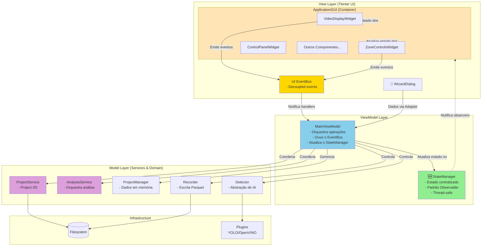
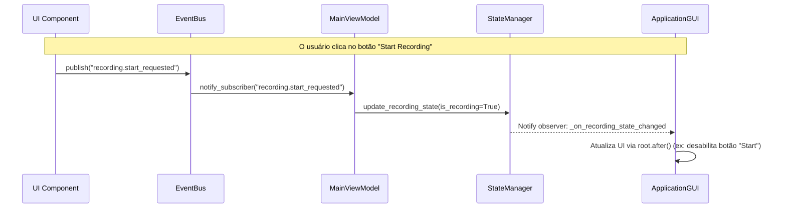

# ZebTrack-AI – Visão Arquitetural

Este documento descreve a arquitetura técnica do ZebTrack-AI, destacando os principais componentes, fluxos de dados e decisões que norteiam o desenvolvimento e a manutenção do projeto.

## 1. Panorama

ZebTrack-AI é uma aplicação desktop baseada em Tkinter que organiza o fluxo completo de análise comportamental de animais aquáticos:

1.  **Captura/Carga de vídeo** (ao vivo ou pré-gravado).
2.  **Rastreamento multi-animal** usando plugins de detecção.
3.  **Registro de trajetórias** em Parquet com esquema rígido.
4.  **Análises comportamentais e ROI** orientadas a métricas científicas.
5.  **Geração de relatórios** (Excel/Word/CSV) para uso laboratorial.

### Arquitetura Geral: MVVM-like com Componentes de UI

ZebTrack-AI segue um padrão arquitetural **MVVM-like** (Model-View-ViewModel) adaptado para Tkinter, com uma **arquitetura de UI baseada em componentes** e comunicação desacoplada via **EventBus** e **StateManager**.

-   **Model**: Camada de dados e serviços. Inclui o `StateManager` (fonte única de verdade para o estado), `ProjectManager` (dados de projeto em memória), e serviços de domínio como `ProjectService` (I/O) e `AnalysisService`.
-   **View**: A camada de UI, composta por componentes `ttk.Frame` modulares e reutilizáveis (`VideoDisplayWidget`, `ZoneControlsWidget`, etc.) que emitem eventos. A `ApplicationGUI` atua como um contêiner para esses componentes.
-   **ViewModel**: O `MainViewModel` (controller) que orquestra as operações. Ele se inscreve em eventos do `EventBus` para responder a interações da UI e atualiza o `StateManager` para acionar atualizações reativas na View.

Este padrão promove:

-   **Separação de responsabilidades**: UI desacoplada da lógica de negócio.
-   **Testabilidade**: ViewModels, serviços e componentes de UI são testáveis de forma isolada.
-   **Reatividade**: `StateManager` notifica a UI sobre mudanças de estado, e o `EventBus` notifica o ViewModel sobre ações do usuário.
-   **Manutenibilidade**: Componentes coesos e de baixo acoplamento facilitam a manutenção e extensão.

## 2. Diagrama de Arquitetura

O diagrama a seguir ilustra a interação entre as camadas e os principais componentes do sistema.



## 3. Componentes Principais

### 3.1. View Layer (UI)

A UI foi refatorada de uma classe monolítica para uma **arquitetura baseada em componentes modulares**, melhorando a manutenibilidade, testabilidade e reutilização.

| Componente | Responsabilidade principal |
|---|---|
| `ApplicationGUI` | A janela principal da aplicação. Atua como um contêiner que monta os vários componentes da UI e se inscreve nas mudanças de estado do `StateManager` para atualizar seus filhos. |
| **Componentes de UI** | Subclasses de `ttk.Frame` auto-contidas e reutilizáveis (ex: `VideoDisplayWidget`, `ZoneControlsWidget`). Lidam exclusivamente com a lógica de exibição e emitem eventos no `EventBus` em resposta à interação do usuário. |
| `EventBus` | Um sistema de publicação/inscrição que desacopla os componentes da UI do `MainViewModel`. Componentes publicam eventos (`zone.draw_roi`) sem conhecer quem os consome. |
| `WizardDialog` 🧙 | Assistente de 5 etapas para criação inteligente de projetos. É um componente complexo, porém autocontido, que entrega um conjunto de dados para o `MainViewModel` através de um `Adapter`. |

### 3.2. ViewModel Layer

| Componente | Responsabilidade principal |
|---|---|
| `MainViewModel` | Orquestra o fluxo da aplicação. Inscreve-se em eventos do `EventBus` para executar a lógica de negócio correspondente (ex: iniciar o desenho de uma zona). Atualiza o `StateManager` com o novo estado da aplicação. |
| `StateManager` 🆕 | **Fonte única de verdade** para o estado da aplicação. Implementa um padrão observável thread-safe com 5 categorias de estado (Project, Detector, Recording, Processing, UI). A UI observa o `StateManager` e reage a mudanças. |

### 3.3. Model Layer (Services & Domain)

| Componente | Responsabilidade principal |
|---|---|
| `ProjectService` | Camada de serviço para I/O de projetos: criar, salvar, carregar configurações e gerenciar templates de ROI. |
| `AnalysisService` | Camada de serviço que orquestra a análise de dados, coordenando os diferentes analisadores (comportamental, ROI) e o gerador de relatórios. |
| `ProjectManager` | Gerencia o estado do projeto em memória, incluindo a lista de vídeos, zonas, intervalos de análise e outras configurações. |
| `Detector` | Abstração para os modelos de IA (YOLO, OpenVINO), normalizando as detecções e gerenciando a máquina de estado das zonas. |
| `Recorder` | Responsável pela persistência de dados, garantindo um esquema Parquet imutável e a gravação opcional de vídeos com overlays. |

## 4. Estrutura de Dados do Projeto

A configuração e os dados de um projeto são persistidos no arquivo `<pasta_projeto>/project_config.json`. Esta é a estrutura principal que o `ProjectManager` manipula.

```json
{
    "project_name": "string",
    "project_type": "pre-recorded' | 'live'",
    "timestamp": "string (ISO 8601)",
    "calibration": {
        "num_aquariums": "int",
        "animals_per_aquarium": "int",
        "aquarium_width_cm": "float",
        "aquarium_height_cm": "float"
    },
    "active_weight": "string",
    "use_openvino": "bool",
    "analysis_interval_frames": "int",
    "display_interval_frames": "int",
    "batches": [
        {
            "timestamp": "string (ISO 8601)",
            "videos": [
                {
                    "path": "string",
                    "sha256": "string",
                    "status": "'pending' | 'complete'"
                }
            ]
        }
    ],
    "detection_zones": {
        "polygon": "list[list[int]]",
        "roi_polygons": "list[list[list[int]]]",
        "roi_names": "list[string]",
        "roi_colors": "list[tuple[int, int, int]]"
    },
    "detector_config": {
        "plugin_name": "string",
        "confidence_threshold": "float",
        "nms_threshold": "float",
        "context": "'tracking' | 'zones'"
    },
    "file_hash": "string (SHA256 of the content)"
}
```

## 5. Fluxos de Dados Principais

### 5.1. Fluxo de Estado Centralizado e UI Reativa

O sistema utiliza uma combinação do `StateManager` e do `EventBus` para criar uma UI reativa e desacoplada.



### 5.2. Processamento Assíncrono em Lote

Operações pesadas, como a análise de vídeos, são executadas em uma thread separada para manter a UI responsiva.

```mermaid
graph LR
    subgraph "Main Thread (Tkinter)"
        Controller[MainViewModel]
        StateManager[StateManager]
        GUI[UI Components]
    end
    
    subgraph "Worker Thread"
        ProcessingLoop[Processing Loop<br/>- Detecção de objetos<br/>- Escrita de Parquet]
        AnalysisTask[Analysis Task<br/>- Cálculo de métricas]
    end
    
    Controller --o|spawn thread| ProcessingLoop
    ProcessingLoop -->>|update_state| StateManager
    StateManager -.->|notify observers| GUI
    GUI -->>|root.after()| GUI
    ProcessingLoop --> AnalysisTask
    AnalysisTask -->>|final_update| StateManager
    
    style ProcessingLoop fill:#FFB6C1
    style AnalysisTask fill:#FFB6C1
```

## 6. Decisões Arquiteturais Chave

| ID | Decisão | Motivação |
|---|---|---|
| **AD-01** | **Padrão MVVM-like com Componentes de UI** | Promove separação de responsabilidades, testabilidade e manutenibilidade, desacoplando a lógica da UI da lógica de negócio. |
| **AD-02** | **Gerenciamento Centralizado de Estado (StateManager)** | Cria uma fonte única de verdade para o estado da aplicação, permitindo atualizações reativas da UI de forma thread-safe e desacoplada. |
| **AD-03** | **Comunicação via EventBus na UI** | Desacopla os componentes de UI do `MainViewModel`. Componentes emitem eventos sem saber quem os consome, aumentando a modularidade. |
| **AD-04** | **Camada de Serviços (Service Layer)** | Encapsula a lógica de domínio e I/O (`ProjectService`, `AnalysisService`), isolando a complexidade do `MainViewModel` e facilitando testes unitários. |
| **AD-05** | **Threading com `root.after()`** | Mantém a UI responsiva durante operações pesadas sem introduzir a complexidade de frameworks assíncronos mais pesados. |
| **AD-06** | **Plugins de Detector** | Facilita a extensão do sistema com novos modelos de IA (YOLO, OpenVINO) sem alterar o código do núcleo. |
| **AD-07** | **Esquema Parquet Rígido** | Garante a compatibilidade e a consistência dos dados de saída, essencial para a reprodutibilidade científica e análise externa. |
| **AD-08** | **Wizard de Criação de Projetos como Padrão** | Oferece uma experiência de usuário guiada e à prova de erros para a configuração de projetos, que é uma tarefa complexa. |
| **AD-09** | **Hierarquia de Configuração (Global → Projeto)** | Permite configurações padrão em toda a aplicação (`config.yaml`) que podem ser sobrescritas por configurações específicas do projeto (`project_config.json`), oferecendo flexibilidade e consistência. |

---

Para guias de desenvolvimento e manuais de usuário detalhados, consulte a [Wiki do projeto](wiki/).