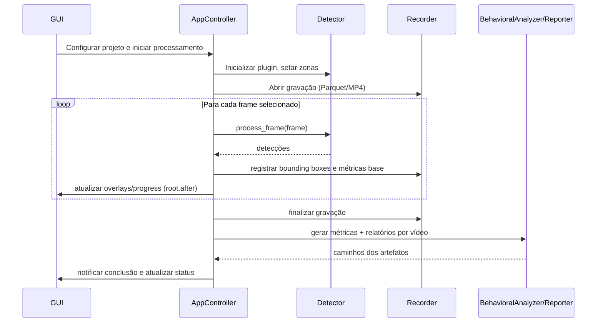

# ZebTrack-AI – Visão Arquitetural

Este documento descreve a arquitetura técnica do ZebTrack-AI, destacando os principais componentes, fluxos de dados e decisões que norteiam o desenvolvimento e a manutenção do projeto.

## 1. Panorama

ZebTrack-AI é uma aplicação desktop baseada em Tkinter que organiza o fluxo completo de análise comportamental de animais aquáticos:

1. **Captura/Carga de vídeo** (ao vivo ou pré-gravado).
2. **Rastreamento multi-animal** usando plugins de detecção.
3. **Registro de trajetórias** em Parquet com esquema rígido.
4. **Análises comportamentais e ROI** orientadas a métricas científicas.
5. **Geração de relatórios** (Excel/Word/CSV) para uso laboratorial.

## 2. Diagrama de componentes

```mermaid
graph TD
    subgraph UI
        GUI[ApplicationGUI (Tkinter)]
        WizardDialog[🧙 WizardDialog - 5 steps]

        WizardAdapter[wizard_adapter]
    end
    subgraph Core
        Controller[AppController]
        ProjectManager
        Detector
        WeightManager
        Calibration
    end
    subgraph IO
        VideoSource[io/video_source]
        Recorder
    end
    subgraph Analysis
        BehavioralAnalyzer
        ROIAnalyzer[analysis/roi]
        Reporter
    end
    subgraph Plugins
        DetectorPlugins[(DetectorPlugin impls)]
    end

    GUI --> WizardDialog
    WizardDialog --> WizardAdapter
    WizardAdapter --> Controller
    GUI --> Controller
    Controller --> ProjectManager
    Controller --> Detector
    Controller --> VideoSource
    Controller --> Recorder
    Controller --> BehavioralAnalyzer
    Controller --> Reporter
    Detector --> DetectorPlugins
    Detector --> Calibration
    Recorder -->|Parquet/MP4| Storage[(Filesystem)]
    ProjectManager --> Storage
    Reporter -->|Excel/Word/CSV| Storage
    WeightManager -->|model paths| Detector
```

### Responsabilidades

| Componente | Responsabilidade principal |
|------------|---------------------------|
| `ApplicationGUI` | Interfaces Tkinter, coleta de input do usuário, exibição de progresso e overlays. |
| `WizardDialog` 🧙 | Assistente de 5 etapas (padrão desde v1.6) para criação inteligente de projetos com auto-detecção de design experimental e importação de parquets. |
| `wizard_adapter` | Traduz saída do wizard (formato rico) para formato esperado pelo controller (compatibilidade retroativa). |
| `AppController` | Orquestra o fluxo end-to-end, agenda threads e callbacks (`root.after`). |
| `ProjectManager` | Persistência de metadados, batches de vídeos, zonas, intervalos, snapshots de configuração e detecção granular de parquets (`scan_input_paths()`). |
| `Detector` + plugins | Abstração de modelos (YOLO, OpenVINO), normaliza detecções, desenha overlays. |
| `Recorder` | Persistência do esquema Parquet/MP4 com colunas ordenadas. |
| `analysis/*` | Métricas comportamentais, cálculos de ROI, geração de relatórios rich-media. |
| `WeightManager` | Descoberta e verificação de pesos, inclusive hashes de modelos OpenVINO. |

## 3. Fluxo de dados



### Pipeline resumido

1. **Entrada**: `VideoSource` entrega frames sequenciais (de arquivo ou câmera).
2. **Detecção**: `DetectorPlugin` retorna bounding boxes, scores e `track_id`.
3. **Registro**: `Recorder` grava Parquet na ordem fixa de colunas e, opcionalmente, MP4 com sobreposições.
4. **Análise**: `BehavioralAnalyzer` e `ROI` aplicam métricas (distância, freezing, thigmotaxis, etc.).
5. **Relatórios**: `Reporter` compila resultados em Excel/Word com plots e mapas de ROI.

## 4. Decisões arquiteturais chave

| ID | Decisão | Motivação |
|----|---------|-----------|
| AD-01 | **Uso de Tkinter + threads secundárias** | Permitir distribuição simples (sem dependência web) mantendo a UI responsiva via `root.after`. |
| AD-02 | **Plugins de detector baseados em `DetectorPlugin`** | Facilitar troca entre YOLO puro e modelos convertidos (OpenVINO) sem alterar a GUI. |
| AD-03 | **Esquema Parquet rígido** | Garantir compatibilidade com pipelines de análise externos e regressão de dados. |
| AD-04 | **Configuração via Pydantic (`settings.py`)** | Validar `config.yaml` em runtime e suportar overrides (`config.local.yaml`). |
| AD-05 | **Progresso granular** | `progress_callback` propaga métricas (frames totais/processados/detectados) para alimentar `update_processing_stats`. |
| AD-06 | **Projétil orientado a projetos** | Persistir `ProjectManager.project_data` mantendo batches e intervalos por projeto. |
| AD-07 | **Wizard padrão com fallback controlado por flag** 🧙 | O fluxo guiado é a experiência padrão (v1.6+); a flag `UIFeatureFlags.use_wizard_for_project_creation` permanece apenas para cenários legados, com compatibilidade assegurada pelo `wizard_adapter`. |
| AD-08 | **Fila de eventos assíncrona (em implantação)** | `UIFeatureFlags.enable_event_queue` introduz um _event bus_ entre threads de processamento e o mainloop Tkinter, reduzindo `root.after` diretos e isolando efeitos de UI. |
| AD-09 | **Wizard com janela larga e layout de 3 colunas** 🧙 | Para máximo aproveitamento horizontal sem ocultar botões, o wizard usa tamanho fixo de 1150×550px (aspecto wide, 2.09:1). Discovery Step organiza todas as 3 perguntas em colunas lado a lado. Espaçamentos compactos (padding 8-10px). Reserva 220px verticais para garantir que botões fiquem sempre visíveis. Redimensionável entre 75%-120% largura, 75%-110% altura. |
| AD-10 | **Gerenciamento Centralizado de Estado (StateManager)** 🆕 | Implementação de padrão observável para unificar estado da aplicação. Cinco categorias de estado (Project, Detector, Recording, Processing, UI) com thread-safety, snapshots imutáveis e histórico opcional. Desacopla componentes e permite atualizações reativas da UI. |

## 4.1. Gerenciamento Centralizado de Estado (StateManager) 🆕

### Visão Geral

O **StateManager** (`core/state_manager.py`) é a fonte única de verdade para o estado da aplicação, implementando um padrão observável que desacopla componentes e permite atualizações reativas da UI. Introduzido na v1.8, substitui a leitura direta de atributos do controller por um sistema centralizado e thread-safe.

### Arquitetura do StateManager

```mermaid
graph TB
    subgraph StateManager Core
        SM[StateManager<br/>- subscribe()<br/>- update_*_state()<br/>- get_*_state()]

        
        subgraph State Categories
            PS[ProjectState<br/>project_path<br/>project_name<br/>total_videos]
            DS[DetectorState<br/>initialized<br/>detector_name<br/>zones_configured]
            RS[RecordingState<br/>is_recording<br/>arduino_connected<br/>arduino_port]
            PRS[ProcessingState<br/>is_processing<br/>current_operation]
            US[UIState<br/>active_tab<br/>last_analysis_path]
        end
    end
    
    subgraph Observers
        GUI[ApplicationGUI<br/>_on_recording_state_changed<br/>_on_processing_state_changed<br/>_on_detector_state_changed<br/>_on_project_state_changed]
        PM[ProjectManager<br/>optional state_manager ref]
        Custom[Custom Observers<br/>extensible]
    end
    
    subgraph State Producers
        CTRL[MainViewModel<br/>Controller]
        Worker[Processing Worker]
        Arduino[Arduino Manager]
    end
    
    SM --> PS
    SM --> DS
    SM --> RS
    SM --> PRS
    SM --> US
    
    CTRL --> SM
    Worker --> SM
    Arduino --> SM
    
    SM -.notify.-> GUI
    SM -.notify.-> PM
    SM -.notify.-> Custom
    
    GUI -.subscribe.-> SM
    PM -.subscribe.-> SM
    Custom -.subscribe.-> SM
```

### Categorias de Estado

| Categoria | Dataclass | Campos Principais | Quando Atualizar |
|-----------|-----------|-------------------|------------------|
| **Project** | `ProjectState` | `project_path`, `project_name`, `total_videos`, `project_loaded` | Criar/abrir/fechar projetos |
| **Detector** | `DetectorState` | `initialized`, `detector_name`, `zones_configured`, `model_loaded` | Inicializar detector, configurar zonas |
| **Recording** | `RecordingState` | `is_recording`, `output_path`, `arduino_connected`, `arduino_port` | Iniciar/parar gravação, conectar Arduino |
| **Processing** | `ProcessingState` | `is_processing`, `current_operation`, `progress`, `start_time` | Iniciar/finalizar análise ou rastreamento |
| **UI** | `UIState` | `active_tab`, `last_analysis_path`, `status_message` | Mudanças de interface (futuro) |

### Características Técnicas

#### Thread-Safety

- Todas as operações protegidas por `threading.RLock()`

- Snapshots imutáveis via `copy.deepcopy()`

- Notificações de observadores thread-safe

#### Histórico de Estados

```python
# Habilitar histórico (opcional, máx. 100 entradas)
state_manager = StateManager(enable_history=True)

# Consultar histórico
history = state_manager.get_history(StateCategory.RECORDING, limit=10)
for entry in history:
    print(f"{entry.timestamp}: {entry.changes}")
```

#### Padrão Observável

```python
# Inscrever observador
def on_recording_changed(category, changes, new_state):
    if "is_recording" in changes:
        print(f"Recording: {new_state.is_recording}")

state_manager.subscribe(
    StateCategory.RECORDING, 
    on_recording_changed
)

# Atualizar estado (notifica automaticamente)
state_manager.update_recording_state(
    source="controller.start_recording",
    is_recording=True,
    output_path="/path/to/output.parquet"
)
```

### Integração com Componentes

#### MainViewModel (Controller)

O controller inicializa o StateManager e atualiza estados em pontos críticos:

```python
class MainViewModel:
    def __init__(self):
        self.state_manager = StateManager(enable_history=True)
        
    def start_recording(self, output_path):
        # Lógica de gravação...
        self.state_manager.update_recording_state(
            source="controller.start_recording",
            is_recording=True,
            output_path=output_path
        )
    
    # Propriedades retrocompatíveis
    @property
    def is_recording(self):
        return self.state_manager.get_recording_state().is_recording
```

**Pontos de Atualização no Controller:**

- `start_recording()` / `stop_recording()`: RecordingState

- `initialize_detector()` / `close_detector()`: DetectorState

- `_process_videos()` / análise: ProcessingState

- `open_project()` / `close_project()`: ProjectState

- `setup_arduino()`: RecordingState (arduino_connected, arduino_port)

#### ApplicationGUI (Observer Reativo)

A GUI se inscreve em categorias relevantes e atualiza a interface reativamente:

```python
class ApplicationGUI:
    def _subscribe_to_state_changes(self):
        # Inscrever em 4 categorias
        self.controller.state_manager.subscribe(
            StateCategory.RECORDING, 
            self._on_recording_state_changed
        )
        self.controller.state_manager.subscribe(
            StateCategory.PROCESSING,
            self._on_processing_state_changed
        )
        self.controller.state_manager.subscribe(
            StateCategory.DETECTOR,
            self._on_detector_state_changed
        )
        self.controller.state_manager.subscribe(
            StateCategory.PROJECT,
            self._on_project_state_changed
        )
    
    def _on_recording_state_changed(self, category, changes, new_state):
        # Atualizar UI no mainloop Tkinter
        if "is_recording" in changes:
            self.root.after(0, self._update_recording_ui, new_state.is_recording)
        elif "arduino_connected" in changes:
            self.root.after(0, self._update_arduino_ui, new_state.arduino_connected)
```

**Callbacks de Observador:**

- `_on_recording_state_changed`: Botões de gravação, status Arduino

- `_on_processing_state_changed`: Barra de progresso, overlays

- `_on_detector_state_changed`: Status de inicialização do detector

- `_on_project_state_changed`: Load/close de projetos

#### ProjectManager

O `ProjectManager` recebe referência opcional ao StateManager para propagação de estado:

```python
class ProjectManager:
    def __init__(self, state_manager=None):
        self.state_manager = state_manager
        # Pode propagar mudanças de projeto via state_manager.update_project_state()
```

O controller passa a referência:

```python
self.project_manager = ProjectManager(state_manager=self.state_manager)
```

### Retrocompatibilidade

Para garantir compatibilidade com código existente, o controller mantém propriedades que leem do StateManager:

```python
@property
def is_recording(self):
    """Backward-compatible property for recording state."""
    return self.state_manager.get_recording_state().is_recording

@property
def detector_initialized(self):
    """Backward-compatible property for detector state."""
    return self.state_manager.get_detector_state().initialized

@property
def is_processing(self):
    """Backward-compatible property for processing state."""
    return self.state_manager.get_processing_state().is_processing
```

### Casos de Uso Avançados

#### Rastreamento de Arduino

```python
# No controller, ao conectar Arduino
if arduino_manager.connect(port, baud_rate):
    self.arduino = arduino_manager.arduino
    self.state_manager.update_recording_state(
        source="controller.setup_arduino",
        arduino_connected=True,
        arduino_port=port
    )

# Na GUI, observador reage automaticamente
def _update_arduino_ui(self, connected):
    if connected:
        self.arduino_status_var.set("✓ Conectado")
        self.arduino_status_indicator.configure(bootstyle="success")
    else:
        self.arduino_status_var.set("✗ Desconectado")
        self.arduino_status_indicator.configure(bootstyle="danger")
```

#### Progresso de Análise em Tempo Real

```python
# Worker thread atualiza progresso
state_manager.update_processing_state(
    source="analysis_worker",
    is_processing=True,
    current_operation="Analyzing trajectories",
    progress=0.45  # 45%
)

# GUI atualiza barra de progresso automaticamente
def _on_processing_state_changed(self, category, changes, new_state):
    if "progress" in changes:
        self.root.after(0, self._update_progress_bar, new_state.progress)
```

### Padrões de Teste

#### Teste Unitário (StateManager isolado)

```python
def test_state_update_notifies_observers():
    manager = StateManager()
    notifications = []
    
    def observer(category, changes, new_state):
        notifications.append((category, changes))
    
    manager.subscribe(StateCategory.RECORDING, observer)
    manager.update_recording_state(source="test", is_recording=True)
    
    assert len(notifications) == 1
    assert "is_recording" in notifications[0][1]
```

#### Teste de Integração (Controller + StateManager)

```python
def test_start_recording_updates_state(mocker):
    controller = MainViewModel()
    observer_mock = mocker.Mock()
    
    controller.state_manager.subscribe(
        StateCategory.RECORDING, 
        observer_mock
    )
    
    controller.start_recording("output.parquet")
    
    observer_mock.assert_called_once()
    recording_state = controller.state_manager.get_recording_state()
    assert recording_state.is_recording is True
```

#### Teste de GUI (Observadores reativos)

```python
def test_gui_updates_on_recording_state(mocker):
    gui = ApplicationGUI(controller, root)
    gui._subscribe_to_state_changes()
    
    # Simular mudança de estado
    gui.controller.state_manager.update_recording_state(
        source="test",
        is_recording=True
    )
    
    # Processar eventos pendentes do Tkinter
    root.update_idletasks()
    
    # Verificar que UI foi atualizada
    assert gui.record_button["text"] == "⏹ Parar Gravação"
```

### Guia de Extensão

Para adicionar nova categoria de estado ou novos campos:

**1. Adicionar Dataclass** em `state_manager.py`:

```python
@dataclass
class CalibrationState:
    calibrated: bool = False
    pixel_per_cm: Optional[float] = None
    calibration_method: Optional[str] = None
```

**2. Adicionar Categoria ao Enum**:

```python
class StateCategory(Enum):
    # ... existentes
    CALIBRATION = "calibration"
```

**3. Adicionar Métodos ao StateManager**:

```python
def update_calibration_state(self, source: str, **kwargs):
    self._update_state(StateCategory.CALIBRATION, source, **kwargs)

def get_calibration_state(self) -> CalibrationState:
    return self._get_state(StateCategory.CALIBRATION)
```

**4. Atualizar Estado no Controller**:

```python
def calibrate(self, pixel_per_cm):
    # Lógica de calibração...
    self.state_manager.update_calibration_state(
        source="controller.calibrate",
        calibrated=True,
        pixel_per_cm=pixel_per_cm
    )
```

**5. Observar na GUI (se relevante)**:

```python
self.controller.state_manager.subscribe(
    StateCategory.CALIBRATION,
    self._on_calibration_state_changed
)
```

### Cobertura de Testes

**Testes Implementados:**

- **35 testes unitários** (`tests/test_state_manager.py`): Operações básicas, notificações, histórico
- **9 testes de integração** (`tests/test_state_manager_integration.py`): Controller + StateManager
- **7 testes de GUI** (`tests/test_gui_state_observer.py`): Observadores reativos

**Resultado:** 51 testes, 100% passando (5.85s)

### Referências Relacionadas

- `src/zebtrack/core/state_manager.py` (883 linhas): Implementação completa

- `src/zebtrack/core/controller.py`: Integração e propriedades retrocompatíveis

- `src/zebtrack/ui/gui.py`: Padrão observável na GUI

- `tests/test_state_manager*.py`: Suite completa de testes

## 5. Pontos de extensão

- **Novos detectores**: implementar `DetectorPlugin`, registrar em `plugins/__init__.py` e garantir suporte a `draw_overlay`/`process_frame`.

- **Novos relatórios**: estender `Reporter` adicionando exportadores e atualizar testes em `tests/analysis/`.

- **Integrações de hardware**: `core/detector.py` contém ganchos para comandos Arduino; novas integrações devem seguir o padrão `structlog`.

- **Regras de ROI adicionais**: evoluir `analysis/roi.py`, documentar novas chaves em `config.yaml` e atualizar `tests/test_settings.py`.

## 6. Considerações de desempenho

- **Intermitência de frames**: `analysis_interval_frames` e `display_interval_frames` determinam frequência de processamento; armazenados no projeto para repetibilidade.

- **OpenVINO**: `WeightManager` verifica existência de `.xml/.bin` e hashes antes de habilitar aceleração.

- **Threading**: detecção e análise pesadas rodam em threads separadas; interações com GUI devem ser reencaminhadas via `root.after` para o mainloop.

- **Event bus planejado**: a próxima iteração adiciona `ui.event_bus.EventBus`, permitindo migrar gradualmente publicadores do controller. O feature flag `settings.ui_features.enable_event_queue` controla a adoção progressiva.

## 7. Bibliografia de módulos

| Módulo | Descrição |
|--------|-----------|
| `core/state_manager.py` 🆕 | **Gerenciamento centralizado de estado** com padrão observável. 5 categorias de estado (Project, Detector, Recording, Processing, UI), thread-safe, snapshots imutáveis, histórico opcional. Ver seção 4.1 para detalhes completos. |
| `core/controller.py` | Contém `_process_videos`, `_run_tracking_if_needed`, integração com `Recorder`, UI e análise. Inicializa StateManager e mantém propriedades retrocompatíveis. |
| `core/project_manager.py` | Persistência (`project_config.json`), batches, metadados, zonas e detecção granular de parquets (`scan_input_paths()`). Recebe referência opcional ao StateManager. |
| `core/detector.py` | Estado de zonas, interface com plugins, cálculo de bounding boxes e overlays. |
| `io/recorder.py` | Escreve trajetórias (`pyarrow`/`pandas`) e vídeos com overlays. |
| `analysis/behavior.py` | Implementa pré-processamento, métricas comportamentais e utilitários de trajetória. |
| `analysis/analysis_service.py` | Orquestra métricas gerais e de ROI, consolida resultados para relatórios. |
| `analysis/reporter.py` | Gera relatórios Excel/Word com gráficos (seaborn/matplotlib). |
| `ui/gui.py` | Componentes da interface: dialogs, canvas, progress overlay, interval dialogs, integração com wizard. |
| `ui/wizard/wizard_dialog.py` 🧙 | Orquestrador principal do wizard de 5 etapas (Discovery → File Selection → Detection → Import Config → Confirmation). |
| `ui/wizard/wizard_adapter.py` 🧙 | Traduz output do wizard para formato esperado pelo controller (`adapt_wizard_data_to_controller_format`, `extract_parquet_import_plan`). |
| `ui/wizard/enums.py` 🧙 | Definições formais: `ProjectType`, `ImportAction`, `ROIMergeStrategy`, `WizardStepID`. |
| `ui/wizard/*_step.py` 🧙 | Implementação individual dos 5 steps (discovery, file_selection, detection, import_config, confirmation). |

## 8. Links úteis

- [README.md](../README.md) – visão geral, guia rápido e convenções.

- [REFERENCE_GUIDE.md](./REFERENCE_GUIDE.md) – referências operacionais (métricas, tutoriais e integração Arduino).

- [CONTRIBUTING.md](../CONTRIBUTING.md) – processo de desenvolvimento e padrões de PR.

- [.github/copilot-instructions.md](../.github/copilot-instructions.md) – resumo rápido para agentes automáticos.

- `tests/manual/` – scripts atuais para inspeções manuais; substituem os antigos geradores de cenários do Wizard.

Atualize este documento sempre que novas decisões arquiteturais forem tomadas ou quando fluxos principais forem alterados.
