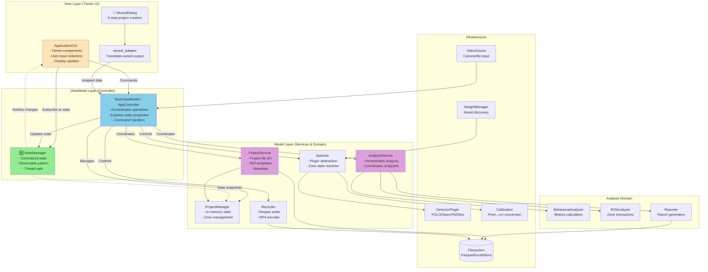
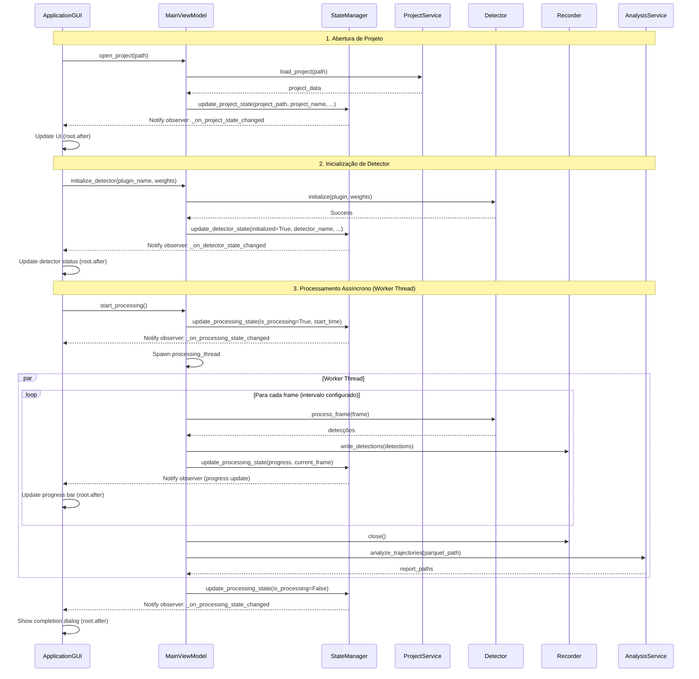
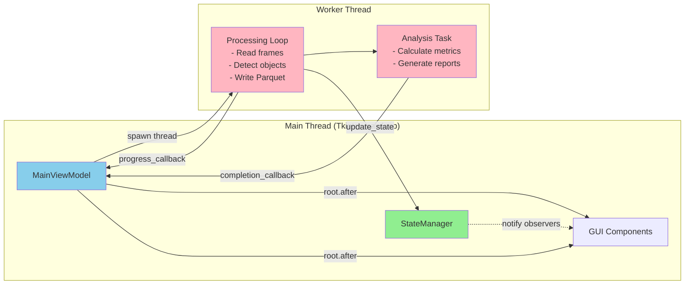
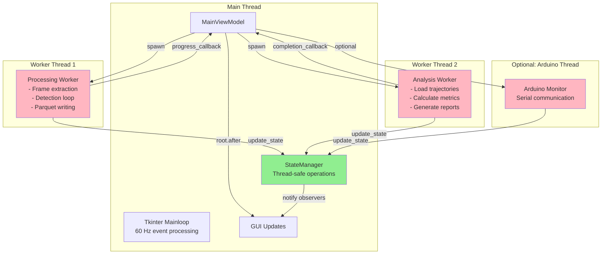

# ZebTrack-AI – Visão Arquitetural

Este documento descreve a arquitetura técnica do ZebTrack-AI, destacando os principais componentes, fluxos de dados e decisões que norteiam o desenvolvimento e a manutenção do projeto.

## 1. Panorama

ZebTrack-AI é uma aplicação desktop baseada em Tkinter que organiza o fluxo completo de análise comportamental de animais aquáticos:

1. **Captura/Carga de vídeo** (ao vivo ou pré-gravado).
2. **Rastreamento multi-animal** usando plugins de detecção.
3. **Registro de trajetórias** em Parquet com esquema rígido.
4. **Análises comportamentais e ROI** orientadas a métricas científicas.
5. **Geração de relatórios** (Excel/Word/CSV) para uso laboratorial.

### Arquitetura Geral: MVVM-like Pattern

ZebTrack-AI segue um padrão arquitetural **MVVM-like** (Model-View-ViewModel) adaptado para Tkinter:

- **Model**: Gerenciamento de estado via `StateManager` (fonte única de verdade) + dados de projeto via `ProjectManager` + serviços de domínio (`ProjectService`, `AnalysisService`)
- **View**: `ApplicationGUI` (Tkinter) - componentes visuais puros, sem lógica de negócio
- **ViewModel**: `MainViewModel` (controller) - orquestra operações, coordena serviços, expõe estado para a View via propriedades e observadores

Este padrão promove:

- **Separação de responsabilidades**: UI desacoplada da lógica de negócio
- **Testabilidade**: ViewModels e serviços testáveis sem Tkinter
- **Reatividade**: StateManager notifica observadores de mudanças de estado
- **Manutenibilidade**: Componentes coesos com interfaces bem definidas

## 2. Diagrama de Arquitetura MVVM



### Responsabilidades por Camada

#### View Layer (UI)

| Componente | Responsabilidade principal |
|------------|---------------------------|
| `ApplicationGUI` | Componentes Tkinter puros, coleta de input do usuário, exibição de progresso e overlays. Observa StateManager para atualizações reativas. |
| `WizardDialog` 🧙 | Assistente de 5 etapas (padrão desde v1.6) para criação inteligente de projetos com auto-detecção de design experimental e importação de parquets. Layout wide 3-colunas (1150×550px). |
| `wizard_adapter` | Traduz saída do wizard (formato rico) para formato esperado pelo controller (compatibilidade retroativa). |

#### ViewModel Layer (Controller)

| Componente | Responsabilidade principal |
|------------|---------------------------|
| `MainViewModel` (alias `AppController`) | Orquestra o fluxo end-to-end, agenda threads e callbacks (`root.after`), coordena serviços, expõe estado via propriedades. Implementa command handlers para UI. |
| `StateManager` 🆕 | Fonte única de verdade para estado da aplicação. Padrão observável thread-safe com 5 categorias (Project, Detector, Recording, Processing, UI). Snapshots imutáveis e histórico opcional. |

#### Model Layer (Services & Domain)

| Componente | Responsabilidade principal |
|------------|---------------------------|
| `ProjectService` | Camada de serviço para I/O de projetos: criar, salvar, carregar configurações, gerenciar templates de ROI, persistir metadados. |
| `AnalysisService` | Camada de serviço para orquestração de análise: coordena BehavioralAnalyzer + ROIAnalyzer + Reporter, consolida resultados. |
| `ProjectManager` | Gerenciamento de estado em memória do projeto: batches de vídeos, zonas, intervalos, snapshots de configuração. Referência opcional ao StateManager. |
| `Detector` + plugins | Abstração de modelos (YOLO, OpenVINO), normaliza detecções, máquina de estado de zonas, desenha overlays. |
| `Recorder` | Persistência do esquema Parquet/MP4 com colunas ordenadas. Adiciona colunas de calibração quando disponível. |

#### Analysis Domain

| Componente | Responsabilidade principal |
|------------|---------------------------|
| `BehavioralAnalyzer` | Métricas comportamentais: distância percorrida, velocidade, aceleração, freezing, movimentos angulares, thigmotaxis. |
| `ROIAnalyzer` | Análise de interações com ROIs: tempo em zona, frequência de entrada/saída, regras de inclusão (centroid_in, bbox_intersects, seg_overlap). |
| `Reporter` | Geração de relatórios rich-media: Excel/Word/CSV com plots (seaborn/matplotlib), mapas de calor de ROI, estatísticas agregadas. |

#### Infrastructure

| Componente | Responsabilidade principal |
|------------|---------------------------|
| `VideoSource` | Abstração de entrada de frames: câmera ao vivo ou arquivo pré-gravado. |
| `DetectorPlugin` | Interface para plugins de detecção: YOLO nativo, OpenVINO, etc. |
| `WeightManager` | Descoberta e verificação de pesos de modelos, validação de hashes OpenVINO (.xml/.bin). |
| `Calibration` | Conversão pixel↔cm para métricas espaciais em unidades reais. |

## 3. Fluxo de Dados e Processamento Assíncrono

### 3.1. Fluxo de Estado Centralizado



### 3.2. Modelo de Processamento Assíncrono

ZebTrack-AI usa threading nativo do Python com coordenação via `root.after()` do Tkinter:



**Padrões de Threading:**

1. **Worker Thread**: Operações pesadas (detecção, análise) executam em `threading.Thread` separada
2. **UI Updates**: Sempre via `root.after(0, callback)` para garantir thread-safety do Tkinter
3. **Progress Callbacks**: Worker chama `progress_callback()` que agenda atualização via `root.after()`
4. **State Updates**: StateManager é thread-safe e notifica observadores que agendam UI updates
5. **Completion**: Worker chama `finalize()` via `root.after(0, finalize)` ao terminar

### 3.3. Pipeline de Processamento Resumido

1. **Entrada**: `VideoSource` entrega frames sequenciais (de arquivo ou câmera ao vivo)
2. **Detecção**: `DetectorPlugin` retorna bounding boxes, scores e `track_id` (worker thread)
3. **Registro**: `Recorder` grava Parquet na ordem fixa de colunas + opcional MP4 com overlays
4. **Estado**: `StateManager` propaga mudanças (progress, frames processados) via padrão observável
5. **UI Update**: `ApplicationGUI` recebe notificações e atualiza interface via `root.after()`
6. **Análise**: `AnalysisService` coordena `BehavioralAnalyzer` + `ROIAnalyzer` (worker thread)
7. **Relatórios**: `Reporter` compila resultados em Excel/Word com plots e mapas de ROI
8. **Finalização**: StateManager atualiza estado final, GUI exibe conclusão

## 4. Decisões Arquiteturais Chave

| ID | Decisão | Motivação |
|----|---------|-----------|
| AD-01 | **Padrão MVVM-like com Tkinter** 🆕 | Separação clara de responsabilidades: View (GUI) → ViewModel (MainViewModel) → Model (StateManager + Services). Promove testabilidade, manutenibilidade e desacoplamento. |
| AD-02 | **Gerenciamento Centralizado de Estado (StateManager)** 🆕 | Fonte única de verdade para estado da aplicação. Padrão observável thread-safe com 5 categorias (Project, Detector, Recording, Processing, UI). Snapshots imutáveis e histórico opcional. Desacopla componentes e permite atualizações reativas da UI. |
| AD-03 | **Camada de Serviços** 🆕 | `ProjectService` e `AnalysisService` encapsulam lógica de domínio e I/O, isolando complexidade do controller. Facilita testes unitários e reutilização de lógica. |
| AD-04 | **Threading + root.after()** | Permitir distribuição simples (sem dependência web) mantendo a UI responsiva. Worker threads para operações pesadas + `root.after()` para UI updates thread-safe. |
| AD-05 | **Plugins de detector baseados em `DetectorPlugin`** | Facilitar troca entre YOLO puro e modelos convertidos (OpenVINO) sem alterar a GUI. Abstração limpa com interface uniforme. |
| AD-06 | **Esquema Parquet rígido** | Garantir compatibilidade com pipelines de análise externos e regressão de dados. Colunas ordenadas: `timestamp, frame, track_id, x1, y1, x2, y2, confidence` + opcionais calibradas. |
| AD-07 | **Configuração via Pydantic (`settings.py`)** | Validar `config.yaml` em runtime e suportar overrides (`config.local.yaml`). Type safety e validação automática. |
| AD-08 | **Progresso granular com callbacks** | `progress_callback` propaga métricas (frames totais/processados/detectados, tempo decorrido) para alimentar `update_processing_stats` na GUI via StateManager. |
| AD-09 | **Projeto orientado a projetos** | Persistir `ProjectManager.project_data` mantendo batches, zonas e intervalos por projeto. `ProjectService` gerencia I/O e templates. |
| AD-10 | **Wizard padrão com fallback controlado por flag** 🧙 | O fluxo guiado é a experiência padrão (v1.6+); a flag `UIFeatureFlags.use_wizard_for_project_creation` permanece apenas para cenários legados, com compatibilidade assegurada pelo `wizard_adapter`. |
| AD-11 | **Wizard com janela larga e layout de 3 colunas** 🧙 | Para máximo aproveitamento horizontal sem ocultar botões, o wizard usa tamanho fixo de 1150×550px (aspecto wide, 2.09:1). Discovery Step organiza todas as 3 perguntas em colunas lado a lado. Espaçamentos compactos (padding 8-10px). Reserva 220px verticais para garantir que botões fiquem sempre visíveis. Redimensionável entre 75%-120% largura, 75%-110% altura. |
| AD-12 | **Event Bus (opt-in, staged migration)** | `UIFeatureFlags.enable_event_queue` introduz um _event bus_ entre threads de processamento e o mainloop Tkinter, reduzindo `root.after` diretos e isolando efeitos de UI. Ainda em migração gradual. |
| AD-13 | **Padrão Observável para UI Reativa** 🆕 | GUI se inscreve em categorias de estado do StateManager e reage automaticamente a mudanças via callbacks. Elimina polling e reduz acoplamento entre controller e UI. |

## 4.1. Gerenciamento Centralizado de Estado (StateManager) 🆕

### Visão Geral

O **StateManager** (`core/state_manager.py`) é a fonte única de verdade para o estado da aplicação, implementando um padrão observável que desacopla componentes e permite atualizações reativas da UI. Introduzido na v1.8, substitui a leitura direta de atributos do controller por um sistema centralizado e thread-safe.

### Arquitetura do StateManager

```mermaid
graph TB
    subgraph StateManager Core
        SM[StateManager<br/>- subscribe()<br/>- update_*_state()<br/>- get_*_state()]

        
        subgraph State Categories
            PS[ProjectState<br/>project_path<br/>project_name<br/>total_videos]
            DS[DetectorState<br/>initialized<br/>detector_name<br/>zones_configured]
            RS[RecordingState<br/>is_recording<br/>arduino_connected<br/>arduino_port]
            PRS[ProcessingState<br/>is_processing<br/>current_operation]
            US[UIState<br/>active_tab<br/>last_analysis_path]
        end
    end
    
    subgraph Observers
        GUI[ApplicationGUI<br/>_on_recording_state_changed<br/>_on_processing_state_changed<br/>_on_detector_state_changed<br/>_on_project_state_changed]
        PM[ProjectManager<br/>optional state_manager ref]
        Custom[Custom Observers<br/>extensible]
    end
    
    subgraph State Producers
        CTRL[MainViewModel<br/>Controller]
        Worker[Processing Worker]
        Arduino[Arduino Manager]
    end
    
    SM --> PS
    SM --> DS
    SM --> RS
    SM --> PRS
    SM --> US
    
    CTRL --> SM
    Worker --> SM
    Arduino --> SM
    
    SM -.notify.-> GUI
    SM -.notify.-> PM
    SM -.notify.-> Custom
    
    GUI -.subscribe.-> SM
    PM -.subscribe.-> SM
    Custom -.subscribe.-> SM
```

### Categorias de Estado

| Categoria | Dataclass | Campos Principais | Quando Atualizar |
|-----------|-----------|-------------------|------------------|
| **Project** | `ProjectState` | `project_path`, `project_name`, `total_videos`, `project_loaded` | Criar/abrir/fechar projetos |
| **Detector** | `DetectorState` | `initialized`, `detector_name`, `zones_configured`, `model_loaded` | Inicializar detector, configurar zonas |
| **Recording** | `RecordingState` | `is_recording`, `output_path`, `arduino_connected`, `arduino_port` | Iniciar/parar gravação, conectar Arduino |
| **Processing** | `ProcessingState` | `is_processing`, `current_operation`, `progress`, `start_time` | Iniciar/finalizar análise ou rastreamento |
| **UI** | `UIState` | `active_tab`, `last_analysis_path`, `status_message` | Mudanças de interface (futuro) |

### Características Técnicas

#### Thread-Safety

- Todas as operações protegidas por `threading.RLock()`

- Snapshots imutáveis via `copy.deepcopy()`

- Notificações de observadores thread-safe

#### Histórico de Estados

```python
# Habilitar histórico (opcional, máx. 100 entradas)
state_manager = StateManager(enable_history=True)

# Consultar histórico
history = state_manager.get_history(StateCategory.RECORDING, limit=10)
for entry in history:
    print(f"{entry.timestamp}: {entry.changes}")
```

#### Padrão Observável

```python
# Inscrever observador
def on_recording_changed(category, changes, new_state):
    if "is_recording" in changes:
        print(f"Recording: {new_state.is_recording}")

state_manager.subscribe(
    StateCategory.RECORDING, 
    on_recording_changed
)

# Atualizar estado (notifica automaticamente)
state_manager.update_recording_state(
    source="controller.start_recording",
    is_recording=True,
    output_path="/path/to/output.parquet"
)
```

### Integração com Componentes

#### MainViewModel (Controller)

O controller inicializa o StateManager e atualiza estados em pontos críticos:

```python
class MainViewModel:
    def __init__(self):
        self.state_manager = StateManager(enable_history=True)
        
    def start_recording(self, output_path):
        # Lógica de gravação...
        self.state_manager.update_recording_state(
            source="controller.start_recording",
            is_recording=True,
            output_path=output_path
        )
    
    # Propriedades retrocompatíveis
    @property
    def is_recording(self):
        return self.state_manager.get_recording_state().is_recording
```

**Pontos de Atualização no Controller:**

- `start_recording()` / `stop_recording()`: RecordingState

- `initialize_detector()` / `close_detector()`: DetectorState

- `_process_videos()` / análise: ProcessingState

- `open_project()` / `close_project()`: ProjectState

- `setup_arduino()`: RecordingState (arduino_connected, arduino_port)

#### ApplicationGUI (Observer Reativo)

A GUI se inscreve em categorias relevantes e atualiza a interface reativamente:

```python
class ApplicationGUI:
    def _subscribe_to_state_changes(self):
        # Inscrever em 4 categorias
        self.controller.state_manager.subscribe(
            StateCategory.RECORDING, 
            self._on_recording_state_changed
        )
        self.controller.state_manager.subscribe(
            StateCategory.PROCESSING,
            self._on_processing_state_changed
        )
        self.controller.state_manager.subscribe(
            StateCategory.DETECTOR,
            self._on_detector_state_changed
        )
        self.controller.state_manager.subscribe(
            StateCategory.PROJECT,
            self._on_project_state_changed
        )
    
    def _on_recording_state_changed(self, category, changes, new_state):
        # Atualizar UI no mainloop Tkinter
        if "is_recording" in changes:
            self.root.after(0, self._update_recording_ui, new_state.is_recording)
        elif "arduino_connected" in changes:
            self.root.after(0, self._update_arduino_ui, new_state.arduino_connected)
```

**Callbacks de Observador:**

- `_on_recording_state_changed`: Botões de gravação, status Arduino

- `_on_processing_state_changed`: Barra de progresso, overlays

- `_on_detector_state_changed`: Status de inicialização do detector

- `_on_project_state_changed`: Load/close de projetos

#### ProjectManager

O `ProjectManager` recebe referência opcional ao StateManager para propagação de estado:

```python
class ProjectManager:
    def __init__(self, state_manager=None):
        self.state_manager = state_manager
        # Pode propagar mudanças de projeto via state_manager.update_project_state()
```

O controller passa a referência:

```python
self.project_manager = ProjectManager(state_manager=self.state_manager)
```

### Retrocompatibilidade

Para garantir compatibilidade com código existente, o controller mantém propriedades que leem do StateManager:

```python
@property
def is_recording(self):
    """Backward-compatible property for recording state."""
    return self.state_manager.get_recording_state().is_recording

@property
def detector_initialized(self):
    """Backward-compatible property for detector state."""
    return self.state_manager.get_detector_state().initialized

@property
def is_processing(self):
    """Backward-compatible property for processing state."""
    return self.state_manager.get_processing_state().is_processing
```

### Casos de Uso Avançados

#### Rastreamento de Arduino

```python
# No controller, ao conectar Arduino
if arduino_manager.connect(port, baud_rate):
    self.arduino = arduino_manager.arduino
    self.state_manager.update_recording_state(
        source="controller.setup_arduino",
        arduino_connected=True,
        arduino_port=port
    )

# Na GUI, observador reage automaticamente
def _update_arduino_ui(self, connected):
    if connected:
        self.arduino_status_var.set("✓ Conectado")
        self.arduino_status_indicator.configure(bootstyle="success")
    else:
        self.arduino_status_var.set("✗ Desconectado")
        self.arduino_status_indicator.configure(bootstyle="danger")
```

#### Progresso de Análise em Tempo Real

```python
# Worker thread atualiza progresso
state_manager.update_processing_state(
    source="analysis_worker",
    is_processing=True,
    current_operation="Analyzing trajectories",
    progress=0.45  # 45%
)

# GUI atualiza barra de progresso automaticamente
def _on_processing_state_changed(self, category, changes, new_state):
    if "progress" in changes:
        self.root.after(0, self._update_progress_bar, new_state.progress)
```

### Padrões de Teste

#### Teste Unitário (StateManager isolado)

```python
def test_state_update_notifies_observers():
    manager = StateManager()
    notifications = []
    
    def observer(category, changes, new_state):
        notifications.append((category, changes))
    
    manager.subscribe(StateCategory.RECORDING, observer)
    manager.update_recording_state(source="test", is_recording=True)
    
    assert len(notifications) == 1
    assert "is_recording" in notifications[0][1]
```

#### Teste de Integração (Controller + StateManager)

```python
def test_start_recording_updates_state(mocker):
    controller = MainViewModel()
    observer_mock = mocker.Mock()
    
    controller.state_manager.subscribe(
        StateCategory.RECORDING, 
        observer_mock
    )
    
    controller.start_recording("output.parquet")
    
    observer_mock.assert_called_once()
    recording_state = controller.state_manager.get_recording_state()
    assert recording_state.is_recording is True
```

#### Teste de GUI (Observadores reativos)

```python
def test_gui_updates_on_recording_state(mocker):
    gui = ApplicationGUI(controller, root)
    gui._subscribe_to_state_changes()
    
    # Simular mudança de estado
    gui.controller.state_manager.update_recording_state(
        source="test",
        is_recording=True
    )
    
    # Processar eventos pendentes do Tkinter
    root.update_idletasks()
    
    # Verificar que UI foi atualizada
    assert gui.record_button["text"] == "⏹ Parar Gravação"
```

### Guia de Extensão

Para adicionar nova categoria de estado ou novos campos:

**1. Adicionar Dataclass** em `state_manager.py`:

```python
@dataclass
class CalibrationState:
    calibrated: bool = False
    pixel_per_cm: Optional[float] = None
    calibration_method: Optional[str] = None
```

**2. Adicionar Categoria ao Enum**:

```python
class StateCategory(Enum):
    # ... existentes
    CALIBRATION = "calibration"
```

**3. Adicionar Métodos ao StateManager**:

```python
def update_calibration_state(self, source: str, **kwargs):
    self._update_state(StateCategory.CALIBRATION, source, **kwargs)

def get_calibration_state(self) -> CalibrationState:
    return self._get_state(StateCategory.CALIBRATION)
```

**4. Atualizar Estado no Controller**:

```python
def calibrate(self, pixel_per_cm):
    # Lógica de calibração...
    self.state_manager.update_calibration_state(
        source="controller.calibrate",
        calibrated=True,
        pixel_per_cm=pixel_per_cm
    )
```

**5. Observar na GUI (se relevante)**:

```python
self.controller.state_manager.subscribe(
    StateCategory.CALIBRATION,
    self._on_calibration_state_changed
)
```

### Cobertura de Testes

**Testes Implementados:**

- **35 testes unitários** (`tests/test_state_manager.py`): Operações básicas, notificações, histórico
- **9 testes de integração** (`tests/test_state_manager_integration.py`): Controller + StateManager
- **7 testes de GUI** (`tests/test_gui_state_observer.py`): Observadores reativos

**Resultado:** 51 testes, 100% passando (5.85s)

### Referências Relacionadas

- `src/zebtrack/core/state_manager.py` (883 linhas): Implementação completa
- `src/zebtrack/core/controller.py`: Integração e propriedades retrocompatíveis
- `src/zebtrack/ui/gui.py`: Padrão observável na GUI
- `tests/test_state_manager*.py`: Suite completa de testes

## 4.2. Threading e Concorrência

### Modelo de Threading



### Padrões de Thread Safety

#### 1. Worker Thread Pattern

```python
# No controller: spawn worker thread
def start_processing(self):
    self.state_manager.update_processing_state(
        source="controller.start_processing",
        is_processing=True,
        start_time=time.time()
    )
    
    self.processing_thread = threading.Thread(
        target=self._process_videos_worker,
        name="ProcessingWorker",
        daemon=True
    )
    self.processing_thread.start()

def _process_videos_worker(self):
    """Runs in separate thread - heavy processing here."""
    try:
        for frame in video_frames:
            detections = self.detector.process_frame(frame)
            self.recorder.write(detections)
            
            # Update progress (thread-safe)
            self.state_manager.update_processing_state(
                source="worker.progress",
                current_frame=frame_num,
                total_frames=total
            )
    except Exception as e:
        log.error("processing.failed", error=str(e))
    finally:
        # Schedule finalization on main thread
        self.root.after(0, self._finalize_processing)
```

#### 2. UI Update Pattern (root.after)

```python
# Na GUI: observador de estado agenda updates no mainloop
def _on_processing_state_changed(self, category, changes, new_state):
    """Called by StateManager (may be from worker thread)."""
    
    # SEMPRE usar root.after para UI updates
    if "current_frame" in changes:
        self.root.after(0, self._update_progress_bar, new_state.current_frame)
    
    if "is_processing" in changes:
        self.root.after(0, self._update_processing_ui, new_state.is_processing)

def _update_progress_bar(self, current_frame):
    """Runs on main thread - safe to update Tkinter widgets."""
    progress = (current_frame / self.total_frames) * 100
    self.progress_bar["value"] = progress
    self.progress_label["text"] = f"{current_frame}/{self.total_frames} frames"
```

#### 3. StateManager Thread Safety

```python
# StateManager usa RLock para proteger mutações
class StateManager:
    def __init__(self):
        self._lock = threading.RLock()
        # ...
    
    def update_recording_state(self, source: str, **kwargs):
        with self._lock:
            # Atomic state mutation
            current_state = self._states[StateCategory.RECORDING]
            new_state = copy.deepcopy(current_state)
            
            for key, value in kwargs.items():
                setattr(new_state, key, value)
            
            # Update and notify
            self._states[StateCategory.RECORDING] = new_state
            self._notify_observers(StateCategory.RECORDING, kwargs, new_state)
```

### Regras de Thread Safety

1. **NUNCA acessar Tkinter widgets de worker threads**
   - Sempre usar `root.after(0, callback)` para UI updates

2. **StateManager é thread-safe**
   - Pode ser atualizado de qualquer thread
   - Snapshots retornados são imutáveis (deepcopy)

3. **Progress Callbacks devem usar root.after**

   ```python
   def progress_callback(stats):
       # Worker thread chama isso
       self.root.after(0, lambda: self.view.update_progress(stats))
   ```

4. **Completion Callbacks via root.after**

   ```python
   def _finalize_processing(self):
       """Must run on main thread."""
       self.root.after(0, self._show_completion_dialog)
   ```

5. **Detector/Recorder são thread-confined**
   - Instâncias usadas apenas pelo worker thread que as criou
   - Não compartilhar entre threads

### Event Bus (Opt-in Alternative)

Para projetos que preferem desacoplamento adicional:

```python
# Habilitar event bus
settings.ui_features.enable_event_queue = True

# Worker thread publica evento
self.event_bus.publish("processing.progress", {
    "current_frame": frame_num,
    "total_frames": total
})

# GUI subscreve e processa
self.event_bus.subscribe("processing.progress", self._on_progress_event)

def _on_progress_event(self, data):
    """Automatically scheduled on main thread by EventBus."""
    self._update_progress_bar(data["current_frame"])
```

**Status:** Event Bus ainda em staged migration (AD-12), `root.after` é o padrão atual.

## 5. Pontos de Extensão

### Adicionando Novos Detectores

1. Implementar `DetectorPlugin` em `plugins/your_detector.py`
2. Garantir suporte a `get_name()`, `initialize()`, `process_frame()`, `draw_overlay()`, `close()`
3. Registrar em `plugins/__init__.py` no dicionário `DETECTOR_PLUGINS`
4. Adicionar testes em `tests/plugins/test_your_detector.py`
5. Documentar configurações específicas em `config.yaml` se necessário

### Adicionando Novos Serviços

Para criar novos serviços seguindo o padrão da camada Model:

```python
# src/zebtrack/services/your_service.py
class YourService:
    """Service description."""
    
    def __init__(self, state_manager: Optional[StateManager] = None):
        self.state_manager = state_manager
        self.log = structlog.get_logger().bind(component="services.your_service")
    
    def perform_operation(self, params):
        """Service method."""
        self.log.info("operation.start", params=params)
        
        # Perform work
        result = self._do_work(params)
        
        # Update state if needed
        if self.state_manager:
            self.state_manager.update_ui_state(
                source="your_service.perform_operation",
                status_message=f"Operation completed: {result}"
            )
        
        return result
```

### Adicionando Categorias de Estado

Ver seção 4.1 "Guia de Extensão" para instruções detalhadas sobre como adicionar novas categorias ao StateManager.

### Adicionando Novos Relatórios

1. Estender `Reporter` em `analysis/reporter.py` adicionando método de exportação
2. Implementar geração de conteúdo (plots, tabelas, estatísticas)
3. Adicionar testes em `tests/analysis/test_reporter.py` com trajetórias sintéticas
4. Atualizar `AnalysisService` para chamar novo método se necessário
5. Documentar formato de saída em `REFERENCE_GUIDE.md`

### Integrações de Hardware

1. Criar manager em `core/your_hardware.py` seguindo padrão de `ArduinoManager`
2. Usar `structlog` para logging estruturado
3. Atualizar estado via `StateManager` quando relevante
4. Adicionar configurações em `settings.py` (HardwareSettings)
5. Integrar no controller via threading se necessário (ver seção 4.2)
6. Adicionar testes unitários e de integração

### Regras de ROI Adicionais

1. Adicionar nova função de inclusão em `analysis/roi.py`
2. Documentar nova chave em `config.yaml` (ex: `roi_inclusion_rule: "new_rule"`)
3. Atualizar `tests/test_settings.py` para validar nova opção
4. Adicionar testes em `tests/analysis/test_roi.py` com casos de teste específicos
5. Documentar comportamento em `REFERENCE_GUIDE.md`

### Novos Observadores de Estado

Para criar componentes que reagem a mudanças de estado:

```python
class YourObserver:
    def __init__(self, controller):
        self.controller = controller
        self._subscribe_to_state()
    
    def _subscribe_to_state(self):
        self.controller.state_manager.subscribe(
            StateCategory.PROCESSING,
            self._on_processing_changed
        )
    
    def _on_processing_changed(self, category, changes, new_state):
        """React to processing state changes."""
        if "is_processing" in changes:
            self._handle_processing_state(new_state.is_processing)
```

## 6. Considerações de Desempenho

### Frame Intervals (Configurável)

- **`analysis_interval_frames`**: Determina frequência de detecção/análise (default: 10)
  - Reduzir para maior precisão temporal (mais CPU)
  - Aumentar para processamento mais rápido (menos frames analisados)
  
- **`display_interval_frames`**: Determina frequência de atualização de UI (default: 10)
  - Independente de analysis_interval para desacoplamento
  - Persiste em `project_data` para reprodutibilidade

### Aceleração de Inferência

- **OpenVINO**: `WeightManager` verifica existência de `.xml/.bin` e hashes antes de habilitar
  - Conversão automática não implementada (usuário deve fornecer modelos convertidos)
  - Validação de hashes previne corrupção de cache
  
- **YOLO nativo**: Usa PyTorch/ultralytics padrão
  - GPU automática se disponível (CUDA)
  - CPU fallback transparente

### Threading e Responsividade

- **Worker Threads**: Operações pesadas (detecção, análise) executam em threads separadas
  - Evita bloqueio do mainloop Tkinter (60 Hz)
  - StateManager é thread-safe (RLock interno)
  
- **UI Updates**: SEMPRE via `root.after(0, callback)` para thread safety
  - NUNCA atualizar widgets Tkinter de worker threads diretamente
  - Observers do StateManager agendam callbacks automaticamente

### Otimizações de Parquet

- **Batch Writing**: `Recorder` agrupa escritas em chunks para eficiência
- **Schema Rígido**: Colunas fixas previnem overhead de inferência de schema
- **Compression**: PyArrow usa Snappy por padrão (bom trade-off velocidade/tamanho)

### Event Bus (Staged Migration)

- **Status**: Opt-in via `settings.ui_features.enable_event_queue = True`
- **Overhead**: Queue adicional + thread de processamento de eventos
- **Quando usar**: Projetos que necessitam desacoplamento máximo controller↔UI
- **Padrão atual**: `root.after()` é mais simples e suficiente para maioria dos casos

### Profiling

Para identificar gargalos:

```python
# Habilitar timing logs
import structlog
log = structlog.get_logger().bind(component="profiling")

import time
start = time.perf_counter()
# ... operação pesada
elapsed = time.perf_counter() - start
log.info("operation.timing", operation="detect_frame", elapsed_ms=elapsed*1000)
```

Use `tests/manual/` para scripts de profiling isolados.

## 7. Bibliografia de Módulos

### Camada ViewModel (Controller)

| Módulo | Descrição |
|--------|-----------|
| `core/controller.py` | **MainViewModel** (alias `AppController`): ViewModel central no padrão MVVM. Orquestra operações end-to-end, coordena serviços, gerencia threading, expõe estado via propriedades. Handlers de comandos da UI (`start_recording`, `initialize_detector`, `start_processing`, etc.). Inicializa StateManager e mantém propriedades retrocompatíveis. |
| `core/state_manager.py` 🆕 | **StateManager**: Gerenciamento centralizado de estado com padrão observável. 5 categorias de estado (Project, Detector, Recording, Processing, UI), thread-safe com RLock, snapshots imutáveis, histórico opcional. Ver seção 4.1 para detalhes completos. |

### Camada Model (Services & Domain)

| Módulo | Descrição |
|--------|-----------|
| `core/project_service.py` 🆕 | **ProjectService**: Camada de serviço para I/O de projetos. Encapsula criação, salvamento, carregamento de configurações (`project_config.json`), gerenciamento de templates de ROI (`templates/`), persistência de metadados. Desacopla lógica de persistência do controller. |
| `analysis/analysis_service.py` 🆕 | **AnalysisService**: Camada de serviço para orquestração de análise. Coordena `BehavioralAnalyzer` + `ROIAnalyzer` + `Reporter`, consolida resultados, gerencia pipeline de análise. Encapsula complexidade de cálculo de métricas. |
| `core/project_manager.py` | **ProjectManager**: Gerenciamento de estado em memória do projeto. Mantém batches de vídeos, zonas desenhadas, intervalos de análise/display, snapshots de configuração. Detecção granular de parquets existentes via `scan_input_paths()`. Recebe referência opcional ao StateManager para propagação de estado. |
| `core/detector.py` | **Detector**: Abstração de modelos de detecção. Máquina de estado de zonas, interface com plugins (`DetectorPlugin`), normalização de detecções, cálculo de bounding boxes, desenho de overlays. Suporta YOLO nativo e OpenVINO. |
| `io/recorder.py` | **Recorder**: Persistência de trajetórias e vídeos. Escreve Parquet com esquema rígido (`timestamp, frame, track_id, x1, y1, x2, y2, confidence`) usando `pyarrow`/`pandas`. Adiciona colunas calibradas quando disponível. Opcional: MP4 com overlays via OpenCV. |

### Camada Analysis (Domain)

| Módulo | Descrição |
|--------|-----------|
| `analysis/behavior.py` | **BehavioralAnalyzer**: Implementa pré-processamento de trajetórias e cálculo de métricas comportamentais (distância percorrida, velocidade média/instantânea, aceleração, freezing, ângulo de movimento, velocidade angular, thigmotaxis). Utilitários de geometria e estatística. |
| `analysis/roi.py` | **ROIAnalyzer**: Análise de interações com ROIs. Regras de inclusão configuráveis (`centroid_in`, `centroid_in_on_buffered_roi`, `bbox_intersects`, `seg_overlap`). Cálculo de tempo em zona, frequência de entrada/saída, primeiro/último acesso. |
| `analysis/reporter.py` | **Reporter**: Geração de relatórios rich-media. Compila Excel com estatísticas agregadas, gera Word com plots (seaborn/matplotlib), mapas de calor de ROI, gráficos de trajetórias. Exporta CSV para análise externa. |

### Camada View (UI)

| Módulo | Descrição |
|--------|-----------|
| `ui/gui.py` | **ApplicationGUI**: View principal (Tkinter). Componentes visuais puros: canvas de desenho, dialogs de configuração, barra de progresso, overlays de análise, tab de configuração avançada, seletor de templates de ROI. Observa StateManager para atualizações reativas. Handlers de eventos delegam comandos ao controller. |
| `ui/wizard/wizard_dialog.py` 🧙 | **WizardDialog**: Orquestrador principal do wizard de 5 etapas (Discovery → File Selection → Detection → Import Config → Confirmation). Interface guiada para criação inteligente de projetos (padrão desde v1.6). Layout wide 3-colunas (1150×550px). |
| `ui/wizard/wizard_adapter.py` 🧙 | **WizardAdapter**: Traduz output do wizard (formato rico) para formato esperado pelo controller (`adapt_wizard_data_to_controller_format`, `extract_parquet_import_plan`). Garante compatibilidade retroativa com dialogs legados. |
| `ui/wizard/enums.py` 🧙 | Definições formais do wizard: `ProjectType`, `ImportAction`, `ROIMergeStrategy`, `WizardStepID`. |
| `ui/wizard/*_step.py` 🧙 | Implementação individual dos 5 steps: discovery, file_selection, detection, import_config, confirmation. |
| `ui/event_bus.py` | **EventBus**: Sistema opcional de pub/sub para desacoplamento controller↔GUI. Suporta eventos callable e named events. Status: staged migration (opt-in via flag), `root.after` ainda é padrão. |
| `ui/window_utils.py` | Utilitários de janela: maximização, factory de scrollbars (`create_scrollbar()`) que gerencia teardown de Style singleton do ttkbootstrap. |

### Camada Infrastructure

| Módulo | Descrição |
|--------|-----------|
| `io/video_source.py` | **VideoSource**: Abstração de entrada de frames. Suporta câmera ao vivo (OpenCV) e arquivos pré-gravados. Iterador de frames com metadados (FPS, resolução). |
| `plugins/base.py` | **DetectorPlugin**: Interface abstrata para plugins de detecção. Define contrato: `get_name()`, `initialize()`, `process_frame()`, `draw_overlay()`, `close()`. |
| `plugins/*.py` | Implementações de plugins: YOLO nativo, OpenVINO, etc. Registro em `plugins/__init__.py`. |
| `core/weight_manager.py` | **WeightManager**: Descoberta automática de pesos de modelos (`.pt`, `.xml/.bin`). Validação de hashes OpenVINO, verificação de integridade. |
| `core/calibration.py` | **Calibration**: Conversão pixel↔centímetros. Suporta calibração manual (diálogo interativo) e automática (objetos de referência). Necessário para métricas espaciais em unidades reais. |
| `core/arduino.py` | **ArduinoManager**: Integração com hardware via serial. Suporta comandos de entrada/saída de zona (LEDs, estimulação). Opcional, detectado automaticamente. |
| `settings.py` | **Settings**: Configuração via Pydantic. Carrega `config.yaml` + `config.local.yaml` (merged). Validação automática de tipos, feature flags (`UIFeatureFlags`), defaults. |
| `utils/geometry.py` | Utilitários de geometria: detecção de interseção polígono/bbox, snapping centroid-aware, cálculo de centroides, distâncias. |

## 8. Sumário da Arquitetura Atual (v1.8+)

### Padrão MVVM-like

```text
┌─────────────────────────────────────────────────────────────┐
│                    View (ApplicationGUI)                     │
│  • Tkinter components • User input • Display updates        │
│  • Observes StateManager for reactive updates               │
└────────────────────────┬────────────────────────────────────┘
                         │ Commands
                         ↓
┌─────────────────────────────────────────────────────────────┐
│           ViewModel (MainViewModel / Controller)             │
│  • Orchestrates operations • Coordinates services            │
│  • Manages threading • Exposes state via properties          │
└─────┬───────────────────┬───────────────────────────────────┘
      │                   │
      │ Updates           │ Queries
      ↓                   ↓
┌──────────────┐    ┌──────────────────────────────────────┐
│ StateManager │    │  Model (Services & Domain)           │
│ • 5 categories│    │  • ProjectService                    │
│ • Observable  │    │  • AnalysisService                   │
│ • Thread-safe │    │  • ProjectManager                    │
└──────┬───────┘    │  • Detector • Recorder               │
       │            └──────────────────────────────────────┘
       │ Notifies
       └──────────► GUI (observers)
```

### Características Chave

- **Separação de Camadas**: View ↔ ViewModel ↔ Model bem definidas
- **Estado Centralizado**: StateManager como fonte única de verdade
- **Reatividade**: Padrão observável para UI updates automáticos
- **Assíncrono**: Worker threads + root.after() para responsividade
- **Testável**: Serviços e ViewModels testáveis sem Tkinter
- **Extensível**: Plugins de detector, novos relatórios, ROI rules

### Fluxo de Dados Típico

1. **User Action** → `ApplicationGUI` (View)
2. **Command** → `MainViewModel` (ViewModel)
3. **Spawn Worker** → Background thread (detecção/análise)
4. **Update State** → `StateManager` (thread-safe)
5. **Notify Observers** → `ApplicationGUI` recebe callback
6. **Schedule UI Update** → `root.after(0, update_function)`
7. **Display Result** → Tkinter widgets atualizados (main thread)

### Decisões Recentes

- **v1.8**: StateManager com padrão observável (AD-02)
- **v1.7**: Service layer (ProjectService, AnalysisService) - AD-03
- **v1.7**: Refatoração MVVM-like completa (AD-01)
- **v1.6**: Wizard padrão 5-etapas (AD-10)
- **Staged**: Event Bus opt-in (AD-12)

## 9. Links Úteis

- [README.md](../README.md) – visão geral, guia rápido e convenções
- [STATE_MANAGER_GUIDE.md](./STATE_MANAGER_GUIDE.md) – guia completo do StateManager para desenvolvedores
- [REFERENCE_GUIDE.md](./REFERENCE_GUIDE.md) – referências operacionais (métricas, tutoriais e integração Arduino)
- [CONTRIBUTING.md](../CONTRIBUTING.md) – processo de desenvolvimento e padrões de PR
- [.github/copilot-instructions.md](../.github/copilot-instructions.md) – resumo rápido para agentes automáticos
- `tests/manual/` – scripts atuais para inspeções manuais; substituem os antigos geradores de cenários do Wizard
- `tests/test_state_manager*.py` – suite completa de testes do StateManager (44 testes)

---

**Nota:** Atualize este documento sempre que novas decisões arquiteturais forem tomadas ou quando fluxos principais forem alterados. Mantenha os diagramas Mermaid sincronizados com a implementação real.
