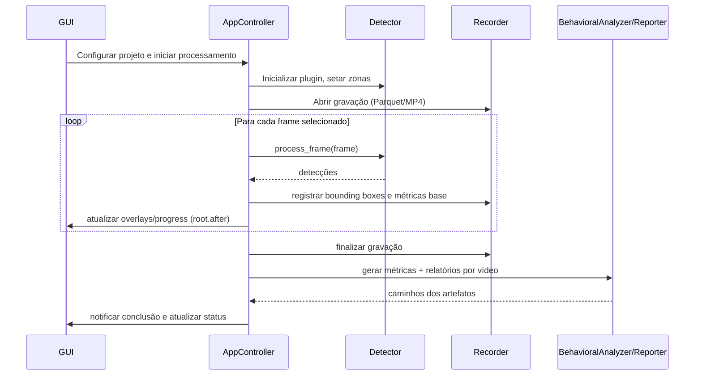

# ZebTrack-AI – Visão Arquitetural

Este documento descreve a arquitetura técnica do ZebTrack-AI, destacando os principais componentes, fluxos de dados e decisões que norteiam o desenvolvimento e a manutenção do projeto.

## 1. Panorama

ZebTrack-AI é uma aplicação desktop baseada em Tkinter que organiza o fluxo completo de análise comportamental de animais aquáticos:

1. **Captura/Carga de vídeo** (ao vivo ou pré-gravado).
2. **Rastreamento multi-animal** usando plugins de detecção.
3. **Registro de trajetórias** em Parquet com esquema rígido.
4. **Análises comportamentais e ROI** orientadas a métricas científicas.
5. **Geração de relatórios** (Excel/Word/CSV) para uso laboratorial.

## 2. Diagrama de componentes

```mermaid
graph TD
    subgraph UI
        GUI[ApplicationGUI (Tkinter)]
        WizardDialog[🧙 WizardDialog - 5 steps]
        WizardAdapter[wizard_adapter]
    end
    subgraph Core
        Controller[AppController]
        ProjectManager
        Detector
        WeightManager
        Calibration
    end
    subgraph IO
        VideoSource[io/video_source]
        Recorder
    end
    subgraph Analysis
        BehavioralAnalyzer
        ROIAnalyzer[analysis/roi]
        Reporter
    end
    subgraph Plugins
        DetectorPlugins[(DetectorPlugin impls)]
    end

    GUI --> WizardDialog
    WizardDialog --> WizardAdapter
    WizardAdapter --> Controller
    GUI --> Controller
    Controller --> ProjectManager
    Controller --> Detector
    Controller --> VideoSource
    Controller --> Recorder
    Controller --> BehavioralAnalyzer
    Controller --> Reporter
    Detector --> DetectorPlugins
    Detector --> Calibration
    Recorder -->|Parquet/MP4| Storage[(Filesystem)]
    ProjectManager --> Storage
    Reporter -->|Excel/Word/CSV| Storage
    WeightManager -->|model paths| Detector
```

### Responsabilidades

| Componente | Responsabilidade principal |
|------------|---------------------------|
| `ApplicationGUI` | Interfaces Tkinter, coleta de input do usuário, exibição de progresso e overlays. |
| `WizardDialog` 🧙 | Assistente de 5 etapas para criação inteligente de projetos com auto-detecção de design experimental e importação de parquets. |
| `wizard_adapter` | Traduz saída do wizard (formato rico) para formato esperado pelo controller (compatibilidade retroativa). |
| `AppController` | Orquestra o fluxo end-to-end, agenda threads e callbacks (`root.after`). |
| `ProjectManager` | Persistência de metadados, batches de vídeos, zonas, intervalos, snapshots de configuração e detecção granular de parquets (`scan_input_paths()`). |
| `Detector` + plugins | Abstração de modelos (YOLO, OpenVINO), normaliza detecções, desenha overlays. |
| `Recorder` | Persistência do esquema Parquet/MP4 com colunas ordenadas. |
| `analysis/*` | Métricas comportamentais, cálculos de ROI, geração de relatórios rich-media. |
| `WeightManager` | Descoberta e verificação de pesos, inclusive hashes de modelos OpenVINO. |

## 3. Fluxo de dados



### Pipeline resumido

1. **Entrada**: `VideoSource` entrega frames sequenciais (de arquivo ou câmera).
2. **Detecção**: `DetectorPlugin` retorna bounding boxes, scores e `track_id`.
3. **Registro**: `Recorder` grava Parquet na ordem fixa de colunas e, opcionalmente, MP4 com sobreposições.
4. **Análise**: `BehavioralAnalyzer` e `ROI` aplicam métricas (distância, freezing, thigmotaxis, etc.).
5. **Relatórios**: `Reporter` compila resultados em Excel/Word com plots e mapas de ROI.

## 4. Decisões arquiteturais chave

| ID | Decisão | Motivação |
|----|---------|-----------|
| AD-01 | **Uso de Tkinter + threads secundárias** | Permitir distribuição simples (sem dependência web) mantendo a UI responsiva via `root.after`. |
| AD-02 | **Plugins de detector baseados em `DetectorPlugin`** | Facilitar troca entre YOLO puro e modelos convertidos (OpenVINO) sem alterar a GUI. |
| AD-03 | **Esquema Parquet rígido** | Garantir compatibilidade com pipelines de análise externos e regressão de dados. |
| AD-04 | **Configuração via Pydantic (`settings.py`)** | Validar `config.yaml` em runtime e suportar overrides (`config.local.yaml`). |
| AD-05 | **Progresso granular** | `progress_callback` propaga métricas (frames totais/processados/detectados) para alimentar `update_processing_stats`. |
| AD-06 | **Projétil orientado a projetos** | Persistir `ProjectManager.project_data` mantendo batches e intervalos por projeto. |
| AD-07 | **Wizard com feature flag e adapter pattern** 🧙 | Rollout gradual via `UIFeatureFlags.use_wizard_for_project_creation` com compatibilidade total via `wizard_adapter`, permitindo evolução sem quebrar fluxo legado. |

## 5. Pontos de extensão

- **Novos detectores**: implementar `DetectorPlugin`, registrar em `plugins/__init__.py` e garantir suporte a `draw_overlay`/`process_frame`.
- **Novos relatórios**: estender `Reporter` adicionando exportadores e atualizar testes em `tests/analysis/`.
- **Integrações de hardware**: `core/detector.py` contém ganchos para comandos Arduino; novas integrações devem seguir o padrão `structlog`.
- **Regras de ROI adicionais**: evoluir `analysis/roi.py`, documentar novas chaves em `config.yaml` e atualizar `tests/test_settings.py`.

## 6. Considerações de desempenho

- **Intermitência de frames**: `analysis_interval_frames` e `display_interval_frames` determinam frequência de processamento; armazenados no projeto para repetibilidade.
- **OpenVINO**: `WeightManager` verifica existência de `.xml/.bin` e hashes antes de habilitar aceleração.
- **Threading**: detecção e análise pesadas rodam em threads separadas; interações com GUI devem ser reencaminhadas via `root.after` para o mainloop.

## 7. Bibliografia de módulos

| Módulo | Descrição |
|--------|-----------|
| `core/controller.py` | Contém `_process_videos`, `_run_tracking_if_needed`, integração com `Recorder`, UI e análise. |
| `core/project_manager.py` | Persistência (`project_config.json`), batches, metadados, zonas e detecção granular de parquets (`scan_input_paths()`). |
| `core/detector.py` | Estado de zonas, interface com plugins, cálculo de bounding boxes e overlays. |
| `io/recorder.py` | Escreve trajetórias (`pyarrow`/`pandas`) e vídeos com overlays. |
| `analysis/behavioral_analyzer.py` | Orquestra métricas, congela ROI, consolida resultados. |
| `analysis/reporter.py` | Gera relatórios Excel/Word com gráficos (seaborn/matplotlib). |
| `ui/gui.py` | Componentes da interface: dialogs, canvas, progress overlay, interval dialogs, integração com wizard. |
| `ui/wizard/wizard_dialog.py` 🧙 | Orquestrador principal do wizard de 5 etapas (Discovery → File Selection → Detection → Import Config → Confirmation). |
| `ui/wizard/wizard_adapter.py` 🧙 | Traduz output do wizard para formato esperado pelo controller (`adapt_wizard_data_to_controller_format`, `extract_parquet_import_plan`). |
| `ui/wizard/enums.py` 🧙 | Definições formais: `ProjectType`, `ImportAction`, `ROIMergeStrategy`, `WizardStepID`. |
| `ui/wizard/*_step.py` 🧙 | Implementação individual dos 5 steps (discovery, file_selection, detection, import_config, confirmation). |

## 8. Links úteis

- [README.md](../README.md) – visão geral, guia rápido e convenções.
- [CONTRIBUTING.md](../CONTRIBUTING.md) – processo de desenvolvimento e padrões de PR.
- [.github/copilot-instructions.md](../.github/copilot-instructions.md) – resumo rápido para agentes automáticos.
- `tests/manual/` – scripts atuais para inspeções manuais; substituem os antigos geradores de cenários do Wizard.

Atualize este documento sempre que novas decisões arquiteturais forem tomadas ou quando fluxos principais forem alterados.
