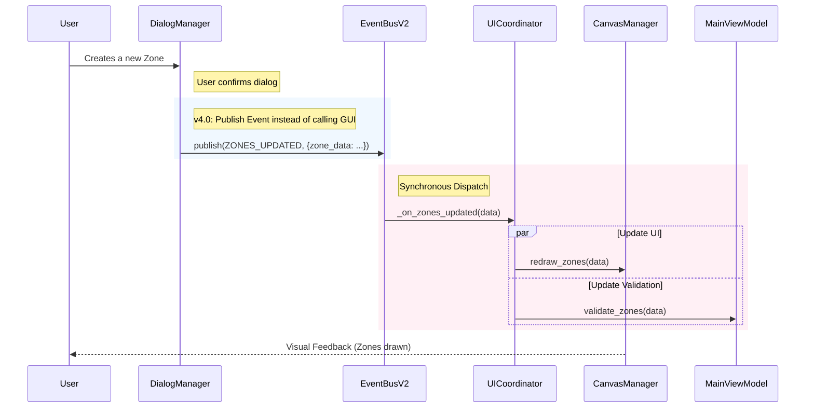
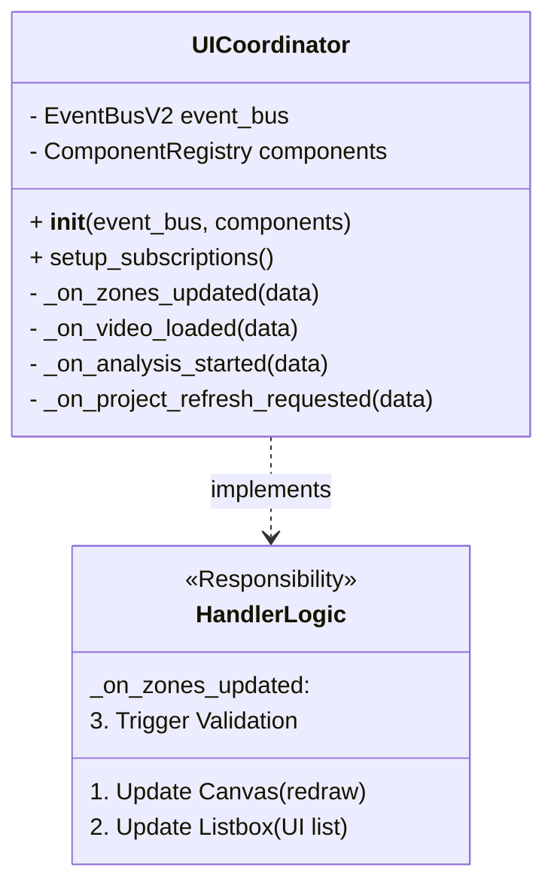

# Architecture v4.0: Event-Driven Design

**Version**: 4.0 (Draft)
**Status**: Implemented in Phase 2

This document details the architectural changes introduced in v4.0, specifically the transition from a monolithic Facade pattern to an Event-Driven Architecture (EDA) using the Mediator pattern.

---

## 1. High-Level Overview

The core goal of v4.0 is to decouple the User Interface (View) from the Business Logic (ViewModel/Model) and to decouple UI components from each other.

*   **Before (v3.0)**: `ApplicationGUI` acted as a "God Object," coordinating everything. Components had direct references to `ApplicationGUI` and called its methods directly.
*   **After (v4.0)**: Components communicate via a central `EventBusV2`. A new `UICoordinator` acts as a Mediator, listening to events and coordinating responses.

---

## 2. Event Flow Diagram

This diagram illustrates how a user action propagates through the system in v4.0 without direct coupling between components.



---

## 3. Component Communication: v3 vs v4

### v3.0: Coupled Facade (The "Spiderweb")

In v3.0, `ApplicationGUI` sits in the middle, and components (like `DialogManager`) call it directly. `ApplicationGUI` then calls other components.

```mermaid
graph TD
    subgraph v3_Legacy ["v3.0: Monolithic Facade"]
        GUI[ApplicationGUI]
        DM[DialogManager]
        CM[CanvasManager]
        PVM[ProjectViewManager]

        DM -->|1. gui.update_zone_listbox()| GUI
        GUI -->|2. calls| CM
        GUI -->|3. calls| PVM

        style GUI fill:#ff9999,stroke:#333,stroke-width:2px
    end
```

### v4.0: Decoupled Event-Driven (The Hub)

In v4.0, `DialogManager` doesn't know `ApplicationGUI` or `CanvasManager` exist. It just announces "Zones Updated". The `UICoordinator` (or direct subscribers) handle the rest.

```mermaid
graph TD
    subgraph v4_Architecture ["v4.0: Event-Driven + Mediator"]
        DM[DialogManager]
        EB[EventBusV2]
        Coord[UICoordinator]
        CM[CanvasManager]
        PVM[ProjectViewManager]

        DM -->|1. publish(ZONES_UPDATED)| EB
        EB -.->|2. notify| Coord

        Coord -->|3. coordinate| CM
        Coord -->|3. coordinate| PVM

        style EB fill:#99ff99,stroke:#333,stroke-width:2px
        style Coord fill:#99ccff,stroke:#333,stroke-width:2px
    end
```

---

## 4. UICoordinator Responsibilities

The `UICoordinator` serves as the **Mediator**. It centralizes the logic of "what happens when X occurs", preventing that logic from being scattered across UI components.



### Key Workflows managed by UICoordinator

1.  **Zone Management** (`ZONES_UPDATED`)
    *   Updates the visual overlay (`CanvasManager`).
    *   Updates the control panel list (`ZoneControlBuilder`).
    *   Triggers readiness checks (`ValidationManager`).

2.  **Project Navigation** (`VIDEO_LOADED`)
    *   Loads the frame into the canvas.
    *   Updates the window title.
    *   Checks if the video has existing results to display.

3.  **Analysis Feedback** (`PROCESSING_STATS_UPDATED`)
    *   Updates the progress bar.
    *   Updates the estimated time remaining (ETA).
    *   Refreshes the active tracking overlay.
