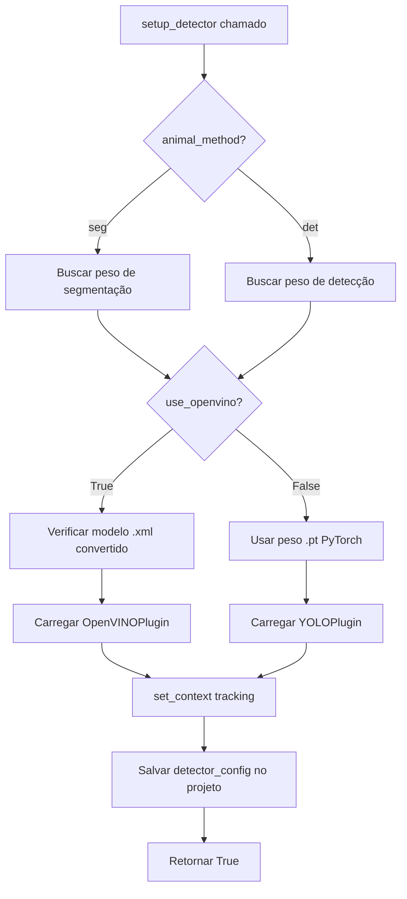
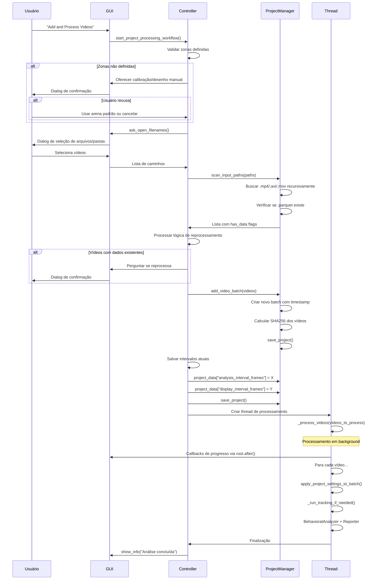

# Fluxo de Criação de Projetos e Análise de Vídeos em Lote

> **📌 DOCUMENTO VIVO**: Este documento é atualizado automaticamente sempre que alterações no fluxo de projetos e análise em lote são implementadas com sucesso. Consulte a seção [Changelog](#changelog) para histórico de mudanças.

---

## Índice

1. [Visão Geral](#1-visão-geral)
2. [Arquitetura de 3 Camadas](#2-arquitetura-de-3-camadas)
3. [Fluxo de Criação de Novo Projeto](#3-fluxo-de-criação-de-novo-projeto)
4. [Fluxo de Análise de Vídeos em Lote](#4-fluxo-de-análise-de-vídeos-em-lote)
5. [Parâmetros Configuráveis](#5-parâmetros-configuráveis)
6. [Requisitos Críticos](#6-requisitos-críticos)
7. [Estrutura de Dados e Persistência](#7-estrutura-de-dados-e-persistência)
8. [Arquivos de Saída](#8-arquivos-de-saída)
9. [Pontos de Atenção para Desenvolvimento](#9-pontos-de-atenção-para-desenvolvimento)
10. [Referências de Código](#10-referências-de-código)
11. [Changelog](#changelog)

---

## 1. Visão Geral

O ZebTrack-AI implementa um sistema robusto de **gestão de projetos científicos** que:

- Armazena configurações, vídeos e resultados em uma estrutura hierárquica
- Suporta análise em lote de múltiplos vídeos com configurações consistentes
- Persiste parâmetros de análise (intervalos, métodos de detecção, calibrações)
- Garante rastreabilidade através de hashes SHA256
- Permite análise incremental (adicionar novos lotes de vídeos a projetos existentes)

**Tipos de projetos suportados:**
- **Pre-recorded**: Análise de vídeos já gravados
- **Live**: Gravação ao vivo com câmera + análise posterior
- **Single Video**: Análise rápida de um único vídeo sem criar projeto completo

---

## 2. Arquitetura de 3 Camadas

```
┌─────────────────────────────────────────────────────┐
│  CAMADA 1: UI (gui.py)                              │
│  - CreateProjectDialog: coleta configurações        │
│  - ApplicationGUI: visualização e controles         │
│  - Progress overlays: feedback em tempo real        │
└────────────────┬────────────────────────────────────┘
                 │
┌────────────────▼────────────────────────────────────┐
│  CAMADA 2: Orquestração (controller.py)             │
│  - AppController: coordena fluxo completo           │
│  - Gerencia threads de processamento                │
│  - Callbacks de progresso via root.after()          │
└────────────────┬────────────────────────────────────┘
                 │
┌────────────────▼────────────────────────────────────┐
│  CAMADA 3: Dados e Análise                          │
│  - ProjectManager: persistência (JSON/Parquet)      │
│  - Detector + plugins: YOLO/OpenVINO                │
│  - Recorder: gravação Parquet/MP4                   │
│  - Reporter: geração Excel/Word/CSV                 │
└─────────────────────────────────────────────────────┘
```

### Comunicação entre Camadas

**Regra crítica**: Toda atualização de UI a partir de threads secundárias **DEVE** usar `root.after(0, lambda: ...)` para evitar bloqueio do mainloop Tkinter.

---

## 3. Fluxo de Criação de Novo Projeto

### 3.1 Dialog de Criação

**Arquivo**: `src/zebtrack/ui/gui.py` (linhas 415-855)
**Classe**: `CreateProjectDialog`

#### Parâmetros Coletados

| Categoria | Parâmetro | Tipo | Padrão | Descrição |
|-----------|-----------|------|--------|-----------|
| **Básico** | `project_name` | `str` | - | Nome do projeto |
| | `project_path` | `str` | - | Caminho da pasta |
| | `project_type` | `"pre-recorded"` \| `"live"` | `"pre-recorded"` | Tipo de projeto |
| **Calibração** | `num_aquariums` | `int` | 1 | Número de aquários |
| | `animals_per_aquarium` | `int` | 1 | Animais por aquário |
| | `aquarium_width_cm` | `float` | 10.0 | Largura física (cm) |
| | `aquarium_height_cm` | `float` | 10.0 | Altura física (cm) |
| **Processamento** | `analysis_interval_frames` | `int` | 10 | Frames pulados na análise |
| | `display_interval_frames` | `int` | 10 | Frames pulados na exibição |
| **Detecção** | `aquarium_method` | `"seg"` \| `"det"` | `"seg"` | Método p/ detectar aquário |
| | `animal_method` | `"seg"` \| `"det"` | `"det"` | Método p/ rastrear animais |
| **Vídeos** | `video_files` | `list[str]` | `[]` | Caminhos dos vídeos (só pre-recorded) |
| **Live** | `experiment_days` | `int` | `None` | Total de dias do experimento |
| | `subjects_per_group` | `int` | `None` | Cobaias por grupo |
| | `group_names` | `list[str]` | `None` | Nomes dos grupos (máx 6) |
| | `use_timed_recording` | `bool` | `False` | Gravação com tempo fixo |
| | `recording_duration_s` | `int` | 0 | Duração em segundos |
| | `use_countdown` | `bool` | `False` | Contagem regressiva antes de gravar |
| | `countdown_duration_s` | `int` | 0 | Duração da contagem regressiva |

#### Validações Aplicadas

```python
# gui.py:701-806 (método validate)
✓ Pasta base existe e é válida
✓ Nome do projeto não está vazio
✓ Pasta do projeto não existe ou está vazia
✓ Pre-recorded: pelo menos 1 vídeo selecionado
✓ Valores numéricos positivos (aquários, animais, dimensões)
✓ Live: experiment_days, subjects_per_group, num_groups > 0
✓ Live: nomes de grupos não vazios
✓ Intervalos de frames > 0
```

### 3.2 Criação no Backend

**Arquivo**: `src/zebtrack/core/project_manager.py` (linhas 86-173)
**Método**: `ProjectManager.create_new_project()`

#### Estrutura `project_data` Completa

```python
{
    # --- Metadados básicos ---
    "project_name": str,
    "project_type": "pre-recorded" | "live",
    "timestamp": str (ISO 8601),  # Adicionado automaticamente

    # --- Calibração física ---
    "calibration": {
        "num_aquariums": int,
        "animals_per_aquarium": int,
        "aquarium_width_cm": float,
        "aquarium_height_cm": float
    },

    # --- Configuração de modelo ---
    "active_weight": str,      # Nome do arquivo de peso YOLO
    "use_openvino": bool,      # Usar aceleração OpenVINO

    # --- Intervalos de processamento ---
    "analysis_interval_frames": int,   # Persistido por projeto!
    "display_interval_frames": int,    # Persistido por projeto!

    # --- Vídeos organizados em lotes ---
    "batches": [
        {
            "timestamp": str (ISO 8601),
            "videos": [
                {
                    "path": str,
                    "sha256": str,  # Hash de integridade do vídeo
                    "status": "pending" | "complete"
                }
            ]
        }
    ],

    # --- Design experimental (apenas Live) ---
    "groups": list[str],
    "experiment_days": int | None,
    "subjects_per_group": int | None,
    "last_selected_day": int,
    "last_selected_group": str,

    # --- Zonas de detecção (adicionado posteriormente) ---
    "detection_zones": {
        "polygon": list[list[int]],           # Arena principal [[x,y], ...]
        "roi_polygons": list[list[list[int]]], # ROIs aninhadas
        "roi_names": list[str],
        "roi_colors": list[tuple[int, int, int]]  # BGR
    },

    # --- Estado do detector (salvo ao configurar) ---
    "detector_config": {
        "plugin_name": str,  # "YOLO (Ultralytics)" | "OpenVINO"
        "confidence_threshold": float,
        "nms_threshold": float,
        "context": str  # "tracking" | "zones"
    },

    # --- Integridade ---
    "file_hash": str  # SHA256 de todo o JSON acima
}
```

#### Arquivos Criados

```
<pasta_projeto>/
├── project_config.json         # Estrutura acima
└── config_snapshot.yaml        # Snapshot de settings.py no momento da criação
```

### 3.3 Inicialização do Detector

**Arquivo**: `src/zebtrack/core/controller.py` (linhas 332-456)
**Método**: `AppController.setup_detector()`

**Fluxo:**



**Validações críticas:**
- `animal_method == "det"` + `animals_per_aquarium > 1` → **Erro** (incompatível)
- Peso não encontrado → **Erro**
- OpenVINO solicitado mas modelo não convertido → **Erro**

---

## 4. Fluxo de Análise de Vídeos em Lote

### 4.1 Adicionar Lote ao Projeto

**Arquivo**: `src/zebtrack/core/controller.py` (linhas 1269-1486)
**Método**: `AppController.start_project_processing_workflow()`

#### Validações Pré-Processamento

```python
# Ordem de validação:
1. ✓ Projeto está carregado (project_manager.project_path existe)
2. ✓ Arena principal definida (detection_zones.polygon)
   - Se não: oferecer calibração automática ou desenho manual
   - Fallback: criar arena padrão (frame completo) com aviso
3. ⚠ ROIs definidas (opcional mas recomendado)
   - Se não: avisar usuário e oferecer continuar
```

#### Fluxo Completo



### 4.2 Scan de Vídeos

**Arquivo**: `src/zebtrack/core/project_manager.py` (linhas 30-68)
**Método**: `ProjectManager.scan_input_paths()`

```python
def scan_input_paths(paths: list[str]) -> list[dict]:
    """
    Escaneia arquivos/pastas e retorna lista de vídeos com status.

    Returns:
        [
            {
                "path": "/caminho/para/video.mp4",
                "has_data": True  # Se existe video.parquet na mesma pasta
            },
            ...
        ]
    """
```

**Extensões suportadas**: `.mp4`, `.avi`, `.mov`
**Busca recursiva**: Sim (usa `Path.rglob()`)
**Critério de "has_data"**: Existe `<stem>*.parquet` no mesmo diretório

### 4.3 Adição de Batch

**Arquivo**: `src/zebtrack/core/project_manager.py` (linhas 175-206)
**Método**: `ProjectManager.add_video_batch()`

```python
# Estrutura de um batch:
{
    "timestamp": datetime.now().isoformat(),
    "videos": [
        {
            "path": "/caminho/completo/video.mp4",
            "sha256": "a1b2c3...",  # Hash do arquivo para integridade
            "status": "pending" | "complete"
        }
    ]
}
```

### 4.4 Processamento em Thread

**Arquivo**: `src/zebtrack/core/controller.py` (linhas 1745-2038)
**Método**: `AppController._process_videos()`

**Executado como daemon thread:**
```python
self.processing_thread = threading.Thread(
    target=self._process_videos,
    args=(videos_to_process, project_path),
    daemon=True
)
```

#### Pipeline de Processamento

```
Para cada vídeo:
┌────────────────────────────────────────────────────────────┐
│ 1. Aplicar Configurações do Projeto                        │
│    - Salvar project_settings.json em <video>_results/      │
│    - Copiar zones.json para diretório de resultados        │
└────────────────┬───────────────────────────────────────────┘
                 │
┌────────────────▼───────────────────────────────────────────┐
│ 2. Gerar Trajetória (_run_tracking_if_needed)              │
│    - Verificar se 3_CoordMovimento_<video>.parquet existe  │
│    - Se não: executar detecção frame a frame               │
│    - Aplicar analysis_interval_frames                      │
│    - Salvar Parquet com schema imutável                    │
└────────────────┬───────────────────────────────────────────┘
                 │
┌────────────────▼───────────────────────────────────────────┐
│ 3. Calibração Espacial                                     │
│    - Ler arena_polygon_px e dimensões físicas              │
│    - Criar objeto Calibration                              │
│    - Aplicar transformação de perspectiva                  │
│    - Calcular pixel_per_cm_ratio                           │
└────────────────┬───────────────────────────────────────────┘
                 │
┌────────────────▼───────────────────────────────────────────┐
│ 4. Análise Comportamental                                  │
│    - Carregar trajetória do Parquet                        │
│    - BehavioralAnalyzer: distância, velocidade, turns      │
│    - ROIAnalyzer: permanência, latência, transições        │
│    - Freezing detection: velocidade < threshold            │
└────────────────┬───────────────────────────────────────────┘
                 │
┌────────────────▼───────────────────────────────────────────┐
│ 5. Geração de Relatórios                                   │
│    - Reporter.export_summary_data() → Excel                │
│    - Reporter.export_individual_report() → Word            │
│    - Incluir gráficos, heatmaps, event appendix            │
└────────────────────────────────────────────────────────────┘
```

#### Callback de Progresso

```python
def progress_callback(
    progress_fraction: float,  # 0.0 a 1.0
    status_message: str,       # "Processando frame 150/300"
    frame: np.ndarray = None,  # Frame para preview (opcional)
    stats: dict = None         # Estatísticas em tempo real
):
    """
    Callback chamado periodicamente durante processamento.

    stats = {
        'total_frames': int,
        'processed_frames': int,
        'detected_frames': int,
        'start_time': float,
        'current_frame': int
    }
    """
    # IMPORTANTE: Usar root.after() para atualizar UI
    self.root.after(0, lambda: self.view.update_progress(progress_fraction))
    self.root.after(0, lambda: self.view.set_status(status_message))
    if frame is not None:
        self.root.after(0, lambda f=frame: self.view.display_frame(f))
    if stats:
        self.root.after(0, lambda: self.view.update_processing_stats(**stats))
```

### 4.5 Schema Parquet IMUTÁVEL

**Arquivo**: `src/zebtrack/io/recorder.py`
**Referência**: `CLAUDE.md` linhas 49-59

**Colunas obrigatórias (ordem FIXA):**
```
timestamp, frame, track_id, x1, y1, x2, y2, confidence
```

**Colunas opcionais (quando calibração está disponível):**
```
x_center_px, y_center_px, x_cm, y_cm
```

⚠️ **REGRA CRÍTICA**:
- **NUNCA** alterar ordem das colunas existentes
- **NUNCA** remover colunas
- Novas colunas só podem ser **adicionadas ao final**
- Requer testes de cobertura explícitos

---

## 5. Parâmetros Configuráveis

### 5.1 Hierarquia de Configuração

```
┌─────────────────────────────────────────────────────┐
│  Nível 1: Global (config.yaml → settings.py)       │
│  Valores padrão para toda a aplicação              │
└────────────────┬────────────────────────────────────┘
                 │ Sobrescrito por ↓
┌────────────────▼────────────────────────────────────┐
│  Nível 2: Projeto (project_config.json)            │
│  Configurações específicas do projeto               │
│  - analysis_interval_frames                         │
│  - display_interval_frames                          │
│  - active_weight, use_openvino                      │
│  - detector_config (thresholds)                     │
└────────────────┬────────────────────────────────────┘
                 │ Sobrescrito por ↓
┌────────────────▼────────────────────────────────────┐
│  Nível 3: Single Video (passado via kwargs)        │
│  Configurações para análise de vídeo único          │
│  - Sobrescreve tudo temporariamente                 │
└─────────────────────────────────────────────────────┘
```

### 5.2 Parâmetros por Nível

#### Nível Global (`config.yaml`)

```yaml
camera:
  desired_width: 1920
  desired_height: 1080

video_processing:
  fps: 30
  processing_interval: 10  # ⚠️ NÃO usado em projetos! Ignorado.
  processing_offset: 0     # ⚠️ NÃO usado em projetos! Ignorado.
  sharp_turn_threshold_deg_s: 200.0
  freezing_velocity_threshold: 1.5
  freezing_min_duration_s: 1.0
  single_animal_per_aquarium: false

model_selection:
  aquarium_method: "seg"    # "seg" | "det"
  animal_method: "det"      # "seg" | "det"
  use_openvino: false

weights:
  seg_filename: "best_seg.pt"
  det_filename: "best_oi.pt"

roi_inclusion_rule: "bbox_intersects"  # Ver abaixo
roi_buffer_radius_value: 0.5
roi_min_bbox_overlap_ratio: 0.10
```

**Modos de inclusão em ROI:**
- `bbox_intersects`: Bounding box intersecta polígono da ROI (padrão)
- `centroid_in`: Centroide do objeto está dentro da ROI
- `centroid_in_on_buffered_roi`: Centroide dentro da ROI com buffer
- `seg_overlap`: Máscara de segmentação sobrepõe ROI

#### Nível Projeto (`project_config.json`)

**Parâmetros que sobrescrevem globals:**

| Parâmetro | Onde é usado | Linha de código |
|-----------|--------------|-----------------|
| `analysis_interval_frames` | `_process_videos` | controller.py:1781-1786 |
| `display_interval_frames` | `_process_videos` | controller.py:1781-1786 |
| `active_weight` | `setup_detector` | controller.py:349-357 |
| `use_openvino` | `setup_detector` | controller.py:366-395 |
| `detector_config.confidence_threshold` | Restaurado ao abrir projeto | controller.py:211-224 |
| `detector_config.nms_threshold` | Restaurado ao abrir projeto | controller.py:227-240 |
| `detector_config.context` | Restaurado ao abrir projeto | controller.py:243-255 |

**Como são salvos:**
```python
# controller.py:1447-1467
analysis_interval = int(self.view.analysis_interval_var.get())
display_interval = int(self.view.display_interval_var.get())
self.project_manager.project_data["analysis_interval_frames"] = analysis_interval
self.project_manager.project_data["display_interval_frames"] = display_interval
self.project_manager.save_project()
```

**Como são lidos:**
```python
# controller.py:1778-1786
if hasattr(self.project_manager, "project_data") and self.project_manager.project_data:
    analysis_interval_frames = self.project_manager.project_data.get(
        "analysis_interval_frames", 10
    )
    display_interval_frames = self.project_manager.project_data.get(
        "display_interval_frames", 10
    )
```

---

## 6. Requisitos Críticos

### 6.1 Obrigatórios ANTES de Processar Lote

| Requisito | Validação | Arquivo:Linha |
|-----------|-----------|---------------|
| ✅ Projeto criado | `project_manager.project_path` existe | controller.py:1282 |
| ✅ Arena principal definida | `detection_zones.polygon` não vazio | controller.py:1287-1358 |
| ✅ Detector inicializado | `self.detector` não é None | controller.py:1044-1047 |
| ✅ Peso YOLO carregado | `active_weight` em project_data | controller.py:176 |

### 6.2 Recomendados (com avisos)

| Requisito | Consequência se ausente | Ação |
|-----------|------------------------|------|
| ⚠️ ROIs definidas | Análise de comportamento regional não disponível | Aviso em controller.py:1361-1370 |
| ⚠️ Calibração física | Métricas em pixels ao invés de cm | Análise continua com valores padrão |
| ⚠️ Metadata.csv | Metadados extraídos via regex do nome do arquivo | Fallback em project_manager.py:485-509 |

### 6.3 Validações de Integridade

**Hash SHA256 do projeto:**
```python
# project_manager.py:298-302
canonical_string = json.dumps(data_to_save, sort_keys=True, separators=(",", ":"))
new_hash = hashlib.sha256(canonical_string.encode("utf-8")).hexdigest()
data_to_save["file_hash"] = new_hash
```

**Verificação ao carregar:**
```python
# project_manager.py:234-246
expected_hash = loaded_data.pop("file_hash", None)
if expected_hash:
    canonical_string = json.dumps(loaded_data, sort_keys=True, separators=(",", ":"))
    actual_hash = hashlib.sha256(canonical_string.encode("utf-8")).hexdigest()
    if actual_hash != expected_hash:
        raise IntegrityError("Arquivo corrompido")
```

### 6.4 Compatibilidade com Versões Antigas

**Exemplo: campo `animals_per_aquarium` adicionado posteriormente:**
```python
# project_manager.py:250-258
if "calibration" in loaded_data:
    if "animals_per_aquarium" not in loaded_data["calibration"]:
        loaded_data["calibration"]["animals_per_aquarium"] = 1
        log.info("project.load.backward_compatibility",
                 message="Added missing animals_per_aquarium field")
```

---

## 7. Estrutura de Dados e Persistência

### 7.1 Estrutura de Diretórios

```
<pasta_projeto>/
├── project_config.json              # Configuração do projeto (COM hash)
├── config_snapshot.yaml             # Snapshot de settings.py na criação
├── metadata.csv                     # (Opcional) Metadados experimentais
│
├── <video1>_results/                # Resultados do vídeo 1
│   ├── project_settings.json        # Configurações usadas nesta análise
│   ├── zones.json                   # Zonas definidas (arena + ROIs)
│   ├── 3_CoordMovimento_<video1>.parquet  # Trajetórias (schema imutável)
│   ├── <video1>_summary.xlsx       # Resumo em Excel
│   └── <video1>_report.docx        # Relatório detalhado Word
│
├── <video2>_results/
│   └── ...
│
└── D1_GControl_S1/                  # (Para projetos Live)
    ├── session_video.mp4
    ├── 3_CoordMovimento_D1_GControl_S1.parquet
    └── ...
```

### 7.2 Formato metadata.csv

**Opcional mas recomendado para projetos complexos:**

```csv
experiment_id,day,group,subject
D1_GControl_S1,1,Control,1
D1_GControl_S2,1,Control,2
D1_GTreatment_S1,1,Treatment,1
D2_GControl_S1,2,Control,1
...
```

**Fallback se não existir:**
```python
# project_manager.py:485-509
# Tenta extrair via regex: D(\d+)_G(.+)_S(\d+)
pattern = re.compile(r"D(\d+)_G(.+)_S(\d+)")
match = pattern.match(experiment_id)
if match:
    return {"day": int(match.group(1)),
            "group": match.group(2),
            "subject": int(match.group(3))}
```

---

## 8. Arquivos de Saída

### 8.1 Por Vídeo Processado

| Arquivo | Formato | Conteúdo |
|---------|---------|----------|
| `3_CoordMovimento_<nome>.parquet` | Parquet | Trajetórias frame a frame (schema imutável) |
| `<nome>_summary.xlsx` | Excel | Métricas agregadas por animal e ROI |
| `<nome>_report.docx` | Word | Relatório com texto, tabelas, gráficos, event appendix |
| `project_settings.json` | JSON | Snapshot das configurações usadas |
| `zones.json` | JSON | Polígonos da arena e ROIs em pixels |

### 8.2 Conteúdo do Excel (`_summary.xlsx`)

**Abas geradas:**

1. **Summary**: Métricas globais do vídeo
   - Total distance, average velocity, freezing events, sharp turns
   - Por animal (track_id)

2. **ROI_<nome>**: Para cada ROI definida
   - Time in ROI, distance in ROI, velocity in ROI
   - Entry latency, number of entries
   - Por animal

3. **Trajectory Data**: Dump completo do Parquet
   - Todas as colunas: timestamp, frame, track_id, x1, y1, x2, y2, confidence, x_cm, y_cm

### 8.3 Conteúdo do Word (`_report.docx`)

**Seções:**

1. **Cabeçalho**
   - Nome do experimento, data, duração
   - Parâmetros de calibração

2. **Resumo Executivo**
   - Tabela com métricas principais

3. **Análise por Animal**
   - Gráfico de trajetória (heatmap)
   - Gráfico de velocidade ao longo do tempo
   - Métricas de freezing e sharp turns

4. **Análise de ROIs**
   - Mapa visual das ROIs
   - Tabela de permanência e transições
   - Gráficos de ocupação

5. **Event Appendix**
   - Log cronológico de entradas/saídas de ROIs
   - Formato: `[00:01:23.456] Animal 1 entered ROI_Center`

---

## 9. Pontos de Atenção para Desenvolvimento

### 9.1 Thread Safety e UI Updates

⚠️ **REGRA CRÍTICA**: Nunca atualizar UI diretamente de threads secundárias!

```python
# ❌ ERRADO - Causa deadlock
def process_in_thread():
    self.view.update_progress(0.5)  # Bloqueará!

# ✅ CORRETO - Usar root.after()
def process_in_thread():
    self.root.after(0, lambda: self.view.update_progress(0.5))
```

**Referência**: `CLAUDE.md` linhas 31-33

### 9.2 Dual-View Canvas System

**Sistema de canvas mutuamente exclusivo:**

- **Zones View** (`roi_canvas`): Para desenhar arena e ROIs
- **Analysis View** (`analysis_overlay_frame`): Para mostrar detecções em tempo real

**Ordem de pack crucial:**
```python
# gui.py - ordem DEVE ser esta:
overlay_progress_frame.pack()        # Barras de progresso PRIMEIRO
analysis_video_label.pack()          # Vídeo DEPOIS
```

Se inverter, as barras de progresso ficam escondidas atrás do vídeo!

**Referência**: `CLAUDE.md` linhas 61-72

### 9.3 Detector Context

**Dois modos de operação:**

| Context | Quando usar | Configuração |
|---------|-------------|--------------|
| `"tracking"` | Análise de vídeos, gravação live | Otimizado para rastreamento contínuo |
| `"zones"` | Calibração de aquário | Foco em detecção de bordas/segmentação |

```python
# controller.py:423-425
if hasattr(plugin_instance, "set_context"):
    plugin_instance.set_context("tracking")
```

### 9.4 Cancelamento de Análise

**Usando threading.Event:**

```python
# controller.py:1470
self.cancel_event.clear()

# Dentro do loop de processamento:
# controller.py:1807
if self.cancel_event.is_set():
    was_cancelled = True
    break

# Para cancelar:
# controller.py:1141-1145
def cancel_current_analysis(self):
    if self.processing_thread and self.processing_thread.is_alive():
        self.cancel_event.set()
```

### 9.5 Lambda Variable Capture

⚠️ **PROBLEMA COMUM**: Variáveis em lambdas dentro de loops

```python
# ❌ ERRADO - Todas as lambdas compartilham a mesma referência
for i, video in enumerate(videos):
    root.after(0, lambda: process(i, video))  # i e video mudam!

# ✅ CORRETO - Capturar valores explicitamente
for i, video in enumerate(videos):
    root.after(0, lambda i=i, v=video: process(i, v))
```

**Referência**: `CLAUDE.md` linhas 110-116

---

## 10. Referências de Código

### 10.1 Arquivos Principais

| Arquivo | Linhas Relevantes | Descrição |
|---------|-------------------|-----------|
| `src/zebtrack/core/controller.py` | 118-330 | `create_project_workflow`, `open_project_workflow` |
| | 332-456 | `setup_detector` |
| | 1269-1486 | `start_project_processing_workflow` |
| | 1745-2038 | `_process_videos` |
| | 1488-1648 | `_run_tracking_if_needed` |
| | 1653-1743 | `apply_project_settings_to_batch` |
| `src/zebtrack/core/project_manager.py` | 30-68 | `scan_input_paths` |
| | 86-173 | `create_new_project` |
| | 175-206 | `add_video_batch` |
| | 208-277 | `load_project`, `save_project` |
| | 378-386 | `get_zone_data` |
| `src/zebtrack/ui/gui.py` | 415-855 | `CreateProjectDialog` |
| `src/zebtrack/io/recorder.py` | - | Schema Parquet imutável |
| `src/zebtrack/settings.py` | 163-194 | Estrutura de Settings |

### 10.2 Testes Relacionados

| Teste | Cobertura |
|-------|-----------|
| `tests/test_project_manager.py` | Criação, carregamento, batches |
| `tests/test_interval_frames_config.py` | Persistência de intervalos |
| `tests/test_overlay_integration.py` | Sistema de canvas dual-view |
| `tests/test_settings.py` | Validação de config.yaml |

---

## Changelog

### 2025-01-XX - Documentação Inicial Criada
- ✨ Criação da documentação completa de fluxo de projetos e análise em lote
- 📝 Mapeamento de toda a arquitetura, validações e parâmetros configuráveis
- 🔗 Adição de referências de código com linhas específicas
- 📊 Documentação de estruturas de dados (`project_data`, schema Parquet)
- ⚠️ Seção de pontos críticos para desenvolvimento (thread safety, dual-canvas, lambdas)

---

## Contribuindo

Ao implementar alterações que afetem este fluxo:

1. **Atualize este documento** imediatamente após sucesso
2. **Adicione entrada no Changelog** com data e descrição clara
3. **Atualize referências de código** se linhas mudarem significativamente
4. **Execute testes relacionados** listados na seção 10.2
5. **Revise CLAUDE.md** para consistência

---

**Última atualização**: 2025-01-XX
**Mantido por**: Claude Code (atualização automática ao reportar sucessos)
