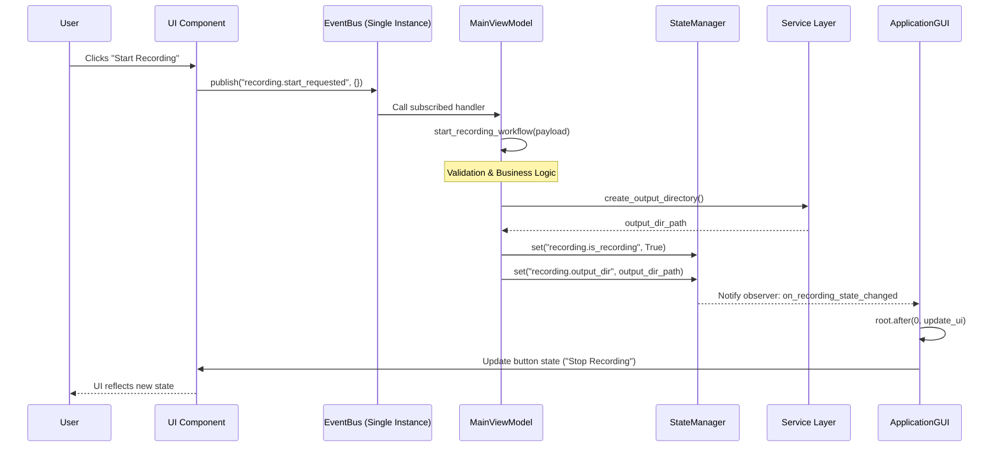
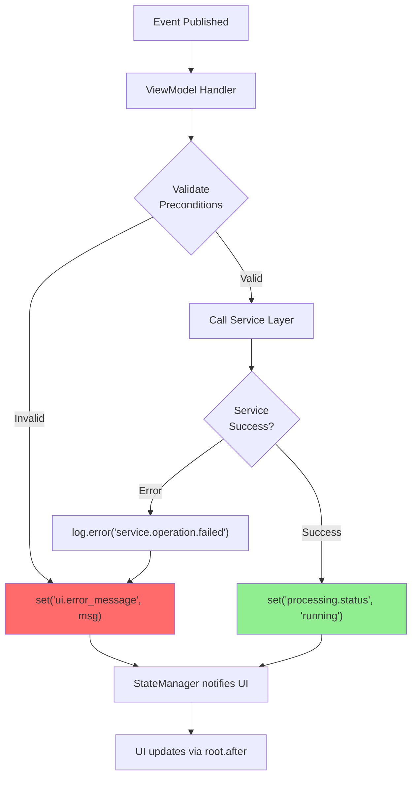

# Event-Driven Workflows in ZebTrack-AI

This document outlines the event-driven architecture adopted in ZebTrack-AI, aligning with the Model-View-ViewModel (MVVM) pattern. This design decouples the user interface (View) from the business logic and orchestration (ViewModel), leading to a more maintainable, testable, and scalable application.

## Core Architectural Components

### 1. The View (`ApplicationGUI`)

The user interface layer, built with Tkinter using a **component-based architecture**.

**Responsibilities**:
- Display data to the user via modular UI components (`VideoDisplayWidget`, `ZoneControlsWidget`, etc.)
- Capture user interactions (button clicks, form submissions)
- **Does NOT** contain business logic or orchestration
- Publishes events to `EventBus` when user actions occur

**Key Characteristics**:
- Components are self-contained `ttk.Frame` subclasses
- Each component emits domain-specific events (e.g., `zone.draw_roi`, `recording.start_requested`)
- Components do not know who consumes their events (decoupled)

**File**: `src/zebtrack/ui/gui.py`, `src/zebtrack/ui/components/`

### 2. The Event Bus (`EventBus`)

A central messaging system implementing the **publish-subscribe pattern**.

**Responsibilities**:
- Allow components to communicate without direct references
- Route events from View to ViewModel handlers
- Support multiple subscribers per event (future extensibility)

**Key Methods**:
```python
class EventBus:
    def publish(self, event_name: str, payload: dict = None):
        """Publish event from UI component."""

    def subscribe(self, event_name: str, handler: Callable):
        """Subscribe ViewModel handler to event."""
```

**Consolidation (Fase 3.2)**:
- **Before**: Multiple EventBus instances or direct method calls
- **After**: Single EventBus instance in `ApplicationGUI`, passed to all components
- **Benefit**: Centralized event flow, easier debugging and testing

**File**: `src/zebtrack/core/event_bus.py`

### 3. The Events Registry (`Events` Enum - Future)

A centralized enumeration defining all possible events for type safety and self-documentation.

**Current State**: Events are string-based (e.g., `"recording.start_requested"`)
**Future Enhancement**: Enum-based for IDE autocomplete and compile-time checks

```python
class Events(Enum):
    RECORDING_START_REQUESTED = "recording.start_requested"
    ZONE_DRAW_ROI = "zone.draw_roi"
    PROJECT_CREATE = "project.create"
```

### 4. The ViewModel (`MainViewModel`)

The **orchestrator** of the application, containing all business logic and workflow coordination.

**Responsibilities** (Migradas na Fase 3.1):
- Subscribe to events from `EventBus` via `bind_events()`
- Execute business logic in event handlers (e.g., `start_recording_workflow`)
- Coordinate with services (`ProjectService`, `AnalysisService`, `DetectorService`)
- Update `StateManager` with new application state
- Schedule UI updates via `root.after()` for thread-safety

**Before Fase 3.1**:
- Business logic scattered across UI callbacks
- Direct coupling between UI and services
- Difficult to test workflows

**After Fase 3.1**:
- Centralized orchestration in `MainViewModel`
- UI only emits events, never calls services directly
- Testable workflows via mocked EventBus

**File**: `src/zebtrack/core/main_view_model.py`

**Example Handler**:
```python
class MainViewModel:
    def bind_events(self):
        """Subscribe handlers to EventBus events."""
        self.event_bus.subscribe("recording.start_requested", self.start_recording_workflow)

    def start_recording_workflow(self, payload: dict):
        """Handle recording start event."""
        # 1. Validate preconditions
        if not self.detector.is_initialized:
            self.state_manager.set("ui.error_message", "Detector not ready")
            return

        # 2. Coordinate with services
        output_dir = self.project_service.create_output_directory()

        # 3. Update state
        self.state_manager.set("recording.is_recording", True)
        self.state_manager.set("recording.output_dir", output_dir)

        # 4. Start background worker
        self.recorder.start(output_dir)
```

### 5. The State Manager (`StateManager`)

**Source of truth** for application state, implementing the **Observable pattern**.

**Responsibilities**:
- Store all application state in 5 categories: `project`, `detector`, `recording`, `processing`, `ui`
- Provide thread-safe read/write access via `RLock`
- Notify observers (UI components) of state changes
- Log all state transitions for debugging

**Integration with ViewModel**:
- ViewModel writes to StateManager (e.g., `state_manager.set("processing.status", "running")`)
- ApplicationGUI observes StateManager and updates UI reactively

**File**: `src/zebtrack/core/state_manager.py`
**Documentation**: [`docs/STATE_MANAGER_GUIDE.md`](STATE_MANAGER_GUIDE.md)

## General Workflow Pattern

The standard flow for any user-initiated action is as follows:

1.  **User Interaction:** The user interacts with a widget in the `ApplicationGUI` (e.g., clicks the "Create Project" button).
2.  **Event Publication:** The `ApplicationGUI` collects data from the relevant input fields, creates a payload dictionary, and publishes a specific event (e.g., `Events.PROJECT_CREATE`) to the `EventBus`.
3.  **Event Subscription:** The `MainViewModel`, which has already subscribed its handler methods during initialization (via `bind_events()`), receives the notification for that event.
4.  **Workflow Orchestration:** The corresponding handler method in the `MainViewModel` (e.g., `create_project_workflow`) is executed. This method orchestrates the necessary actions by calling various services.
5.  **UI Update:** The `MainViewModel` updates the UI indirectly by changing the central state or by publishing events that the UI is subscribed to.

---

## Detailed Workflows

Below are descriptions of the main workflows that have been refactored to follow this event-driven pattern.

### 1. Project Creation

*   **Trigger:** User fills out the new project wizard and clicks the final "Create" button.
*   **Event:** `Events.PROJECT_CREATE`
*   **Payload:** A dictionary containing all project configuration details, such as `project_name`, `animal_method`, etc.
*   **Handler:** `MainViewModel.create_project_workflow`
*   **Orchestration:**
    1.  The handler receives the project data from the event payload.
    2.  It calls the `ProjectWorkflowService` to perform the business logic of creating the project directory and configuration file.
    3.  It then calls `setup_detector()` to initialize the detector with the correct settings for the new project.
    4.  Finally, it publishes events to the `UICoordinator` to switch the main window's view from the welcome screen to the main project interface.

### 2. Opening an Existing Project

*   **Trigger:** User selects a project file (`.ztp`) via the "Open Project" file dialog.
*   **Event:** `Events.PROJECT_OPEN`
*   **Payload:** `{"project_path": "/path/to/your/project.ztp"}`
*   **Handler:** `MainViewModel.open_project_workflow`
*   **Orchestration:**
    1.  Receives the project path.
    2.  Delegates to `ProjectWorkflowService` to load the project data, validate its contents, and restore detector and model settings from the project configuration.
    3.  Calls `setup_detector_zones()` to configure the detection zones based on the loaded project.
    4.  Publishes events to update the UI with the loaded project's information and switches to the main project view.

### 3. Single Video Processing

*   **Trigger:** After defining zones for a single video, the user clicks the "Start Processing" button.
*   **Event:** `Events.VIDEO_START_SINGLE_PROCESSING`
*   **Payload:** `{"video_path": "...", "config": {...}, "zone_data": <ZoneData>}`
*   **Handler:** `MainViewModel.start_single_video_processing`
*   **Orchestration:**
    1.  Receives the video path, configuration, and defined zone data.
    2.  Updates the `Detector` instance with the provided `zone_data`.
    3.  Initializes and starts a `ProcessingWorker` in a separate background thread to handle the computationally intensive video analysis.
    4.  The worker uses a callback system to report progress, which the `MainViewModel` then uses to update the UI's progress bar and status messages.
    5.  Switches the UI to the analysis view.

### 4. Model & Weight Management

*   **Trigger:** User interacts with buttons like "Load New Weight" or "Manage Weights".
*   **Events:**
    *   `Events.MODEL_LOAD_NEW_WEIGHT`
    *   `Events.MODEL_MANAGE_WEIGHTS`
*   **Payload:** Typically empty (`{}`).
*   **Handlers:** `MainViewModel.load_new_weight` and `MainViewModel.manage_weights`
*   **Orchestration:** These handlers are simpler, primarily responsible for opening the appropriate UI dialogs (`ask_open_filenames` or `ManageWeightsDialog`) which then handle the interaction with the `WeightManager` service.

### 5. Automatic Aquarium Detection

*   **Trigger:** User clicks the "Auto-Detect Aquarium" button in the zone definition tab.
*   **Event:** `Events.ZONE_AUTO_DETECT`
*   **Payload:** `{"video_path": "...", "stabilization_frames": 10}`
*   **Handler:** `MainViewModel.run_aquarium_detection`
*   **Orchestration:**
    1.  The handler instantiates an `AquariumDetector`.
    2.  It runs the detection model on the specified video.
    3.  If a polygon is successfully detected, it publishes a `UI_SETUP_INTERACTIVE_POLYGON` event, which the `ApplicationGUI` listens for to draw the suggested polygon on the screen for the user to confirm or edit.

---

## Event Registry (Fase 3.2 - Consolidação)

Esta seção documenta todos os eventos suportados após a consolidação do EventBus, agrupados por domínio.

### Recording Events

| Event Name | Payload | Handler | Description |
|------------|---------|---------|-------------|
| `recording.start_requested` | `{}` | `MainViewModel.start_recording_workflow` | Usuário solicita início de gravação |
| `recording.stop_requested` | `{}` | `MainViewModel.stop_recording_workflow` | Usuário solicita parada de gravação |
| `recording.pause_requested` | `{}` | `MainViewModel.pause_recording` | Usuário solicita pausa |
| `recording.resume_requested` | `{}` | `MainViewModel.resume_recording` | Usuário solicita retomada |

### Zone Events

| Event Name | Payload | Handler | Description |
|------------|---------|---------|-------------|
| `zone.draw_roi` | `{"mode": "arena" \| "roi"}` | `MainViewModel.start_zone_drawing` | Usuário inicia desenho de arena/ROI |
| `zone.save` | `{"polygon": list, "roi_data": dict}` | `MainViewModel.save_zone_data` | Salva zona definida |
| `zone.auto_detect` | `{"video_path": str}` | `MainViewModel.run_aquarium_detection` | Detecção automática de arena |
| `zone.clear_all` | `{}` | `MainViewModel.clear_all_zones` | Limpa todas as zonas |
| `zone.load_template` | `{"template_name": str}` | `MainViewModel.load_zone_template` | Carrega template salvo |

### Project Events

| Event Name | Payload | Handler | Description |
|------------|---------|---------|-------------|
| `project.create` | `{project_name, type, calibration, ...}` | `MainViewModel.create_project_workflow` | Wizard criou novo projeto |
| `project.open` | `{"project_path": str}` | `MainViewModel.open_project_workflow` | Usuário abriu projeto existente |
| `project.save` | `{}` | `MainViewModel.save_project` | Salva estado atual do projeto |
| `project.close` | `{}` | `MainViewModel.close_project` | Fecha projeto ativo |

### Processing Events

| Event Name | Payload | Handler | Description |
|------------|---------|---------|-------------|
| `processing.start_single` | `{video_path, config, zone_data}` | `MainViewModel.start_single_video_processing` | Processa vídeo único |
| `processing.start_batch` | `{videos: list, config}` | `MainViewModel.start_batch_processing` | Processa lote de vídeos |
| `processing.cancel` | `{}` | `MainViewModel.cancel_processing` | Cancela processamento |
| `processing.retry_failed` | `{failed_videos: list}` | `MainViewModel.retry_failed_videos` | Reprocessa vídeos que falharam |

### Detector Events

| Event Name | Payload | Handler | Description |
|------------|---------|---------|-------------|
| `detector.configure` | `{plugin, confidence, nms}` | `MainViewModel.configure_detector` | Atualiza configuração do detector |
| `detector.load_weight` | `{weight_path: str}` | `MainViewModel.load_detector_weight` | Carrega novo peso YOLO |
| `detector.toggle_openvino` | `{enabled: bool}` | `MainViewModel.toggle_openvino` | Ativa/desativa OpenVINO |

### UI Events

| Event Name | Payload | Handler | Description |
|------------|---------|---------|-------------|
| `ui.view_change` | `{view: str}` | `MainViewModel.switch_view` | Troca de tela (welcome/project/analysis) |
| `ui.overlay_toggle` | `{enabled: bool}` | `MainViewModel.toggle_overlay` | Ativa/desativa overlay de detecções |
| `ui.zoom_change` | `{level: float}` | `MainViewModel.update_zoom` | Ajusta zoom do vídeo |

---

## Updated Workflow Diagrams

### Consolidated Event Flow (Post-Fase 3.1 & 3.2)



### Error Handling in Workflows



---

## Migration Notes (Fase 3.1 & 3.2)

### Changes from Previous Architecture

**Before (Pre-Fase 3)**:
- UI callbacks directly called `MainViewModel` methods
- Multiple EventBus instances or no EventBus at all
- Business logic mixed with UI update code
- Difficult to trace event flow

**After (Post-Fase 3.2)**:
- Single EventBus instance in `ApplicationGUI`
- UI components only emit events, never call ViewModel directly
- Business logic centralized in ViewModel handlers
- Clear separation: View → EventBus → ViewModel → Services → StateManager → View

### Benefits Realized

1. **Testability**: Mock EventBus to test ViewModel in isolation
2. **Decoupling**: Components don't depend on ViewModel structure
3. **Maintainability**: Event names are self-documenting contracts
4. **Extensibility**: Add new handlers without modifying UI code
5. **Debugging**: Single event flow path to trace and log

### Testing Example

```python
def test_start_recording_workflow(mock_event_bus, mock_state_manager):
    # Given
    view_model = MainViewModel(event_bus=mock_event_bus, state_manager=mock_state_manager)
    view_model.bind_events()

    # When
    mock_event_bus.publish("recording.start_requested", {})

    # Then
    mock_state_manager.set.assert_called_with("recording.is_recording", True)
```

---

## Related Documentation

- **[ARCHITECTURE.md](ARCHITECTURE.md)**: Full system architecture and MVVM pattern
- **[ERROR_HANDLING.md](ERROR_HANDLING.md)**: Error handling strategies and callbacks
- **[STATE_MANAGER_GUIDE.md](STATE_MANAGER_GUIDE.md)**: StateManager API and observer pattern
- **[REFERENCE_GUIDE.md](REFERENCE_GUIDE.md)**: API reference for all components
