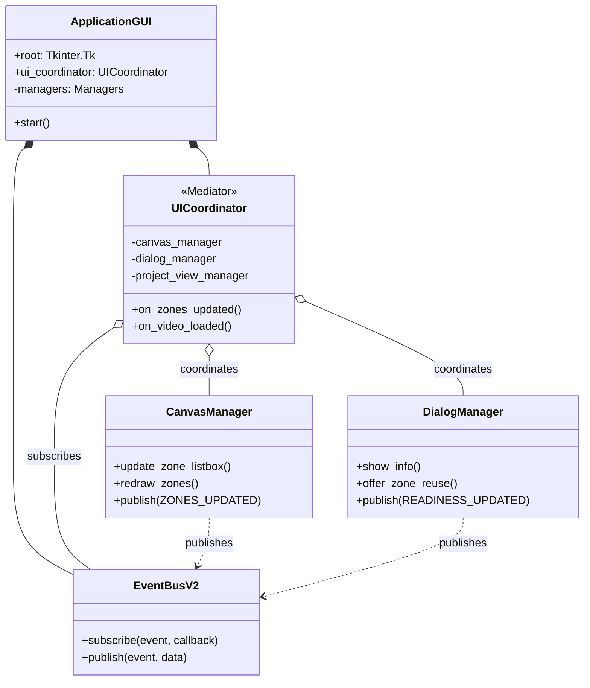
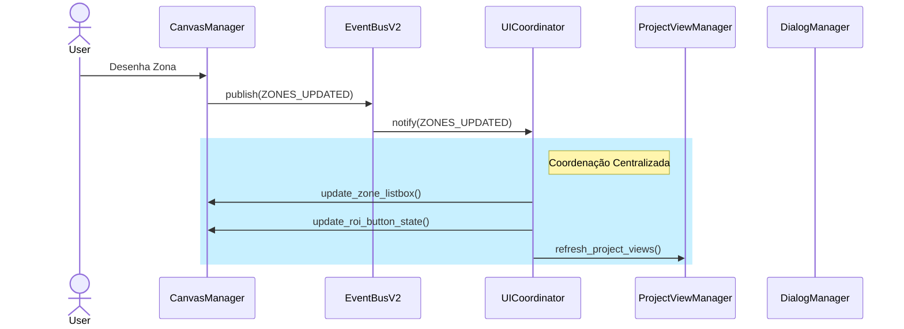

# Arquitetura do ZebTrack-AI (v4.0 - Event-Driven)

**Versão:** 4.0.0 (Estável)
**Data:** 23 de Novembro de 2025
**Status:** Implementado

O ZebTrack-AI migrou de uma arquitetura monolítica (God Object/Facade) para uma **Arquitetura Orientada a Eventos (Event-Driven Architecture)** modular, utilizando o padrão **Mediator**.

## 1. Visão Geral

A arquitetura v4.0 resolve o problema de acoplamento circular e complexidade ciclomática da antiga `GUI` (~2700 linhas). A nova estrutura desacopla a lógica de visualização da lógica de negócios e coordenação.

### Componentes Principais

1. **Event Bus V2 (`EventBusV2`):** O canal central de comunicação. Componentes publicam eventos (ex: `ZONES_UPDATED`) sem saber quem os consome.
2. **Coordenador de UI (`UICoordinator`):** Atua como **Mediator**. Escuta eventos do barramento e orquestra a atualização de múltiplos componentes da UI. Elimina a necessidade de componentes chamarem a `GUI` diretamente.
3. **Componentes Especializados (Managers):**
    * `CanvasManager`: Gerencia o desenho e interação no canvas de vídeo.
    * `DialogManager`: Gerencia diálogos modais e interações de usuário.
    * `ProjectViewManager`: Gerencia a árvore de vídeos e painéis de resumo.
    * `ValidationManager`: Centraliza regras de validação e formatação.
    * `WidgetFactory`: Fábrica para criação padronizada de widgets UI.
4. **Controller (`MainController`):** Mantém a lógica de negócios "pura" (backend), sem dependência direta da UI.

## 2. Diagrama de Componentes (Mermaid)



## 3. Fluxo de Dados (Event Flow)

A comunicação segue um fluxo unidirecional estrito para evitar efeitos colaterais e ciclos.

### Exemplo: Atualização de Zonas

1. **Ação:** Usuário desenha uma nova zona no `CanvasManager`.
2. **Publicação:** `CanvasManager` publica evento `ZONES_UPDATED`.
3. **Mediação:** `EventBusV2` entrega o evento ao `UICoordinator`.
4. **Orquestração:** `UICoordinator` executa:
    * Atualiza lista lateral (`CanvasManager.update_zone_listbox`).
    * Valida integridade (`ValidationManager.validate_zones`).
    * Atualiza status do projeto (`ProjectViewManager.refresh_project_views`).
    * Habilita botões de ROI (`CanvasManager.update_roi_button_state`).



## 4. Métricas de Qualidade

* **Redução de Código:** `gui.py` reduzido de ~2700 para ~1280 linhas.
* **Acoplamento:** Zero dependências circulares entre `GUI` e `Managers`.
* **Testabilidade:** Managers podem ser testados isoladamente simulando eventos.
* **Manutenibilidade:** Novos recursos exigem apenas novos assinantes no `EventBus`, sem alterar a `GUI` principal.

## 5. Estrutura de Diretórios

* `src/zebtrack/ui/`:
  * `gui.py`: Ponto de entrada (Bootstrap).
  * `ui_coordinator.py`: Lógica de mediação.
  * `event_bus_v2.py`: Sistema de mensagens.
  * `components/`: Managers especializados.
  * `builders/`: Factories de construção de UI.

## 6. Atualizações Recentes (Dezembro 2025)

### 6.1. Sequential Multi-Aquarium Processing (v3.1)

O sistema agora suporta processamento sequencial de múltiplos aquários:

* **Modo Paralelo (padrão):** Ambos aquários processados em 1 passagem de vídeo
* **Modo Sequencial:** Cada aquário processado separadamente (2 passagens)

**Novo Evento:** `ZONE_PROCESSING_MODE_CHANGED` com payload `{sequential: bool}`

**Novos Métodos em ProcessingCoordinator:**

* `_start_sequential_multi_aquarium_processing()`
* `_process_next_aquarium_in_sequence()`
* `_start_single_aquarium_for_sequential()`

### 6.2. Unified Reports & Analysis (v3.2)

Melhorias no sistema de relatórios unificados:

* **Max Speed Metric:** Nova métrica `max_speed_cm_s` em estatísticas de velocidade
* **Geotaxis Naming:** Zonas exibidas com nomes 1-indexados (Zona 1, Zona 2)
* **Column Formatting:** `DISPLAY_COLUMN_MAPPING` para nomes formatados com unidades
* **Subject Identification:** Colunas de identificação sempre presentes em relatórios unificados
* **Batch Dialog Suppression:** Diálogos individuais suprimidos durante processamento em lote

**Correção Crítica:** `Reporter.behavioral_config` agora é armazenado corretamente no construtor legado, garantindo que dados de geotaxis apareçam nos relatórios.

### 6.3. Estrutura de Saída Multi-Aquário

```text
video_results/
├── aquarium_0/
│   ├── 3_CoordMovimento_{video}.parquet
│   ├── 4_Relatorio_{video}_aq0.docx
│   └── {video}_aq0_summary.parquet
└── aquarium_1/
    ├── 3_CoordMovimento_{video}.parquet
    ├── 4_Relatorio_{video}_aq1.docx
    └── {video}_aq1_summary.parquet
```

## 7. Histórico de Versões

| Versão | Data | Principais Mudanças |
| -------- | ------ | --------------------- |
| v4.0 | Nov 2025 | Arquitetura Event-Driven, UICoordinator Mediator |
| v3.1 | Dez 21, 2025 | Sequential Multi-Aquarium Processing |
| v3.2 | Dez 28, 2025 | Unified Reports, Max Speed, Geotaxis Naming Fix |

---
**Verificação Científica:** Esta arquitetura garante que o fluxo de dados (ex: detecção -> resultado) seja determinístico e auditável, essencial para a reprodutibilidade científica dos experimentos comportamentais.

**Documentação Relacionada:**

* `SYSTEM_INTEGRATION_MAP.md` - Contratos de eventos e payloads
* `UPDATES_DEC_2025.md` - Detalhes das atualizações de dezembro 2025
