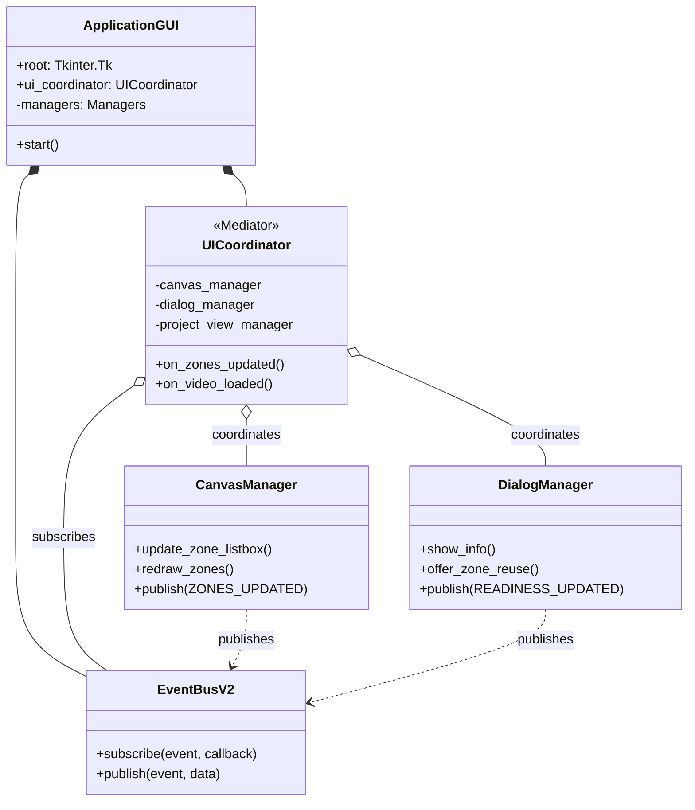
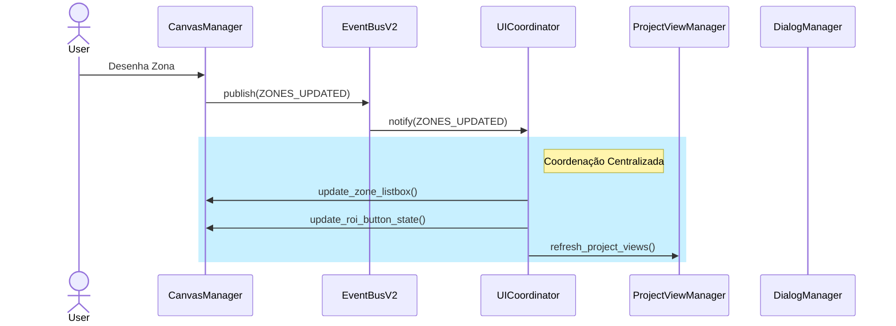

# Arquitetura do ZebTrack-AI (v4.0 - Event-Driven)

**Versão:** 4.0.0 (Estável)
**Data:** 23 de Novembro de 2025
**Status:** Implementado

O ZebTrack-AI migrou de uma arquitetura monolítica (God Object/Facade) para uma **Arquitetura Orientada a Eventos (Event-Driven Architecture)** modular, utilizando o padrão **Mediator**.

## 1. Visão Geral

A arquitetura v4.0 resolve o problema de acoplamento circular e complexidade ciclomática da antiga `GUI` (~2700 linhas). A nova estrutura desacopla a lógica de visualização da lógica de negócios e coordenação.

### Componentes Principais

1.  **Event Bus V2 (`EventBusV2`):** O canal central de comunicação. Componentes publicam eventos (ex: `ZONES_UPDATED`) sem saber quem os consome.
2.  **Coordenador de UI (`UICoordinator`):** Atua como **Mediator**. Escuta eventos do barramento e orquestra a atualização de múltiplos componentes da UI. Elimina a necessidade de componentes chamarem a `GUI` diretamente.
3.  **Componentes Especializados (Managers):**
    *   `CanvasManager`: Gerencia o desenho e interação no canvas de vídeo.
    *   `DialogManager`: Gerencia diálogos modais e interações de usuário.
    *   `ProjectViewManager`: Gerencia a árvore de vídeos e painéis de resumo.
    *   `ValidationManager`: Centraliza regras de validação e formatação.
    *   `WidgetFactory`: Fábrica para criação padronizada de widgets UI.
4.  **Controller (`MainController`):** Mantém a lógica de negócios "pura" (backend), sem dependência direta da UI.

## 2. Diagrama de Componentes (Mermaid)

## 3. Fluxo de Dados (Event Flow)

A comunicação segue um fluxo unidirecional estrito para evitar efeitos colaterais e ciclos.

### Exemplo: Atualização de Zonas

1.  **Ação:** Usuário desenha uma nova zona no `CanvasManager`.
2.  **Publicação:** `CanvasManager` publica evento `ZONES_UPDATED`.
3.  **Mediação:** `EventBusV2` entrega o evento ao `UICoordinator`.
4.  **Orquestração:** `UICoordinator` executa:
    *   Atualiza lista lateral (`CanvasManager.update_zone_listbox`).
    *   Valida integridade (`ValidationManager.validate_zones`).
    *   Atualiza status do projeto (`ProjectViewManager.refresh_project_views`).
    *   Habilita botões de ROI (`CanvasManager.update_roi_button_state`).

## 4. Métricas de Qualidade

*   **Redução de Código:** `gui.py` reduzido de ~2700 para ~1280 linhas.
*   **Acoplamento:** Zero dependências circulares entre `GUI` e `Managers`.
*   **Testabilidade:** Managers podem ser testados isoladamente simulando eventos.
*   **Manutenibilidade:** Novos recursos exigem apenas novos assinantes no `EventBus`, sem alterar a `GUI` principal.

## 5. Estrutura de Diretórios

*   `src/zebtrack/ui/`:
    *   `gui.py`: Ponto de entrada (Bootstrap).
    *   `ui_coordinator.py`: Lógica de mediação.
    *   `event_bus_v2.py`: Sistema de mensagens.
    *   `components/`: Managers especializados.
    *   `builders/`: Factories de construção de UI.

---
**Verificação Científica:** Esta arquitetura garante que o fluxo de dados (ex: detecção -> resultado) seja determinístico e auditável, essencial para a reprodutibilidade científica dos experimentos comportamentais.
