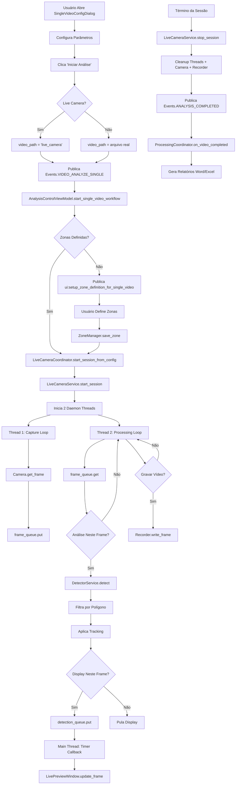

# Auditoria: Fluxo Single-Aquarium Live Camera (1 Aquário)

## 📋 Resumo Executivo

Esta auditoria documenta o fluxo completo de criação e uso de projetos com vídeos ao vivo (live camera), focando especificamente na análise de **1 único aquário**. O objetivo é mapear todos os componentes, eventos, integrações e possíveis pontos de falha para facilitar a identificação e resolução de problemas.

> **Status**: ✅ Fluxo funcional desde Phase 8 (Jan 2025), sem reclamações de usuários reportadas
> **Última Atualização**: 30 de Dezembro de 2025
> **Foco**: Single-Aquarium Analysis (não Multi-Aquarium)

---

## 🏗️ Arquitetura Geral

### Padrão Arquitetural

O ZebTrack-AI utiliza uma arquitetura em camadas com **dependency injection** e comunicação via **event bus dual**:

```
┌─────────────────────────────────────────────────────────────┐
│                      UI Layer (Tkinter)                      │
│  - ApplicationGUI                                            │
│  - LivePreviewWindow (dedicated window for live preview)    │
│  - SingleVideoConfigDialog                                  │
└────────────────────┬────────────────────────────────────────┘
                     │ Events (EventBus v1 + EventBusV2)
┌────────────────────▼────────────────────────────────────────┐
│                  ViewModel Layer                             │
│  - MainViewModel                                             │
│  - AnalysisControlViewModel                                 │
│  - HardwareStatusViewModel                                  │
└────────────────────┬────────────────────────────────────────┘
                     │
┌────────────────────▼────────────────────────────────────────┐
│               Coordinator Layer (Phase 3)                    │
│  - LiveCameraCoordinator ← PONTO DE ENTRADA LIVE CAMERA     │
│  - ProcessingCoordinator                                    │
│  - HardwareCoordinator                                      │
│  - SessionCoordinator                                       │
│  - ProjectLifecycleCoordinator                              │
└────────────────────┬────────────────────────────────────────┘
                     │
┌────────────────────▼────────────────────────────────────────┐
│                   Service Layer                              │
│  - LiveCameraService ← LÓGICA PRINCIPAL LIVE CAMERA         │
│  - DetectorService                                          │
│  - RecordingService                                         │
│  - ProjectManager                                           │
│  - ZoneManager                                              │
└────────────────────┬────────────────────────────────────────┘
                     │
┌────────────────────▼────────────────────────────────────────┐
│                 Hardware/Plugin Layer                        │
│  - Camera (cv2 wrapper)                                     │
│  - UltralyticsDetectorPlugin / OpenVINOPlugin               │
│  - BYTETracker / SingleSubjectTracker                       │
│  - Recorder (video recording)                               │
└─────────────────────────────────────────────────────────────┘
```

### Dual Event Bus (CRÍTICO)

| Event System | Módulo | Tipo de Evento | Uso Principal |
|--------------|--------|----------------|---------------|
| **EventBus (v1)** | `zebtrack.ui.event_bus.EventBus` | String constants (`Events` class) | Domain events: recording, project, analysis, detector |
| **EventBusV2** | `zebtrack.ui.event_bus_v2.EventBusV2` | Enum (`UIEvents`) | UI component communication: zones, dialogs, canvas updates |

> ⚠️ **IMPORTANTE**: Não misturar os dois sistemas. Use `Events` class com `EventBus` para domain events.

---

## 🔄 Fluxo End-to-End: Análise ao Vivo (1 Aquário)

### Fase 1: Inicialização e Configuração

#### 1.1. Usuário Abre o Diálogo de Análise

**Componente**: `SingleVideoConfigDialog`

**Ações**:

1. Usuário seleciona "Live Camera Analysis" (vídeo ao vivo)
2. Configura parâmetros no diálogo:
   - **Duração da sessão** (segundos)
   - **Índice da câmera** (0, 1, 2...)
   - **Número de aquários**: **1** (nosso foco)
   - **Animais por aquário**: 1 ou N
   - **Intervalos de análise/display**: frames entre análises e entre atualizações de tela
   - **Configurações comportamentais**: perspectiva (lateral/superior), geotaxis, thigmotaxis
   - **Gravar vídeo**: Sim/Não
   - **Output base directory**

3. Clica em "Iniciar Análise"

**Validações no Diálogo**:

```python
# animal_method = "det" suporta apenas 1 animal por aquário
# animal_method = "seg" suporta múltiplos animais
if animal_method == "det" and animals_per_aquarium > 1:
    # Erro: "O modo de detecção (det) suporta apenas 1 animal por aquário"
    return
```

#### 1.2. Construção do Config

**Componente**: `SingleVideoConfigDialog._build_config()`

**Payload**:

```python
config = {
    # Parâmetros básicos
    "video_path": "live_camera",
    "is_live_camera": True,
    "camera_index": 0,
    "duration_s": 60.0,
    "experiment_id": "live_20251230_154956",

    # Análise
    "num_aquariums": 1,  # ← FOCO DESTA AUDITORIA
    "animals_per_aquarium": 1,
    "analysis_interval_frames": 1,  # analisar todo frame
    "display_interval_frames": 1,   # atualizar UI todo frame
    "record_video": True,
    "output_base_dir": "C:/Users/santa/Videos/ZebTrack",

    # Detector
    "use_openvino": False,
    "animal_method": "seg",  # ou "det"
    "model_path": "path/to/model.pt",
    "conf_threshold": 0.25,

    # Configurações comportamentais
    "behavioral_config": {
        "aquarium_perspective": "lateral",  # ou "superior"
        "geotaxis_mode": "by_zones",
        "geotaxis_num_zones": 3,
        "geotaxis_height_cm": 15.0,
        "thigmotaxis_distance_cm": 2.0,
        ...
    },

    # Zones (se já definidas)
    "zones": None  # ou [{"aquarium_id": 0, "polygon": [[x1,y1], [x2,y2], ...]}]
}
```

---

### Fase 2: Publicação do Evento e Roteamento

#### 2.1. Evento Publicado

**Evento**: `Events.VIDEO_ANALYZE_SINGLE`

**Publisher**: `SingleVideoConfigDialog` (via `EventDispatcher`)

**Payload**:

```python
{
    "video_path": "live_camera",
    "config": {...}  # config completo acima
}
```

#### 2.2. Roteamento pelo ViewModel

**Subscriber**: `AnalysisControlViewModel.start_single_video_workflow()`

**Caminho**:

```
EventBus.publish(Events.VIDEO_ANALYZE_SINGLE, payload)
    ↓
EventDispatcher._handle_video_analyze_single(payload)
    ↓
MainViewModel.start_single_video_workflow(video_path, config)
    ↓
AnalysisControlViewModel.start_single_video_workflow(video_path, config, detector_vm)
```

**Lógica no ViewModel**:

1. `ProjectManager.set_active_zone_video(video_path)`
2. Valida `animal_method` vs `animals_per_aquarium`
3. Setup do detector (se necessário via HardwareStatusViewModel)
4. Publica `"ui:setup_zone_definition_for_single_video"` event

---

### Fase 3: Setup de Zonas (ROI/Arena)

#### 3.1. Subscriber do Evento de Zona

**Evento**: `"ui:setup_zone_definition_for_single_video"`

**Subscriber**: `EventDispatcher` → `ZoneControlBuilder` (ou handler dedicado)

**Ações**:

1. **Se `num_aquariums == 1` E `zones` não estão definidas**:
   - Navega para a tab de definição de zona
   - Usuário pode:
     - **Auto-detectar**: `Events.ZONE_AUTO_DETECT` → `ProcessingCoordinator._handle_zone_auto_detect()`
       - Usa `AquariumDetector` (YOLO) para encontrar o tanque
       - Estabiliza em `stabilization_frames` (padrão: 30)
       - Retorna polígono detectado
     - **Desenhar manualmente**: Canvas tools (CanvasManager)
     - **Copiar de outro vídeo**: `Events.ZONE_COPY_ZONES` / `Events.ZONE_PASTE_ZONES`

2. **Se zonas já estão definidas** (passadas no config):
   - Pula para Fase 4 imediatamente

3. **Após zonas definidas**:
   - Salva no `ZoneManager`: `save_zone(video_path, ZoneData)`
   - Publica `UIEvents.ZONES_UPDATED`

**Estrutura de ZoneData (Single-Aquarium)**:

```python
ZoneData(
    aquarium_id=0,
    polygon=[[x1, y1], [x2, y2], [x3, y3], [x4, y4]],  # 4 pontos
    width_cm=None,   # opcional, para calibração
    height_cm=None,  # opcional, para calibração
    metadata={}
)
```

> **CRÍTICO (Single-Aquarium)**: Para 1 aquário, sempre usa `aquarium_id=0`. O sistema também suporta `MultiAquariumZoneData` para múltiplos aquários, mas não é o foco desta auditoria.

---

### Fase 4: Início da Sessão ao Vivo

#### 4.1. Trigger de Processamento

**Evento**: Após zonas definidas, o fluxo prossegue automaticamente

**Componente**: `AnalysisControlViewModel` chama `LiveCameraCoordinator.start_session_from_config(config)`

**Caminho**:

```
AnalysisControlViewModel
    ↓
LiveCameraCoordinator.start_session_from_config(config)
    ↓
LiveCameraCoordinator.start_live_session(...)
    ↓
LiveCameraService.start_session(...)
```

#### 4.2. LiveCameraCoordinator

**Arquivo**: `src/zebtrack/coordinators/live_camera_coordinator.py`

**Responsabilidades**:

- Extrai parâmetros do config
- Valida dependências (detector, camera, project_manager)
- Delega para `LiveCameraService`

**Método Principal**: `start_live_session()`

**Parâmetros Passados**:

```python
self.live_camera_service.start_session(
    camera_index=0,
    duration_s=60.0,
    experiment_id="live_20251230_154956",
    analysis_interval_frames=1,
    display_interval_frames=1,
    record_video=True,
    output_base_dir="C:/Users/santa/Videos/ZebTrack",
    animals_per_aquarium=1,
    analysis_config={
        "behavioral_config": {...},
        "num_aquariums": 1,
        "zones": [ZoneData(aquarium_id=0, polygon=[...])],
        ...
    }
)
```

---

### Fase 5: LiveCameraService - Lógica Principal

#### 5.1. Inicialização da Sessão

**Arquivo**: `src/zebtrack/core/live_camera_service.py` (1693 linhas)

**Componente**: `LiveCameraService.start_session()`

**Arquitetura de Threads**:

```
┌─────────────────────────────────────────────────────────────┐
│                    Main Thread (Tkinter)                     │
└──────────────────────────┬──────────────────────────────────┘
                           │
            ┌──────────────┼──────────────┐
            │              │              │
            ▼              ▼              ▼
   ┌────────────┐  ┌──────────────┐  ┌──────────────┐
   │  Capture   │  │  Processing  │  │    Timer     │
   │   Thread   │  │    Thread    │  │   (Tkinter)  │
   │  (daemon)  │  │   (daemon)   │  │              │
   └────────────┘  └──────────────┘  └──────────────┘
         │                 │                 │
         │                 │                 │
         ▼                 ▼                 ▼
    frame_queue    detection_queue    preview_window
                                           .update_frame()
```

**Threads Criadas**:

1. **Capture Thread** (`_capture_loop`): Captura frames da câmera
2. **Processing Thread** (`_processing_loop`): Detecta animais e processa
3. **Timer Callback** (main thread): Atualiza UI via `root.after()`

#### 5.2. Capture Loop (Thread 1)

**Método**: `LiveCameraService._capture_loop()`

**Lógica**:

```python
while not self._stop_event.is_set():
    # 1. Captura frame da câmera
    frame = self.camera.get_frame()
    if frame is None:
        continue

    # 2. Incrementa contador
    self._frame_counter += 1

    # 3. Coloca na fila para processamento
    if not self._frame_queue.full():
        self._frame_queue.put({
            "frame": frame.copy(),
            "frame_number": self._frame_counter,
            "timestamp": time.time()
        })

    # 4. Sleep para controlar framerate
    time.sleep(1.0 / 30)  # ~30 FPS
```

**Flags de Controle**:

- `self._stop_event`: threading.Event() para parar a thread
- `self._frame_queue`: queue.Queue(maxsize=10) para evitar memory leak

#### 5.3. Processing Loop (Thread 2)

**Método**: `LiveCameraService._processing_loop()`

**Lógica Principal**:

```python
while not self._stop_event.is_set():
    # 1. Pega frame da fila de captura
    frame_data = self._frame_queue.get(timeout=0.1)
    frame = frame_data["frame"]
    frame_number = frame_data["frame_number"]

    # 2. Verifica interval de análise
    if frame_number % self._analysis_interval_frames != 0:
        continue  # pula análise neste frame

    # 3. DETECÇÃO (PASSO CRÍTICO)
    detections = self._run_detection(frame, frame_number)

    # 4. Atualiza estatísticas
    self._update_stats(frame_number)

    # 5. Coloca resultado na fila de display
    if frame_number % self._display_interval_frames == 0:
        self._detection_queue.put({
            "frame": frame,
            "detections": detections,
            "frame_number": frame_number,
            "stats": {...}
        })

    # 6. GRAVAÇÃO (se record_video=True)
    if self._recorder and self.is_capturing_for_video:
        self._recorder.write_frame(frame, detections, frame_number)
```

**Componente de Detecção**: `_run_detection(frame, frame_number)`

```python
def _run_detection(self, frame, frame_number):
    # 1. Configura contexto do detector
    with DetectorContextManager(self.detector_service, "tracking"):
        # 2. Pega zona definida (single-aquarium)
        zone_data = self.zone_manager.get_zone_data(self._current_video_path)

        # 3. Crop do frame (se zona definida)
        if zone_data and zone_data.polygon:
            cropped_frame = self._crop_to_zone(frame, zone_data.polygon)
        else:
            cropped_frame = frame

        # 4. Detecção via plugin (Ultralytics ou OpenVINO)
        detections = self.detector_service.detector.detect(
            cropped_frame,
            conf_threshold=self.conf_threshold
        )

        # 5. Filtra por polígono (remove detecções fora da zona)
        if zone_data and zone_data.polygon:
            detections = self._filter_by_polygon(detections, zone_data.polygon)

        # 6. Tracking (mantém IDs consistentes)
        detections = self._apply_tracking(detections, frame_number)

        return detections
```

**Tracking (Single-Aquarium)**:

- **BYTETracker**: Usa Kalman Filter para prever posições (default)
- **SingleSubjectTracker**: Hybrid IoU + distance matching (alternativa)
- **Track IDs**: Para 1 aquário (aquarium_id=0), IDs vão de 0-999
  - Track ID = `0 * 1000 + local_track_id` = `0, 1, 2, 3, ...`

> ⚠️ **CRÍTICO**: ByteTracker pode prever posições FORA do polígono devido ao Kalman Filter. O sistema RE-FILTRA após tracking para garantir que apenas detecções dentro da zona são mantidas (fix Dec 2025).

#### 5.4. Display Update (Main Thread via Timer)

**Método**: `LiveCameraService._schedule_preview_update()`

**Lógica**:

```python
def _schedule_preview_update():
    # 1. Timer callback via Tkinter (executa na main thread)
    if not self._detection_queue.empty():
        display_data = self._detection_queue.get()

        # 2. Atualiza janela de preview
        if self.preview_window:
            self.preview_window.update_frame(
                frame=display_data["frame"],
                detections=display_data["detections"],
                stats=display_data["stats"]
            )

    # 3. Reagenda próximo update (30 FPS na UI)
    if not self._stop_event.is_set():
        self.root.after(33, self._schedule_preview_update)  # ~30 FPS
```

**Componente**: `LivePreviewWindow` (Tkinter Toplevel window)

**Características**:

- **Janela dedicada** (não usa `CanvasManager` do main GUI)
- **Decisão arquitetural** (ver `docs/decisions/ADR-004-live-camera-divergence.md`)
- **Justificativa**:
  - Threading model diferente (daemon threads vs multiprocessing)
  - Lifecycle diferente (criada/destruída por sessão)
  - Zero reclamações de usuários desde Phase 8 (Jan 2025)

**Trade-off**:

- ❌ Ferramentas de desenho do `CanvasManager` não disponíveis em live preview
- ✅ Simplicidade e estabilidade

---

### Fase 6: Gravação e Outputs

#### 6.1. Gravação de Vídeo (Opcional)

**Componente**: `Recorder` (via `RecordingService`)

**Condição**: `record_video=True` no config

**Lógica**:

```python
# Inicializa gravador
self._recorder = Recorder(
    output_dir=output_dir,
    experiment_id=experiment_id,
    fps=30,
    codec="mp4v"  # ou "avc1"
)

# Durante processing loop
if self._recorder and self.is_capturing_for_video:
    self._recorder.write_frame(
        frame=frame,
        detections=detections,
        frame_number=frame_number
    )
```

**Outputs Gerados**:

```
output_base_dir/
├── live_20251230_154956/
│   ├── live_20251230_154956.mp4          # ← Vídeo gravado
│   ├── 3_CoordMovimento_live_....parquet # ← Coordenadas de movimento
│   ├── metadata.json                      # ← Metadados da sessão
│   └── ...
```

#### 6.2. Estrutura de Outputs (Single-Aquarium)

**Para 1 aquário**, os outputs seguem o padrão **sem sufixo** `_aquarium_X`:

```
<experiment_id>/
├── <experiment_id>.mp4                        # Vídeo original/gravado
├── 1_ArenaROI_<experiment_id>.parquet         # Arena ROI (bbox do tanque)
├── 3_CoordMovimento_<experiment_id>.parquet   # Coordenadas de movimento
├── 4_BehavioralData_<experiment_id>.parquet   # Dados comportamentais
├── summary_<experiment_id>.parquet            # ← Summary para relatórios
├── metadata.json                              # Metadados da sessão
└── plots/                                     # Visualizações
    ├── trajectory_plot.png
    ├── heatmap.png
    └── roi_reference.png
```

**Formato do Summary Parquet** (usado para gerar relatórios):

```
Colunas:
- experiment_id, group, subject, day, aquarium_id, is_multi_aquarium
- Total Time (s), Total Distance (cm), Average Speed (cm/s), Max Speed (cm/s)
- Total Freezing Time (s), Freezing Episodes, Average Freezing Duration (s)
- Total Movement Time (s), Movement Episodes
- Erratic Movement Episodes, Erratic Movement Time (s)
- Thigmotaxis Time (s), Thigmotaxis Time (%)
- Geotaxis colunas (se enabled):
  - Fundo (0-5cm) Time (s), Fundo (0-5cm) Time (%)
  - Meio (5-10cm) Time (s), Meio (5-10cm) Time (%)
  - Topo (10-15cm) Time (s), Topo (10-15cm) Time (%)
```

> **NOTA**: Para multi-aquarium (fora do escopo desta auditoria), os outputs ficam em subpastas `<experiment_id>_aquarium_0/`, `<experiment_id>_aquarium_1/`, etc.

---

### Fase 7: Término da Sessão e Relatórios

#### 7.1. Término da Sessão

**Triggers**:

1. **Duração completa**: Timer de `duration_s` expira
2. **Cancelamento manual**: Usuário clica "Stop" → `Events.VIDEO_CANCEL_ANALYSIS`
3. **Erro**: Exceção capturada (camera disconnected, detector crash, etc.)

**Componente**: `LiveCameraService.stop_session()`

**Lógica de Cleanup**:

```python
def stop_session():
    # 1. Seta flag de stop
    self._stop_event.set()

    # 2. Aguarda threads terminarem
    if self._capture_thread:
        self._capture_thread.join(timeout=5.0)
    if self._processing_thread:
        self._processing_thread.join(timeout=5.0)

    # 3. Finaliza gravador
    if self._recorder:
        self._recorder.release()

    # 4. Libera câmera
    if self.camera:
        self.camera.release()

    # 5. Fecha preview window
    if self.preview_window:
        self.preview_window.destroy()

    # 6. Publica evento de conclusão
    self.event_bus.publish(Events.ANALYSIS_COMPLETED, {...})

    # 7. Atualiza StateManager
    self.state_manager.is_processing = False
```

#### 7.2. Geração de Relatórios

**Automática**: Após sessão completa, se `generate_reports=True`

**Componente**: `ProcessingCoordinator.on_video_completed()`

**Fluxo**:

```
LiveCameraService.stop_session()
    ↓
Publica Events.ANALYSIS_COMPLETED
    ↓
ProcessingCoordinator._on_session_completed()
    ↓
ProcessingCoordinator.generate_project_reports()
    ↓
AnalysisService.analyze_project(behavioral_config)
    ↓
Reporter.generate_word_report() + Reporter.generate_excel_report()
```

**CRÍTICO (Behavioral Config)**:
> O `behavioral_config` DEVE ser explicitamente passado para `AnalysisService` para garantir que as configurações de perspectiva e geotaxis sejam respeitadas. Sem isso, os relatórios usarão configurações padrão erradas (bug fixed Dec 2025).

**Relatórios Gerados** (Single-Aquarium):

```
<experiment_id>/
├── reports/
│   ├── Individual_Report_<experiment_id>.docx   # ← Word report individual
│   ├── Individual_Report_<experiment_id>.xlsx   # ← Excel report individual
│   └── plots/
│       ├── trajectory_plot.png
│       ├── heatmap.png
│       └── roi_reference.png
```

**Conteúdo do Word Report**:

1. **Informações do Experimento**: ID, data, duração, FPS
2. **Resumo de Movimento**: distância total, velocidade média/máxima
3. **Análise Comportamental**:
   - Freezing: tempo total, episódios, duração média
   - Erratic movement: tempo total, episódios
   - Thigmotaxis: tempo no perímetro, porcentagem
   - **Geotaxis** (se enabled): tempo em cada zona (Fundo, Meio, Topo)
4. **Visualizações**: trajectory, heatmap, ROI reference (embedded)
5. **Trajectory Validation**: coverage, frame range, warnings (if any)

**Conteúdo do Excel Report**:

- **Sheet 1**: Summary metrics (1 linha por experimento)
- **Sheet 2**: Detailed trajectory data (coordenadas frame-a-frame)
- **Sheet 3**: Behavioral events (freezing, erratic, zona changes)

---

## 🔑 Componentes Principais

### 1. LiveCameraCoordinator

**Arquivo**: `src/zebtrack/coordinators/live_camera_coordinator.py`

**Responsabilidades**:

- Gerencia lifecycle de sessões live camera
- Inicializa/libera hardware de câmera
- Delega lógica para `LiveCameraService`
- Atualiza `StateManager`

**Métodos Críticos**:

- `start_live_session()`: Inicia sessão
- `start_session_from_config()`: Inicia a partir do config do diálogo
- `stop_live_session()`: Para sessão
- `initialize_camera()`: Inicializa hardware
- `release_camera()`: Libera hardware

**Dependências**:

- `StateManager`: Estado centralizado
- `LiveCameraService`: Lógica principal
- `ProjectManager`: Gerenciamento de projeto
- `Settings`: Configurações globais
- `Camera`: Hardware da câmera
- `EventBus`: Comunicação

---

### 2. LiveCameraService

**Arquivo**: `src/zebtrack/core/live_camera_service.py` (1693 linhas)

**Responsabilidades**:

- **Thread coordination**: 2 daemon threads (capture + processing)
- **Frame capture**: Captura frames da câmera via `Camera`
- **Detection processing**: Detecta animais via `DetectorService`
- **Live preview**: Atualiza `LivePreviewWindow` via `root.after()`
- **Recording**: Grava vídeo via `Recorder` (opcional)
- **Output generation**: Gera arquivos parquet e metadados

**Métodos Críticos**:

- `start_session()`: Inicializa sessão, cria threads
- `stop_session()`: Para threads, cleanup
- `_capture_loop()`: Loop de captura (Thread 1)
- `_processing_loop()`: Loop de processamento (Thread 2)
- `_run_detection()`: Detecção + tracking
- `_schedule_preview_update()`: Atualiza UI (main thread)

**Thread Safety**:

- Usa `threading.Lock` para propriedades compartilhadas:
  - `_camera_lock`, `_preview_window_lock`, `_is_capturing_for_video_lock`
- Usa `queue.Queue` para comunicação inter-thread:
  - `_frame_queue`, `_detection_queue`
- Usa `threading.Event` para sinalização:
  - `_stop_event`

---

### 3. AnalysisControlViewModel

**Arquivo**: `src/zebtrack/core/viewmodels/analysis_control_view_model.py`

**Responsabilidades**:

- Orquestra workflow de análise de vídeo único
- Valida configurações (animal_method vs animals_per_aquarium)
- Setup do detector via `HardwareStatusViewModel`
- Publica eventos para UI (setup de zonas)

**Métodos Críticos**:

- `start_single_video_workflow()`: Entry point para análise de vídeo único
- Validações:
  - `animal_method == "det"` → máximo 1 animal por aquário
  - `animal_method == "seg"` → múltiplos animais permitidos

---

### 4. ProcessingCoordinator

**Arquivo**: `src/zebtrack/coordinators/processing_coordinator.py`

**Responsabilidades**:

- Coordena processamento de vídeos (gravados E ao vivo)
- Gerencia `ProcessingWorker` (multiprocessing)
- Coordena geração de relatórios
- Detecta aquários automaticamente (`AquariumDetector`)

**Métodos Críticos**:

- `_handle_zone_auto_detect()`: Auto-detecta aquário
- `on_video_completed()`: Callback após análise completar
- `generate_project_reports()`: Gera relatórios Word/Excel

> **NOTA**: Para live camera, o `ProcessingWorker` NÃO é usado (usa `LiveCameraService` dedicado). Mas o `ProcessingCoordinator` ainda é responsável por geração de relatórios após a sessão.

---

### 5. ZoneManager

**Arquivo**: `src/zebtrack/core/zone_manager.py`

**Responsabilidades**:

- Armazena e recupera dados de zona (ROI/arena)
- Serializa/deserializa `ZoneData` e `MultiAquariumZoneData`
- Suporta single-aquarium e multi-aquarium modes

**Métodos Críticos (Single-Aquarium)**:

- `get_zone_data(video_path)`: Retorna `ZoneData` para aquarium_id=0
- `save_zone(video_path, zone_data)`: Salva zona
- `has_zones(video_path)`: Verifica se zonas estão definidas

**Estrutura de ZoneData**:

```python
@dataclass
class ZoneData:
    aquarium_id: int           # 0 para single-aquarium
    polygon: list[list[float]] # [[x1,y1], [x2,y2], [x3,y3], [x4,y4]]
    width_cm: float | None     # calibração opcional
    height_cm: float | None    # calibração opcional
    metadata: dict             # metadados extras
```

---

### 6. DetectorService

**Arquivo**: `src/zebtrack/services/detector_service.py`

**Responsabilidades**:

- Abstração para plugins de detecção (Ultralytics, OpenVINO)
- Gerencia contexto de detecção ("tracking", "detection", "segmentation")
- Configuração de parâmetros (conf_threshold, iou_threshold, track_buffer)

**Plugins Suportados**:

- **UltralyticsDetectorPlugin**: YOLO (PyTorch)
- **OpenVINOPlugin**: YOLO (OpenVINO IR)

**Métodos Críticos**:

- `setup_detector(animal_method, use_openvino)`: Inicializa plugin
- `detect(frame, conf_threshold)`: Detecta objetos
- `set_context(context)`: Altera contexto ("tracking" vs "detection")
- `set_zones(zones)`: Configura zonas para tracking

---

### 7. Camera

**Arquivo**: `src/zebtrack/io/camera.py`

**Responsabilidades**:

- Wrapper para `cv2.VideoCapture`
- Inicializa/libera hardware de câmera
- Captura frames
- Thread-safe

**Métodos Críticos**:

- `initialize(camera_index, width, height)`: Abre câmera
- `get_frame()`: Captura frame (retorna np.ndarray ou None)
- `release()`: Libera hardware

---

### 8. Recorder

**Arquivo**: `src/zebtrack/io/recorder.py`

**Responsabilidades**:

- Grava vídeo via `cv2.VideoWriter`
- Suporta codecs: `mp4v`, `avc1`, `h264`
- Gera arquivos parquet de coordenadas

**Métodos Críticos**:

- `write_frame(frame, detections, frame_number)`: Escreve frame + detections
- `release()`: Finaliza gravação

---

## 📊 Eventos Relevantes

### Domain Events (EventBus v1)

| Evento | Payload | Publisher | Subscriber | Efeito |
|--------|---------|-----------|------------|--------|
| `Events.VIDEO_ANALYZE_SINGLE` | `video_path`, `config` | `SingleVideoConfigDialog` | `AnalysisControlViewModel` | Inicia workflow de análise |
| `Events.VIDEO_CANCEL_ANALYSIS` | - | UI (Cancel button) | `AnalysisControlViewModel` | Cancela análise em andamento |
| `Events.ZONE_AUTO_DETECT` | `video_path`, `stabilization_frames` | `ZoneControls` | `ProcessingCoordinator` | Auto-detecta aquário |
| `Events.ANALYSIS_COMPLETED` | `experiment_id`, `outputs` | `LiveCameraService` | `ProcessingCoordinator` | Sessão completada |
| `Events.UI_SET_STATUS` | `message` | Diversos | `ApplicationGUI` | Atualiza barra de status |

### UI Events (EventBusV2)

| Evento | Payload | Publisher | Subscriber | Efeito |
|--------|---------|-----------|------------|--------|
| `UIEvents.ZONES_UPDATED` | `zone_data` | `ZoneManager`, `CanvasManager` | UI components | Atualiza UI de zonas |
| `UIEvents.SHOW_ERROR` | `title`, `message` | Diversos | `ApplicationGUI` | Mostra diálogo de erro |

### Custom Events (String-based)

| Evento | Payload | Publisher | Subscriber | Efeito |
|--------|---------|-----------|------------|--------|
| `"ui:setup_zone_definition_for_single_video"` | `video_path`, `config` | `AnalysisControlViewModel` | `EventDispatcher` → `ZoneControlBuilder` | Navega para tab de zona |

---

## 🗺️ Fluxo de Dados Completo (Diagrama)



---

## ⚠️ Pontos Críticos e Possíveis Falhas

### 1. Thread Synchronization

**Problema**: Race conditions entre capture/processing threads

**Mitigação Atual**:

- `threading.Lock` para propriedades compartilhadas
- `queue.Queue` para comunicação inter-thread
- `threading.Event` para sinalização de stop

**Possíveis Issues**:

- ❌ Se `_stop_event` não for setado corretamente, threads podem não terminar
- ❌ Se `_frame_queue` encher, captura pode bloquear (fixado com `maxsize=10`)
- ❌ Se `_detection_queue` encher, UI pode congelar

**Recomendação**:

- Monitorar tamanho das filas em produção
- Implementar timeout em `queue.put()` se necessário

---

### 2. Camera Initialization

**Problema**: Câmera pode não estar disponível ou já em uso

**Mitigação Atual**:

```python
def initialize_camera(camera_index):
    camera = Camera()
    success = camera.initialize(camera_index)
    if not success:
        raise LiveCameraCoordinatorError(f"Failed to open camera {camera_index}")
```

**Possíveis Issues**:

- ❌ Múltiplas sessões tentam abrir a mesma câmera
- ❌ Permissões de sistema bloqueiam acesso
- ❌ Driver de câmera não instalado/atualizado

**Recomendação**:

- Implementar lock global para câmera
- Adicionar retry mechanism com delay
- Verificar disponibilidade antes de iniciar sessão

---

### 3. Zone Detection

**Problema**: Auto-detecção pode falhar ou retornar polígono incorreto

**Mitigação Atual**:

- `stabilization_frames` (padrão: 30) para estabilizar detecção
- Fallback para desenho manual se auto-detecção falhar

**Possíveis Issues**:

- ❌ Tanque muito escuro ou com reflexos
- ❌ Múltiplos objetos detectados (ruído)
- ❌ Frame inicial atípico (ex: mão do usuário aparecendo)

**Recomendação**:

- Aumentar `stabilization_frames` se ambiente ruidoso
- Implementar validação de polígono (ex: área mínima/máxima)
- Adicionar preview da detecção antes de confirmar

---

### 4. Tracking Drift (ByteTracker)

**Problema**: Kalman Filter pode prever posições fora do polígono

**Mitigação Atual** (Fixed Dec 2025):

```python
# Após _apply_byte_tracking()
detections = self._filter_by_polygon(detections, zone_polygon)
```

**Possíveis Issues**:

- ❌ Se re-filtro não for aplicado, IDs podem aparecer fora da zona
- ❌ Sparse frames (`analysis_interval > 1`) podem causar drift maior

**Recomendação**:

- **JÁ FIXADO**: Re-filtro pós-tracking implementado
- Para sparse frames, `dt` do Kalman é ajustado automaticamente

---

### 5. Behavioral Config Propagation

**Problema**: `behavioral_config` pode não ser passado para relatórios

**Mitigação Atual** (Fixed Dec 2025):

```python
# ProcessingCoordinator.on_video_completed()
behavioral_config = self._extract_behavioral_config(video_info)
self.generate_project_reports(behavioral_config=behavioral_config)
```

**Possíveis Issues**:

- ❌ Se config não for extraído, relatórios usarão defaults errados
- ❌ Geotaxis pode aparecer vazio mesmo estando enabled

**Recomendação**:

- **JÁ FIXADO**: Config explicitamente passado para AnalysisService
- Adicionar validação de config antes de gerar relatórios

---

### 6. Memory Leaks

**Problema**: Frames grandes podem causar memory leak se não liberados

**Mitigação Atual**:

- `queue.Queue(maxsize=10)` para limitar tamanho
- `frame.copy()` usado para evitar referências compartilhadas
- Threads daemon terminam automaticamente

**Possíveis Issues**:

- ❌ Se threads travarem, filas podem encher memória
- ❌ Frames de alta resolução (4K, 8K) podem esgotar RAM rapidamente

**Recomendação**:

- Implementar monitoramento de memória
- Adicionar downsampling se resolução > 1080p
- Limpar filas explicitamente em `stop_session()`

---

### 7. Output File Collisions

**Problema**: Múltiplas sessões simultâneas podem sobrescrever arquivos

**Mitigação Atual**:

- `experiment_id` com timestamp único: `live_20251230_154956`
- Output dir separado por experiment_id

**Possíveis Issues**:

- ❌ Se timestamp tiver precisão de segundos, sessões iniciadas no mesmo segundo podem colidir
- ❌ Se usuário especificar `experiment_id` manualmente, pode haver colisão

**Recomendação**:

- Usar timestamp com milissegundos: `live_20251230_154956_123`
- Verificar se output_dir já existe e adicionar sufixo `_1`, `_2`, etc.

---

## 🔍 Gaps e Issues Conhecidos

### Gap 1: Calibração de Zonas

**Situação Atual**: Zonas podem ser salvas sem `width_cm` e `height_cm`

**Impacto**: Métricas em centímetros podem ser incorretas (padrão: 1 px = 1 cm)

**Solução**:

- Implementar wizard de calibração após definir zona
- Permitir usuário especificar dimensões reais do tanque
- Calcular fator de escala automático

---

### Gap 2: Validação de Configurações Incompatíveis

**Situação Atual**: Apenas valida `animal_method vs animals_per_aquarium`

**Outros Casos Não Validados**:

- `geotaxis_mode="by_zones"` mas `num_aquariums > 1` (não suportado atualmente)
- `analysis_interval_frames` muito alto com `duration_s` curto (poucos frames analisados)
- `display_interval_frames > analysis_interval_frames` (não faz sentido)

**Solução**:

- Adicionar validação no `SingleVideoConfigDialog._validate_config()`
- Mostrar warnings/errors antes de iniciar sessão

---

### Gap 3: Recuperação de Erros Durante Sessão

**Situação Atual**: Se detector crash, sessão toda falha

**Solução**:

- Implementar try/except em `_processing_loop()`
- Continuar sessão mesmo se alguns frames falharem detecção
- Log de frames que falharam

---

### Gap 4: Preview de Configurações Antes de Iniciar

**Situação Atual**: Usuário não vê preview do que será analisado

**Solução**:

- Adicionar botão "Preview" no `SingleVideoConfigDialog`
- Mostrar 1 frame da câmera com zona desenhada
- Permitir ajuste de `conf_threshold` em tempo real

---

### Gap 5: Métricas de Qualidade da Sessão

**Situação Atual**: Sem feedback sobre qualidade da detecção durante sessão

**Métricas Úteis**:

- FPS real vs esperado
- % de frames com detecções válidas
- Número de track ID switches (instabilidade)
- Latência de processamento (frame captured → displayed)

**Solução**:

- Adicionar painel de estatísticas em `LivePreviewWindow`
- Salvar métricas em `metadata.json` para auditoria pós-sessão

---

### Gap 6: Suporte para Pausa/Resume

**Situação Atual**: Não é possível pausar sessão ao vivo

**Solução**:

- Adicionar botão "Pause" em `LivePreviewWindow`
- Seta flag `_pause_event` que faz threads aguardarem
- Continuar gravação ou pausar também?

---

## 📝 Checklist de Verificação (Para Reportar Issues)

Quando reportar um problema no fluxo live camera single-aquarium, forneça:

- [ ] **Config usado**: Copiar todo o `config` dict do diálogo
- [ ] **Versão do ZebTrack**: `poetry run zebtrack --version`
- [ ] **Sistema operacional**: Windows 10/11, Linux, macOS
- [ ] **Índice da câmera**: qual câmera foi usada (0, 1, 2...)
- [ ] **Resolução da câmera**: largura x altura
- [ ] **Modelo de detecção**: YOLO path, animal_method (det/seg)
- [ ] **Logs relevantes**: procurar por `LiveCameraService` ou `LiveCameraCoordinator` no log
- [ ] **Screenshots**: preview window, erro dialogs, logs
- [ ] **Outputs gerados**: arquivos parquet, vídeo, relatórios (se gerados)
- [ ] **Comportamento esperado vs real**: descrição clara da discrepância

---

## 🎯 Próximos Passos

Esta auditoria serve como base para:

1. **Identificar issues específicos** que o usuário está enfrentando
2. **Planejar melhorias** nos gaps identificados
3. **Documentar soluções** para problemas recorrentes
4. **Testes end-to-end** cobrindo todo o fluxo

---

*Documento criado em: 30 de Dezembro de 2025*
*Foco: Single-Aquarium Live Camera Analysis*
