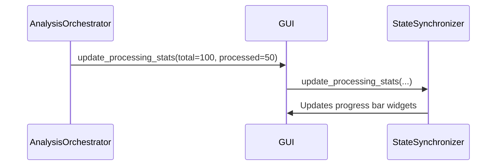
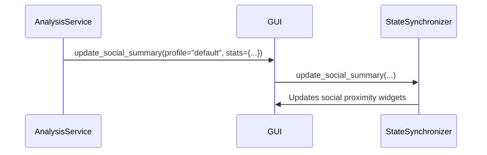
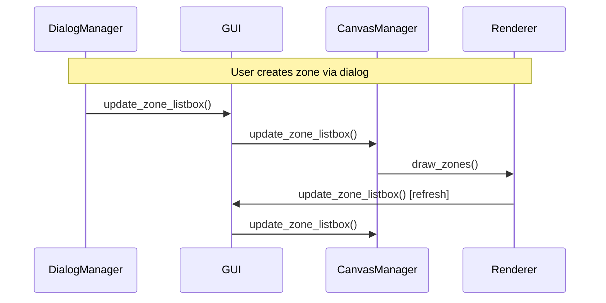
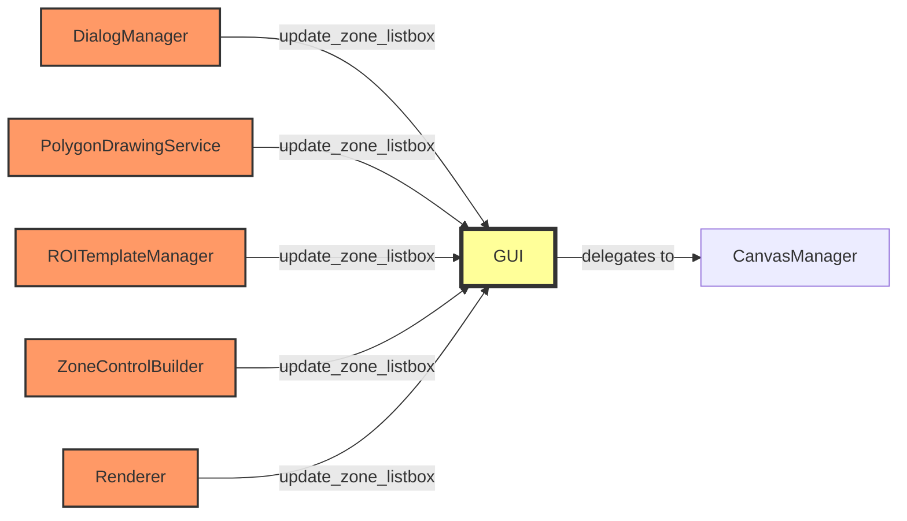

# GUI ↔ Components Dependency Diagram

**Version**: 3.0
**Last Updated**: 2025-01-22

---

## Architecture Overview

```mermaid
graph TB
    subgraph "External Callers"
        ORCH[Orchestrators]
        SERV[Services]
        DIALOG[Dialogs]
    end

    subgraph "GUI Class (Facade)"
        GUI[GUI<br/>2653 lines<br/>166 methods]
    end

    subgraph "UI Components"
        WF[WidgetFactory]
        TB[TabBuilder]
        CM[CanvasManager]
        ED[EventDispatcher]
        SS[StateSynchronizer]
        PVM[ProjectViewManager]
        DM[DialogManager]
        VM[ValidationManager]
        PDS[PolygonDrawingService]
        RTM[ROITemplateManager]
        ZCB[ZoneControlBuilder]
        RENDERER[Renderer]
    end

    subgraph "Data/State"
        STATE[StateManager]
        CTRL[Controller]
    end

    %% External → GUI calls
    ORCH -->|refresh_project_views| GUI
    ORCH -->|update_processing_stats| GUI
    SERV -->|update_social_summary| GUI
    SERV -->|show_external_trigger_notice| GUI
    SERV -->|clear_external_trigger_notice| GUI

    %% Component → GUI calls (BIDIRECTIONAL!)
    DM -->|update_zone_listbox| GUI
    DM -->|apply_pending_readiness_snapshot| GUI
    PDS -->|update_zone_listbox| GUI
    RTM -->|update_zone_listbox| GUI
    ZCB -->|_populate_video_selector_tree| GUI
    ZCB -->|update_zone_listbox| GUI
    RENDERER -->|update_zone_listbox| GUI
    CM -->|setup_interactive_polygon| GUI
    PVM -->|_populate_video_selector_tree| GUI
    PVM -->|_build_video_hierarchy_snapshot| GUI

    %% GUI → Component delegation
    GUI -->|delegates to| WF
    GUI -->|delegates to| TB
    GUI -->|delegates to| CM
    GUI -->|delegates to| ED
    GUI -->|delegates to| SS
    GUI -->|delegates to| PVM
    GUI -->|delegates to| DM
    GUI -->|delegates to| VM

    %% Component dependencies
    GUI -.->|creates| WF
    GUI -.->|creates| TB
    GUI -.->|creates| CM
    GUI -.->|creates| ED
    GUI -.->|creates| SS
    GUI -.->|creates| PVM
    GUI -.->|creates| DM
    GUI -.->|creates| VM

    GUI -->|accesses| STATE
    GUI -->|accesses| CTRL

    style GUI fill:#ff9,stroke:#333,stroke-width:4px
    style ORCH fill:#9cf,stroke:#333,stroke-width:2px
    style SERV fill:#9cf,stroke:#333,stroke-width:2px
    style DM fill:#f96,stroke:#333,stroke-width:2px
    style PVM fill:#f96,stroke:#333,stroke-width:2px
    style CM fill:#6f9,stroke:#333,stroke-width:2px
```



---

## Detailed Call Patterns

### Pattern 1: Orchestrators → GUI (One-Way)



**Characteristics**:
- ✅ Clean one-way dependency
- ✅ GUI acts as facade
- ✅ No callbacks to orchestrators

---

### Pattern 2: Services → GUI (One-Way)



**Characteristics**:
- ✅ Clean one-way dependency
- ✅ Services don't depend on GUI internals
- ✅ Stable API contract

---

### Pattern 3: Components → GUI → Components (⚠️ BIDIRECTIONAL)



**Characteristics**:
- ⚠️ **BIDIRECTIONAL** dependency
- ⚠️ Component calls GUI, GUI calls Component
- ⚠️ Can create circular call chains
- 📝 **Why it exists**: GUI acts as coordination hub

**Affected Components**:
- DialogManager (2 calls to GUI)
- PolygonDrawingService (1 call to GUI)
- ROITemplateManager (1 call to GUI)
- ZoneControlBuilder (3 calls to GUI)
- Renderer (1 call to GUI)

---

### Pattern 4: Multiple Components → Same GUI Method



**Analysis**:
- `update_zone_listbox()` is called by **5 different components**
- This demonstrates why it **CANNOT** be removed (breaking 5 callers)
- GUI acts as **central coordination point**

---

## Dependency Metrics

### GUI → Components (Delegation)

| Component | # of Delegations | Purpose |
|-----------|------------------|---------|
| ProjectViewManager | ~15 | Project overview, reports, video hierarchy |
| CanvasManager | ~5 | Zone rendering, polygon editing |
| StateSynchronizer | ~4 | Progress stats, social summary |
| EventDispatcher | ~2 | Event handling, single video analysis |
| DialogManager | ~2 | External triggers, zone reuse |
| ValidationManager | ~5 | Video metadata, readiness checks |
| WidgetFactory | ~3 | Widget creation |
| TabBuilder | ~3 | Tab creation |

**Total**: ~39 delegation points

---

### Components → GUI (Reverse Calls)

| Component | # of Calls to GUI | Methods Called |
|-----------|-------------------|----------------|
| **ZoneControlBuilder** | 3 | `_populate_video_selector_tree` (2x), `update_zone_listbox` |
| **ProjectViewManager** | 2 | `_populate_video_selector_tree`, `_build_video_hierarchy_snapshot` |
| **DialogManager** | 2 | `update_zone_listbox`, `apply_pending_readiness_snapshot` |
| **PolygonDrawingService** | 1 | `update_zone_listbox` |
| **ROITemplateManager** | 1 | `update_zone_listbox` |
| **Renderer** | 1 | `update_zone_listbox` |
| **CanvasManager** | 1 | `setup_interactive_polygon` |

**Total**: ~11 reverse calls from 7 components

---

## Architectural Issues

### Issue 1: Bidirectional Dependencies ⚠️

**Problem**: Components call GUI, GUI calls Components back
```
DialogManager → GUI.update_zone_listbox() → CanvasManager.update_zone_listbox() → Renderer → GUI.update_zone_listbox()
```

**Impact**:
- Makes dependency graph cyclic
- Hard to test in isolation
- Prevents true component separation

**Mitigation (Current)**:
- `@public_api` decorator documents stable interfaces
- Components depend on specific GUI methods only

**Future Solution** (v4.0):
- Introduce Mediator/Event Bus pattern
- Components emit events instead of calling GUI
- GUI subscribes to events and coordinates

---

### Issue 2: GUI as "God Object"

**Current State**:
- GUI has 166 methods, 2653 lines
- Acts as facade for 8+ components
- Central coordination hub

**Why It's Acceptable**:
- ✅ Delegations reduce cognitive load (thin wrappers)
- ✅ Stable public API (37 methods marked)
- ✅ Well-tested (98.5% tests passing)

**Future Evolution** (Optional):
- Extract coordination logic to separate `UICoordinator`
- GUI becomes pure view layer
- Coordinator handles inter-component communication

---

## Call Frequency Analysis

### Most Called Public APIs

| Method | # of Callers | Caller Types |
|--------|--------------|--------------|
| `update_zone_listbox()` | 5 | Components (DM, PDS, RTM, ZCB, Renderer) |
| `refresh_project_views()` | 3 | Orchestrators (Analysis, Project, VideoProcessing) |
| `_populate_video_selector_tree()` | 3 | Components (ZCBx2, PVM) |
| `update_processing_stats()` | 2 | Services (AnalysisService, VPOrchestrator) |
| `show_external_trigger_notice()` | 2 | Services (RecordingService, LiveCameraService) |

**Insight**: Top 5 methods account for 15 of ~37 public API calls.

---

## Recommended Refactoring (v4.0)

### Phase 1: Event-Driven Updates

Replace direct calls with event emissions:

**Before (v3.0)**:
```python
# In DialogManager
self.gui.update_zone_listbox()
```

**After (v4.0)**:
```python
# In DialogManager
self.event_bus.publish(Events.ZONES_UPDATED, zone_data=...)

# In GUI (subscriber)
def _on_zones_updated(self, zone_data):
    self.canvas_manager.update_zone_listbox(zone_data)
```

**Benefits**:
- ✅ Breaks bidirectional dependency
- ✅ Components don't need GUI reference
- ✅ Easier to test
- ⚠️ Requires significant refactoring

---

### Phase 2: Extract UICoordinator

Move coordination logic out of GUI:

```python
class UICoordinator:
    """Coordinates communication between UI components."""

    def __init__(self, gui, components):
        self.gui = gui
        self.components = components
        self.event_bus = EventBus()

    def handle_zone_updated(self, zone_data):
        # Coordinate UI updates across components
        self.components.canvas_manager.update_zone_listbox(zone_data)
        self.components.validation_manager.validate_zones(zone_data)
```

**Benefits**:
- ✅ GUI becomes pure view
- ✅ Testable coordination logic
- ✅ Single Responsibility Principle
- ⚠️ Major architecture change

---

## Dependency Health Score

| Metric | Current | Target (v4.0) |
|--------|---------|---------------|
| GUI → Component calls | 39 | 20 (reduce by 50%) |
| Component → GUI calls | 11 | 0 (eliminate via events) |
| Bidirectional deps | 7 components | 0 |
| GUI Lines of Code | 2653 | ~1500 |
| Public API surface | 37 methods | ~20 |

**Current Health**: 🟡 **ACCEPTABLE** (functional, but has architectural debt)
**Target Health**: 🟢 **EXCELLENT** (clean separation, event-driven)

---

## Conclusion

### Current Architecture (v3.0)
- GUI acts as **Facade** for UI components
- **Bidirectional** dependencies exist (7 components call GUI)
- **Stable** public API with `@public_api` markers
- **Functional** and well-tested (98.5% pass rate)

### Recommended Evolution (v4.0+)
1. Introduce **Event Bus** for component communication
2. Extract **UICoordinator** for inter-component logic
3. Reduce GUI to **pure view layer**
4. Eliminate **bidirectional dependencies**

**Status**: ✅ Current architecture is **production-ready** and **well-documented**

---

**References**:
- API Documentation: `docs/API_STABILITY.md`
- Wrapper Removal Report: `RELATORIO_REMOCAO_WRAPPERS_FINAL.md`
- GUI Source: `src/zebtrack/ui/gui.py` (2653 lines, 166 methods)
