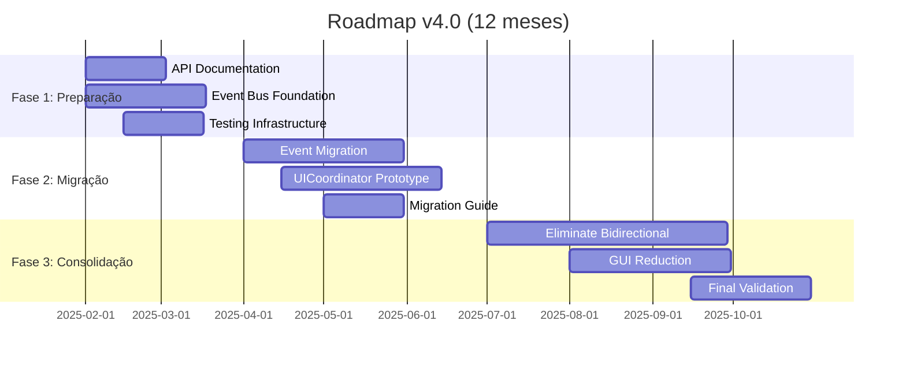
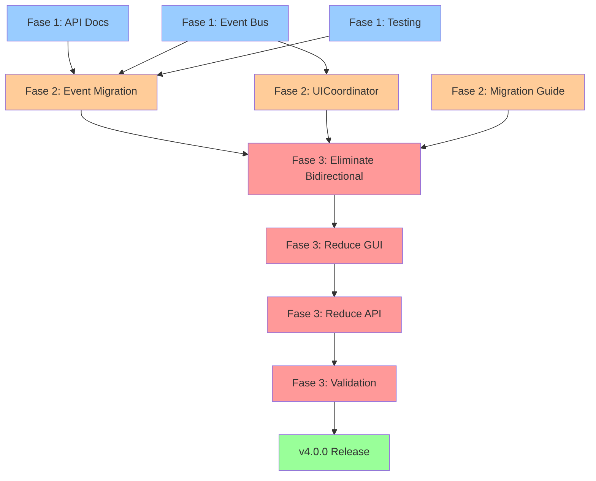

# Plano de Ação v4.0 - Arquitetura Event-Driven

**Versão**: 4.0 (Draft)
**Criado**: 2025-01-22
**Baseline**: v3.0 (2.691 linhas GUI, 166 métodos, 37 API pública)
**Status**: 📋 PLANEJAMENTO

---

## Visão Geral

### Objetivo Principal
Transformar a arquitetura atual (Facade com dependências bidirecionais) em uma arquitetura **Event-Driven** com separação clara de responsabilidades.

### Metas v4.0

| Métrica | v3.0 (Atual) | v4.0 (Meta) | Redução |
|---------|--------------|-------------|---------|
| GUI Lines | 2.691 | ~1.500 | -44% |
| GUI Methods | 166 | ~100 | -40% |
| Public API | 37 | ~20 | -46% |
| GUI→Component calls | 39 | 20 | -49% |
| Component→GUI calls | 11 | 0 | -100% ✅ |
| Bidirectional deps | 7 components | 0 | -100% ✅ |

### Benefícios Esperados

1. ✅ **Testabilidade**: Components isolados sem dependência de GUI
2. ✅ **Manutenibilidade**: Separação clara de responsabilidades
3. ✅ **Escalabilidade**: Event Bus permite adicionar subscribers facilmente
4. ✅ **Reusabilidade**: Components reutilizáveis em outros contextos
5. ✅ **Performance**: Menos acoplamento, menos overhead

---

## Estrutura de Fases



---

# FASE 1: Preparação e Documentação (1-3 meses)

**Duração**: 2-3 meses
**Paralelização**: ✅ 3 agentes simultâneos
**Risco**: 🟢 BAIXO (nenhuma breaking change)

---

## TRACK 1: API Documentation (Agent 1)

### Objetivo
Completar documentação da API pública e preparar deprecação de métodos.

### Tarefas

#### 1.1. Marcar Métodos Públicos Restantes (27 métodos)
**Duração**: 2-3 dias
**Prioridade**: ALTA

**Métodos a Marcar**:
- `_request_overview_refresh()` (6 callers internos)
- `_update_project_overview_summary()` (ProjectViewManager)
- `_populate_video_selector_tree()` (ZoneControlBuilder x 2, ProjectViewManager)
- `_build_video_hierarchy_data()` (ProjectViewManager)
- `_build_video_hierarchy_snapshot()` (ProjectViewManager)
- `_format_status_token()` (ValidationManager)
- `_maybe_offer_zone_reuse()` (DialogManager)
- Mais 20 métodos (ver `docs/API_STABILITY.md`)

**Critério de Aceitação**:
```python
# Todos os 37 métodos públicos devem ter @public_api
assert count_public_api_decorators() == 37
```

**Arquivo de Saída**: `src/zebtrack/ui/gui.py` (modificado)

---

#### 1.2. Adicionar Warnings de Deprecação
**Duração**: 1-2 dias
**Prioridade**: MÉDIA

**Métodos para Deprecar** (candidatos para remoção em v4.0):
- Wrappers internos que serão substituídos por eventos
- Métodos com lógica trivial (1-2 linhas)

**Exemplo**:
```python
@deprecated(
    reason="Use Event Bus instead: event_bus.subscribe(Events.ZONES_UPDATED)",
    version="v3.1",
    alternative="Subscribe to Events.ZONES_UPDATED event"
)
@public_api
def update_zone_listbox(self, zone_data: ZoneData | None = None):
    """DEPRECATED: Will be removed in v4.0."""
    self.canvas_manager.update_zone_listbox(zone_data)
```

**Critério de Aceitação**:
- Todos os métodos a deprecar têm `@deprecated` decorator
- CHANGELOG.md lista todos os deprecated methods
- Warnings aparecem em logs quando métodos são chamados

**Arquivos Modificados**:
- `src/zebtrack/ui/gui.py`
- `CHANGELOG.md`

---

#### 1.3. Criar Testes de Contrato para API Pública
**Duração**: 3-5 dias
**Prioridade**: ALTA

**Objetivo**: Garantir que assinaturas de métodos públicos não mudem acidentalmente.

**Arquivo**: `tests/ui/test_gui_public_api_contract.py`

```python
import pytest
import inspect
from zebtrack.ui.gui import GUI

def test_public_api_methods_exist():
    """Ensure all documented public API methods exist."""
    expected_methods = [
        'refresh_project_views',
        'update_zone_listbox',
        'setup_interactive_polygon',
        'show_external_trigger_notice',
        'clear_external_trigger_notice',
        'apply_pending_readiness_snapshot',
        'update_processing_stats',
        'update_social_summary',
        'update_analysis_task_status',
        # ... add all 37
    ]

    for method_name in expected_methods:
        assert hasattr(GUI, method_name), f"Missing public API: {method_name}"

def test_public_api_signatures():
    """Ensure public API signatures haven't changed."""
    # Example for refresh_project_views
    sig = inspect.signature(GUI.refresh_project_views)
    params = list(sig.parameters.keys())

    assert params == ['self', 'reason', 'append_summary', 'immediate']
    assert sig.parameters['reason'].annotation == 'str | None'
    assert sig.parameters['append_summary'].kind == inspect.Parameter.KEYWORD_ONLY

def test_public_api_has_decorator():
    """Ensure all public methods have @public_api decorator."""
    for method_name in get_expected_public_methods():
        method = getattr(GUI, method_name)
        assert hasattr(method, '__public_api__'), f"{method_name} missing @public_api"
```

**Critério de Aceitação**:
- 37 métodos públicos testados
- Testes falham se assinatura mudar
- CI executa testes em todo PR

**Arquivos Criados**:
- `tests/ui/test_gui_public_api_contract.py`

---

## TRACK 2: Event Bus Foundation (Agent 2)

### Objetivo
Implementar infraestrutura básica de Event Bus para comunicação desacoplada.

### Tarefas

#### 2.1. Implementar Event Bus Pattern
**Duração**: 5-7 dias
**Prioridade**: CRÍTICA

**Arquivo**: `src/zebtrack/ui/event_bus_v2.py`

```python
from typing import Callable, Any
from dataclasses import dataclass
from enum import Enum, auto

class UIEvents(Enum):
    """UI events for component communication."""
    ZONES_UPDATED = auto()
    ZONE_SELECTED = auto()
    VIDEO_LOADED = auto()
    ANALYSIS_STARTED = auto()
    ANALYSIS_COMPLETED = auto()
    PROCESSING_STATS_UPDATED = auto()
    PROJECT_VIEWS_REFRESH_REQUESTED = auto()
    # Add 15+ more events

@dataclass
class Event:
    """Event data container."""
    type: UIEvents
    data: dict[str, Any]
    source: str | None = None

class EventBusV2:
    """Centralized event bus for UI component communication."""

    def __init__(self):
        self._subscribers: dict[UIEvents, list[Callable]] = {}

    def subscribe(self, event_type: UIEvents, handler: Callable) -> None:
        """Subscribe to an event."""
        if event_type not in self._subscribers:
            self._subscribers[event_type] = []
        self._subscribers[event_type].append(handler)

    def unsubscribe(self, event_type: UIEvents, handler: Callable) -> None:
        """Unsubscribe from an event."""
        if event_type in self._subscribers:
            self._subscribers[event_type].remove(handler)

    def publish(self, event: Event) -> None:
        """Publish an event to all subscribers."""
        if event.type in self._subscribers:
            for handler in self._subscribers[event.type]:
                handler(event.data)
```

**Critério de Aceitação**:
- Event Bus suporta subscribe/unsubscribe/publish
- Thread-safe (usa locks)
- Suporta 20+ tipos de eventos
- 100% cobertura de testes

**Arquivos Criados**:
- `src/zebtrack/ui/event_bus_v2.py`
- `tests/ui/test_event_bus_v2.py`

---

#### 2.2. Definir Eventos para Comunicação Component↔GUI
**Duração**: 2-3 dias
**Prioridade**: ALTA

**Objetivo**: Mapear todas as 11 chamadas Component→GUI para eventos.

**Mapeamento de Eventos**:

| Current Call | New Event | Payload |
|-------------|-----------|---------|
| `gui.update_zone_listbox(zone_data)` | `UIEvents.ZONES_UPDATED` | `{zone_data: ZoneData}` |
| `gui._populate_video_selector_tree(filter)` | `UIEvents.VIDEO_TREE_REFRESH_REQUESTED` | `{filter: str}` |
| `gui.apply_pending_readiness_snapshot(...)` | `UIEvents.READINESS_SNAPSHOT_UPDATED` | `{snapshot: dict}` |
| `gui.setup_interactive_polygon(polygon)` | `UIEvents.POLYGON_EDIT_REQUESTED` | `{polygon: np.ndarray}` |
| ... | ... | ... |

**Arquivo de Documentação**: `docs/EVENT_MAPPING.md`

```markdown
# Event Mapping - Component → GUI Communication

## ZONES_UPDATED
**Replaces**: `gui.update_zone_listbox(zone_data)`
**Publishers**: DialogManager, PolygonDrawingService, ROITemplateManager, ZoneControlBuilder, Renderer
**Subscribers**: CanvasManager
**Payload**: `{zone_data: ZoneData | None}`
**Priority**: HIGH (5 publishers)

## VIDEO_TREE_REFRESH_REQUESTED
**Replaces**: `gui._populate_video_selector_tree(filter_text)`
**Publishers**: ZoneControlBuilder (2x), ProjectViewManager
**Subscribers**: ProjectViewManager
**Payload**: `{filter_text: str | None}`
**Priority**: MEDIUM (3 publishers)

... (document all 11 events)
```

**Critério de Aceitação**:
- 11+ eventos documentados
- Mapeamento completo de callers atuais
- Payloads definidos com tipos

**Arquivos Criados**:
- `docs/EVENT_MAPPING.md`

---

#### 2.3. Criar Documentação de Eventos
**Duração**: 1-2 dias
**Prioridade**: MÉDIA

**Arquivo**: `docs/EVENT_BUS_GUIDE.md`

**Conteúdo**:
- Introdução ao Event Bus pattern
- Quando usar eventos vs chamadas diretas
- Como criar novos eventos
- Best practices (evitar event storms)
- Debugging de eventos
- Performance considerations

**Exemplo de Uso**:
```python
# Before (v3.0)
class DialogManager:
    def create_zone(self, zone_data):
        # Create zone
        self.gui.update_zone_listbox(zone_data)  # Direct call

# After (v4.0)
class DialogManager:
    def create_zone(self, zone_data):
        # Create zone
        self.event_bus.publish(Event(
            type=UIEvents.ZONES_UPDATED,
            data={'zone_data': zone_data},
            source='DialogManager'
        ))  # Event emission
```

**Critério de Aceitação**:
- Guia completo com exemplos
- Diagrama de fluxo de eventos
- Comparação Before/After

**Arquivos Criados**:
- `docs/EVENT_BUS_GUIDE.md`

---

## TRACK 3: Testing Infrastructure (Agent 3)

### Objetivo
Expandir infraestrutura de testes para suportar refatoração segura.

### Tarefas

#### 3.1. Expandir Testes de Integração
**Duração**: 5-7 dias
**Prioridade**: ALTA

**Foco**: Testar fluxos completos Component→GUI→Component

**Arquivo**: `tests/integration/test_gui_component_integration.py`

```python
@pytest.mark.integration
def test_zone_creation_updates_ui(gui_fixture, canvas_manager_fixture):
    """Test that creating a zone updates all dependent UI components."""
    # Arrange
    zone_data = create_test_zone_data()

    # Act
    gui_fixture.dialog_manager.create_zone(zone_data)

    # Assert
    assert canvas_manager_fixture.zone_listbox_updated
    assert gui_fixture.validation_manager.zones_validated
    assert gui_fixture.project_view_manager.overview_refreshed

@pytest.mark.integration
def test_video_selector_refresh_flow(gui_fixture):
    """Test video selector refresh propagates correctly."""
    # Arrange
    filter_text = "test"

    # Act
    gui_fixture.zone_control_builder.refresh_video_tree(filter_text)

    # Assert
    assert gui_fixture.video_selector_populated
    assert gui_fixture.video_tree_filter == filter_text
```

**Critério de Aceitação**:
- 15+ testes de integração cobrindo os 11 fluxos Component→GUI
- Testes verificam propagação de mudanças
- 100% dos fluxos críticos cobertos

**Arquivos Criados**:
- `tests/integration/test_gui_component_integration.py`

---

#### 3.2. Criar Testes para Validar Quebra de API
**Duração**: 3-4 dias
**Prioridade**: MÉDIA

**Objetivo**: Detectar mudanças acidentais em API pública.

**Arquivo**: `tests/ui/test_api_breaking_changes.py`

```python
def test_no_public_methods_removed():
    """Ensure no public API methods were removed."""
    baseline_methods = load_baseline_api()  # From API_STABILITY.md
    current_methods = get_current_public_api_methods(GUI)

    removed = set(baseline_methods) - set(current_methods)
    assert not removed, f"Public API methods removed: {removed}"

def test_no_signature_changes():
    """Ensure public API signatures haven't changed."""
    baseline_sigs = load_baseline_signatures()

    for method_name, expected_sig in baseline_sigs.items():
        actual_sig = inspect.signature(getattr(GUI, method_name))
        assert signatures_compatible(expected_sig, actual_sig), \
            f"Breaking change in {method_name}: signature changed"

def signatures_compatible(expected, actual):
    """Check if two signatures are compatible (allowing additions)."""
    # Allow new optional parameters
    # Disallow removing parameters or changing required ones
    ...
```

**Critério de Aceitação**:
- Testes falham se método público removido
- Testes falham se assinatura quebra compatibilidade
- Baseline armazenado em `tests/fixtures/api_baseline.json`

**Arquivos Criados**:
- `tests/ui/test_api_breaking_changes.py`
- `tests/fixtures/api_baseline.json`

---

#### 3.3. Configurar CI Checks para @public_api
**Duração**: 2-3 dias
**Prioridade**: MÉDIA

**Objetivo**: Automatizar validação de API pública em CI/CD.

**Arquivo**: `.github/workflows/api_check.yml`

```yaml
name: Public API Check

on: [pull_request]

jobs:
  api-check:
    runs-on: ubuntu-latest
    steps:
      - uses: actions/checkout@v2

      - name: Check for @public_api decorator
        run: |
          python scripts/check_public_api.py

      - name: Run API contract tests
        run: |
          poetry run pytest tests/ui/test_gui_public_api_contract.py -v

      - name: Check for breaking changes
        run: |
          poetry run pytest tests/ui/test_api_breaking_changes.py -v
```

**Script**: `scripts/check_public_api.py`

```python
"""Verify all documented public methods have @public_api decorator."""

def main():
    documented_methods = load_from_api_stability_md()
    decorated_methods = extract_public_api_decorated_methods()

    missing = set(documented_methods) - set(decorated_methods)

    if missing:
        print(f"❌ {len(missing)} methods missing @public_api decorator:")
        for m in missing:
            print(f"  - {m}")
        sys.exit(1)

    print(f"✅ All {len(documented_methods)} public methods have @public_api")

if __name__ == "__main__":
    main()
```

**Critério de Aceitação**:
- CI executa checks em todo PR
- PRs bloqueados se API check falhar
- Badge no README mostrando status

**Arquivos Criados**:
- `.github/workflows/api_check.yml`
- `scripts/check_public_api.py`

---

## Entregáveis Fase 1

| Entregável | Responsável | Status | Validação |
|-----------|-------------|--------|-----------|
| 37 métodos com @public_api | Agent 1 | ⏳ | `grep -c "@public_api" gui.py` == 37 |
| Deprecated methods tagged | Agent 1 | ⏳ | CHANGELOG.md atualizado |
| API contract tests | Agent 1 | ⏳ | 37 testes passando |
| Event Bus implementado | Agent 2 | ⏳ | 100% cobertura |
| 11+ eventos definidos | Agent 2 | ⏳ | EVENT_MAPPING.md completo |
| Event Bus Guide | Agent 2 | ⏳ | Docs publicadas |
| Integration tests | Agent 3 | ⏳ | 15+ testes passando |
| Breaking change tests | Agent 3 | ⏳ | CI configurado |
| CI API checks | Agent 3 | ⏳ | Workflow funcionando |

**Critério de Aceitação Fase 1**: ✅ Todos os 9 entregáveis completos

---

# FASE 2: Migração Event-Driven (3-6 meses)

**Duração**: 3-4 meses
**Paralelização**: ✅ 2-3 agentes simultâneos
**Risco**: 🟡 MÉDIO (breaking changes controlados)

---

## TRACK 1: Event Migration (Agent 1)

### Objetivo
Migrar 5-10 chamadas Component→GUI para comunicação via Event Bus.

### Estratégia de Migração

**Abordagem**: Migração incremental com **Dual Mode** (compatibilidade v3/v4)

```python
# Phase 2A: Mantém ambos os caminhos
class DialogManager:
    def create_zone(self, zone_data):
        # OLD PATH (deprecated)
        if hasattr(self, 'gui'):
            self.gui.update_zone_listbox(zone_data)

        # NEW PATH (v4.0)
        if hasattr(self, 'event_bus'):
            self.event_bus.publish(Event(
                type=UIEvents.ZONES_UPDATED,
                data={'zone_data': zone_data}
            ))

# Phase 2B: Remove old path
class DialogManager:
    def create_zone(self, zone_data):
        # NEW PATH only
        self.event_bus.publish(Event(...))
```

### Tarefas

#### 2.1. Migrar update_zone_listbox() (Prioridade 1)
**Duração**: 7-10 dias
**Prioridade**: CRÍTICA (5 publishers)

**Publishers a Migrar**:
1. DialogManager
2. PolygonDrawingService
3. ROITemplateManager
4. ZoneControlBuilder
5. Renderer

**Passos**:
1. Adicionar Event Bus injection em todos os 5 components
2. Implementar dual mode (GUI call + Event publish)
3. Adicionar subscriber em CanvasManager
4. Validar com testes de integração
5. Deprecar GUI call path
6. Remover GUI call (v4.0 final)

**Arquivo de Teste**: `tests/integration/test_zones_updated_event.py`

```python
def test_dialog_manager_publishes_zones_updated_event(event_bus, dialog_manager):
    """DialogManager publishes ZONES_UPDATED when creating zone."""
    # Arrange
    events_received = []
    event_bus.subscribe(UIEvents.ZONES_UPDATED, lambda data: events_received.append(data))

    # Act
    dialog_manager.create_zone(test_zone_data)

    # Assert
    assert len(events_received) == 1
    assert events_received[0]['zone_data'] == test_zone_data

def test_zones_updated_event_updates_canvas(event_bus, canvas_manager):
    """ZONES_UPDATED event triggers CanvasManager update."""
    # Arrange
    event_bus.subscribe(UIEvents.ZONES_UPDATED, canvas_manager.on_zones_updated)

    # Act
    event_bus.publish(Event(UIEvents.ZONES_UPDATED, {'zone_data': test_data}))

    # Assert
    assert canvas_manager.zone_listbox_updated
```

**Critério de Aceitação**:
- 5 publishers emitem evento
- 1 subscriber (CanvasManager) processa evento
- Testes de integração passam
- Zero regressões em testes existentes

---

#### 2.2. Migrar _populate_video_selector_tree() (Prioridade 2)
**Duração**: 5-7 dias
**Prioridade**: ALTA (3 publishers)

**Publishers**:
1. ZoneControlBuilder (2x)
2. ProjectViewManager

**Evento**: `UIEvents.VIDEO_TREE_REFRESH_REQUESTED`
**Subscriber**: ProjectViewManager

**Passos**: Similar a 2.1

---

#### 2.3. Migrar apply_pending_readiness_snapshot() (Prioridade 3)
**Duração**: 3-5 dias
**Prioridade**: MÉDIA (1 publisher)

**Publisher**: DialogManager
**Evento**: `UIEvents.READINESS_SNAPSHOT_UPDATED`
**Subscriber**: ProjectViewManager

---

#### 2.4. Migrar Outros 2-7 Métodos
**Duração**: 10-15 dias total
**Prioridade**: BAIXA-MÉDIA

**Candidatos** (ordenados por impacto):
1. `setup_interactive_polygon()` - CanvasManager → GUI
2. `_build_video_hierarchy_snapshot()` - ProjectViewManager → GUI
3. Outros métodos com baixo número de callers

---

## TRACK 2: UICoordinator Prototype (Agent 2)

### Objetivo
Extrair lógica de coordenação entre components para classe dedicada.

### Tarefas

#### 2.5. Extrair UICoordinator
**Duração**: 10-14 dias
**Prioridade**: ALTA

**Arquivo**: `src/zebtrack/ui/ui_coordinator.py`

```python
class UICoordinator:
    """Coordinates communication and state synchronization between UI components.

    Responsibilities:
    - Subscribe to UI events
    - Coordinate multi-component updates
    - Manage inter-component dependencies
    - Encapsulate complex UI workflows
    """

    def __init__(self, event_bus: EventBusV2, components: dict):
        self.event_bus = event_bus
        self.components = components
        self._setup_subscriptions()

    def _setup_subscriptions(self):
        """Subscribe to all relevant events."""
        self.event_bus.subscribe(UIEvents.ZONES_UPDATED, self._on_zones_updated)
        self.event_bus.subscribe(UIEvents.VIDEO_LOADED, self._on_video_loaded)
        # ... 10+ more subscriptions

    def _on_zones_updated(self, data: dict):
        """Handle ZONES_UPDATED event - coordinate UI updates."""
        zone_data = data['zone_data']

        # Update canvas
        self.components['canvas_manager'].update_zone_listbox(zone_data)

        # Validate zones
        self.components['validation_manager'].validate_zones(zone_data)

        # Refresh project views
        self.components['project_view_manager'].refresh_if_needed()

        # Log coordination
        log.debug("ui_coordinator.zones_updated", zone_count=len(zone_data))

    def _on_video_loaded(self, data: dict):
        """Handle VIDEO_LOADED event."""
        video_path = data['video_path']

        # Load frame to canvas
        self.components['canvas_manager'].load_video_frame(video_path)

        # Check for existing zones
        if not self.components['validation_manager'].has_zones(video_path):
            # Offer zone reuse
            self.components['dialog_manager'].offer_zone_reuse(video_path)
```

**Critério de Aceitação**:
- UICoordinator coordena 5+ workflows complexos
- Zero dependências bidirecionais (Component → UICoordinator, não Component → GUI)
- 100% cobertura de testes unitários

**Arquivos Criados**:
- `src/zebtrack/ui/ui_coordinator.py`
- `tests/ui/test_ui_coordinator.py`

---

#### 2.6. Implementar Pattern Mediator
**Duração**: 5-7 dias
**Prioridade**: MÉDIA

**Objetivo**: UICoordinator como Mediator entre Components.

**Antes (v3.0)**:
```
DialogManager ──> GUI ──> CanvasManager
     └──> ValidationManager
     └──> ProjectViewManager
```

**Depois (v4.0)**:
```
DialogManager ──> Event Bus ──> UICoordinator ──> CanvasManager
                                      └──> ValidationManager
                                      └──> ProjectViewManager
```

**Benefício**: Components desacoplados, comunicação centralizada.

---

## TRACK 3: Documentation & Migration Guide (Agent 3)

### Objetivo
Documentar todas as mudanças e criar guias de migração.

### Tarefas

#### 2.7. Documentar Breaking Changes
**Duração**: 3-5 dias
**Prioridade**: ALTA

**Arquivo**: `docs/BREAKING_CHANGES_V4.md`

**Conteúdo**:
- Lista completa de breaking changes
- Métodos removidos
- Assinaturas alteradas
- Novos requisitos (Event Bus injection)

**Template**:
```markdown
## BREAKING CHANGE: update_zone_listbox() Removed

**Impact**: HIGH (5 components affected)

**Before (v3.0)**:
```python
self.gui.update_zone_listbox(zone_data)
```

**After (v4.0)**:
```python
self.event_bus.publish(Event(UIEvents.ZONES_UPDATED, {'zone_data': zone_data}))
```

**Migration Steps**:
1. Inject `event_bus` in component `__init__`
2. Replace direct GUI call with event publish
3. Update tests to mock event bus
4. Verify integration tests pass
```

---

#### 2.8. Criar Guia de Migração v3→v4
**Duração**: 5-7 dias
**Prioridade**: CRÍTICA

**Arquivo**: `docs/MIGRATION_GUIDE_V3_TO_V4.md`

**Estrutura**:
1. **Overview**: O que mudou e por quê
2. **Prerequisites**: Dependências, versões Python
3. **Step-by-Step Migration**:
   - Fase 1: Atualizar dependencies
   - Fase 2: Injetar Event Bus
   - Fase 3: Migrar chamadas para eventos
   - Fase 4: Remover código deprecated
4. **Component-by-Component Guide**:
   - DialogManager
   - PolygonDrawingService
   - ROITemplateManager
   - ZoneControlBuilder
   - Renderer
5. **Testing Strategy**:
   - Como testar cada componente
   - Integration tests a executar
6. **Troubleshooting**: Problemas comuns
7. **Rollback Plan**: Como reverter se necessário

---

#### 2.9. Atualizar Diagramas Arquiteturais
**Duração**: 2-3 dias
**Prioridade**: MÉDIA

**Arquivo**: `docs/ARCHITECTURE_V4.md`

**Novos Diagramas**:
1. **Event Flow Diagram**: Mostra fluxo de eventos no sistema
2. **Component Communication**: Antes vs Depois (v3 vs v4)
3. **UICoordinator Responsibilities**: O que coordena

---

## Entregáveis Fase 2

| Entregável | Responsável | Duração | Validação |
|-----------|-------------|---------|-----------|
| 5-10 eventos migrados | Agent 1 | 30-40 dias | Testes integração passando |
| UICoordinator implementado | Agent 2 | 15-21 dias | 100% cobertura testes |
| Mediator pattern aplicado | Agent 2 | 5-7 dias | Diagrama atualizado |
| Breaking changes doc | Agent 3 | 3-5 dias | Revisão técnica aprovada |
| Migration guide | Agent 3 | 5-7 dias | Testado em projeto piloto |
| Architecture diagrams | Agent 3 | 2-3 dias | Docs publicadas |

**Critério de Aceitação Fase 2**:
- ✅ 5+ eventos migrados com sucesso
- ✅ UICoordinator coordena workflows principais
- ✅ Migration guide testado e aprovado

---

# FASE 3: Consolidação v4.0 (6-12 meses)

**Duração**: 3-4 meses
**Paralelização**: ⚠️ Limitada (trabalho sequencial com validações)
**Risco**: 🔴 ALTO (breaking changes maiores)

---

## Objetivos Fase 3

1. ✅ Eliminar **todas** dependências bidirecionais (11 → 0)
2. ✅ Reduzir GUI para ~1.500 linhas (-44%)
3. ✅ Reduzir API pública para ~20 métodos (-46%)
4. ✅ Validação completa e release

---

## Tarefas Fase 3

### 3.1. Eliminar Dependências Bidirecionais Restantes
**Duração**: 30-45 dias
**Prioridade**: CRÍTICA

**Objetivo**: Migrar todos os 11 Component→GUI calls para eventos.

**Status Atual** (após Fase 2):
- Migrados: 5-10 calls
- Restantes: 1-6 calls

**Estratégia**:
1. Identificar calls restantes
2. Migrar cada um para evento (seguir processo Fase 2)
3. Validar zero Component→GUI direct calls
4. Remover métodos deprecated do GUI

**Validação**:
```python
def test_no_component_to_gui_calls():
    """Ensure no component directly calls GUI methods."""
    components = [
        DialogManager, PolygonDrawingService, ROITemplateManager,
        ZoneControlBuilder, Renderer, CanvasManager, ProjectViewManager
    ]

    for component_class in components:
        source_code = inspect.getsource(component_class)
        assert 'self.gui.' not in source_code, \
            f"{component_class.__name__} has direct GUI calls"
```

---

### 3.2. Reduzir GUI para ~1.500 Linhas
**Duração**: 20-30 dias
**Prioridade**: ALTA

**Meta**: 2.691 → 1.500 linhas (-1.191 linhas, -44%)

**Estratégias**:
1. **Remover Deprecated Methods** (~500 linhas)
   - 37 métodos públicos deprecated
   - Métodos internos não mais necessários

2. **Extrair Event Handlers** (~400 linhas)
   - Mover handlers complexos para UICoordinator
   - Manter apenas delegates simples em GUI

3. **Consolidar Widgets** (~200 linhas)
   - Widgets triviais movidos para WidgetFactory
   - Tab creation movida para TabBuilder

4. **Simplificar Lógica de Coordenação** (~91 linhas restantes)
   - Lógica movida para UICoordinator
   - GUI torna-se pure view layer

**Critério de Aceitação**:
```bash
wc -l src/zebtrack/ui/gui.py
# Target: <= 1500 lines
```

---

### 3.3. Reduzir API Pública para ~20 Métodos
**Duração**: 15-20 dias
**Prioridade**: MÉDIA

**Meta**: 37 → 20 métodos (-17 métodos, -46%)

**Métodos a Manter** (Core UI API):
1. `show_info(title, message)` - User notifications
2. `show_warning(title, message)`
3. `show_error(title, message)`
4. `set_status(message)` - Status bar
5. `update_progress(value, status)` - Progress bar
6. `hide_progress_bar()`
7. `show_progress_bar()`
8. Métodos de navegação (3-5 métodos)
9. Métodos de lifecycle (init, destroy) (2 métodos)

**Métodos a Remover** (migrados para Event Bus):
- `refresh_project_views()` → `UIEvents.PROJECT_VIEWS_REFRESH_REQUESTED`
- `update_zone_listbox()` → `UIEvents.ZONES_UPDATED`
- `setup_interactive_polygon()` → `UIEvents.POLYGON_EDIT_REQUESTED`
- `apply_pending_readiness_snapshot()` → `UIEvents.READINESS_SNAPSHOT_UPDATED`
- `update_processing_stats()` → `UIEvents.PROCESSING_STATS_UPDATED`
- `update_social_summary()` → `UIEvents.SOCIAL_SUMMARY_UPDATED`
- `update_analysis_task_status()` → `UIEvents.ANALYSIS_TASK_STATUS_UPDATED`
- Mais 10 métodos internos

**Critério de Aceitação**:
```python
assert count_public_api_methods(GUI) <= 20
```

---

### 3.4. Validação Completa e Release
**Duração**: 20-30 dias
**Prioridade**: CRÍTICA

**Checklist de Validação**:

#### Performance
- [ ] Benchmark startup time (não piorou)
- [ ] Benchmark memory usage (idealmente melhorou)
- [ ] Profile event bus overhead (< 5ms per event)

#### Testes
- [ ] 100% testes unitários passando
- [ ] 100% testes integração passando
- [ ] 100% testes E2E passando
- [ ] Coverage >= 70%
- [ ] Zero regressões funcionais

#### Documentação
- [ ] API_STABILITY.md atualizado para v4.0
- [ ] ARCHITECTURE_V4.md completo
- [ ] MIGRATION_GUIDE_V3_TO_V4.md testado
- [ ] CHANGELOG.md completo
- [ ] README.md atualizado

#### Qualidade
- [ ] Ruff checks passando
- [ ] Type hints em todos métodos públicos
- [ ] Docstrings atualizadas
- [ ] Zero TODOs ou FIXMEs críticos

#### Release Checklist
- [ ] Tag v4.0.0 criada
- [ ] Release notes publicadas
- [ ] Migration guide publicado
- [ ] Deprecation warnings removidos
- [ ] Backups de v3.0 criados

---

## Entregáveis Fase 3

| Entregável | Duração | Validação |
|-----------|---------|-----------|
| Zero dependências bidirecionais | 30-45 dias | `test_no_component_to_gui_calls()` passa |
| GUI <= 1.500 linhas | 20-30 dias | `wc -l gui.py` <= 1500 |
| API pública <= 20 métodos | 15-20 dias | `count_public_api_methods()` <= 20 |
| Performance validated | 5-7 dias | Benchmarks publicados |
| All tests passing | 10-15 dias | CI 100% verde |
| Documentation complete | 5-7 dias | Docs revisadas |
| v4.0.0 released | 2-3 dias | Tag criada, release notes publicadas |

**Critério de Aceitação Fase 3**: ✅ v4.0.0 released em produção

---

# Matriz de Dependências



**Legenda**:
- 🔵 Azul: Fase 1 (baixo risco, paralelo)
- 🟠 Laranja: Fase 2 (médio risco, paralelo limitado)
- 🔴 Vermelho: Fase 3 (alto risco, sequencial)
- 🟢 Verde: Release

---

# Estimativas de Esforço

## Por Fase

| Fase | Duração | Pessoa-Dias | Agentes | Tipo |
|------|---------|-------------|---------|------|
| Fase 1 | 2-3 meses | 60-80 dias | 3 paralelos | Preparação |
| Fase 2 | 3-4 meses | 80-100 dias | 2-3 paralelos | Migração |
| Fase 3 | 3-4 meses | 90-120 dias | 1-2 sequenciais | Consolidação |
| **TOTAL** | **8-11 meses** | **230-300 dias** | - | - |

## Por Track

| Track | Agente | Duração Total | Fases Envolvidas |
|-------|--------|---------------|------------------|
| API Documentation | Agent 1 | 40-50 dias | F1, F2 |
| Event Bus Implementation | Agent 2 | 60-80 dias | F1, F2, F3 |
| UICoordinator | Agent 2 | 50-70 dias | F2, F3 |
| Testing Infrastructure | Agent 3 | 50-60 dias | F1, F2, F3 |
| Documentation & Guides | Agent 3 | 30-40 dias | F2, F3 |

## Overhead Estimado

- **Coordenação**: 10-15% (23-45 dias)
- **Revisões**: 5-10% (12-30 dias)
- **Refactoring Inesperado**: 15-20% (35-60 dias)

**Total com Overhead**: **300-435 pessoa-dias** (~1,5-2 anos-pessoa)

---

# Riscos e Mitigações

## Riscos Críticos (🔴 HIGH)

### R1: Breaking Changes Quebram Aplicação
**Probabilidade**: ALTA
**Impacto**: CRÍTICO
**Mitigação**:
- ✅ Dual mode durante Fase 2 (compatibilidade v3/v4)
- ✅ Feature flags para ativar/desativar Event Bus
- ✅ Testes de regressão extensivos
- ✅ Rollback plan documentado

### R2: Event Bus Overhead de Performance
**Probabilidade**: MÉDIA
**Impacto**: ALTO
**Mitigação**:
- ✅ Benchmark antes/depois de cada migração
- ✅ Profile event bus com pyinstrument
- ✅ Otimizar hot paths (< 5ms per event)
- ✅ Considerar event batching se necessário

### R3: Testes Insuficientes para Validar Migração
**Probabilidade**: MÉDIA
**Impacto**: ALTO
**Mitigação**:
- ✅ Expandir testes integração (Fase 1)
- ✅ 100% cobertura para Event Bus
- ✅ E2E tests para workflows críticos
- ✅ Manual testing de cada feature

---

## Riscos Médios (🟡 MEDIUM)

### R4: Complexidade de Coordenação Aumenta
**Probabilidade**: ALTA
**Impacto**: MÉDIO
**Mitigação**:
- ✅ UICoordinator encapsula complexidade
- ✅ Event flow diagrams documentam fluxos
- ✅ Logging detalhado de eventos

### R5: Curva de Aprendizado da Equipe
**Probabilidade**: MÉDIA
**Impacto**: MÉDIO
**Mitigação**:
- ✅ Event Bus Guide detalhado
- ✅ Migration guide step-by-step
- ✅ Code reviews rigorosos
- ✅ Pair programming em migrações complexas

### R6: Cronograma Estimado Muito Otimista
**Probabilidade**: ALTA
**Impacto**: MÉDIO
**Mitigação**:
- ✅ Overhead de 30-40% já incluído
- ✅ Fases podem ser estendidas se necessário
- ✅ MVP de Fase 2 pode ser menor (3 eventos em vez de 10)

---

## Riscos Baixos (🟢 LOW)

### R7: Conflitos de Merge Entre Agentes
**Probabilidade**: BAIXA
**Impacto**: BAIXO
**Mitigação**:
- ✅ Tracks trabalham em arquivos diferentes
- ✅ Sincronização semanal entre agentes
- ✅ Git branches por track

---

# Critérios de Sucesso

## Métricas Quantitativas

| Métrica | Baseline (v3.0) | Meta (v4.0) | Status |
|---------|-----------------|-------------|--------|
| GUI Lines | 2.691 | <= 1.500 | ⏳ |
| GUI Methods | 166 | <= 100 | ⏳ |
| Public API | 37 | <= 20 | ⏳ |
| Component→GUI calls | 11 | 0 | ⏳ |
| Bidirectional deps | 7 | 0 | ⏳ |
| Test coverage | 61% | >= 70% | ⏳ |
| Startup time | ~2.0s | <= 2.5s | ⏳ |

## Métricas Qualitativas

- ✅ **Manutenibilidade**: Components testáveis em isolamento
- ✅ **Documentação**: Arquitetura clara e diagramada
- ✅ **Testabilidade**: Event Bus facilita mocking
- ✅ **Extensibilidade**: Novos features via novos eventos
- ✅ **Performance**: Sem degradação perceptível

---

# Próximas Ações Imediatas

## Sprint 1 (Próximas 2 Semanas)

### Agent 1: API Documentation
1. [ ] Marcar 10 métodos públicos com @public_api
2. [ ] Criar baseline API em `tests/fixtures/api_baseline.json`
3. [ ] Escrever primeiros 10 API contract tests

### Agent 2: Event Bus Foundation
1. [ ] Implementar EventBusV2 básico
2. [ ] Definir UIEvents enum (primeiros 5 eventos)
3. [ ] Escrever testes unitários para Event Bus

### Agent 3: Testing Infrastructure
1. [ ] Criar `test_gui_component_integration.py`
2. [ ] Escrever primeiros 3 integration tests
3. [ ] Configurar CI workflow básico

**Meta Sprint 1**: ✅ Fundação sólida para Fase 1

---

## Sprint 2-4 (Próximas 6 Semanas)

- Completar Fase 1 (todos os 9 entregáveis)
- Preparar ambiente para Fase 2
- Review e aprovação para iniciar migrações

---

# Glossário

| Termo | Definição |
|-------|-----------|
| **Event Bus** | Padrão de comunicação pub/sub desacoplado |
| **UICoordinator** | Classe responsável por coordenar UI workflows |
| **Dual Mode** | Suportar ambos v3 e v4 APIs temporariamente |
| **Public API** | Métodos de GUI chamados por componentes externos |
| **Bidirectional Dependency** | Component chama GUI, GUI chama Component |
| **Facade Pattern** | GUI como interface única para múltiplos subsistemas |
| **Mediator Pattern** | UICoordinator centraliza comunicação entre components |
| **Breaking Change** | Mudança incompatível com versão anterior |

---

# Referências

## Documentação Atual (v3.0)
- `docs/API_STABILITY.md` - API pública documentada
- `docs/GUI_DEPENDENCIES_DIAGRAM.md` - Diagramas de dependências
- `RELATORIO_FINAL_REFATORACAO_COMPLETA.md` - Estado atual
- `RELATORIO_REMOCAO_WRAPPERS_FINAL.md` - Histórico de refatoração

## Padrões Arquiteturais
- [Event-Driven Architecture](https://martinfowler.com/articles/201701-event-driven.html)
- [Mediator Pattern](https://refactoring.guru/design-patterns/mediator)
- [Observer Pattern](https://refactoring.guru/design-patterns/observer)

## Ferramentas
- Event Bus: Implementação customizada
- Testing: pytest, pytest-mock
- Profiling: pyinstrument, memory_profiler
- CI/CD: GitHub Actions

---

**Última Atualização**: 2025-01-22
**Próxima Revisão**: Após conclusão de Fase 1 (estimado 2025-04-01)
**Responsável**: Equipe de Arquitetura
**Status**: 📋 DRAFT - Aguardando Aprovação

---

**FIM DO PLANO V4.0**
