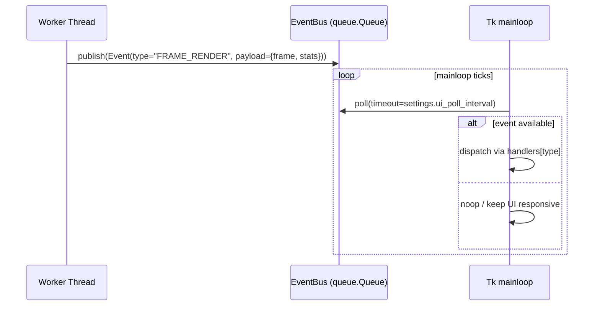

# Controller ↔ GUI Integration Audit & Event Queue Plan

_Last updated: 2025-10-09_

## Current Integration Surface

The controller drives the Tkinter view directly in several hot paths. The table below captures the callsites, grouped by controller method.

| Controller scope | UI interactions |
| --- | --- |
| `_display_initial_frame` | `display_frame()` |
| `_finalize_processing` | `set_status()`, `show_info()` |
| `_finish_diagnostic_and_save_report` | `ask_save_filename()`, `set_status()`, `show_error()`, `show_info()` |
| `_load_trajectory_dataframe` | `show_error()` |
| `_make_progress_callback.progress_callback` | `display_frame()`, `set_status()`, `update_analysis_progress()`, `update_processing_stats()`, `update_progress()` |
| `_prepare_processing_ui` | `set_status()` |
| `_process_videos` | `show_error()` |
| `_run_analysis_pipeline` | `show_error()` |
| `_run_tracking_if_needed` | `set_status()`, `show_error()`, `update_idletasks()` |
| `_schedule_analysis_metadata_update` | `update_analysis_metadata()` |
| `_show_post_creation_guide` | `show_info()` |
| `_start_recording_now` | `show_error()` (direct), button state updates through `_schedule_on_ui()` |
| `add_new_weight` | `set_active_weight_in_dropdown()`, `update_weights_dropdown()` |
| `add_roi_polygon` | `ask_ok_cancel()` |
| `close_project` | `_create_welcome_frame()` |
| `convert_active_weight_to_openvino` | `set_status()`, `update_idletasks()` |
| `copy_global_model_settings_to_project` | `set_status()`, `show_warning()` |
| `create_project_workflow` | `_load_project_view()`, `set_active_weight_in_dropdown()`, `show_error()`, `update_openvino_checkbox()` |
| `delete_weight` | `set_active_weight_in_dropdown()`, `update_weights_dropdown()` |
| `generate_parquet_summaries` | `show_error()`, `show_info()`, `show_warning()` |
| `generate_parquet_summaries.worker.finalize` | `set_status()`, `show_info()`, `show_warning()` |
| `generate_report` | `ask_save_filename()`, `show_error()`, `show_info()`, `show_warning()` |
| `on_close` | `ask_ok_cancel()` |
| `open_project_workflow` | `_load_project_view()`, `redraw_zones_from_project_data()`, `set_active_weight_in_dropdown()`, `show_error()`, `show_info()`, `update_openvino_checkbox()`, `update_zone_listbox()` |
| `process_pending_project_videos` | `set_status()`, `show_error()`, `show_info()`, `show_pending_videos_dialog()`, `show_warning()` |
| `run_aquarium_detection` | `display_roi_video_frame()`, `set_status()`, `setup_interactive_polygon()`, `show_error()`, `show_warning()`, `update_idletasks()` |
| `run_live_calibration` | `set_status()`, `setup_interactive_polygon()`, `show_error()`, `show_warning()`, `update_idletasks()` |
| `run_model_diagnostic` | `ask_ok_cancel()`, `set_status()`, `show_error()`, `update_idletasks()` |
| `save_current_calibration_to_project` | `set_status()`, `show_warning()` |
| `set_active_weight` | `set_active_weight_in_dropdown()` |
| `set_openvino_usage` | `update_openvino_checkbox()` |
| `setup_detector` | `show_error()` |
| `setup_detector_zones` | `display_roi_video_frame()`, `show_error()` |
| `start_project_processing_workflow` | `ask_ok_cancel()`, `ask_open_filenames()`, `load_video_frame_to_canvas()`, `show_error()`, `show_info()`, `show_warning()` |
| `start_recording` | `ask_ok_cancel()`, `ask_recording_details_unified()`, `set_status()`, `show_error()`, `show_external_trigger_notice()`, `show_info()`, `update_button_state()` |
| `start_single_video_processing` | `show_error()`, `show_info()`, `start_analysis_view_mode()` |
| `start_single_video_workflow` | `setup_zone_definition_for_single_video()`, `show_error()` |
| `stop_recording` | `update_button_state()` |
| `trigger_recording._start_from_trigger` | `clear_external_trigger_notice()` |
| `update_detector_parameters` | `set_status()` |
| `update_openvino_status` | `update_openvino_status_display()` |

> **Note:** Most invocations already pass through `_schedule_on_ui()`, but several methods still call the view synchronously on background threads (e.g., `_run_tracking_if_needed`, `_make_progress_callback`, `generate_parquet_summaries.worker`). These will benefit the most from the new event queue.

## `root.after()` Scheduling Footprint

| Controller scope | `root.after` usage |
| --- | --- |
| `_schedule_on_ui` | Canonical helper used across controller to marshal UI calls. |
| `_start_recording_now` | Schedules timed stop via `self.root.after(duration_ms, self.stop_recording)`. |
| `set_main_arena_polygon` | Throttles redraw events when user adjusts arenas. |
| `_run_countdown.update_timer` | Tick callback for the pre-recording countdown overlay. |
| `generate_parquet_summaries.worker` | Periodically posts status updates while summaries run in worker thread. |
| `_prepare_processing_ui` | Queues initial status update + clearing of overlays. |
| `_finalize_processing` | Fan-out of completion callbacks (status text, buttons, dialogs). |
| `_schedule_analysis_metadata_update` | Batches metadata refreshes to avoid UI thrash. |
| `_notify_task_status_start` | Signals busy indicators when long-running jobs begin. |
| `_make_progress_callback.progress_callback` | High-frequency update path used while processing frames. |
| `_display_initial_frame` | Boots the live preview canvas. |
| `_load_trajectory_dataframe` | Debounces overlay refresh after CSV import. |
| `_run_analysis_pipeline` | Schedules overlay toggles and report notifications. |
| `_process_videos` | Triggers UI refresh for pending queues. |
| `_diagnostic_processing_thread` | Posts preview frames and stats during the model diagnostic wizard. |

The presence of deeply nested callbacks suggests that the future event queue should become the authoritative gateway for Tkinter operations, leaving `_schedule_on_ui()` as an adapter for legacy paths during the migration.

## Proposed Event Queue Architecture

### Components

- **`ui.event_bus.EventBus`** (new): wraps `queue.Queue` with `publish(event)` and `drain(max_items)` helpers, plus structured `UIEvent` dataclass.
- **`AppController` publishers**: background threads push immutable, serialisable events (status updates, frame buffers, dialog requests). Legacy direct calls remain behind `self._emit_legacy_ui_call(...)` until fully migrated.
- **`ApplicationGUI` consumer**: registers event handlers, schedules `root.after` ticks to drain the queue, and executes view operations on the main thread. Structured logging via `structlog` records dispatch/latency metrics.
- **Feature flag** (`settings.ui_features.enable_event_queue`): when disabled, controller continues to call the view synchronously. When enabled, UI operations flow exclusively through the bus.

### Event Types (initial set)

| Event | Payload | Notes |
| --- | --- | --- |
| `STATUS_CHANGED` | `text`, optional `level` | Replaces `set_status`, `show_info`, `show_warning`. |
| `FRAME_READY` | `frame`, `overlay_meta` | Updates canvas in `display_analysis_frame`. |
| `PROGRESS_UPDATED` | `processed`, `total`, `metrics` | Covers `update_progress`, `update_processing_stats`, `update_analysis_progress`. |
| `DIALOG_REQUEST` | `dialog_id`, `kwargs` | Allows controller to trigger modal dialogs safely. |
| `BUTTON_STATE` | `button_id`, `state` | Replaces direct `update_button_state`. |

## Test Impact Review

- **`tests/test_controller.py`** relies on mocked `ApplicationGUI` to assert direct method invocations (e.g., `refresh_project_views` scheduling). When the event bus is enabled, these assertions should target the publishing logic instead of immediate UI calls. Plan: parameterise tests to run in both modes; introduce helper fixtures exposing published events.
- **`tests/test_overlay_integration.py`** currently inspects source code strings for `draw_overlay` usage. As long as `_run_tracking_if_needed` continues to call `progress_callback` with processed frames before publishing, the expectations remain valid. When migrating to the event bus, ensure the generated code still contains `progress_callback(...)` or update the string-based assertions to look for `publish(EventType.FRAME_READY, ...)`.

## Next Steps

1. Implement feature flag plumbing and scaffolding so the controller can switch between direct UI calls and the event bus.
2. Introduce the actual `EventBus` module (`Phase 1`) and start migrating high-volume paths (`progress_callback`, recording controls).
3. Update the automated test suite to assert event publications when the flag is active.
4. Phase in documentation and changelog entries as the event bus ships.
