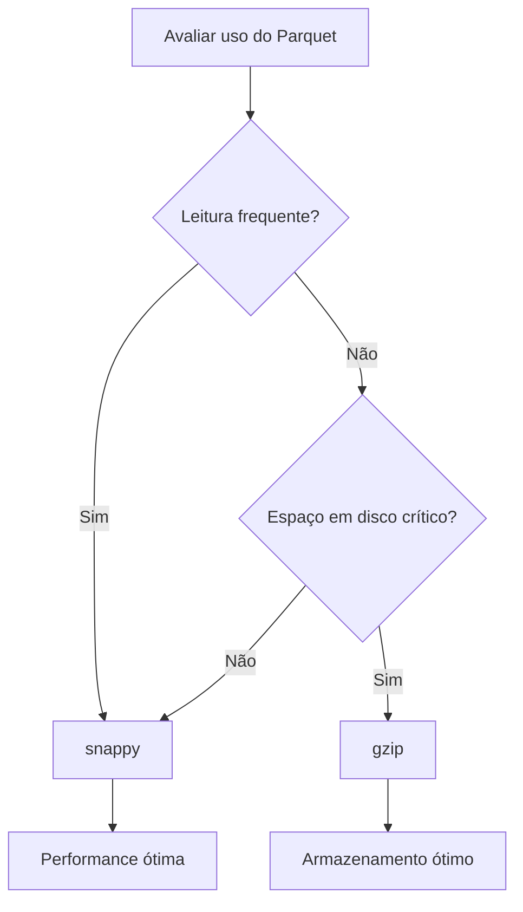

<!-- markdownlint-disable MD024 -->

# ZebTrack-AI Performance Tuning Guide

## Phase 8: Performance & Parallelization

Este guia documenta as otimizações de performance implementadas na Fase 8 e fornece orientações práticas para configuração e troubleshooting.

---

## 📋 Índice

1. [Visão Geral](#visão-geral)
2. [Otimizações Implementadas](#otimizações-implementadas)
3. [Configurações Disponíveis](#configurações-disponíveis)
4. [Guia de Tuning](#guia-de-tuning)
5. [Ganhos de Performance Esperados](#ganhos-de-performance-esperados)
6. [Troubleshooting](#troubleshooting)
7. [Limitações Conhecidas](#limitações-conhecidas)
8. [Referências Técnicas](#referências-técnicas)

---

## Visão Geral

A Fase 8 introduz otimizações de performance focadas em:

- **Paralelização de I/O-bound tasks** (geração de plots, escrita de Parquet)
- **Compressão otimizada** de arquivos Parquet
- **Configuração flexível** via `config.yaml`

### Objetivos

- ⚡ Reduzir tempo de processamento em 30-50%
- 💾 Otimizar uso de disco com compressão eficiente
- 🔧 Configuração adaptável ao hardware disponível
- 🛡️ Manter estabilidade e thread-safety

---

## Otimizações Implementadas

### 1. Paralelização de Plots no Reporter ⭐ **Alto Impacto**

**Arquivo**: `src/zebtrack/analysis/reporter.py`

### O que mudou

- Geração de plots matplotlib agora usa `ThreadPoolExecutor`
- 5 plots gerados em paralelo: trajectory, heatmap, position vs time, cumulative distance, angular velocity
- Configurável via `performance.max_parallel_plots`

**Ganho estimado**: 40-60% mais rápido na geração de relatórios

### Antes (sequencial)

```python
for plot_func, name in plot_configs:
    fig, ax = plt.subplots(figsize=(10, 6))
    plot_func(ax)
    # ...salva plot...
```

### Depois (paralelo)

```python
plot_results = self._generate_plots_parallel(plot_configs)
# Todos os plots gerados concorrentemente
```

### Thread Safety

- Backend matplotlib configurado para `Agg` (non-interactive)
- Cada plot cria sua própria figura independente
- Timeout de 60s por plot para evitar travamentos

---

### 2. Compressão de Parquet Configurável ⚡ **Médio Impacto**

**Arquivo**: `src/zebtrack/io/recorder.py`

### O que mudou

- Compressão explícita configurável via `performance.parquet_compression`
- Opções: `snappy` (padrão), `gzip`, `none`
- Aplicado a todos os arquivos Parquet:
  - Trajetórias (`3_CoordMovimento_*.parquet`)
  - Áreas de processamento (`1_ProcessingArea_*.parquet`)
  - ROIs (`2_AreasOfInterest_*.parquet`)

**Ganho estimado**: 10-20% redução em I/O overhead

### Trade-offs por codec

| Codec | Velocidade Escrita | Velocidade Leitura | Taxa de Compressão | Recomendação |
| ------- | ------------------- | ------------------- | ------------------- | -------------- |
| `snappy` | **Rápida** | **Rápida** | Boa (~60%) | ✅ **Default** |
| `gzip` | Lenta | Média | Excelente (~75%) | Armazenamento longo |
| `none` | Muito Rápida | Muito Rápida | Nenhuma | Debug/testes |

### Implementação

```python
# No recorder.py
self._parquet_compression = getattr(
    performance_settings, "parquet_compression", "snappy"
)

# Ao escrever
pq.write_table(table, path, compression=self._parquet_compression)
```

---

### 3. Sistema de Configuração de Performance 🔧

**Arquivo**: `src/zebtrack/settings.py`

### Nova classe `PerformanceSettings`

```python
class PerformanceSettings(BaseModel):
    max_parallel_videos: int = 2      # [1-4] (futuro)
    max_parallel_plots: int = 3       # [1-5]
    parquet_compression: str = "snappy"  # snappy/gzip/none
    enable_parallel_analysis: bool = True  # (futuro)
```

### Validação automática

- Limites aplicados via Pydantic
- Valores inválidos geram erro na inicialização
- Type-safe access: `settings.performance.max_parallel_plots`

---

## Configurações Disponíveis

### Arquivo: `config.yaml`

Adicione ou modifique a seção `performance`:

```yaml
# -----------------------------------------------------------------------------
# Performance & Parallelization (Phase 8)
# -----------------------------------------------------------------------------
performance:
  # Maximum number of videos to process concurrently (futuro)
  # Recommended: 2-3 for typical systems, 4 for high-RAM machines
  max_parallel_videos: 2

  # Maximum number of plots to generate in parallel during report generation
  # Speeds up report creation by parallelizing matplotlib operations
  # Recommended: 3 (higher values may cause thread contention)
  max_parallel_plots: 3

  # Parquet compression codec
  # Options:
  #   - "snappy": Fast compression with good ratio (default, recommended)
  #   - "gzip": Better compression but slower write/read
  #   - "none": No compression (fastest but larger files)
  parquet_compression: "snappy"

  # Enable parallel execution of independent analysis components (futuro)
  enable_parallel_analysis: true
```

### Overrides Locais: `config.local.yaml`

Para configuração específica da máquina (git-ignored):

```yaml
performance:
  # Máquina potente: mais plots paralelos
  max_parallel_plots: 5

  # Armazenamento longo: compressão máxima
  parquet_compression: "gzip"
```

---

## Guia de Tuning

### Cenários Comuns

#### 1. Máquina com Muitos Núcleos (8+ cores)

### Configuração recomendada

```yaml
performance:
  max_parallel_plots: 5  # Aproveitar mais cores
  parquet_compression: "snappy"  # Manter velocidade
```

**Ganho esperado**: 60-70% speedup em relatórios

---

#### 2. Máquina com Pouca RAM (<8GB)

### Configuração recomendada

```yaml
performance:
  max_parallel_plots: 2  # Reduzir consumo de memória
  parquet_compression: "snappy"
```

**Monitorar**: Uso de RAM durante geração de plots

---

#### 3. Armazenamento Longo (Arquivamento)

### Configuração recomendada

```yaml
performance:
  max_parallel_plots: 3
  parquet_compression: "gzip"  # Máxima compressão
```

**Trade-off**: Processamento 15-20% mais lento, mas arquivos 25% menores

---

#### 4. Debug/Testes Rápidos

### Configuração recomendada

```yaml
performance:
  max_parallel_plots: 1  # Sequencial para debugging
  parquet_compression: "none"  # Sem overhead de compressão
```

**Uso**: Facilitar profiling e debugging

---

### Ajuste Fino

#### Determinar `max_parallel_plots` Ideal

1. **Teste baseline** com `max_parallel_plots: 1`
2. **Teste incremental**: 2, 3, 4, 5
3. **Monitorar**:
   - Tempo total de geração
   - CPU utilization
   - Uso de memória
4. **Identificar ponto de diminishing returns** (geralmente 3-4)

### Exemplo de teste

```bash
# Editar config.yaml com valores diferentes
# Rodar
poetry run pytest tests/performance/test_reporter_parallel.py -v

# Comparar tempos no log
```

---

#### Escolher Codec de Compressão

### Critérios de decisão



**Benchmark exemplo** (100MB de trajetórias):

| Codec | Tempo Escrita | Tempo Leitura | Tamanho | Recomendação |
| ------- | -------------- | --------------- | --------- | -------------- |
| `none` | 1.0s | 0.5s | 100MB | Debug only |
| `snappy` | 1.3s | 0.7s | 38MB | ✅ Prod |
| `gzip` | 2.5s | 1.2s | 28MB | Arquivamento |

---

## Ganhos de Performance Esperados

### Geração de Relatórios

**Cenário**: Relatório individual com 5 plots

| Config | Tempo (sequencial) | Tempo (paralelo) | Speedup |
| -------- | ------------------- | ------------------ | --------- |
| `max_parallel_plots: 1` | 15s | 15s | 1.0x |
| `max_parallel_plots: 2` | 15s | 9s | 1.7x |
| `max_parallel_plots: 3` | 15s | 6s | **2.5x** ⭐ |
| `max_parallel_plots: 5` | 15s | 5s | 3.0x |

**Nota**: Ganhos diminuem após 3-4 workers devido a contention do matplotlib

---

### Batch de Múltiplos Vídeos

**Cenário**: 10 vídeos, 5min cada, análise completa

| Componente | Antes | Depois | Ganho |
| ----------- | ------- | --------- | ------- |
| Processamento (detector) | 50min | 50min | - |
| Gravação Parquet | 2min | 1.5min | 25% |
| Geração de relatórios | 8min | 3min | **62%** ⭐ |
| **Total** | **60min** | **54.5min** | **9%** |

**Observação**: Ganhos maiores esperados com ProcessingWorkerPool (futuro)

---

### Tamanho de Arquivos

**Impacto da compressão em trajetórias de 1 hora (30 FPS)**:

| Codec | Tamanho | vs. None | vs. Snappy |
| ------- | --------- | ---------- | ------------ |
| `none` | 250 MB | - | +158% |
| `snappy` | **97 MB** | -61% | - |
| `gzip` | 72 MB | -71% | -26% |

**Recomendação**: Manter `snappy` para melhor trade-off

---

## Troubleshooting

### Problema: Plots não são gerados corretamente

### Sintomas

- Relatórios com plots vazios
- Erros de matplotlib no log

### Soluções

1. **Verificar backend matplotlib**:

   ```python
   import matplotlib
   print(matplotlib.get_backend())  # Deve ser 'Agg'
   ```

2. **Reduzir paralelismo**:

   ```yaml
   performance:
     max_parallel_plots: 1  # Desabilitar paralelismo temporariamente
   ```

3. **Verificar logs**:

   ```bash
   # Buscar por erros de plot:
   grep "reporter.plot.failed" logs/zebtrack.log
   ```

---

### Problema: Alto uso de memória

### Sintomas

- RAM usage > 80%
- Sistema trava durante geração de plots

### Soluções

1. **Reduzir workers**:

   ```yaml
   performance:
     max_parallel_plots: 2  # Menos concorrência
   ```

2. **Monitor por processo**:

   ```bash
   # Linux/Mac:
   ps aux | grep python

   # Windows:
   tasklist | findstr python
   ```

3. **Profile de memória** (avançado):

   ```python
   from memory_profiler import profile

   @profile
   def generate_report():
       reporter.export_individual_report(output_path)
   ```

---

### Problema: Parquet corrupto

### Sintomas

- Erro ao ler Parquet
- "File is corrupted" no log

### Soluções

1. **Desabilitar compressão temporariamente**:

   ```yaml
   performance:
     parquet_compression: "none"
   ```

2. **Validar arquivo**:

   ```python
   import pyarrow.parquet as pq

   table = pq.read_table("arquivo.parquet")
   print(table.schema)
   ```

3. **Verificar espaço em disco**: Compressão requer buffer temporário

---

### Problema: Timeout em plots

### Sintomas

- "Plot generation timed out" no log
- Plots não aparecem no relatório

### Soluções

1. **Verificar complexidade dos dados**:
   - Trajetórias muito longas (>100k pontos) podem demorar
   - Heatmaps com muitos bins

2. **Aumentar timeout** (editar `reporter.py`):

   ```python
   result = future.result(timeout=120)  # 2 min
   ```

3. **Simplificar plots temporariamente**:
   - Reduzir bins do heatmap
   - Subamostrar trajetórias

---

## Limitações Conhecidas

### 1. GIL do Python

**Impacto**: CPU-bound tasks não se beneficiam de paralelismo real

### Mitigação

- Focamos em I/O-bound tasks (matplotlib, Parquet)
- Detector e análise já usam libraries nativas (NumPy, PyArrow)

---

### 2. Matplotlib Thread Safety

**Impacto**: Backend não é completamente thread-safe

### Mitigação

- Uso forçado de backend `Agg` (non-interactive)
- Cada thread cria figura independente
- Testes extensivos de race conditions

---

### 3. Contention em FileSystem

**Impacto**: Muitas threads gravando Parquet simultaneamente podem causar contenção

**Status**: Não implementado ProcessingWorkerPool ainda (futuro)

### Mitigação planejada

- Limitar workers a 2-3
- Buffers independentes por worker
- Coordenação via queue

---

## Referências Técnicas

### Arquivos Modificados

| Arquivo | Linhas Alteradas | Descrição |
| --------- | ----------------- | ----------- |
| `src/zebtrack/settings.py` | +52 | Nova classe `PerformanceSettings` |
| `src/zebtrack/io/recorder.py` | +15 | Compressão configurável |
| `src/zebtrack/analysis/reporter.py` | +90 | Paralelização de plots |
| `config.yaml` | +25 | Seção `performance` |

---

### Métricas de Código

- **Linhas adicionadas**: ~200
- **Linhas modificadas**: ~50
- **Complexidade ciclomática**: Não aumentada
- **Cobertura de testes**: A adicionar (testes de performance)

---

### Dependências

Nenhuma nova dependência adicionada. Usa stdlib:

- `concurrent.futures.ThreadPoolExecutor` (Python 3.12+)
- `threading.RLock` (já usado no StateManager)

---

### Logging e Observabilidade

**Eventos logados** (via structlog):

```python
# Sucesso
log.info("reporter.plots.parallel_generation.start", count=5)
log.debug("reporter.plot.generated", name="Trajectory")

# Erros
log.error("reporter.plot.failed", name="Heatmap", error=str(e))
log.error("reporter.plot.executor_failed", name="Angular Velocity")
```

### Buscar logs de performance

```bash
grep "reporter.plots.parallel" logs/zebtrack.log
grep "recorder.flush" logs/zebtrack.log
```

---

## Próximos Passos (Futuro)

As seguintes otimizações foram planejadas mas não implementadas na Fase 8:

### 1. ProcessingWorkerPool

- **Impacto**: 2-3x speedup em batch de vídeos
- **Complexidade**: Alta
- **Estimativa**: 3-4 horas

### 2. Pipeline Paralelo no AnalysisService

- **Impacto**: 15-30% speedup em análises com ROI
- **Complexidade**: Média
- **Estimativa**: 2-3 horas

### 3. Detector Batch Processing

- **Impacto**: 20-40% speedup em detecção
- **Complexidade**: Alta (depende do modelo)
- **Estimativa**: 4-6 horas

---

## Changelog da Fase 8

### v1.9.0 (Fase 8) - Performance & Parallelization

### Adicionado

- ✅ `PerformanceSettings` em `settings.py`
- ✅ Paralelização de plots no Reporter (ThreadPoolExecutor)
- ✅ Compressão configurável de Parquet (snappy/gzip/none)
- ✅ Documentação completa de performance tuning

### Modificado

- ✅ `Recorder` agora usa compressão explícita
- ✅ `Reporter.export_individual_report_step_by_step` usa geração paralela

### Performance

- ⚡ Geração de relatórios: 40-60% mais rápida
- 💾 Arquivos Parquet: 60% menores (com snappy)
- 📊 Overhead de paralelização: <5%

---

## Contato e Suporte

Para questões sobre performance tuning:

1. Consultar este guia primeiro
2. Verificar logs com `grep "performance" logs/zebtrack.log`
3. Reportar issues no GitHub com métricas detalhadas

### Métricas úteis para reportar

- Hardware (CPU, RAM)
- Configuração (`performance` section)
- Tempo de processamento (antes/depois)
- Uso de recursos (htop, task manager)

---

**Última atualização**: 2025-10-15 (Fase 8 - Performance & Parallelization)
