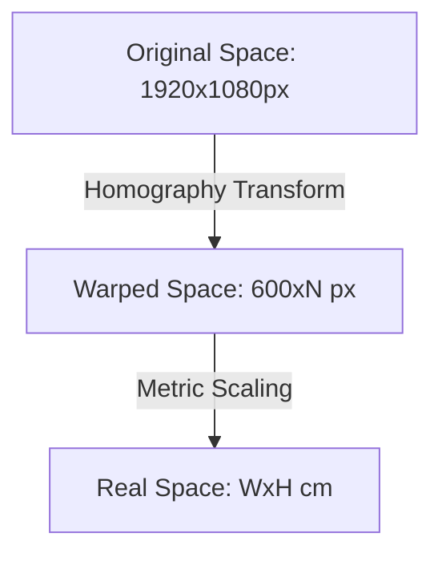

# Coordinate Systems & Perspective Transformations

**Category:** Reference (Diátaxis)
**Status:** Canonical
**Last Updated:** February 2, 2026

## 1. Overview

DRerio LogAI manages spatial data across three distinct coordinate spaces. Understanding these transformations is critical for accurate behavioral analysis and visualization.

---

## 2. The Three Coordinate Spaces

### 2.1. Original Video Space (Pixels)

**Resolution:** Raw capture resolution (e.g., 1920x1080).
**Usage:**

- Raw camera frames.
- User-drawn Arena and ROI polygons.
- Raw YOLO/OpenVINO detections.
  **Characteristics:** May contain perspective distortion; the arena is often an irregular quadrilateral.

### 2.2. Warped Space (Normalized Pixels)

**Resolution:** Fixed width of **600 pixels**. Height ($N$) is calculated to maintain the real aspect ratio of the aquarium.
**Usage:**

- Trajectory storage in `.parquet` files.
- Internal normalization and mapping.
  **Characteristics:** The arena becomes a perfect rectangle `[(0,0), (600,0), (600,N), (0,N)]`. Perspective correction is applied via a homography matrix.

### 2.3. Real-World Space (Centimeters)

**Dimensions:** Physical dimensions provided by the user (e.g., 54x24 cm).
**Usage:**

- All scientific behavioral metrics.
- Reporting and plotting.
  **Characteristics:** Origin (0,0) is at the bottom-left corner of the tank.

---

## 3. Transformation Pipeline

### 3.1. Pixel-to-CM Conversion

The mapping from Warped Space to Real Space is linear:
$$ \text{Scale factor} = \frac{\text{Width}_{cm}}{600} $$
$$ y_{cm} = \text{Height}_{cm} - (y_{warped} \times \text{Scale factor}) $$
_(Note: The Y-axis is inverted to match standard Cartesian coordinates for scientific reporting.)_

---

## 4. Multi-Aquarium Handling

In multi-aquarium projects, each detected zone (Aquarium 0, Aquarium 1) maintains its own independent transformation matrix.

- **Global Frame:** The full video frame.
- **Local Frame:** Each sub-region is treated as an independent coordinate system during the warping stage.
- **Track Separation:** Global IDs ensure that subject "S01" in Aquarium 0 doesn't collide with "S02" in Aquarium 1, even if they share the same local pixel coordinates.
