# Getting Started with DRerio LogAI

From a freshly installed application to a finished report, in the order you will actually do it.

Em português: [Primeiros passos](PRIMEIROS_PASSOS.md).

This guide describes the interface as it is: every menu entry, button and step below exists and is
named exactly as the application names it (in English; the Portuguese interface uses the
translations of the same labels).

## Contents

- [Before your first analysis](#before-your-first-analysis)
- [The first launch](#the-first-launch)
- [Setting up the detector models](#setting-up-the-detector-models)
- [The main window](#the-main-window)
- [Choosing what kind of project to create](#choosing-what-kind-of-project-to-create)
- [Creating a pre-recorded project](#creating-a-pre-recorded-project-7-steps)
- [Drawing the arena and the ROIs](#drawing-the-arena-and-the-rois)
- [Processing the videos](#processing-the-videos)
- [Reports and results](#reports-and-results)
- [Live camera projects](#live-camera-projects)
- [Analysing a single video without a project](#analysing-a-single-video-without-a-project)
- [Keyboard and mouse](#keyboard-and-mouse)
- [Where to go next](#where-to-go-next)
- [Glossary](#glossary)

## Before your first analysis

You need:

- **The application installed** — see [Installation and Setup](../1_Installation.md).
- **Your videos**, or a camera connected. MP4 is the safest format; AVI, MOV and MKV work, and in
  general anything OpenCV can open.
- **The physical dimensions of your aquarium, in centimetres** (width and height of the area the
  camera sees). Without them, distances and speeds can only be reported in pixels.
- **A decision about the camera angle**: lateral (side view, as in the novel tank test) or top-down
  (from above, as in an open field). The detector model you use depends on it.

## The first launch

1. **A language question.** Your answer is written to `config.local.yaml`. The operating system's
   language is deliberately not consulted. Change it later in **Settings → Language...**.

2. **A splash screen running a hardware benchmark.** It converts one model to OpenVINO and measures
   how fast each available device runs it, in order to pick a backend. This is the slowest launch
   you will have: the result is cached, and later launches skip it.

3. **The main window.**

   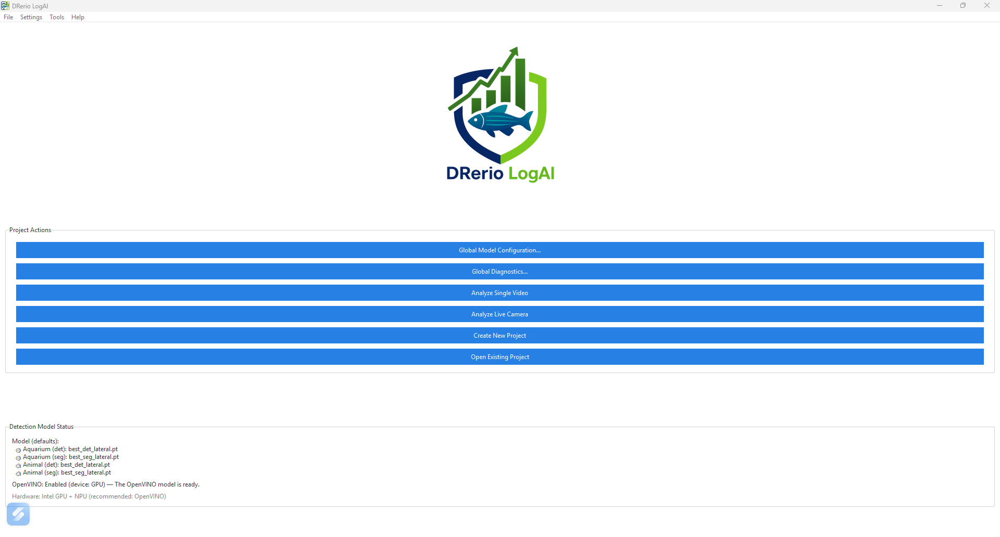

4. **The Getting started window**, which explains the detector models and reads your hardware to
   say whether OpenVINO is worth enabling here. Its button opens the model panel; you can also
   reach that panel at any time from **Settings → Model settings...**, and this window from
   **Help → Getting Started...**.

## Setting up the detector models

Do this once, before the first analysis. **Settings → Model settings...**

### What the six models are

`fetch-weights` (run for you by the installer) puts six trained YOLO models in `weights/`:

| Model | Type | Camera angle |
| --- | --- | --- |
| `best_det_lateral.pt` | detection — a box around the animal | lateral (side view) |
| `best_seg_lateral.pt` | segmentation — the animal's outline | lateral |
| `best_det_topdown.pt` | detection | top-down (from above) |
| `best_seg_topdown.pt` | segmentation | top-down |
| `best_oi.pt` | detection | any (generalist, less precise) |
| `best_seg.pt` | segmentation | any (generalist, less precise) |

**A model trained for one angle finds nothing on the other.** A lateral model watching a top-down
recording reports no fish at all, even though the fish is plainly visible. Matching the model to
your camera is the single most important setting on this screen.

### The four roles

Under **Default weights per slot**, one model is assigned to each role:

- 🐠 **Aquarium (Detection)** — finds the tank as a rectangle
- 🐠 **Aquarium (Segmentation)** — finds the tank's real shape
- 🐟 **Animal (Detection)** — finds each fish as a box
- 🐟 **Animal (Segmentation)** — finds each fish as a mask

The four specialists are pre-assigned. Pick the pair matching your camera angle; the generalists are
there for setups the specialists do not fit, and are chosen explicitly.

**Detection or segmentation?** Detection is lighter and enough when approximate position is what
you need. Segmentation is better when spatial precision matters — small regions, edges, several
animals close together — and it is **required** if you intend to use the `seg_overlap` ROI rule,
which compares the animal's mask against the region.

### OpenVINO

| Your machine | What to do |
| --- | --- |
| Has an NVIDIA graphics card | Leave OpenVINO off — PyTorch with CUDA is normally faster |
| Intel CPU / integrated graphics / NPU, no NVIDIA card | Turn it on: it is what makes tracking fast here |
| Neither | Leave it off; analysis runs on the CPU, slower |

Tick **Optimise with OpenVINO (for Intel hardware)**, choose the **OpenVINO device**, select the
weights you plan to use and press **Convert to OpenVINO**. Conversion happens once per weight and
is cached; the catalogue shows ✓ Ready, ⏳ Converting or ✗ Failed.

The same panel also offers **Add Weight...** (register a model you trained yourself),
**Validate Paths**, **Rescan Weights Folder**, OpenVINO cache maintenance and
**Re-run Hardware Benchmark**.

## The main window

Before any project is open, the launcher offers:

| Button | What it does |
| --- | --- |
| **Create New Project** | Opens the project wizard |
| **Open Existing Project** | Reopens a project folder created earlier |
| **Analyze Single Video** | One video, no project, no experimental design |
| **Analyze Live Camera** | An ad-hoc live session, no project |
| **Global Model Configuration...** | The same panel as **Settings → Model settings...** |
| **Global Diagnostics...** | Runs the active models against a sample frame and reports what they found |

The **Detection Model Status** panel underneath reports the active weights per role, the OpenVINO
state and the detected hardware — it is worth a glance before starting a long batch.

## Choosing what kind of project to create

| You have | Use |
| --- | --- |
| Videos already recorded, organised in folders by group/day/subject | **Create New Project** → experimental (pre-recorded) |
| A camera, and experiments still to run | **Create New Project** → live |
| One video, to look at quickly | **Analyze Single Video** |
| A camera, for a quick unstructured test | **Analyze Live Camera** |

A project is what gives you the group/day/subject structure, per-video status tracking and the
unified report across the whole experiment. The two ad-hoc modes skip all of that.

## Creating a pre-recorded project (7 steps)

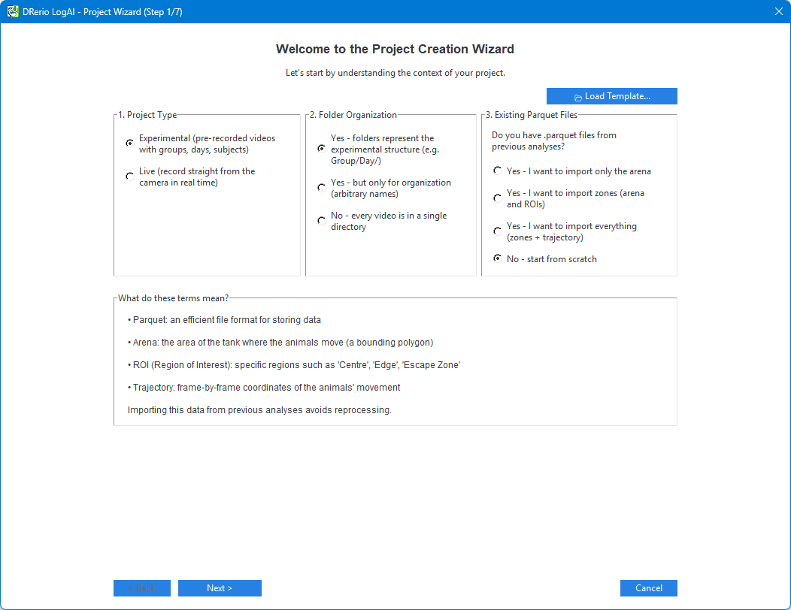

### Step 1 — Discovery

- **Project Type**: *Experimental (pre-recorded videos with groups, days, subjects)*.
- **Folder Organization**: whether your folders mean something (e.g. `Group_CBD/Day_1/...`), are
  only for tidiness, or do not exist (everything in one folder).
- **Existing Parquet Files**: what to do with analysis files already sitting next to the videos —
  import the arena, import the zones, import everything, or start from scratch.

  > **Refusing here is respected.** A project created over a folder containing arenas and ROIs from
  > an earlier study used to adopt them silently on the first double-click, and the report came out
  > complete but measured against the wrong arena.

**📂 Load Template...** restores the answers of a wizard run you saved earlier.

### Step 2 — Video Selection

**📁 Add Files...** for individual videos, **📂 Add Folder...** for a whole tree. The **Structure
Preview** shows how the selection was understood; the videos inside folders are enumerated in the
step after next.

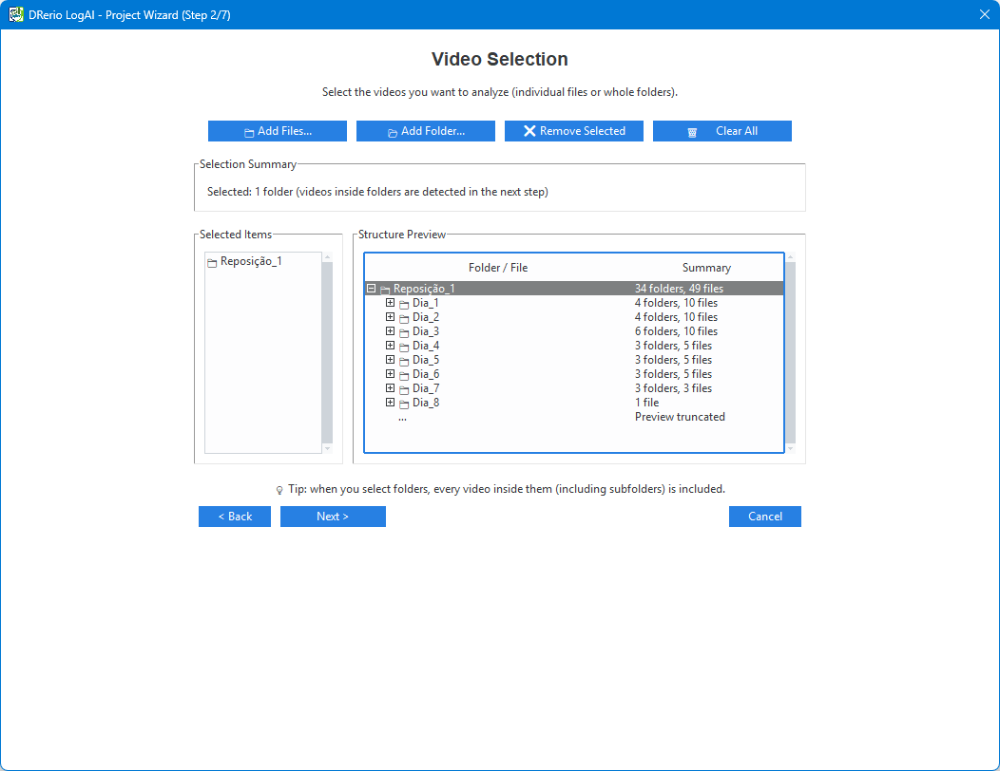

### Step 3 — Physical Calibration

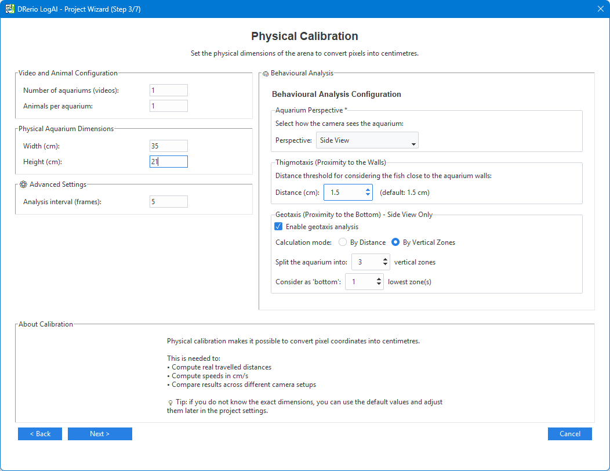

- **Width (cm)** and **Height (cm)** of the aquarium: this is what converts pixels into
  centimetres, so every distance, speed and cm-based metric depends on it. Measure the area the
  camera actually sees.
- **Number of aquariums (videos)**: more than one when several tanks are filmed side by side in the
  same video.
- **Animals per aquarium**.
- **Analysis interval (frames)**: analyse one frame in every N (10 by default). Lower is more
  temporal detail and more processing time.
- **🧠 Behavioural Analysis**: thigmotaxis and geotaxis options.

### Step 4 — Automatic Design Detection

The folder structure and file names are read into **Groups**, **Days** and **Subjects**, with a
confidence value and a summary of what was found.

- **🔄 Re-analyze** after changing something.
- **✏️ Edit Design** to correct the result by hand.
- **🔧 Custom Regex** when your naming scheme needs an explicit pattern.

Confirm the group names before moving on: everything downstream — folders, reports, comparisons —
is built from them.

### Step 5 — Models and Weights

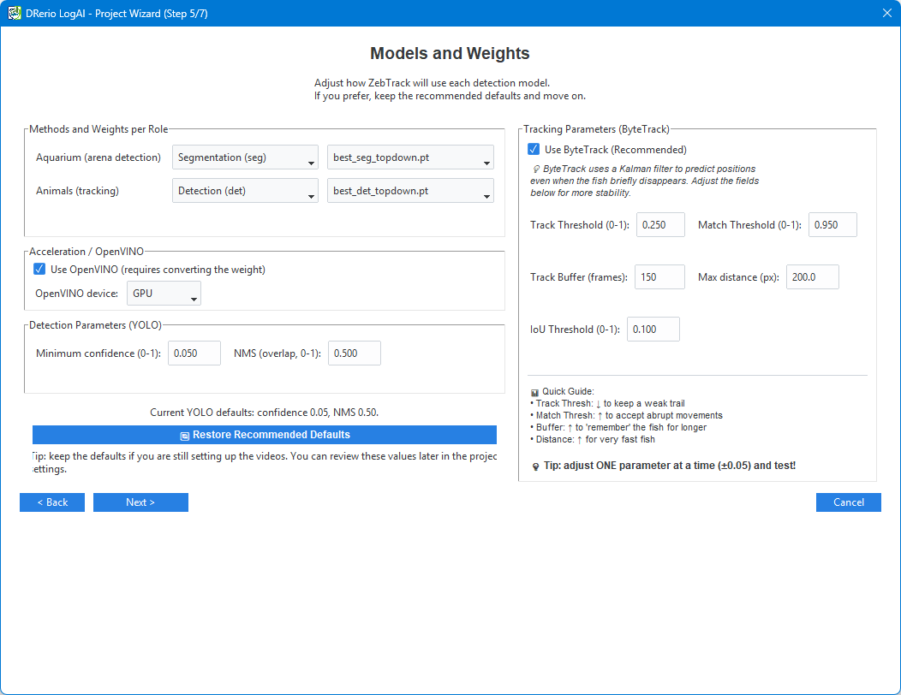

Method (segmentation or detection) and weight, separately for **Aquarium (arena detection)** and
**Animals (tracking)**; the OpenVINO switch and device; and the detector parameters:

| Parameter | Default | What it does |
| --- | --- | --- |
| Minimum confidence (0–1) | 0.05 | How sure the model must be to accept a detection |
| NMS (overlap, 0–1) | 0.5 | How much two detections may overlap before one is discarded |
| Track Threshold (0–1) | 0.25 | Minimum confidence for a detection to keep a track alive |
| Match Threshold (0–1) | 0.95 | How permissive the association between frames is (higher = more permissive) |
| Track Buffer (frames) | 150 | How long a lost animal keeps its identity |
| Max distance (px) | 400 | How far an animal may move between analysed frames and still be the same one |
| IoU Threshold (0–1) | 0.05 | Below this overlap, matching falls back to centre distance |

> **Adjust one parameter at a time, by about ±0.05, and re-test.** Moving two at once makes the
> outcome impossible to attribute. **🔄 Restore Recommended Defaults** undoes the experiment.

### Step 6 — Import Configuration

Per video, what to import from files found alongside it: **Arena**, **ROIs**, **Trajectory**. When
ROIs already exist, choose the strategy: **Replace (overwrite)**, **Merge (keep both ROIs)** or
**Manual (ask)**.

### Step 7 — Confirmation

Project name and location, a summary of every answer, and **💾 Save as Template** to reuse this
configuration for the next study. **Finish** creates the project.

## Drawing the arena and the ROIs

In the **Zone Configuration** tab, working on a real frame from your own recording.

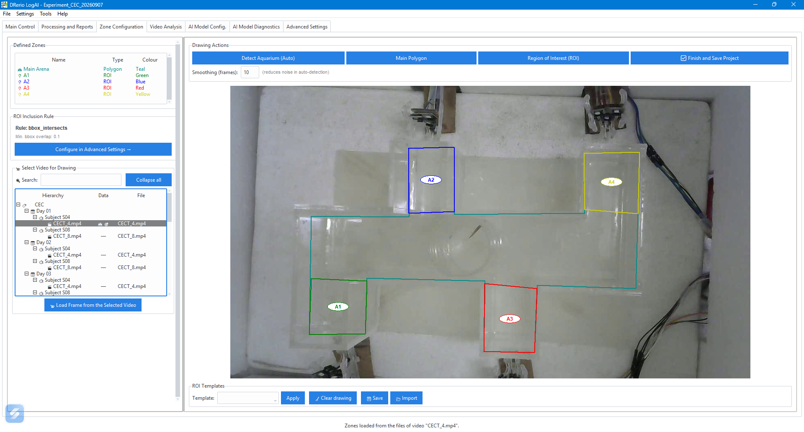

1. **📹 Select Video for Drawing**, then **📹 Load Frame from the Selected Video**.
2. **The arena** — either **Detect Aquarium (Auto)**, which proposes a polygon (use
   **Smoothing (frames)** to reduce noise in that detection), or **Main Polygon** to draw it
   yourself. Click the vertices, then **✓ Close Polygon** and **💾 Save This Area**.
3. **The regions of interest** — **Region of Interest (ROI)**, one polygon per region. Name each
   one: the metrics are reported per ROI under those names.
4. **Templates** — **💾 Save** stores the current set of regions; **📂 Import** applies a saved set
   to another video or project.
5. **✅ Finish and Save Project**.

Mistakes are cheap: **↶ Undo (Ctrl+Z)** and **↷ Redo (Ctrl+Y)**, and **❌ Discard** abandons the
polygon being drawn.

**The inclusion rule** decides what counts as the animal being inside a region:

| Rule | Inside when |
| --- | --- |
| `bbox_intersects` (default) | The box around the animal overlaps the region |
| `centroid_in` | The animal's centre is inside the region |
| `centroid_in_on_buffered_roi` | Same, on a region grown or shrunk by a buffer |
| `seg_overlap` | The animal's mask overlaps the region beyond a fraction (0.3 by default) |

`seg_overlap` needs masks, which only exist if they were recorded — segmentation method, mask
persistence enabled, and this rule in force. When they are missing the analysis falls back to
`bbox_intersects` and says so in the report rather than failing.

With several aquariums in one video, **Processing Mode** chooses **Simultaneous (1 pass, faster)**
or **Sequential (2 passes, 1 aquarium at a time)**, and **🐟 Active Aquarium** selects which one
you are drawing.

Zones belong to the video you drew them on. A video with none of its own uses the project default.

## Processing the videos

In **Main Control**:

- **Analyse Selected Video(s)** — the ones selected in the tree.
- **Process Pending Videos...** — everything not yet processed.
- **Add Videos/Folders to the Project...** — to extend the project later.

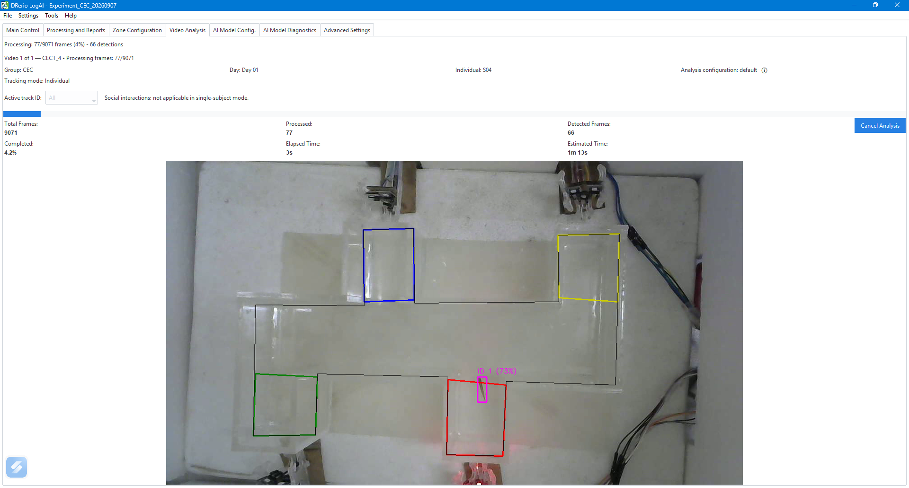

The **Video Analysis** tab follows the run: frames processed, detections, elapsed and estimated
time, and the overlay with each animal's track ID and confidence. It is also where you choose which
`track_id`s to keep — all of them, or a specific one.

The project tree shows the state of each video, by group, day and subject:

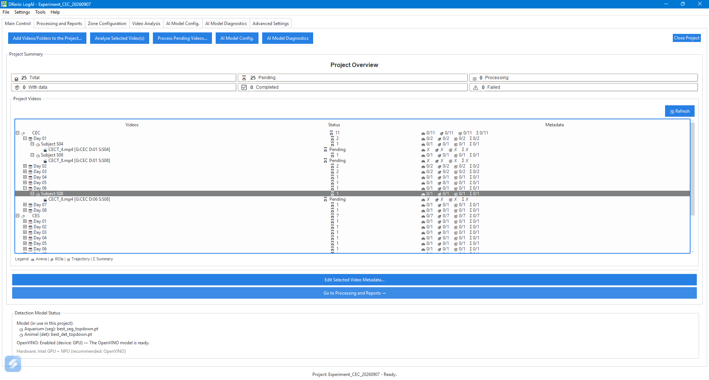

**Roughly how long it takes:** on a typical Intel laptop with OpenVINO enabled and the default
analysis interval of 10, a 5-minute 1080p video takes a few minutes. Lowering the interval to 1
multiplies that by about ten.

## Reports and results

The **Processing and Reports** tab generates:

- **🧾 Partial Reports** — per video: trajectory, summary and Word report.
- **Unified reports** — one comparison across the whole project, in
  `<project>/unified_reports/`, with an Excel sheet of data plus descriptive statistics, a CSV, a
  Word file with comparative boxplots, and a JSON manifest of the run.

Double-click any entry to open the file.

### The files produced, per video

```text
<video>_results/
├── 1_ArenaROI_<video>.parquet       # Arena and ROI definitions
├── 2_Zones_<video>.parquet          # Zone metadata
├── 3_CoordMovimento_<video>.parquet # Frame-by-frame trajectory
├── 3b_Mascaras_<video>.parquet      # Segmentation masks (only when recorded)
├── <video>_summary.xlsx             # Metrics per ROI, plus a per-animal sheet
└── <video>_report.docx              # Illustrated report
```

The trajectory schema is fixed and will not change between versions:

```text
timestamp, frame, track_id, x1, y1, x2, y2, confidence
[x_center_px, y_center_px, x_cm, y_cm]*   — when calibration is available
```

- `track_id` — the animal's identity across frames
- `x1, y1, x2, y2` — the bounding box, in **raw video pixels**
- `confidence` — how sure the detector was, 0 to 1

> `timestamp` is a **processing clock**, not the capture instant. For live sessions, the real
> timing is in `6_FrameLedger_<base>`.

Reading it in Python:

```python
import pandas as pd

df = pd.read_parquet("my_video_results/3_CoordMovimento_my_video.parquet")
one_animal = df[df["track_id"] == 1]
```

### Plots

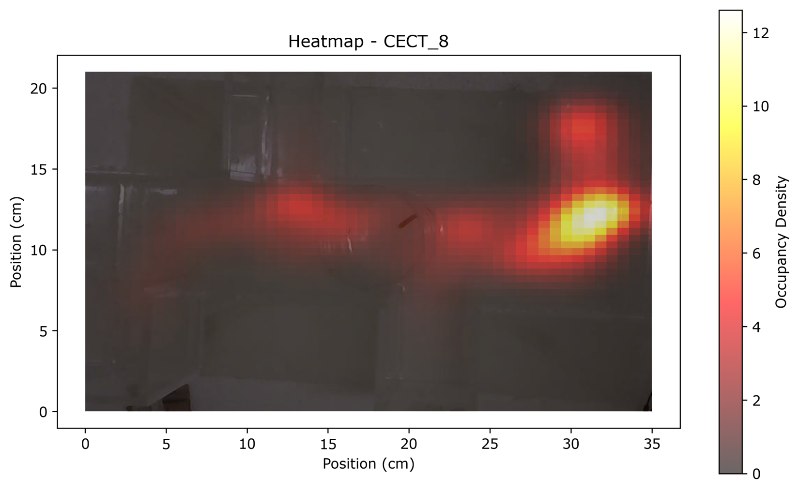

The heat map shows where the animal spent its time — warmer means longer. The trajectory plot shows
the path itself, with the operator-defined regions drawn over the arena:

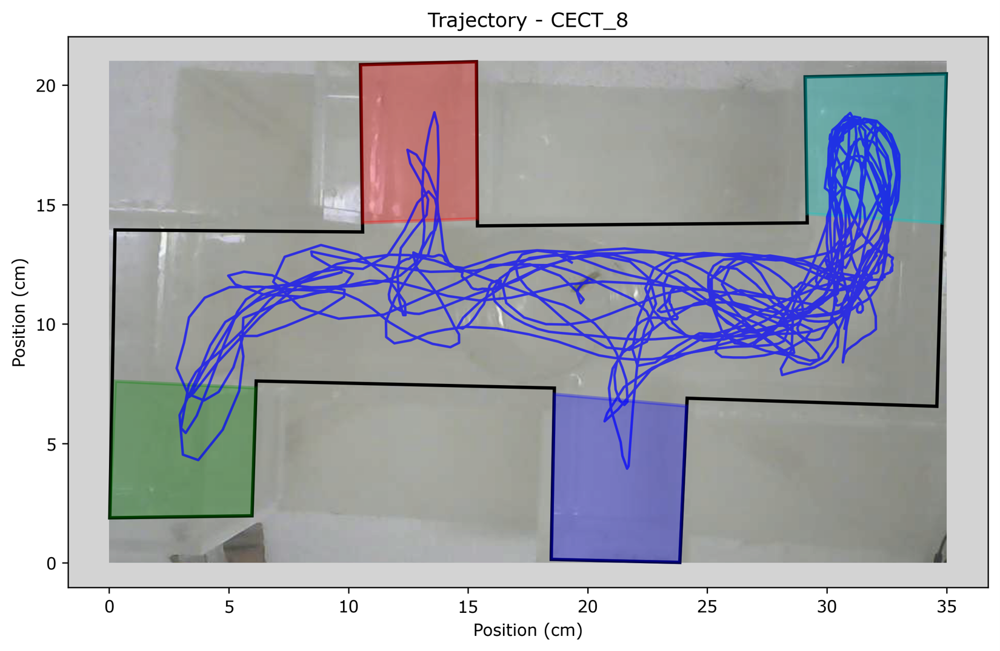

Both are generated automatically and embedded in the Word report.

### The metrics

Locomotion (total distance, mean/max/SD speed, tortuosity), angular velocity and sharp turns,
behavioural episodes (speed bursts, inactivity), thigmotaxis, geotaxis, and per ROI: time, entries,
exits, latency to first entry, distance and speed inside the region.

Every column name and formula: [`docs/reference/metrics.md`](../../reference/metrics.md).

> **Recordings of different lengths cannot be compared on absolute metrics** (total distance, number
> of entries, time in ROI). The application warns before generating the report and stamps the caveat
> inside the `.docx`; normalise using the `video_duration_s` column in the `.xlsx`.

## Live camera projects

A live project records and analyses at the same time, following an experimental design.

### Creating it (6 steps)

1. **Discovery** — project type: live.
2. **Experimental Design** — duration in days, number of groups and their names, animals per group.
   The wizard shows the resulting number of recordings.

   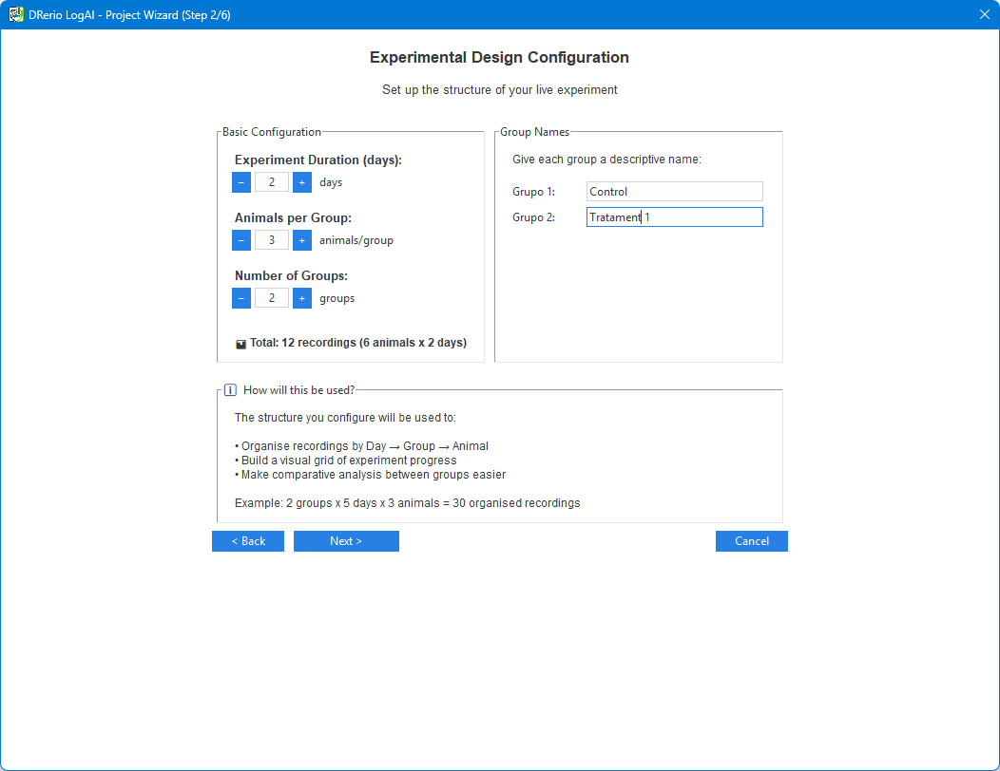

3. **Live Recording Configuration**:

   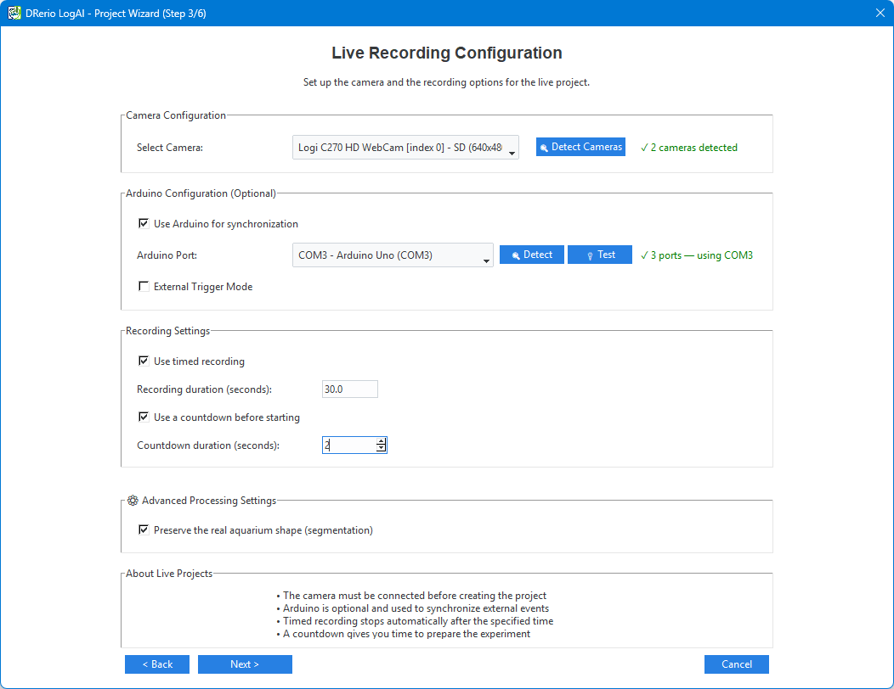

   - **🔍 Detect Cameras**, then **Select Camera**.
   - Optional **Use Arduino for synchronization**: **🔍 Detect** the port, **🔌 Test** the
     connection.
   - **External Trigger Mode** — the Arduino starts the recording rather than the operator. Opt-in,
     and it requires a sketch that sends `1`/`0` over serial; the reference sketch in this
     repository does **not**. See
     [`docs/guides/user/external-trigger.md`](../../guides/user/external-trigger.md).
   - **Use timed recording** with a duration in seconds (300 = 5 minutes), and optionally a
     countdown before it starts.
4. **Physical Calibration**, 5. **Models and Weights**, 6. **Confirmation** — as in the pre-recorded
   flow.

### Running sessions

The session runner shows one card per animal for the current day and group:

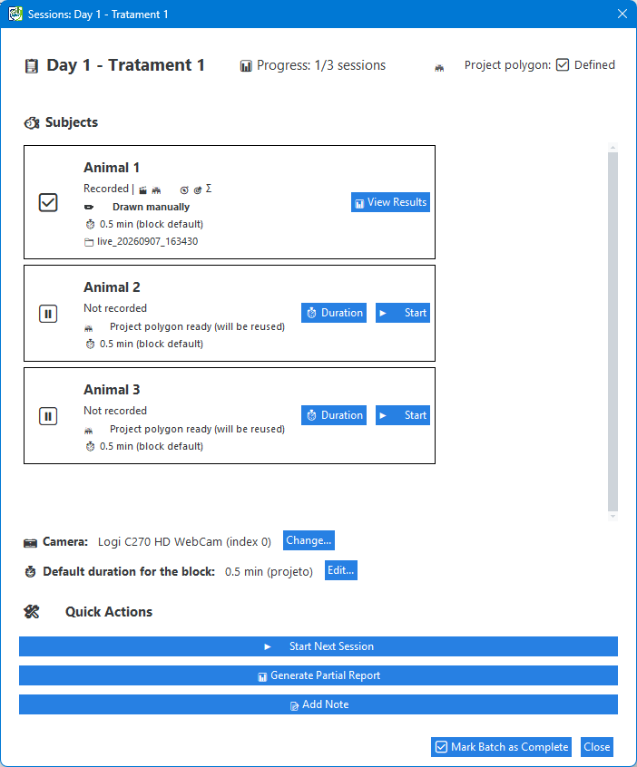

Press **▶️ Start Recording** for a subject; **✖ Cancel Session** discards a recording in progress,
including its folder — a cancelled session is not half-kept. Each session lands in
`live_analysis_sessions/{experiment_id}_{timestamp}/`.

**Recording duration** can be set per subject, per block (day × group) or for the project, in that
order of precedence.

> Heterogeneous durations inside one block invalidate comparisons of absolute metrics. The
> application warns rather than silently normalising: the decision is the researcher's.

The **Experiment Progress** tab shows the day × group grid, with sessions completed per cell:

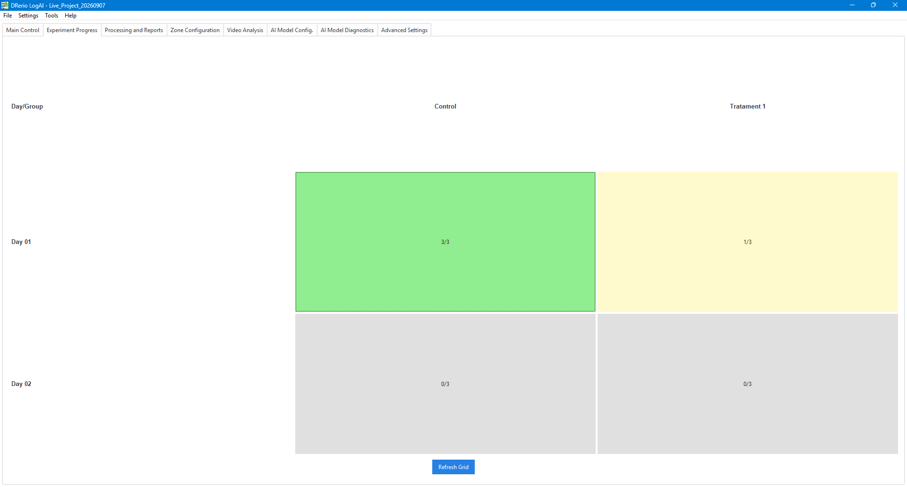

### Arduino, per-zone commands

With an Arduino connected, each ROI can send an integer token when an animal enters or leaves it,
and the firmware decides what the token does:

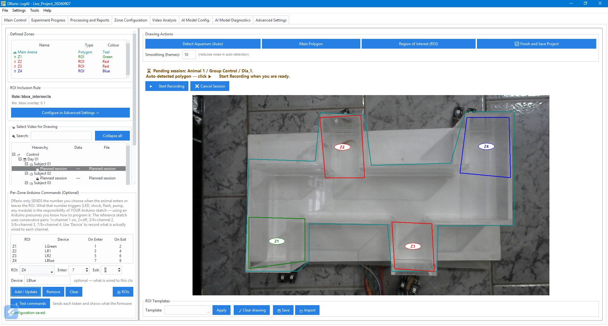

- **Each token must have exactly one role.** Reusing one integer as one region's entry token and
  another's exit token latches a device on and breaks the session-end sweep. The application detects
  the conflict and warns, but never rewrites your bindings — only the sketch knows what each token
  means.
- **Verify against the firmware's reply, not your intent.** **🔌 Test commands** shows what the board answers; an entry token answered with "… OFF" proves the binding is inverted.
- Full guide: [`docs/guides/user/arduino-bindings.md`](../../guides/user/arduino-bindings.md).

## Analysing a single video without a project

**Analyze Single Video** on the main window: choose the file, set the calibration and the number of
animals, draw the arena and ROIs, and process. The outputs are the same `<video>_results/` folder;
what you do not get is the group/day/subject structure or the unified report.

**Analyze Live Camera** does the same for an ad-hoc camera session.

## Keyboard and mouse

| Shortcut | Action |
| --- | --- |
| `Ctrl+Q` | Quit the application |
| `Ctrl+Z` / `Ctrl+Y` | Undo / redo while drawing zones |
| Double-click (reports tree) | Open the report or file |
| Right-click (project tree) | Context menu: edit design, delete specific data, remove a video |

The right-click menu in the project tree is where per-video data is deleted selectively —
**🏛️ Delete Arena**, **📍 Delete ROIs**, **📈 Delete Trajectory**, **📝 Delete Reports** — or all at
once with **🧹 Delete All Processing Data**.

## Where to go next

- [Full tutorial](../2_Full_Tutorial.md) — the same path with more detail on each screen.
- [FAQ](../3_FAQ.md) — the questions that come up most.
- [Troubleshooting](TROUBLESHOOTING.md) — when something does not work.
- [Metrics reference](../../reference/metrics.md) — every column and formula.
- [Tracking configuration](../6_Configuracao_Rastreamento.md) — tuning detection and tracking.
- Bugs and requests: [GitHub Issues](https://github.com/MarkSant/DRerio-LogAI/issues) ·
  Questions: [Discussions](https://github.com/MarkSant/DRerio-LogAI/discussions)

## Glossary

**Arena** — the physical space the animals are tracked in, usually the aquarium.

**ROI (Region of Interest)** — a region drawn inside the arena that metrics are reported for
separately (bottom, top, a corner, a chamber).

**Track ID** — the identity the tracker assigns to an animal and carries across frames.

**Confidence** — how sure the model is about a detection, from 0 to 1.

**Calibration** — the conversion from pixels to centimetres, from the aquarium's real dimensions.

**Detection (det) / Segmentation (seg)** — a box around the animal, or its outline.

**Parquet** — the compact table format the trajectories are stored in; `pandas` reads it directly.

**Thigmotaxis** — the tendency to stay near the walls, a common anxiety-like measure.

**Geotaxis** — vertical preference (bottom, middle, surface), measured in side view.

**OpenVINO** — Intel's accelerator, which makes the models run faster on Intel hardware.
